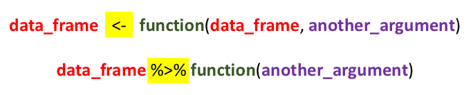

# Introduction to R, the Tidyverse - Visualisation {#Introduction_Tidyverse_Visualisation}

## Loading packages 

```{r}
###Use the code below to check if you have all required packages installed. If some are not installed already, the code below will install these. If you have all packages installed, then you could load them with the second code.
requiredPackages = c('tidyverse', 'languageR', 'phonR', 'summarytools')
for(p in requiredPackages){
  if(!require(p,character.only = TRUE)) install.packages(p)
  library(p,character.only = TRUE)
}
```

## Intro R Markdown
 
### General

This is an [R Markdown](http://rmarkdown.rstudio.com) Notebook. When you execute code within the notebook, the results appear beneath the code. 

Try executing this chunk by clicking the *Run* button within the chunk or by placing your cursor inside it and pressing *Ctrl+Shift+Enter*. 

```{r}
plot(cars)
```

Add a new chunk by clicking the *Insert Chunk* button on the toolbar or by pressing *Ctrl+Alt+I*. 

When you save the notebook, an HTML file containing the code and output will be saved alongside it (click the *Preview* button or press *Ctrl+Shift+K* to preview the HTML file).

The preview shows you a rendered HTML copy of the contents of the editor. Consequently, unlike *Knit*, *Preview* does not run any R code chunks. Instead, the output of the chunk when it was last run in the editor is displayed.

### Knitting to other formats

You can knit notebook into PDF or Word. Make sure to install the `tinytex` package using the following code: `install.packages("tinytex")`. If you already use \LaTeX\ with another distribution, then you do not need to install `tinytex` (though this works perfectly out of the bag). Then from the menu above (Knit), then choose `Knit to PDF` or `Knit to Word`. This is an excellent way to get your work fully written within RStudio: You will write a text (like this), have a specific structure and also have all your results in one place. This allows for transparency and replicability. 

## R and R Studio

### R

`R` is the most influential statistical software that is widely used in data science. [The R Project for Statistical Computing](https://www.r-project.org/). R allows the user to take control of their analyses and being open about how the data were analysed, etc. `R` encourages transparency and reproducible research.

###Downloading base R

If you are a windows user, download the latest version here [R version 4.3.1](https://cran.r-project.org/bin/windows/base/).
If you are a MacX user, download the latest version here [R version 4.3.1](https://cran.r-project.org/bin/macosx/). 
Other Linux versions available [here](https://cran.r-project.org/bin/linux/).

Using up-to-date versions of `R` is important as this allows you to use the latest developments of the software. You can have a look at what is new in this latest release [here](https://cran.r-project.org/bin/windows/base/NEWS.R-4.3.1.html). 

###Upgrading your current R installation

You can download the latest version from above and update. Or you can use the package `installr` and upgrade to the latest available version. If the package is not installed, use this: `install.packages("installr")` and then run with `library(installr)` then type `installr` in the console (what? what's a console?). We'll come to this later on!

### R Studio

[R Studio](https://posit.co/downloads/) is one of the mostly used free and open-source integrated development environment for `R`. It allows the user to have access to various information at the same time, e.g., the `Source`, the `Console`, the `Environment` and the `Files`, etc. When you open `R studio`, and if you have installed `R` appropriately, then `R` Studio will "talk" to `R` by sending it messages to execute commands. 

You can set up the layout to suit your needs. I always find the following layout best for my needs: 

1. The `Source` pane: the file where you write your code 
2. The `Console` where actual code is run 
3. The `Environment` pane, which shows you all variables/datasets, with the history of executed code, etc. 
4. The `Files/Viewer` pane, which shows you the files in the current folder, the plots, the installed packages, and help files, etc.

If you click on Tools and Global options, then Pane Layout, you can change the order, and add/remove options from the two panes below. You will see that I use a specific formatting as this suits me best and also have a special colour-coding used (Theme Modern et Editor theme = Tomorrow Night Bright). Use the theme that works best for you!!

### Other options?

###Text Editors

I use [Sublime Text](https://www.sublimetext.com/) to run Python, Praat and write in \LaTeX\. I use R Markdown in R to publish my code and write notebooks. I am in the process of writing my first article with R Markdown for a fully reproducible research.

There are many development environments that can be used to "talk" to R: [TinnR](https://sourceforge.net/p/tinn-r/wiki/Home/), [Visual Studio](https://visualstudio.microsoft.com/), etc...

###R GUIs

GUIs (for Graphical User Interface) for `R` are available. I list below a few. However, after trying some, I found it much easier to get to code directly in R. I don't remember all codes! I use these to my advantage, by saving my code into a script and using it later on in other scripts. 

Some of the GUIs are meant to make `R` like excel or SPSS, while others are more specialised. Here is a list of some of these GUIs... 

1. [RCommander](https://www.brunoy-osteopathe.fr/installer-et-configurer-r-commander/) is the first GUI I used (and hated!). It is the one used in Discovering Statistics using R by Andy Field. There are compatibility issues between RCommander and RStudio... Install RCommander using `install.packages("Rcmdr")`. Then using `R` base, run RCommander from using `library(Rcmdr)`.
2. [rattle](https://rattle.togaware.com/) is more of use for data mining and advanced statistics (use `library(rattle)` then `rattle()` to run)
3. [Deducer](https://www.deducer.org/pmwiki.php?n=Main.DeducerManual?from=Main.HomePage). For basic and advanced statistics (run with `library(Deducer)` after installation)
4. [RKWard](https://rkward.kde.org/). For basic and advanced statistics. Not available on CRAN and should be downloaded and installed. 
5. Etc..

You can always start by using any of the above to familiarise yourself with the code, and then move to using `R` fully via code. My recommendation is to start coding first thing and search for help on how to write the specific code you are after. 

## Am I ready to use R now?

Well almost. There is one thing we need to consider: telling `R` where is our working directory. By default `R` saves this to your documents (or somewhere else). Here, this is generally OK, though when working on your own data, things get more complicated. 

There are two schools of thought here.
1. Create `R` scripts that run the analyses and saves the output(s) directly to your working directory. Does not save the `.RData` image at the end
2. Create a project: a self-contained folder, where all your scripts, figures, etc. will be automatically saved. Saves the `.RData` at the end

I subscribe to the second, as some of the computations I run take ages to finish.

### Setting working directory

Click the menu `Session -> Set Workign Directory -> Choose Directory` or use `setwd("path/to/directory")` (choose the location where you want to save the results)

You can also use `getwd()` to know where is your current working directory. 

### Creating a project

Look at the top-right hand where you can see `Projects (none)`. You can create a new project in a new path or based on a specific folder. 

## How to use packages?

Base R comes with many packages already installed. Look at `packages` to see which ones are already installed. There are currently 18377 packages on Cran (repository for all packages). No one uses all packages so do not try to install all of them. Simply install what you need!! RMarkdown will let you know if you are running a specific code that lacks a package and asks you to download it.  

### Installation

The best option is to use the menu above (under Tools) and click `Install packages`, or type in install.packages("package.name"). Make sure to always have `install dependencies` ticked (using the first option). 

### Loading

Use the following to load a package: `library(package.name)`. Once the package is loaded, you can use any of its functions directly into your code. Sometimes you may need to specify to use a particular function from within a particular package, in this case use: `package.name::function`. We will most probably not use this today, but this is something you need to know about otherwise undesirable results may occur (or even errors!).

### Finding packages and help 

Under the Files pane (right bottom), click on the menu Packages and you will have access to all **installed** packages. Click on a package and you can see the associated help files. 
You can also type the following to find help:
?package.name. 
??function
e.g., 

```{r}
?stats
```


```{r}
??MASS
```

Or try clicking on the function name to find details of what to specify: e.g., scroll on `lmer` (assuming `lme4` is installed). Do a Ctrl/Cmd + left mouse click on a function to display options.

```{r}
lme4::lmer
```


## Let's get started with R

### R as a calculator

#### Simple calculations

`R` can be used as a calculator. Try some of the following below:

```{r}
1 + 2
```


```{r}
1+2*3
```

Well wait a second! were you all expecting the result to be 7? how many expected the result to be 9?

Check the following:

```{r}
(1+2)*3
```


```{r}
1+(2*3)
```

So parenthesis are important! Always use these to tell R (and any other software) the order of operations. This is the order (remember PEMDAS):

1. Parentheses
2. Exponents
3. Multiplication and Division (from left to right)
4. Addition and Subtraction (from left to right)

#### Functions

There are many built-in functions in R to do some complicated mathematical calculations. 

##### Basic functions

Run some of the following.


```{r}
sqrt(3)
```


```{r}
3^2
```


```{r}
log(3)
```


```{r}
exp(3)
```


##### Creating variables 

We can also create variables (aka temporary place holders).

```{r}
x <- 2
y <- 5
b <- x*y
x
y
b
b+log(y)*x^2
```

When you create a variable and assign to it a number (or characters), you can use it later on.

##### Sequences

We can also create sequences of numbers

```{r}
seq(1, 10, 2)
?seq
```


```{r}
z <- 1:10
```

And we can do the following.. Can you explain what we have done here?

```{r}
z2 <- z+1
z*z2
```


Up to you... Write some more complex maths here just for fun!

```{r}
## Add below


```


### Objects

#### Basic objects

Objects are related to variables (we created above), but can also be dataframes, and other things we create in R. All of these are stored in memory and are shown below (under environment). You can check the type of the "object" below in the list (look at "Type") or by using `class()`.

Let's look at the variables we created so far.. We will create another one as well... 

```{r}
class(b)
class(x)
class(y)
class(z)
class(z2)

a <- "test"

class(a)
```

When we do calculations in R, we need to make sure we use numeric/integer variables only.. Try some of the below. Uncomment the following `##x + two` and run the code. 

```{r}
x+y
two <- "2"
##x + two
```

Can you explain the error? 

We have tried to add a number to a (character) string which is clearly impossible. 
To do the maths, we need to change the class using any of the following commands: `as.character`, `as.integer`, `as.numeric`, `as.factor`, e.g.:

```{r}
two <- as.numeric(two)
x + two
```

#### Other functions and objects

##### Some more calculations

We can create a vector of objects to do various things on.. We use the function `c()` and do various things on:

```{r}
numbers <- c(1,4,5,12,55,13,45,38,77,836,543)
class(numbers)
mean(numbers)
sd(numbers)
median(numbers)
min(numbers)
max(numbers)
range(numbers)
sum(numbers)
```

##### Referring to a specific position

Sometimes we may want to refer to a specific position in the list of numbers we just created... Use the following:

```{r}
numbers[2]
numbers[3:5]
numbers[-4]
numbers+numbers[6]
```

Can you explain what we have done in the last operation?


## Matrices and dataframes

### Matrix

#### General

```{r}
x <- 1:4
x <- as.matrix(x)
x
dim(x)
dim(x) <- c(2,2)
dim(x)
x
```


#### Referring to specific location

```{r}
x[1,]
x[,1]
x[1,2] 
x[,] ## = x
```


### Dataframes

A dataframe is the most important object we will be using over and over again... It is an object that contains information in both rows and columns. 

#### Creating a dataframe from scratch 

In this exercise, we will create a 4*9 dataframe. The code below creates four variables, and combines them together to make a dataframe. As you can see, variables can also be characters.
To create the dataframe, we use the functions `as.data.frame` and `cbind`.

```{r}
word <- c("a", "the", "lamp", "not", "jump", "it", "coffee", "walk", "on")
freq <- c(500, 600, 7, 200, 30, 450, 130, 33, 300)  ## note this is completely made up!!
functionword <- c("y", "y", "n", "y", "n", "y", "n", "n", "y")
length <- c(1, 3, 4, 3, 4, 2, 6, 4, 2)
df <- as.data.frame(cbind(word,freq,functionword,length))
```


#### Deleting variables from the `Environment`


If you have created various variables you do not need any more, you can use `rm` to remove these

```{r}
rm(word,freq,functionword,length)
```

BUT wait, did I remove these from my dataframe? Well no.. We have removed objects from within the `R` environment and not from the actual dataframe. Let's check this up


```{r}
df
```


#### Saving and reading the dataframe

#### Reading and Saving in .csv

The code below allows you to save the dataframe and read it again. The extension `.csv` is for "comma delimited files". This is the best format to use as it is simply a text file with no additional formatting.


```{r}
write.csv(df, paste0("outputs/df.csv"))
dfNew <- read.csv(paste0("outputs/df.csv"))
df
dfNew
```


The newly created object contains 5 columns rather than the 4 we initially created. This is normal. By default, `R` add a column that reflects the order of the list *before* it was saved. You can simply delete the column or keep as is (but be careful as this means you need to adjust any references to columns that we will use later on).


#### Reading and saving other formats

`R` allows us to read data in any format. If you have a `.txt`, `.sav`, `.xls`, `.xlsx`, etc., then there are packages specific to do that (e.g., package `xlsx` to read/save `.xlsx` files, or the function `haven` from the package `Tidyverse` to read/save `.sav` files). 


You can use the built-in plugin in `RStudio` to **import** your dataset. See `Import Dataset` within the `Environment`.


In general, any specific formatting is kept, but sometimes variable names associated with numbers (as in `.sav` files) will be lost. Hence, it is always preferable to do minimal formatting on the data.. Start with a `.csv` file, import it to `R` and do the magic!


#### Checking the structure


The first thing we will do is to check the structure of our created dataset. We will use the originally created one (i.e., `df` and not the imported one (i.e., `dfNew`).


```{r}
str(df)
```


The function `str` gives us the following information:

1. How many observations (i.e., rows) and variables (i.e., columns)
2. The name of each variable (look at `$` and what comes after it)
3. Within each variable, we have the class with number of levels

#### Changing the `class` of a variable


As we can see, the four created variables were added to the dataframe as `factors`. We need to change the `class` of the **numeric** variables: freq and length. Let's do that:


```{r}
df$freq <- as.numeric(df$freq)
df$length <- as.numeric(df$length)
str(df)
```


#### Referring to particular variables, observations

As you can see from the above, we can refer to a particular variable in the dataframe by its name and adding `$`. There are additional options to do that. Let's see what we can do. Can you tell what each of the below does? chat to your neighbour....

```{r}
df[1]
df[,1]
df[1,]
df[1,1]
```


Here are the answers:

1. Refers to the full column 1
2. Refers to first variable
3. Refers to first row
4. Refers to first observation in first column

Practice a bit and use other specifications to obtain specific observations, columns or rows...

### Descriptive statistics

#### Basic summaries, tables

We can use the function `summary` to do some basic summaries


```{r}
summary(df)
```


We can create a table with the function `table`


```{r}
table(df$functionword, df$freq)
```


#### Basic manipulations

##### Creating variables

We sometimes need to create and/or delete new variables.. Do you know how to do that?

Let's look at the structure again:


```{r}
str(df)
```


We said earlier that we can refer to a specific variable by using `$` + the name of the variable. Let's use this again and add a new name of variable not in the list of variables above


```{r}
df$newVariable
```


What does `NULL` mean? The variable does not exist!
Let's do something else


```{r}
df$newVariable <- NA
```

Ah no error messages! Let's check the structure


```{r}
str(df)
```

So we now have five variables and the last one is named "newVariable" and assigned "NA". "NA" is used in `R` to refer to missing data or is a place holder. We can replace these with any calculations, or anything else. Let's do that:


```{r}
df$newVariable <- log(df$freq)
str(df)
```


We replaced "NA" with the log of the frequencies. Let's check that this is correct only for one observation. Can you dissect the code below? what did I use to ask `R` to compute the log of the frequency (freq)? Remember rows and columns


```{r}
log(df[1,2])
df[1,5]
```


So they are the same values. 

##### Changing column names

Now we need to change the name of the variable to reflect the computations. "newVariable" is meaningless as a name, but "logFreq" is informative.

```{r}
colnames(df)[5] <- "logFreq"
str(df)
```


As can be seen from the above, using the command `colnames(df)[5] <- "logFreq"` allows us to change the column name in position 5 of the dataframe. If we were to change all of the columns names, we could use `colnames(df) <- c("col1","col2",...)`". 


##### Deleting variables

Let us now create a new compound variable that we later delete. This new compound variable will the multiplication of two numeric variables. The result is meaningless of course, but will be used for this exercise. 


```{r}
df$madeUpVariable <- df$freq*df$length
str(df)
```


Let us now delete this variable given that we are not interested in. Do you know how to do that? Think about how we referred to a variable before? We use `df[colNumber]`. What if we use `df[-colNumebr]`, what would be the result? 


```{r}
df[-6]
```


This shows all columns *minus* the one we are not interested in. If we rewrite the variable `df` and assign to it the newly created dataframe we just used above (with the minus sign), then the column we are not interested in will be deleted. 


```{r}
df <- df[-6]
str(df)
```


##### Changing names of observations

Let's say that we want to change the names of our observations. For instance, the variable "functionword" has the levels "y" and "n". Let us change the names to become "yes" and "no". We first need to change the `factor` level variable into character and then change the observations. Then we need to transform back to a factor


```{r}
df$functionword <- as.character(df$functionword)
df$functionword[df$functionword == "y"] <- "yes"
df$functionword[df$functionword == "n"] <- "no"
df$functionword <- as.factor(df$functionword)
str(df)
```


##### Checking levels of factors

We can also check the levels of  factor and change the reference value. This is useful when doing any type of statistics or when plotting the data. We use `levels`, `relevel` and `ref`


```{r}
levels(df$functionword)
df$functionword <-relevel(df$functionword, ref = "yes")
levels(df$functionword)
```


We can also use the following code to change the order of the levels of a multilevel factor

```{r}
levels(df$word)
df$word <- factor(df$word, levels = c("a","coffee","jump","lamp","not","it","on","walk","the"))
levels(df$word)
```


##### Subsetting the dataframe


We may sometimes need to subset the dataframe and use parts of it. We use the function `subset` or `which`. 

```{r}
df_Yes1 <- df[which(df$functionword == 'yes'),]
##or
df_Yes2 <- subset(df, functionword=="yes")
str(df_Yes1)
str(df_Yes2)
```


When we subset the data, the levels of a factor are kept as they are. 


```{r}
levels(df_Yes1$functionword)
levels(df_Yes2$functionword)
```


But we only have one level of our factor.. 


```{r}
df_Yes1$functionword
df_Yes2$functionword
```


By default, `R` keeps the levels of the factor as they are unless we change it by using the following:


```{r}
df_Yes1$functionword <- factor(df_Yes1$functionword)
df_Yes2$functionword <- factor(df_Yes2$functionword)
df_Yes1$functionword
df_Yes2$functionword
```

## The `Tidyverse`

### Introduction

The `Tidyverse` is a family of packages used to speed up the use of R. 


You need to first install it (if you haven't already done so) and then load it. To install, use `Tools > Install packages` or `install.packages()` then add tidyverse. To load a package, use the `library()` function.


Look at how many packages are installed within the `Tidyverse`. The messages you see are telling you which packages are loaded and which functions are in conflict (i.e., these are functions from other packages that are found within the `Tidyverse`). If you want to use the original function, simply add `package_name::function`.


### Using piping

The difference between base R and the Tidyverse's way of doing things is that base R can sometimes be more complex, while tidyverse is more straightforward and allows you to "see" within a dataframe easily. 
You need to learn how to use the "pipe" in `magrittr` that is part of the `Tidyverse`. 


Pipes are written in R as `%>%` (note you must use a percentage sign before and after the pipe). To demonstrate what pipes do, have a look at the following pseudo code. You can use a shortcut in your keyboard, type Ctrl+Shift+m to add a `pipe` (for mac users, it is Cmd+Shift+m).





Since `R` version `4.1.0`, there is a native pipe `|>`. It seems to be doing almost the same thing as the `%>%`. We will still use `%>%` as this is integrated within the `Tidyverse`.

### Demo subsetting

Below are two code lines for how to subset the dataframe using base `R` and piping from the `magrittr` package. 

With base R, we always need to refer to the dataset twice: once at the beginning and then to look into the dataset to select a variable.


```{r}
df_Yes1 <- df[which(df$functionword == 'yes'),]
df_Yes1
```


With the pipe, you only need to specify the dataset once: By adding the pipe, you can already look into the dataset and select the variable you need.

```{r}
df %>% filter(functionword =='yes')
```


And this is with the base R pipe (combined with code from the `Tidyverse` family)


```{r}
df |> filter(functionword =='yes')
```


As you can see, using the pipe (either within the `Tidyverse` or with base R) is a quick and easy way to do various operations.

Out of convenience and because we will use other packages integrated within the `Tidyverse`, we will use its pipe.

ReCap:

- `%>%` is called a "pipe"  
- It passes the previous line into the `data` argument of the next line  
- It **does not save any changes** after output 
- If you want to save the output of a particular manipulation, simply save it with xx <- 


### Basic manipulations

We will use the pipe with the `Tidyverse` to obtain summaries. We will use an `R` built-in dataset. Type `data()` to see the full list of datasets installed by default in `R`. You can use `data(package = .packages(all.available = TRUE))` to see all datasets installed within all packages.


#### First steps

Here is a list of all available datasets


```{r}
data()
data(package = .packages(all.available = TRUE))
```

#### Loading dataset

We will use the dataset `english` from the package `languageR`. This is a package that contains many linguistically-oriented datasets.
See details of the dataset [here](https://www.rdocumentation.org/packages/languageR/versions/1.5.0/topics/english). Or by typing `?languageR::english` (or simply `?english` if the package is already loaded) in the console.

You can load the dataset after loading the package. Simply refer to it by its name. 

```{r}
?english
```


#### View

To see the dataset, run the code below to visualise it. 

```{r}
english %>% 
  View()
```


#### Structure


We can use `str()` to look at the structure of the dataset. Here we have a relatively large dataset with 4568 observations (=rows) and 36 variables (=columns).

```{r}
english %>% 
  str()
```


#### See first 6 rows

```{r}
english %>% 
  head()
```

#### See last 6 rows

```{r}
english %>% 
  tail()
```

#### Selecting variables

Here, we select a few variables to use. For `variables` or `columns`, use the function `select`

```{r}
english %>% 
  select(RTlexdec, RTnaming, Familiarity) %>% 
  head(10)
```


#### Selecting observations

If we want to select observations, we use the function `filter`. We will use `select` to select particular variables and then use `filter` to select specific observations. This example shows how the pipe chain works, by combining multiple functions and using pipes

```{r}
english %>% 
  select(RTlexdec, RTnaming, Familiarity, AgeSubject) %>% 
  filter(AgeSubject == "old") %>% 
  head(10)
```


#### Changing order of levels

Use some of the code above to manipulate the dataframe but now using code from the `Tidyverse`. As you will see, once you know how to manipulate a dataset with base `R`, you can easily apply the same techniques with the `Tidyverse`. The `Tidyverse` provides additional ways to manipulate a dataframe.

For example, if I want to check levels of a variable and change the reference level, I will use the following code

```{r}
levels(english$AgeSubject)
```


To change levels of `AgeSubject`, we need to save a new dataset (do not override the original dataset!!). The `mutate` function means we are manipulating an object.

```{r}
english2<- english %>% 
  mutate(AgeSubject = factor(AgeSubject, levels = c("young", "old")))
levels(english2$AgeSubject)
```

#### Changing reference value

You can change the reference value by using `fct_relevel`. This is useful if you have many levels in one of the factors you are working with and you simply need to change the reference.

```{r}
english2<- english %>% 
  mutate(AgeSubject = fct_relevel(AgeSubject, "old"))
levels(english2$AgeSubject)
```


### String manipulation

We use the `str_func` variants from the `stringr` package within the `Tidyverse`.

```{r}
topics <- c("Phonetics", "Phonology", "Morphology", "Syntax", "Semantics", "Pragmatics", "Psycholinguistics")
```

#### str_sub

Extracting substrings (2nd to 4th)

```{r}
str_sub(topics, 2, 4)
```

#### str_detect

Detecting a particular pattern

```{r}
str_detect(topics, "p")
str_detect(topics, "n")
str_detect(topics, "pho")
str_detect(topics, "ling")
```

#### str_locate

Locate specific characters

```{r}
str_locate(topics, "n")
```

#### str_locate_all

Locate all instances of characters

```{r}
str_locate_all(topics, "n")
```

#### str_replace

replaces a single instance

```{r}
str_replace(topics, "o", "O")
```

#### str_replace_all

replaces all instances

```{r}
str_replace_all(topics, "o", "O")
```

### Regular expressions

Regular expressions are wildcards that can be used to search for particular patterns.
We can use them to identify all words that begin with a "p" or end with a "y" or "cs"?
Or any other changes?
You can already consult this cheat sheet Also, [here](https://github.com/rstudio/cheatsheets/blob/main/regex.pdf)


#### Initial and final

\^ used to identify initial position \$ used to identify final position

```{r}
str_detect(topics, "^[Pp]")
str_detect(topics, "[y]$")
str_detect(topics, "[cs]$")

```

#### Other characters

The `.` is used as a place holder asking for any character in the sequence

```{r}
str_detect(topics, "Ph.n")
```


[a-z] will detect all characters between "a" and "z"

```{r}
str_detect(topics, "[a-z]")
```

[M-P] will detect all characters between "M" and "P"

```{r}
str_detect(topics, "[M-P]")
```


[:lower:] will detect all characters in lower case


```{r}
str_detect(topics, "[:lower:]")
```


```{r}
str_detect(topics, "[:upper:]")
```

We can also use "[0-9]", "[:digit:]", "[:alpha:]", "[:alnum:]", "[:punct:]", "[:graph:]", "[:blank:]", "[:space:]", "[:print:]", etc.. See PDF of cheat sheet!


### Advanced manipulations

Sometimes, you may have a dataset that comes in a wide format (i.e., columns contain data from participants) and you want to change to long format (i.e., each row contains one observation with minimal number of columns). Let's look at the functions `pivot_longer` and `pivot_wider`

#### Columns to rows

Let's use the `english` dataset to transform it from wide to long and see the first 10 rows.

```{r}
english %>% 
  select(Word, RTlexdec, RTnaming, Familiarity) %>% 
  pivot_longer(cols = c(RTlexdec, RTnaming, Familiarity), ## you can also add index, i.e., 2:4
               names_to = "variable",
               values_to = "values") %>% 
  head(10)
```


#### Rows to columns

Let's use the same code above and change the code from long format, back to wide format. Pivot_wider allows you to go back to the original dataset. You will need to use `unnest` to get all rows in the correct place. Try without it to see the result.


```{r}
english %>% 
  select(Word, RTlexdec, RTnaming, Familiarity) %>% 
  pivot_longer(cols = c(RTlexdec, RTnaming, Familiarity), ## you can also add index, i.e., 2:4
               names_to = "variable",
               values_to = "values") %>% 
  pivot_wider(names_from = "variable",
              values_from = "values") %>% 
  head(10)
```


But wait, where are the results? They are added in lists. We need to use the function `unnest()` to obtain the full results. 

```{r}
english %>% 
  select(Word, RTlexdec, RTnaming, Familiarity) %>% 
  pivot_longer(cols = c(RTlexdec, RTnaming, Familiarity), ## you can also add index, i.e., 2:4
               names_to = "variable",
               values_to = "values") %>% 
  pivot_wider(names_from = "variable",
              values_from = "values") %>% 
  unnest() %>% 
  head(10)
```


  
Ah that is better. But we get warnings. What does the warnings tell us?
These are simple warnings and not errors. You can use the suggestions the `Tidyverse` makes. By default, we are told that the results are shown as lists of columns (what we are after). The second warning tells you to use a specific specification with unnest().


### Basic descriptive statistics


#### Basic summaries 


We can use `summary()` to obtain basic summaries of the dataset. For numeric variables, this will give you the minimum, maximum, mean, median, 1st and 3rd quartiles; for factors/characters, this will be the count. If there are missing values, you will get number of NAs. Look at the summaries of the dataset below. 


```{r}
english %>% 
  summary()
```

#### Summary for a specific variable

```{r}
english %>% 
  summarise(count = n(),
            range_RTlexdec = range(RTlexdec),
            mean_RTlexdec = mean(RTlexdec),
            sd_RTlexdec = sd(RTlexdec),
            var_RTlexdec = var(RTlexdec),
            min_RTlexdec = min(RTlexdec),
            max_RTlexdec = max(RTlexdec),
            quart1_RTlexdec = quantile(RTlexdec, 0.25),
            quart1_RTlexdec = quantile(RTlexdec, 0.75),
            median_RTlexdec = median(RTlexdec))
```

As you can see, we can add use `summarise` to obtain summaries of the dataset. We asked here for the mean, sd, variance, minimum and maximum values, etc.. In the dataset `english`, we have many numeric variables, and if we want to obtain summaries for all of numeric variables, we can use `summarise_all`. 


#### Summarise_all

If you want to add another level of summaries, e.g., for length, you can either add them as another level (with a new variable name) or use `summarise_all` to do that for you. We need to select only numeric variables to do that. This is the function to only select numeric variables `where(is.numeric)`. If you do not use it, you will get an error message


```{r}
english %>% 
  select(where(is.numeric)) %>% 
  summarise_all(funs(mean = mean, sd = sd, var = var, min = min, max = max,
                     range = range, median = median, Q1 = quantile(., probs = 0.25), Q3 = quantile(., probs = 0.75)))
```

As you can see, in this example, we see the chains of commands in the `Tidyverse`. We can continue to add commands each time we want to investigate something in particular. Keep adding pipes and commands. The most important point is that the dataset `english` did not change at all. If you want to create a new dataset with the results, simply use the assignment function `<-` at the beginning or `->` at the end and give a name to the new dataset.


#### Group_by

#### One variable

What if you want to obtain all results summarised by a specific grouping? Let's obtain the results grouped by the levels of `AgeSubject`.


```{r}
english %>% 
  group_by(AgeSubject) %>% 
  summarise(count = n(),
            range_RTlexdec = range(RTlexdec),
            mean_RTlexdec = mean(RTlexdec),
            sd_RTlexdec = sd(RTlexdec),
            var_RTlexdec = var(RTlexdec),
            min_RTlexdec = min(RTlexdec),
            max_RTlexdec = max(RTlexdec),
            quart1_RTlexdec = quantile(RTlexdec, 0.25),
            quart1_RTlexdec = quantile(RTlexdec, 0.75),
            median_RTlexdec = median(RTlexdec))
```


#### Multiple variables

What if you want to obtain all results summarised by multiple groupings? Let's obtain the results grouped by the levels of `AgeSubject`, `WordCategory` and `Voice` and we want to save the output. 


```{r}
english %>% 
  group_by(AgeSubject, WordCategory, Voice) %>% 
  summarise(count = n(),
            range_RTlexdec = range(RTlexdec),
            mean_RTlexdec = mean(RTlexdec),
            sd_RTlexdec = sd(RTlexdec),
            var_RTlexdec = var(RTlexdec),
            min_RTlexdec = min(RTlexdec),
            max_RTlexdec = max(RTlexdec),
            quart1_RTlexdec = quantile(RTlexdec, 0.25),
            quart1_RTlexdec = quantile(RTlexdec, 0.75),
            median_RTlexdec = median(RTlexdec)) -> dfMeans
dfMeans
```


### Summary tables

Using the package `summarytools` you can obtain nice table ready for publications!

#### Summary of full dataset with graphs

```{r}
english %>% 
  dfSummary(graph.col = TRUE, style = "grid", graph.magnif = 0.75) %>% 
  stview(method = "render")
```


#### Descriptive statistics for numeric variables

```{r}
english %>% 
  descr() %>% 
  stview(method = "render")
```


#### Frequencies for non-numeric variables

```{r}
english %>% 
  freq() %>% 
  stview(method = "render")
```


### Visualisation

In the `tidyverse`, the package for making elegant plots is called `ggplot2`. It works a lot like how pipes work, but since it was originally designed as a separate package, it uses `+` instead of `%>%`.

#### First steps

##### Empty plot area

Let's produce a basic plot with nothing drawn on it. 
This is the basic plotting area in `R`. We need to then add layers on top of it to show our plot

```{r}
english %>% 
  ggplot() +
  theme_bw()
```


##### Adding x and y values

Let's add the x and y values from our dataset. X = subjective familiarity rating, y = RT in Visual Lexical Decision task


```{r}
english %>% 
  ggplot(aes(x = Familiarity, 
             y = RTlexdec)) +
  theme_bw()
```


There are no differences between the two. We need to tell `ggplot2` to add a geometric function for plotting


##### Adding geoms

Geoms are integrated within `ggplot2` to obtain various types of plots. 

```{r}
english %>% 
  ggplot(aes(x = Familiarity, 
             y = RTlexdec)) +
  theme_bw() +
  geom_point()
```


##### Adding line of best fit 

We will add a line of best fit. This is used to evaluate presence/absence of a relationship between two numeric variables


```{r}
english %>% 
  ggplot(aes(x = Familiarity, 
             y = RTlexdec)) +
  theme_bw() +
  geom_point() +
  geom_smooth(method = "lm") ## line of best fit based on the lm() method
```


The result shows a nice negative correlation! RT lexical decision decreases when familiarity rating increases. 

We can ask, are there differences related to the word category, i.e., verb vs noun?


##### By word category

We change colour by levels of word category;

```{r}
english %>% 
  ggplot(aes(x = Familiarity, 
             y = RTlexdec,
             colour = WordCategory)) + ## add colour to the base aesthetics
  theme_bw() +
  geom_point() +
  geom_smooth(method = "lm")
```


##### Making final touches

Let's add a title and a subtitle, change x and y labels, change size of overall plot, and colours of the categories.


```{r}
english %>% 
  ggplot(aes(x = Familiarity, 
             y = RTlexdec,
             colour = WordCategory)) + ## add colour to the base aesthetics
  theme_bw() +
  geom_point() +
  geom_smooth(method = "lm") +
  labs(x = "Familiarity rating", y = "RT Lexical Decision", title = "Familiarity rating vs RT in a lexical decision task", subtitle = "with a trend line") + ## add labels
  theme(text = element_text(size = 15)) + ## increase size of plot
  theme(legend.position = "bottom", legend.title = element_blank()) + ## remove legend title and change position
  scale_color_manual(labels = c("Nouns", "Verbs"), values = c("blue", "red")) ## change colours and names of legend

```


To choose colours, use the addin `colourpicker` from above. See this [link](http://applied-r.com/r-color-tables/) for full list of colours available. Use colours that are colour-blind friendly [here](https://cran.r-project.org/web/packages/colorBlindness/vignettes/colorBlindness.html)


#### Additional plots

We looked above at one example of plots (with points). We could use additional types of plots.


##### A bar plot

Will show barplots of the dataset

```{r}
english %>%
  ggplot(aes(x = RTlexdec, 
             colour = AgeSubject)) +
  theme_bw() +
  geom_bar()
```


And another view with error bars! This is a nice example that shows how you can combine multiple chains with the pipe:

- Group by Age of subject
- Compute mean and SD
- use ggplot2 syntax to plot a barplot and error bars


```{r}
english %>%
  group_by(AgeSubject) %>%
  summarise(
    sd = sd(RTlexdec),
    RTlexdecM = mean(RTlexdec)
  ) %>% 
  ggplot(aes(x = AgeSubject, 
             y = RTlexdecM)) +
  theme_bw() +
  geom_col(fill = "lightgray", color = "black") +
  geom_errorbar(aes(ymin = RTlexdecM-sd, ymax = RTlexdecM+sd), width = 0.2)
```


##### A histogram

This looks at the distribution of the variable. We look at a histogram 

```{r}
english %>%
  ggplot(aes(x = RTlexdec, 
             colour = AgeSubject)) +
  theme_bw() +
  geom_histogram(fill = "white") +
  scale_color_manual(values = c("red", "blue"))
```


##### A density plot

This looks at the distribution of the variable. We see that the two variables have different means. We can superpose the density plot on top of the histogram or have the density plot on its own.


###### Histogram and density plot


```{r}
english %>%
  ggplot(aes(x = RTlexdec, 
             colour = AgeSubject)) +
  theme_bw() +
  geom_histogram(aes(y = ..density..), fill = "white") +
  scale_color_manual(values = c("red", "blue")) +
  geom_density()
```


###### Density plot only


```{r}
english %>%
  ggplot(aes(x = RTlexdec, 
             colour = AgeSubject)) +
  theme_bw() +
  geom_density()
```


##### A boxplot


This allows you to see various information, including the Median, SD, Quartiles (25% and 75%) and outliers. Looking at the medians, we see clear difference between the two distributions. 


```{r}
english %>%
  ggplot(aes(x = AgeSubject, 
             y = RTlexdec)) +
  theme_bw() +
  geom_boxplot()
```


##### A Violin plot

This allows you to see various information, including the Median, SD, Quartiles (25% and 75%) and outliers. Looking at the medians, we see clear difference between the two distributions. 

```{r}
english %>%
  ggplot(aes(x = AgeSubject, 
             y = RTlexdec)) +
  theme_bw() +
  geom_violin()
```


#### Facet_grid

The plots we used so far allowed to plot data as a function of one categorical variable, e.g., `AgeSubject`. What if we wanted to show the different patterns emerging when combining `AgeSubject` (old vs young), `WordCategory` (Noun or Verb), `CV` (Consonant or Vowel) and `Voice` (Voiced and Voiceless) ?
What if we also wanted to modify the labels and order of levels of variables? 

We will start slowly below to show how we can combine two categorical variables and extend them to additional ones 

##### Two categorical variables

###### First steps

Here we obtain a boxplot with two categorical variables `AgeSubject` and `WordCategory`


```{r}
english %>%
  ggplot(aes(x = AgeSubject, 
             y = RTlexdec)) +
  theme_bw() +
  geom_boxplot() +
  facet_grid(~ WordCategory)
```


###### Changing order of levels within a variable and its labels

What would you do to change both order of levels within a variable and its labels? We want to change order for `AgeSubject` to be Young vs Old (rather than old vs young) and change labels of `WordCategory` from N vs V to Noun vs Verb?


```{r}
english %>%
  mutate(AgeSubject = factor(AgeSubject, levels = c("young", "old"), labels = c("Young", "Old")),
         WordCategory = factor(WordCategory, labels = c("Noun", "Verb"))) %>% 
  ggplot(aes(x = AgeSubject, 
             y = RTlexdec)) +
  theme_bw() +
  geom_boxplot() +
  facet_grid(~ WordCategory)
```

##### Three or more categorical variables

Let us obtain a boxplot with four categorical variables `AgeSubject`, `WordCategory`, `CV` and `Voice`. We still need to change names.
We can also add `margins = TRUE` to obtain mean values for all categories (under `all`). We can also use `scale = "free"` to change limits of the `y-axis`.

Of course this figure is so complex that it needs a lot of interpretation. But it allows you to see how we can use `facet_grid` to get more categorical variables in. This visualisation suggests that there are no clear differences when plotting results by this 4-way interaction as we always have clear differences between "Young" and "Old" participants, with "Young" being faster than "Old" participants.


```{r}
english %>%
  mutate(AgeSubject = factor(AgeSubject, levels = c("young", "old"), labels = c("Young", "Old")),
         WordCategory = factor(WordCategory, labels = c("Noun", "Verb")),
         CV = factor(CV, labels = c("Consonant", "Vowel"))) %>% 
  ggplot(aes(x = AgeSubject, 
             y = RTlexdec)) +
  theme_bw() +
  geom_boxplot() +
  facet_grid(CV + Voice ~ WordCategory, margins = TRUE, scales = "free")
```


##### Comparing two numeric outcomes


What if we want to compare performance in relation to reaction time for the lexical decision task (RTlexdec) and reaction time for naming (RTnaming). We want to see if there are differences related to the `AgeSubject`, `WordCategory`.
We use `pivot_longer` here to do change the format of our table and then change names and use `facet_grid`.


```{r}
english %>%
  select(RTlexdec, RTnaming, AgeSubject, WordCategory) %>% 
  pivot_longer(cols = c(RTlexdec, RTnaming),
               names_to = "variable",
               values_to = "values") %>% 
  mutate(AgeSubject = factor(AgeSubject, levels = c("young", "old"), labels = c("Young", "Old")),
         WordCategory = factor(WordCategory, labels = c("Noun", "Verb"))) %>% 
  ggplot(aes(x = variable, 
             y = values)) +
  theme_bw() +
  geom_boxplot() +
  facet_grid(AgeSubject ~ WordCategory, margins = TRUE, scales = "free")
```


##### Exporting images

When you use Rmarkdown, your figures are already embedded within the generated output. If you are using an R script and/or want to add the figure in a different document, you can use the following code:


```{r}
jpeg(filename = paste0("outputs/test.jpeg"), width = 15, height = 15, units = "cm", res = 300)

english %>%
  select(RTlexdec, RTnaming, AgeSubject, WordCategory) %>% 
  pivot_longer(cols = c(RTlexdec, RTnaming),
               names_to = "variable",
               values_to = "values") %>% 
  mutate(AgeSubject = factor(AgeSubject, levels = c("young", "old"), labels = c("Young", "Old")),
         WordCategory = factor(WordCategory, labels = c("Noun", "Verb"))) %>% 
  ggplot(aes(x = variable, 
             y = values)) +
  theme_bw() +
  geom_boxplot() +
  facet_grid(AgeSubject ~ WordCategory, margins = TRUE, scales = "free")
dev.off()

```

The image is automatically saved into your working directory and you can import it to your word (\LaTeX) document.

You can use any device to save the output. Jpeg, PNG, PDF, TIFF, etc.. 
From an R script, you can run the code and then the image will appear within the "Plots" area. Simply click on export and you will be able to save the image.


##### Conclusion

As you can see, visualisations in `R` using the `Tidyverse` provide you with many options and you can explore these further.

See [here](https://ggplot2.tidyverse.org/reference/) for a full list of geoms. This will help you in thinking about visualisation.

See extensions to ggplot2 [here](https://exts.ggplot2.tidyverse.org/gallery/) for additional plugins to enhance plots.


## session info

```{r}
sessionInfo()
```


