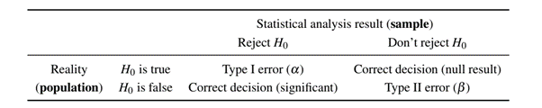
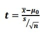

# (PART) Statistical analyses using R {.unnumbered}

# Correlation, LM, GLM, STD and CLM {#Corr-LM-GLM-STD-CLM}

This chapter introduces you to the basics of inferential statistics. We
cover correlation tests to identify specific patterns in the data. We
then use linear models to evaluate group differences, and generalised
linear models to evaluate binary outcomes. We also introduce the basics
of signal detection theory (SDT) to evaluate the accuracy of our models.
At the end of this chapter, we introduce the basics of cumulative link
models (CLM) to evaluate ordinal (likert) outcomes on two datasets.

## Loading packages

```{r warning=FALSE, message=FALSE, error=FALSE}
## Use the code below to check if you have all required packages installed. If some are not installed already, the code below will install these. If you have all packages installed, then you could load them with the second code.
requiredPackages = c('tidyverse', 'broom', 'knitr', 'Hmisc', 'corrplot', 'emmeans', 'ggsignif', 'PresenceAbsence', 'languageR', 'psycho', 'ordinal', 'DHARMa', 'sjPlot', 'htmltools', 'pwr', 'effectsize', 'datawizard', 'parameters')
for(p in requiredPackages){
  if(!require(p,character.only = TRUE)) install.packages(p)
  library(p,character.only = TRUE)
}
 
```

## Inferential statistics

### Introduction

What do we mean by inferential statistics?

We want to evaluate if there are differences observed between two groups
of datapoints and if these differences are statistically significant.

For this, we need to pay attention to the format of our outcome and
predictors. An outcome is the response variable (or dependent variable);
a predictor is our independent variable(s). This is fed into our
equation

$y = x\beta + \varepsilon$

where:

-   $y$ $\rightarrow$ outcome (DV) $\Rightarrow$ known

-   $x$ $\rightarrow$ fixed effect (IV) $\Rightarrow$ known

-   $\beta$ $\rightarrow$ coefficient of fixed effect $\Rightarrow$
    unknown

-   $\varepsilon$ $\rightarrow$ random error term $\Rightarrow$ unknown

### Hypothesis testing

In the approach that this book follows, we use a frequentist approach to
hypothesis testing. By frequentist we mean when modelling the
relationship between an outcome and a predictor, we are interested in
testing if the predictor has a clear and statistically significant
influence on the outcome. When evaluating this, we try to reject the
null hypothesis (*H*$_0$) in favour of the alternative hypothesis
(*H*$_1$).

The null hypothesis (*H*$_0$) is the hypothesis we make that there is no
statistical evidence in favour of an effect nor of a difference between
the groups. The alternative hypothesis (*H*$_1$) is the hypothesis we
make to reject the null hypothesis and there is indeed a statistical
evidence in favour of an effect or a difference between the groups.

### Type of outcomes

It is important to know the class of the outcome before doing any
pre-data analyses or inferential statistics. Outcome classes can be one
of:

1.  `Numeric`: As an example, we have length/width of leaf; height of
    mountain; fundamental frequency of the voice; etc. These are
    generally modelled with a `Gaussian` distribution These are `true`
    numbers and we can use summaries, t-tests, linear models, etc.
    Integers are a family of numeric variables and can still be
    considered as a normal numeric variable. Count data are numbers
    related to a category. In general, these are related to the second
    type of outcomes, and should be analysed using a poisson logistic
    regression

2.  `Categorical` (Unordered): Observations for two or more categories.
    As an example, we can have gender of a speaker (male or female);
    responses to a True vs False perception tests; Colour (unordered)
    categorisation, e.g., red, blue, yellow, orange, etc.. For these we
    can use a Generalised Linear Model (binomial or multinomial) or a
    simple chi-square test.

3.  `Categorical` (Ordered): When you run a rating experiment, where the
    outcome is either `numeric` (i.e., 1, 2, 3, 4, 5) or `categories`
    (i.e., disagree, neutral, agree). The `numeric` option is NOT a true
    number as for the participant, these are categories. Cumulative
    Logit models (or Generalised Linear Model with a cumulative
    function) are used. The mean is meaningless here, and the median is
    a preferred descriptive statistic.

### Types of Errors? {#errors}

In the literature, we discuss various types of errors in statistical
models. There are four different types, and the excellent Sonderegger
(2023) book (Sonderegger, M. (2023). *Regression Modeling for Linguistic
Data*. The MIT Press.) summarises these nicely. Here are the four types:

1.  **Type I** (or "false positive" or error $\alpha$) $\Rightarrow$
    falsely concluding there is an effect when none exists. (generally
    due to inaccurate modelling strategies)

2.  **Type II** (or "false negative" or error $\beta$)) $\Rightarrow$
    falsely concluding there is no effect when one in fact exists
    (generally due to inaccurate modelling strategies)

{width="674"}

3.  **Type S** $\Rightarrow$ Inaccurate sign (generally due to *hidden*
    multicollinearity and low power = 1- $\beta$)

4.  **Type M** $\Rightarrow$ Inaccurate magnitude (generally due to
    *hidden* multicollinearity and low power = 1- $\beta$)

It is important to note that the **Type I** and **Type II** errors are
the most commonly discussed in the literature and are related to each
other. Modelling is an art, and depending on model specifications, we
can easily increase **Type I** and/or **Type II** errors. **Type I** is
usually increased in the case of using inaccurately specified model,
e.g., not using a random effects structure when the data comes from
multiple speakers and/or multiple items. **Type II** error is usually
increased when there is an over specification of the model and/or not
accounting for dependencies in the data. **Type S** and **Type M** are
generally caused due to collinearity in the data, which causes
instability in the model and leads to cases of suppression; a point
discussed in **chapter** \@ref(DT-RF).

## Effect size and power analysis

### Effect size

#### What is the purpose of Effect Size?

'Effect size' is simply a way of quantifying the size of the difference
between two groups.

There are two family groups of Effect Size:

1.  Standardised mean differences (also called group difference indices;
    e.g., Cohen's *d*), The mean difference Effect Sizes are computed
    when the focus of the statistical analysis uses mean outcome scores
    to compare potential group differences.

2.  Strength of association (also referred to as relationship
    variance-accounted-for or variance explained Effect Sizes; e.g.,
    $R^{2}$, $\eta^{2}$, $\eta^{2}p$, $\omega^{2}$, etc. Strength of
    association Effect Size indices are calculated across a wide variety
    of research designs (e.g., ex post facto or causal comparative,
    experimental, quasi-experimental, prediction [regression and
    correlational]) using the general linear model (GLM) for the
    statistical analyses. Strength of association Effect Sizes indicate
    how much of the variance associated with the dependent variable
    (e.g., students' English test scores) can be accounted for (or
    explained) by the independent variable(s) (e.g., gender).

Both Effect Size families can be further categorised into biased
(uncorrected) and unbiased (corrected) measures:

-   Biased measures relates to **"sampling error"** and how the Effect
    Size derived from statistical procedures computed with smaller
    groups of participants (samples) drawn from a larger population will
    be higher than would be found either in the original population or
    in participant samples studied at a later date.

For example, assume a school counselling researcher randomly selects a
sample of 15 girls and 15 boys from a 10th-grade physical education
class in one high school. This 30-person sample then is assumed to
represent the entire population of male and female students attending
all Grade 10 physical education classes across a district's five high
schools. Because there is always sampling error (i.e., problems with
selecting the students to participate in the research study),
uncorrected Effect Sizes (e.g., Cohen's *d*, $R^{2}$, $\eta^{2}$) will
be higher (i.e., positively biased or overestimated) for the 30 students
than if the researcher actually could have included in the study every
10th-grade physical education student across all five high schools.

-   Unbiased ones (e.g., adjusted $R^{2}$, Hays' $\omega^{2}$, etc. )
    statistically correct for this positive bias by calculating the
    strength of association indices so that they better reflect the true
    Effect Sizes for the entire population and those calculated in
    future samples.

The issue is that because these formulas must adjust for sampling error
occurring both in the present study and in subsequent investigations,
Effect Size estimates for future research samples result in more
shrinkage (i.e., are smaller or more conservative) than those Effect
Size estimates based on an entire population. Therefore, interpretation
of Effect Size s is often less than straightforward and must be
exercised with caution.

#### What is the relationship between Effect Size and Significance?

Effect size quantifies the size of the difference between two groups,
and may therefore be said to be a true measure of the significance of
the difference.

The statistical significance is usually calculated as a 'p-value', the
probability that a difference of at least the same size would have
arisen by chance, even if there really were no difference between the
two populations. For differences between the means of two groups, this
p-value would normally be calculated from a 't-test'. By convention, if
p \< 0.05 (i.e. below 5%), the difference is taken to be large enough to
be 'significant'; if not, then it is 'not significant'.

There are a number of problems with using 'significance tests' in this
way. The main one is that the p-value depends essentially on two things:

a)  The size of the effect
b)  The size of the sample.

One would get a 'significant' result either if the effect were very big
(despite having only a small sample) or if the sample were very big
(even if the actual effect size were tiny). It is important to know the
statistical significance of a result, since without it there is a danger
of drawing firm conclusions from studies where the sample is too small
to justify such confidence. However, statistical significance does not
tell you the most important thing: **the size of the effect**. One way
to overcome this confusion is to report the effect size, together with
an estimate of its likely 'margin for error' or 'confidence interval'.

#### What is Confidence Interval?

The confidence interval is an alternative way to indicate the
variability in estimates from small samples. The default calculation
here is a '95% confidence interval'. If multiple samples of two groups
of the same size as these, taken from a population in which the true
difference was the value in column J, there would be variation in the
differences found. However, for every 100 samples taken, for 95 of them
(on average) the difference would be between the lower and upper
confidence limits. The confidence interval is usually interpreted as a
'margin of uncertainty' around the estimate of the difference between
experimental and control groups.

#### Which Effect Size measure to use?

We highlighted above various effect size measures, e.g., Cohen's *d*,
$R^{2}$, $\eta^{2}$, $\eta^{2}p$, $\omega^{2}$. Which one to chose from?
Well, all depends on the statistical approach you are using and whether
you want to report on standardised or unstandardised measures.

However, as a rule of thumb, you can do the following:

1.  In general, if we want to talk about the sample we have, we can use
    any biased method (like the eta-squared) because it estimates only
    for the sample and not the population.

2.  If we want to generalise our results, we have to use an unbiased
    method.

Literature recommends using an Effect Size measure accompanied with the
Confidence Interval, because telling only that a result is statistically
significant doesn't inform us of the contribution of the independent
variable to explain the variation in the dependent variable.

#### How to compute these in `R`

We use the package `effectsize`

##### Standardised effect sizes (Cohen's *d*)

It can be computed using the following formula:

$d=\frac{{Mean}_{factor1}-\ {Mean}_{factor2}}{{SD}_{pooled}}$

With the pooled standard deviation computed as:

${SD}_{pooled}=\sqrt{\frac{{SD}_{factor1}^2\ast\left({Number}_{factor1}-1\right)+\ {SD}_{factor2}^2\ast\left({Number}_{factor2}-1\right)}{{Number}_{factor1}+\ {Number}_{factor2}-\ 2}}$

Fortunately, instead of calculating it manually, we can use the function
`cohens_d()` from the package `effectsize`.

###### Linear model

```{r}
options(es.use_symbols = TRUE)# get nice symbols when printing! (On Windows, requires R >= 4.2.0)

english %>% 
  lm(RTlexdec ~ AgeSubject, data = .) %>%
  summary()
```

What the model above tells us is that there is a very highly
statistically significant impact of AgeSubject on RTlexdec (p \<
0.0001).

###### Cohen's *d*

However, it does not tell us how large this effect is. That is where we
can use the `cohens_d()` function.

```{r}
# Cohen's d
english %>% 
  cohens_d(RTlexdec ~ AgeSubject, data = .) %>% 
  interpret_cohens_d()
```

One nice option in the package `effectsize` is to use an [*Automated
Interpretation of Indices of Effect Size*
vignette](https://easystats.github.io/effectsize/articles/interpret.html).
We can use the original publication to interpret the effect size or use
an alternative. See the link above for more details.

We can also standardise our model's coefficients, which allows us to
compare the effect sizes of different predictors in the same model and
between models, variables and studies.

###### Standardised coefficients

```{r}
model <- english %>% 
  lm(RTlexdec ~ AgeSubject, data = .)

datawizard::standardize(model)

parameters::standardize_parameters(model)
```

Standardised coefficients are interpreted as the change in standard
deviations of the outcome variable for a one standard deviation change
in the predictor variable. We can initially standardise our outcomes
using the function `scale(center = TRUE, scale = TRUE)` and then run our
model, OR use the function `standardize()` from the package `datawizard`
or `standardize_parameters()` from the package `parameters` to do that.

##### Strength of association effect sizes

Here, we saw already that there are biased and unbiased measures. We
will document the classical measures used.

###### $R^{2}$

$R^{2}$ (R squared): It is the proportion of variance explained by the
model. This is a biased effect size measure. It is computed as:

$R^2=\frac{SS_{model}}{SS_{total}}=1-\frac{SS_{residual}}{SS_{total}}$

Where: $SS_{model}$ is the sum of squares of the model, $SS_{total}$ is
the total sum of squares and $SS_{residual}$ is the sum of squares of
the residuals.

We can get the $R^{2}$ and the adjusted $R^{2}$ from the summary of the
model:

```{r}
summary(model)$r.squared
summary(model)$adj.r.squared
```

###### $\eta^{2}$ (eta squared)

The eta-squared effect size measure is a biased measure and describes
the ratio of variance explained in the dependent variable by a predictor
(or factor) while controlling for other predictors (or in a simple way:
it is the proportion of total variation attributable to the factor). The
range is from 0 to 1 and it sums up to 1. Eta squared is a biased
estimator of the variance explained by the model in the population (it
only estimates effect size in the sample). On average it overestimates
the variance explained in the population. . It is computed as:

$\eta^{2}=\frac{SS_{model}}{SS_{total}}$

$SS_{model}$ is the sum of squares of the model, $SS_{total}$ is the
total sum of squares and $SS_{residual}$ is the sum of squares of the
residuals.

In a sense, both $R^{2}$ and $\eta^{2}$ are computed in the same way.

To obtain it directly from the model, we can use the function
`eta_squared()` from the package `effectsize` and specify
`partial = FALSE`.

```{r}
# eta squared
english %>% 
  aov(RTlexdec ~ AgeSubject, data = .) %>%
  eta_squared(., partial = FALSE) %>% 
  interpret_eta_squared()
```

###### $\eta^{2}p$ (partial eta squared)

$\eta^{2}p$ (partial eta squared): "proportion of total variation
attributable to the factor, partialling out (excluding) other factors
from the total non error variation". Partial eta squared is normally
higher than eta squared (except in simple one-factor models). The range
is from 0 to 1, and it sums up to more than 1 (except in one-way ANOVA).
It is computed as:

$\eta^{2}p=\frac{SS_{factor}}{SS_{factor}+SS_{error}}$

Where: $SS_{factor}$ is the sum of squares of the factor, $SS_{error}$
is the sum of squares of the error.

To obtain it directly from the model, we can use the function
`eta_squared()` from the package `effectsize` and specify
`partial = TRUE`.

```{r}
# partial eta squared
english %>% 
  aov(RTlexdec ~ AgeSubject, data = .) %>%
  eta_squared(., partial = TRUE) %>% 
  interpret_eta_squared()
```

###### $\omega^{2}$ (omega squared)

$\omega^{2}$ (omega squared): Provides a relatively unbiased estimate of
the variance explained in the population by a predictor variable. It
takes random error into account more so than eta squared, which is
incredibly biased to be too large. The range is from 0 to 1 and it sums
up to 1.

It is computed as:

$\omega^{2}=\frac{SS_{model}-(df_{model}\ast MS_{error})}{SS_{total}+MS_{error}}$

Where: $SS_{model}$ is the sum of squares of the model, $SS_{total}$ is
the total sum of squares, $df_{model}$ is the degrees of freedom of the
model and $MS_{error}$ is the mean square of the error.

To obtain it directly from the model, we can use the function
`omega_squared()` from the package `effectsize` and specify
`partial = FALSE`.

```{r}
# omega squared
english %>% 
  aov(RTlexdec ~ AgeSubject, data = .) %>%
  omega_squared(., partial = FALSE) %>% 
  interpret_omega_squared()
```

###### Partial $\omega^{2}$ (partial omega squared)

Partial $\omega^{2}$ (omega squared): "proportion of total variation
attributable to the factor, partialling out (excluding) other factors
from the total non error variation". The range is from 0 to 1 and it
sums up to more than 1 (except in one-way ANOVA). It is the equivalent
of partial eta-squared but as an unbiased measure. It is computed as:

$\omega^{2}p=\frac{df_{factor}\ast MS_{factor}-MS_{error})}{df_{factor}\ast MS_{factor}+df_{total}- df_{factor}\ast MS_{error})}$

Where: $df_{factor}$ is the degrees of freedom of the factor,
$MS_{factor}$ is the mean square of the factor, $df_{total}$ is the
total degrees of freedom and $MS_{error}$ is the mean square of the
error.

To obtain it directly from the model, we can use the function
`omega_squared()` from the package `effectsize` and specify
`partial = TRUE`.

```{r}
# omega squared partial
english %>% 
  aov(RTlexdec ~ AgeSubject, data = .) %>%
  omega_squared(., partial = TRUE) %>% 
  interpret_omega_squared()
```

###### Odds ratio

We will see in the **sections** \@ref(GLM) **and** \@ref(GLMM) that we
use odds ratio as an exponentation of the logodds (logit) coefficients.
Odds ratios can be interpreted as the odds for an event to occur. In
comparison to the logodds (logit) scale, which spans -6 and 6 (well
$-\infty$ - $\infty$), odds ratio are very (very high) and can reach 999
for a logodds of 6.9. Of course, in some cases, odds ratio are not easy
to interpret, and it is often "easier" to transform the logodds into
proportions. See this [excellent
link](https://stats.oarc.ucla.edu/other/mult-pkg/faq/general/faq-how-do-i-interpret-odds-ratios-in-logistic-regression/)
where you can understand the links better.

## Power analysis and sample size

Usually, when we design an experiment, we always ask the question: what
is the optimal sample size to use so that I have confidence in the
results I will obtain? To answer this question, we usually say: well it
all depends on your discipline and what is feasible for a particular
study. However, this can easily lead to misconceptions and issues in
designing our studies and more importantly, in the interpretation of the
results!

Hence, we demonstrate in the following power analysis and the sample
size. These two are crucial as they are interlinked. We saw in
**section** \@ref(errors) that there are four types of errors, with
**Type M** and **Type S** depending heavily on the power and on the
sampe size.

We use the package `pwr`, which allows us to compute both power and
sample size (but not at the same time!!). Looking at the [vignette of
the `pwr`
package](https://cran.r-project.org/web/packages/pwr/vignettes/pwr-vignette.html),
they cite the various functions available, such as:

-   `pwr.p.test`: one-sample proportion test
-   `pwr.2p.test`: two-sample proportion test
-   `pwr.2p2n.test`: two-sample proportion test (unequal sample sizes)
-   `pwr.t.test`: two-sample, one-sample and paired t-tests
-   `pwr.t2n.test`: two-sample t-tests (unequal sample sizes)
-   `pwr.anova.test`: one-way balanced ANOVA
-   `pwr.r.test`: correlation test
-   `pwr.chisq.test`: chi-squared test (goodness of fit and association)
-   `pwr.f2.test`: test for the general linear model

### Linear model

#### General example

We borrow from the vignette of the `pwr` package an example of a linear
model.

##### Power of the test

We want to compute the power we have with a sample size of 40 words, an
effect size of 0.3 and a significance level of 0.001.

```{r}
pwr.f2.test(u = 1, v = 40 - 1 - 1, f2 = 0.3/(1 - 0.3), sig.level = 0.001)
```

Where:

-   u = number of predictors

-   v = degrees of freedom of the residuals (n - u - 1)

-   f2 = effect size (Cohen's f2)

-   sig.level = significance level (alpha)

##### Sample size

We want to compute the sample size needed to have a power of 0.8, with a
significance level of 0.001 and an effect size of 0.3 (medium effect
size according to Cohen's conventions).

```{r}
pwr.f2.test(u = 1, f2 = 0.3/(1 - 0.3), sig.level = 0.001, power = 0.8)
```

Where:

-   u = number of predictors

-   f2 = effect size (Cohen's f2)

-   sig.level = significance level (alpha)

-   power = desired power (1 - beta)

Recall $n = v + u + 1$. Therefore, we need 43.35263 + 1 + 1 = 45.35263
\~ **45 words**.

#### Using our LM model

In our case, we use the dataset `english` from the `languageR` package.
We used AgeSubject as our predictor to predict RTlexdec. What if we want
to compute the power of our model that we ran previously? Here is the
summary of our model

```{r}
summary(model)
```

##### Power analysis from our model

Recall that the F test has numerator and denominator degrees of freedom.
The numerator degrees of freedom, `u`, is the number of coefficients
you'll have in your model (minus the intercept).

The effect size, `f2`, is $R^{2}/(1 - R^{2})$, where $R^{2}$ is the
coefficient of determination, aka the "proportion of variance
explained". To determine effect size you hypothesize the proportion of
variance your model explains, or the $R^{2}$.

Once we computed these three values, we can compute the power of our
model based on its summary.

```{r}
u <- summary(model)$fstatistic[2]
v <- summary(model)$fstatistic[3]
f2 <- summary(model)$r.squared/(1 - summary(model)$r.squared)
# p.value <- summary(model)$coefficients[2,4]
p.value <- 0.0001
pwrModel <- pwr.f2.test(u = u, v = v, f2 = f2, sig.level = p.value)
pwrModel
```

##### Sample size

For the optimal sample size, we use the same values for `u`, `f2` and
`p.value` as above, but we specify the power we want to have. Here, we
use the power we obtained from our model above.

```{r}
pwrSample <- pwr.f2.test(u = u, f2 = f2, sig.level = p.value, power = pwrModel$power)
pwrSample
```

Based on the output, we can compute the optimal sample size needed for
our model as

```{r}
n <- pwrSample$v + u + 1
n
```

The optimal sample size to reach this level of power is **1,000,000,000
words**! BUT we do not have that many words in our dataset. This is kind
of telling us that there are serious issues in our model. In fact, we
see that we have a power of 1, which is very high power. However, we
know very well that our linear model is inaccurate. We did not tell our
model that the data comes from multiple words, and that we really need
to compute a mixed effects regression (see **Section** \@ref(LMM) from
**chapter** \@ref(Random-LMM-GLMM-CLMM-GAMM)).

## Correlation tests

### Correlation does not imply causation!

There is a general misconception that when one conducts a correlation
test (see below), we can explain causation. An excellent example is
borrowed from
[wikipedia](https://en.wikipedia.org/wiki/Correlation_does_not_imply_causation#).
It is not because two variables are correlated (positively or
negatively) that one explains the reasons behind the second!

If you want to evaluate the cause of an effect then inferential
statistics that we cover after the correlation tests are the ones to go
for.


### Basic correlations

Let us start with a basic correlation test. We want to evaluate if two
numeric variables are correlated with each other.

We use the function `cor` to obtain the pearson correlation and
`cor.test` to run a basic correlation test on our data with significance
testing

```{r}
cor(english$RTlexdec, english$RTnaming, method = "pearson")
cor.test(english$RTlexdec, english$RTnaming)
```

What these results are telling us? There is a positive correlation
between `RTlexdec` and `RTnaming`. The correlation coefficient (R²) is
0.76 (limits between -1 and 1). This correlation is statistically
significant with a t value of 78.699, degrees of freedom of 4566 and a
p-value \< 2.2e-16.

What are the degrees of freedom? These relate to number of total
observations - number of comparisons. Here we have 4568 observations in
the dataset, and two comparisons, hence 4568 - 2 = 4566.

For the p value, there is a threshold we usually use. This threshold is
p = 0.05. This threshold means we have a minimum to consider any
difference as significant or not. 0.05 means that we have a probability
to find a significant difference that is at 5% or lower. IN our case,
the p value is lower that 2.2e-16. How to interpret this number? this
tells us to add 15 0s before the 2!! i.e., 0.0000000000000002. This
probability is very (very!!) low. So we conclude that there is a
statistically significant correlation between the two variables.

The formula to calculate the t value is below.



x̄ = sample mean μ0 = population mean s = sample standard deviation n =
sample size

The p value is influenced by various factors, number of observations,
strength of the difference, mean values, etc.. You should always be
careful with interpreting p values taking everything else into account.

### Using the package `corrplot`

Above, we did a correlation test on two predictors. What if we want to
obtain a nice plot of all numeric predictors and add significance
levels?

#### Correlation plots

```{r fig.height=6}
corr <- 
  english %>% 
  select(where(is.numeric)) %>% 
  cor()
corrplot(corr, method = 'ellipse', type = 'upper')

```

#### More advanced

Let's first compute the correlations between all numeric variables and
plot these with the p values

```{r fig.height=14, fig.width==14}
## correlation using "corrplot"
## based on the function `rcorr' from the `Hmisc` package
## Need to change dataframe into a matrix
corr <- 
  english %>% 
  select(where(is.numeric)) %>% 
  data.matrix(english) %>% 
  rcorr(type = "pearson")
# use corrplot to obtain a nice correlation plot!
corrplot(corr$r, p.mat = corr$P,
         addCoef.col = "black", diag = FALSE, type = "upper", tl.srt = 55)
```

```{r}
english %>% 
  group_by(AgeSubject) %>% 
  summarise(mean = mean(RTlexdec),
            sd = sd(RTlexdec))
```

## Linear Models {#LM}

Up to now, we have looked at descriptive statistics, and evaluated
summaries, correlations in the data (with p values).

We are now interested in looking at group differences.

### Introduction

The basic assumption of a Linear model is to create a regression
analysis on the data. We have an outcome (or dependent variable) and a
predictor (or an independent variable). The formula of a linear model is
as follows `outcome ~ predictor` that can be read as "outcome as a
function of the predictor". We can add "1" to specify an intercept, but
this is by default added to the model

#### Model estimation

```{r}
english2 <- english %>% 
  mutate(AgeSubject = factor(AgeSubject, levels = c("young", "old")))
mdl.lm <- english2 %>% 
  lm(RTlexdec ~ AgeSubject, data = .)
#lm(RTlexdec ~ AgeSubject, data = english)
mdl.lm #also print(mdl.lm)
summary(mdl.lm)
```

### Role of coding schemes

#### Intro

There are other coding schemes that can be used. See Schad et al.
(2020): "How to capitalize on a priori contrasts in linear (mixed)
models: A tutorial". **Journal of Memory and Language**,vol. 110,
104038.

We have:

1.  The treatment coding
2.  The contrast or sum coding
3.  The polynomial coding
4.  The Repeated coding
5.  The helmert coding

The first two are the most commonly used coding schemes, but see the
paper for why one can use the others.

#### Treatment coding

By default, `R` uses a treatment coding scheme. By this we mean that the
intercept has the outcome of a specific level in the dataset (usually,
the first in alphabetical order, unless you have changed that!). In our
example above, we changed the reference level of the variable
`AgeSubject` to be "young" vs "old". What we see as an result in our LM
is the intercept (=Young) vs "AgeSubjectold". This will mean we are
looking at the difference between the reference level and all other
levels.

The code below allows you to see what the coding scheme is.

```{r}
english2$AgeSubject2 <- english2$AgeSubject

contrasts(english2$AgeSubject2) <- contr.treatment(2)
contrasts(english2$AgeSubject2) 
mdl.lm.T <- english2 %>% 
  lm(RTlexdec ~ AgeSubject2, data = .)
#lm(RTlexdec ~ AgeSubject, data = english)
mdl.lm.T #also print(mdl.lm)
summary(mdl.lm.T)
```

#### Contrast (or sum) coding

##### Default

Let's change the coding scheme and see the difference in the output.

```{r}
english2 <- english2 %>% 
  mutate(AgeSubject2 = factor(AgeSubject2, levels = c("old", "young")))

contrasts(english2$AgeSubject2) <- contr.sum(2)
contrasts(english2$AgeSubject2)
mdl.lm.C <- english2 %>% 
  lm(RTlexdec ~ AgeSubject2, data = .)
#lm(RTlexdec ~ AgeSubject, data = english)
mdl.lm.C #also print(mdl.lm)
summary(mdl.lm.C)
```

With contrast (or sum) coding, the intercept is almost the same as
before (treatment = 6.439237 vs contrast = 6.550097). The intercept is
now the average of all of the data points

```{r}
english2 %>% 
  mutate(meanRTlexdec = mean(RTlexdec)) %>% 
  select(meanRTlexdec) %>%
  head(10)
```

The coefficient for "old" is different. It is now nearly half of that in
the treatment coding (0.221721 vs 0.110861). Why is this the case? In
treatment coding, the distance between old and young was of 1 (1- 0 =
1), in contrast coding, it is of 2 (1 - -1 = 2). The coefficient of the
intercept is exactly the same; for the second, it is half of the one
above (0.221721 / 1 = 0.221721; 0.221721 / 2 = 0.110861)!

How to interpret the coefficient for the level "old"? It is the distance
from the average!

Let's change slightly the coding scheme

##### Modified

```{r}
english2 <- english2 %>% 
  mutate(AgeSubject2 = factor(AgeSubject, levels = c("young", "old")))

contrasts(english2$AgeSubject2) <- c(-0.5, 0.5)
contrasts(english2$AgeSubject2)
mdl.lmC.2 <- english2 %>% 
  lm(RTlexdec ~ AgeSubject2, data = .)
#lm(RTlexdec ~ AgeSubject, data = english)
mdl.lmC.2 #also print(mdl.lmC.2)
summary(mdl.lmC.2)
```

Our intercept is still the average of all datapoints of the dependent
variable; that of "old" is now at 0.221721 as expected. The distance
between young and old is of 1 (0.5 - -0.5 = 1).

When and why do we use the different coding schemes? We use it to make
the intercept more interpretable. This is especially the case when
having more than two categorical predictors, or interactions between a
numeric and a categorical predictor. Read the paper and the Bodo
Winter's book for more details.

### Further steps

#### Tidying the output

We use our original model with treatment coding.

```{r}
# from library(broom)
tidy(mdl.lm) %>% 
  select(term, estimate) %>% 
  mutate(estimate = round(estimate, 3))
mycoefE <- tidy(mdl.lm) %>% pull(estimate)

```

Obtaining mean values from our model

```{r}
#old
mycoefE[1]
#young
mycoefE[1] + mycoefE[2]
```

#### Nice table of our model summary

We can also obtain a nice table of our model summary. We can use the
package `knitr` or `xtable`

##### Directly from model summary

```{r}
kable(summary(mdl.lm)$coef, digits = 3)
```

##### From the `tidy` output

```{r}
mdl.lmT <- tidy(mdl.lm)
kable(mdl.lmT, digits = 3)
```

##### Model’s fit

```{r warning=FALSE, message=FALSE, error=FALSE}
print(tab_model(mdl.lm, file = paste0("outputs/mdl_lm.html")))
htmltools::includeHTML("outputs/mdl_lm.html")
```

#### Dissecting the model

Let us dissect the model. If you use "str", you will be able to see what
is available under our linear model. To access some info from the model

##### "str" and "coef"

```{r}
str(mdl.lm)
```

```{r}
coef(mdl.lm)
## same as 
## mdl.lm$coefficients
```

##### "coef" and "coefficients"

What if I want to obtain the "Intercept"? Or the coefficient for
distance? What if I want the full row for distance?

```{r}
coef(mdl.lm)[1] # same as mdl.lm$coefficients[1]
coef(mdl.lm)[2] # same as mdl.lm$coefficients[2]
```

```{r}
summary(mdl.lm)$coefficients[2, ] # full row
summary(mdl.lm)$coefficients[2, 4] #for p value
```

##### Residuals

What about residuals (difference between the observed value and the
estimated value of the quantity) and fitted values? This allows us to
evaluate how normal our residuals are and how different they are from a
normal distribution.

###### Histogram

```{r warning=FALSE, message=FALSE, error=FALSE}
hist(residuals(mdl.lm))
```

###### qqplots

```{r warning=FALSE, message=FALSE, error=FALSE}
qqnorm(residuals(mdl.lm)); qqline(residuals(mdl.lm))
```

###### Residuals vs fitted values

```{r warning=FALSE, message=FALSE, error=FALSE}
plot(fitted(mdl.lm), residuals(mdl.lm), cex = 4)
```

###### Generating and plotting residual plot with `DHARMa`

```{r warning=FALSE, message=FALSE, error=FALSE}
sim_residuals <- simulateResiduals(mdl.lm)
plot(sim_residuals)
```

##### Goodness of fit?

```{r warning=FALSE, message=FALSE, error=FALSE}
AIC(mdl.lm)	# Akaike's Information Criterion, lower values are better
BIC(mdl.lm)	# Bayesian AIC
logLik(mdl.lm)	# log likelihood
```

Or use the following from `broom`

```{r}
glance(mdl.lm)
```

##### Significance testing

Are the above informative? of course not directly. If we want to test
for overall significance of model. We run a null model (aka intercept
only) and compare models.

```{r warning=FALSE, message=FALSE, error=FALSE}
mdl.lm.Null <- english %>% 
  lm(RTlexdec ~ 1, data = .)
mdl.comp <- anova(mdl.lm.Null, mdl.lm)
mdl.comp
```

The results show that adding the variable "AgeSubject" improves the
model fit. We can write this as follows: Model comparison showed that
the addition of AgeSubject improved the model fit when compared with an
intercept only model ($F$(`r mdl.comp[2,3]`) =
`r round(mdl.comp[2,5], 2)`, *p* \< `r mdl.comp[2,6]`) (F(1) = 4552 , p
\< 2.2e-16)

### Plotting fitted values

#### Trend line

Let's plot our fitted values but only for the trend line

```{r warning=FALSE, message=FALSE, error=FALSE}
english %>% 
  ggplot(aes(x = AgeSubject, y = RTlexdec))+
  geom_boxplot()+
  theme_bw() + theme(text = element_text(size = 15))+
  geom_smooth(aes(x = as.numeric(AgeSubject), y = predict(mdl.lm)), method = "lm", color = "blue") + 
  labs(x = "Age", y = "RTLexDec", title = "Boxplot and predicted trend line", subtitle = "with ggplot2") 
```

This allows us to plot the fitted values from our model with the
predicted linear trend. This is exactly the same as our original data.

#### Predicted means and the trend line

We can also plot the predicted means and linear trend

```{r warning=FALSE, message=FALSE, error=FALSE}
english %>% 
  ggplot(aes(x = AgeSubject, y = predict(mdl.lm)))+
  geom_boxplot(color = "blue") +
  theme_bw() + theme(text = element_text(size = 15)) +
  geom_smooth(aes(x = as.numeric(AgeSubject), y = predict(mdl.lm)), method = "lm", color = "blue") + 
    labs(x = "Age", y = "RTLexDec", title = "Predicted means and trend line", subtitle = "with ggplot2") 

```

#### Raw data, predicted means and the trend line

We can also plot the actual data, the predicted means and linear trend

```{r warning=FALSE, message=FALSE, error=FALSE}
english %>% 
  ggplot(aes(x = AgeSubject, y = RTlexdec))+
  geom_boxplot() +
  geom_boxplot(aes(x = AgeSubject, y = predict(mdl.lm)), color = "blue") +
  theme_bw() + theme(text = element_text(size = 15)) +
  geom_smooth(aes(x = as.numeric(AgeSubject), y = predict(mdl.lm)), method = "lm", color = "blue") +
    labs(x = "Species", y = "Length", title = "Boxplot raw data, predicted means (in blue) and trend line", subtitle = "with ggplot2")
```

#### Add significance levels and trend line on a plot?

We can use the p values generated from either our linear model to add
significance levels on a plot. We use the code from above and add the
significance level. We also add a trend line

```{r warning=FALSE, message=FALSE, error=FALSE}
english %>% 
  ggplot(aes(x = AgeSubject, y = RTlexdec))+
  geom_boxplot() +
  geom_boxplot(aes(x = AgeSubject, y = predict(mdl.lm)), color = "blue") +
  theme_bw() + theme(text = element_text(size = 15)) +
  geom_smooth(aes(x = as.numeric(AgeSubject), y = predict(mdl.lm)), method = "lm", color = "blue") +
    labs(x = "Species", y = "Length", title = "Boxplot raw data, predicted means (in blue) and trend line", subtitle = "with significance testing") +
    geom_signif(comparison = list(c("old", "young")), 
              map_signif_level = TRUE, test = function(a, b) {
                list(p.value = summary(mdl.lm)$coefficients[2, 4])})


```

### What about pairwise comparison?

When having three of more levels in our predictor, we can use pairwise
comparisons, with corrections to evaluate differences between each
level.

```{r}
summary(mdl.lm)
```

```{r}
mdl.lm %>% emmeans(pairwise ~ AgeSubject, adjust = "fdr") -> mdl.emmeans
mdl.emmeans
```

How to interpret the output? Discuss with your neighbour and share with
the group.

Hint... Look at the emmeans values for each level of our factor
"Species" and the contrasts.

### Multiple predictors?

Linear models require a numeric outcome, but the predictor can be either
numeric or a factor. We can have more than one predictor. The only issue
is that this complicates the interpretation of results

```{r warning=FALSE, message=FALSE, error=FALSE}
english %>% 
  lm(RTlexdec ~ AgeSubject * WordCategory, data = .) %>% 
  summary()
```

And with an Anova

```{r warning=FALSE, message=FALSE, error=FALSE}
english %>% 
  lm(RTlexdec ~ AgeSubject * WordCategory, data = .) %>% 
  anova()
```

The results above tell us that all predictors used are significantly
different.

## Generalised Linear Models {#GLM}

Here we will look at an example when the outcome is binary. This
simulated data is structured as follows. We asked one participant to
listen to 165 sentences, and to judge whether these are "grammatical" or
"ungrammatical". There were 105 sentences that were "grammatical" and 60
"ungrammatical". Responses varied, with 110 "yes" responses and 55 "no"
responses, spread across the grammatical.

This fictitious example can apply in any other situation. Let's think
Geography: 165 lands: 105 "flat" and 60 "non-flat", etc. This applies to
any case where you need to "categorise" the outcome into two groups.

### Load and summaries

Let's create this dataset from scratch (you can load the
"grammatical.csv file as well) and do some basic summaries

```{r warning=FALSE, message=FALSE, error=FALSE}
grammatical <- as.data.frame(
  cbind("grammaticality" = c("grammatical" = rep("grammatical", 105),
                             "ungrammatical" = rep("ungrammatical", 60)),
        "response" = c("yes" = rep("yes", 100),
                       "no" = rep("no", 5),
                       "yes" = rep("yes", 10),
                       "no" = rep("no", 50))),
  row.names = FALSE)
grammatical %>% 
  head(20)
str(grammatical)
head(grammatical)
table(grammatical$response, grammatical$grammaticality)
```

### GLM - Categorical predictors

Let's run a first GLM (Generalised Linear Model). A GLM uses a special
family "binomial" as it assumes the outcome has a binomial distribution.
In general, results from a Logistic Regression are close to what we get
from SDT (see above).

To run the results, we will change the reference level for both response
and grammaticality. The basic assumption about GLM is that we start with
our reference level being the "no" responses to the "ungrammatical"
category. Any changes to this reference will be seen in the coefficients
as "yes" responses to the "grammatical" category.

#### Model estimation and results

The results below show the logodds for our model.

```{r warning=FALSE, message=FALSE, error=FALSE}
grammatical <- grammatical %>% 
  mutate(response = factor(response, levels = c("no", "yes")),
         grammaticality = factor(grammaticality, levels = c("ungrammatical", "grammatical")))

grammatical %>% 
  group_by(grammaticality, response) %>% 
  table()

mdl.glm <- grammatical %>% 
  glm(response ~ grammaticality, data = ., family = binomial)
summary(mdl.glm)

tidy(mdl.glm) %>% 
  select(term, estimate) %>% 
  mutate(estimate = round(estimate, 3))
# to only get the coefficients
mycoef2 <- tidy(mdl.glm) %>% pull(estimate)
```

#### Model’s fit

```{r warning=FALSE, message=FALSE, error=FALSE}
print(tab_model(mdl.glm, file = paste0("outputs/mdl.glm.html")))
htmltools::includeHTML("outputs/mdl.glm.html")
```

The results show that for one unit increase in the response (i.e., from
no to yes), the logodds of being "grammatical" is increased by
`r mycoef2[2]` (the intercept shows that when the response is "no", the
logodds are `r mycoef2[1]`). The actual logodds for the response "yes"
to grammatical is `r mycoef2[1]+mycoef2[2]`

#### Logodds to Odd ratios

Logodds can be modified to talk about the odds of an event. For our
model above, the odds of "grammatical" receiving a "no" response is a
mere 0.2; the odds of "grammatical" to receive a "yes" is a 20; i.e., 20
times more likely

```{r warning=FALSE, message=FALSE, error=FALSE}
exp(mycoef2[1])
exp(mycoef2[1] + mycoef2[2])

```

#### LogOdds to proportions

If you want to talk about the percentage "accuracy" of our model, then
we can transform our loggodds into proportions. This shows that the
proportion of "grammatical" receiving a "yes" response increases by 99%
(or 95% based on our "true" coefficients)

```{r warning=FALSE, message=FALSE, error=FALSE}
plogis(mycoef2[1])
plogis(mycoef2[1] + mycoef2[2])
```

#### Plotting

```{r warning=FALSE, message=FALSE, error=FALSE}
grammatical <- grammatical %>% 
  mutate(prob = predict(mdl.glm, type = "response"))
grammatical %>% 
  ggplot(aes(x = as.numeric(grammaticality), y = prob)) +
  geom_point() +
  geom_smooth(method = "glm", 
    method.args = list(family = "binomial"), 
    se = T) + theme_bw(base_size = 20)+
    labs(y = "Probability", x = "")+
    coord_cartesian(ylim = c(0,1))+
    scale_x_discrete(limits = c("Ungrammatical", "Grammatical"))
```

### GLM - Numeric predictors

In this example, we will run a GLM model using a similar technique to
that used in `Al-Tamimi (2017)` and `Baumann & Winter (2018)`. We use
the package `LanguageR` and the dataset `English`.

In the model above, we used the equation as lm(RTlexdec \~ AgeSubject).
We were interested in examining the impact of age of subject on reaction
time in a lexical decision task. In this section, we are interested in
understanding how reaction time allows to differentiate the participants
based on their age. We use `AgeSubject` as our outcome and `RTlexdec` as
our predictor using the equation glm(AgeSubject \~ RTlexdec). We usually
can use `RTlexdec` as is, but due to a possible quasi separation and the
fact that we may want to compare coefficients using multiple acoustic
metrics, we will z-score our predictor. We run below two models, with
and without z-scoring

For the glm model, we need to specify `family = "binomial"`.

#### Without z-scoring of predictor

##### Model estimation

```{r warning=FALSE, message=FALSE, error=FALSE}
mdl.glm2 <- english2 %>% 
  glm(AgeSubject ~ RTlexdec, data = ., family = "binomial")

tidy(mdl.glm2) %>% 
  select(term, estimate) %>% 
  mutate(estimate = round(estimate, 3))
# to only get the coefficients
mycoef2 <- tidy(mdl.glm2) %>% pull(estimate)
```

##### Model’s fit

```{r warning=FALSE, message=FALSE, error=FALSE}
print(tab_model(mdl.glm2, file = paste0("outputs/mdl.glm2.html")))
htmltools::includeHTML("outputs/mdl.glm2.html")
```

##### LogOdds to proportions

If you want to talk about the percentage "accuracy" of our model, then
we can transform our loggodds into proportions.

```{r warning=FALSE, message=FALSE, error=FALSE}
plogis(mycoef2[1])
plogis(mycoef2[1] + mycoef2[2])
```

##### Plotting

```{r warning=FALSE, message=FALSE, error=FALSE}
english2 <- english2 %>% 
  mutate(prob = predict(mdl.glm2, type = "response"))
english2 %>% 
  ggplot(aes(x = as.numeric(AgeSubject), y = prob)) +
  geom_point() +
  geom_smooth(method = "glm", 
    method.args = list(family = "binomial"), 
    se = T) + theme_bw(base_size = 20)+
    labs(y = "Probability", x = "")+
    coord_cartesian(ylim = c(0,1))+
    scale_x_discrete(limits = c("Young", "Old"))
```

The plot above show how the two groups differ using a glm. The results
point to an overall increase in the proportion of reaction time when
moving from the "Young" to the "Old" group. Let's use z-scoring next

#### With z-scoring of predictor

##### Model estimation

```{r warning=FALSE, message=FALSE, error=FALSE}
english2 <- english2 %>% 
  mutate(`RTlexdec_z` = scale(RTlexdec, center = TRUE, scale = TRUE))

english2['RTlexdec_z'] <- as.data.frame(scale(english2$RTlexdec))


mdl.glm3 <- english2 %>% 
  glm(AgeSubject ~ RTlexdec_z, data = ., family = "binomial")

tidy(mdl.glm3) %>% 
  select(term, estimate) %>% 
  mutate(estimate = round(estimate, 3))
# to only get the coefficients
mycoef2 <- tidy(mdl.glm3) %>% pull(estimate)
```

##### Model’s fit

```{r warning=FALSE, message=FALSE, error=FALSE}
print(tab_model(mdl.glm3, file = paste0("outputs/mdl.glm3.html")))
htmltools::includeHTML("outputs/mdl.glm3.html")
```

##### LogOdds to proportions

If you want to talk about the percentage "accuracy" of our model, then
we can transform our loggodds into proportions.

```{r warning=FALSE, message=FALSE, error=FALSE}
plogis(mycoef2[1])
plogis(mycoef2[1] + mycoef2[2])
```

##### Plotting

###### Normal

```{r warning=FALSE, message=FALSE, error=FALSE}
english2 <- english2 %>% 
  mutate(prob = predict(mdl.glm3, type = "response"))
english2 %>% 
  ggplot(aes(x = as.numeric(AgeSubject), y = prob)) +
  geom_point() +
  geom_smooth(method = "glm", 
    method.args = list(family = "binomial"), 
    se = T) + theme_bw(base_size = 20)+
    labs(y = "Probability", x = "")+
    coord_cartesian(ylim = c(0,1))+
    scale_x_discrete(limits = c("Young", "Old"))
```

We obtain the exact same plots, but the model estimations are different.
Let's use another type of predictions

###### z-scores

```{r warning=FALSE, message=FALSE, error=FALSE}
z_vals <- seq(-3, 3, 0.01)

dfPredNew <- data.frame(RTlexdec_z = z_vals)

## store the predicted probabilities for each value of RTlexdec_z
pp <- cbind(dfPredNew, prob = predict(mdl.glm3, newdata = dfPredNew, type = "response"))

pp %>% 
  ggplot(aes(x = RTlexdec_z, y = prob)) +
  geom_point() +
  theme_bw(base_size = 20)+
    labs(y = "Probability", x = "") +
    coord_cartesian(ylim = c(-0.1, 1.1), expand = FALSE) +
    scale_y_discrete(limits = c(0,1), labels = c("Young", "Old")) +
  scale_x_continuous(breaks = c(-3, -2, -1, 0, 1, 2, 3))
```

We obtain the exact same plots, but the model estimations are different.

### Signal Detection Theory {#STD}

#### Rationale

We are generally interested in performance, i.e., whether the we have
"accurately" categorised the outcome or not and at the same time want to
evaluate our biases in responses. When deciding on categories, we are
usually biased in our selection.

Let's ask the question: How many of you have a Mac laptop and how many a
Windows laptop? For those with a Mac, what was the main reason for
choosing it? Are you biased in anyway by your decision?

To correct for these biases, we use some variants from Signal Detection
Theory to obtain the true estimates without being influenced by the
biases.

#### Running stats

Let's do some stats on this

|   | Yes | No | Total |
|-------------------|------------------|------------------|------------------|
| Grammatical (Yes Actual) | TP = 100 | FN = 5 | (Yes Actual) 105 |
| Ungrammatical (No Actual) | FP = 10 | TN = 50 | (No Actual) 60 |
| Total | (Yes Response) 110 | (No Response) 55 | 165 |

```{r warning=FALSE, message=FALSE, error=FALSE}
grammatical <- grammatical %>% 
  mutate(response = factor(response, levels = c("yes", "no")),
         grammaticality = factor(grammaticality, levels = c("grammatical", "ungrammatical")))

```

#### Below we obtain multiple measures

##### TP, FP, FN, TN

TP = True Positive (Hit); FP = False Positive; FN = False Negative; TN =
True Negative

```{r warning=FALSE, message=FALSE, error=FALSE}
TP <- nrow(grammatical %>% 
             filter(grammaticality == "grammatical" &
                      response == "yes"))
FN <- nrow(grammatical %>% 
             filter(grammaticality == "grammatical" &
                      response == "no"))
FP <- nrow(grammatical %>% 
             filter(grammaticality == "ungrammatical" &
                      response == "yes"))
TN <- nrow(grammatical %>% 
             filter(grammaticality == "ungrammatical" &
                      response == "no"))
TP
FN
FP
TN
```

##### Accuracy, Error, Sensitivity, Specificity, Precision, etc.

###### Accuracy and Error

```{r warning=FALSE, message=FALSE, error=FALSE}
(TP+TN)/nrow(grammatical) # accuracy
(FP+FN)/nrow(grammatical) # error, also 1-accuracy
```

###### Sensitivity, Specificity, Precision, etc.

```{r warning=FALSE, message=FALSE, error=FALSE}

# When stimulus = yes, how many times response = yes?
TP/(TP+FN) # also True Positive Rate or Specificity

# When stimulus = no, how many times response = yes?
FP/(FP+TN) # False Positive Rate, 

# When stimulus = no, how many times response = no?
TN/(FP+TN) # True Negative Rate or Sensitivity 

# When subject responds "yes" how many times is (s)he correct?
TP/(TP+FP) # precision
```

###### STD measures

We can get various measures from Signal Detection Theory. using the
package `psycho`.

-   dprime (or the sensitivity index)

-   beta (bias criterion, 0-1, lower = increase in "yes")

-   Aprime (estimate of discriminability, 0-1, 1 = good discrimination;
    0 at chance)

-   bppd (b prime prime d, -1 to 1; 0 = no bias, negative = tendency to
    respond "yes", positive = tendency to respond "no")

-   c (index of bias, equals to SD)

See
[here](https://www.r-bloggers.com/compute-signal-detection-theory-indices-with-r/amp/)
for more details

```{r warning=FALSE, message=FALSE, error=FALSE}
psycho::dprime(TP, FP, FN, TN, 
               n_targets = TP+FN, 
               n_distractors = FP+TN,
               adjust=F)

```

The most important from above, is d-prime. This is modelling the
difference between the rate of "True Positive" responses and "False
Positive" responses in standard unit (or z-scores). The formula can be
written as:

`d' (d prime) = Z(True Positive Rate) - Z(False Positive Rate)`

#### GLM and d prime

The values obtained here match those obtained from SDT. For d prime, the
difference stems from the use of the logit variant of the Binomial
family. By using a probit variant, one obtains the same values ([see
here](https://stats.idre.ucla.edu/r/dae/probit-regression/) for more
details). A probit variant models the z-score differences in the outcome
and is evaluated in change in 1-standard unit. This is modelling the
change from "ungrammatical" "no" responses into "grammatical" "yes"
responses in z-scores. The same conceptual underpinnings of d-prime from
Signal Detection Theory.

```{r}
## d prime
psycho::dprime(TP, FP, FN, TN, 
               n_targets = TP+FN, 
               n_distractors = FP+TN,
               adjust=F)$dprime

## GLM with probit
coef(glm(response ~ grammaticality, data = grammatical, family = binomial(probit)))[2]

```

#### GLM as a classification tool

The code below demonstrates the links between our GLM model and what we
had obtained above from SDT. The predictions' table shows that our GLM
was successful at obtaining prediction that are identical to our initial
data setup. Look at the table here and the table above. Once we have
created our table of outcome, we can compute percent correct, the
specificity, the sensitivity, the Kappa score, etc.. this yields the
actual value with the SD that is related to variations in responses.

```{r}
## predict(mdl.glm)>0.5 is identical to 
## predict(glm(response~grammaticality,data=grammatical,family = binomial),type="response")
grammatical <- grammatical %>% 
  mutate(response = factor(response, levels = c("yes", "no")),
         grammaticality = factor(grammaticality, levels = c("grammatical", "ungrammatical")))


mdl.glm.C <- grammatical %>% 
  glm(response ~ grammaticality, data = .,family = binomial)

tbl.glm <- table(grammatical$response, predict(mdl.glm.C, type = "response")>0.5)
colnames(tbl.glm) <- c("grammatical", "ungrammatical")
tbl.glm
PresenceAbsence::pcc(tbl.glm)
PresenceAbsence::specificity(tbl.glm)
PresenceAbsence::sensitivity(tbl.glm)
###etc..
```

If you look at the results from SDT above, these results are the same as
the following

Accuracy: (TP+TN)/Total (`r (TP+TN)/nrow(grammatical)`)

True Positive Rate (or Specificity) TP/(TP+FN) (`r TP/(TP+FN)`)

True Negative Rate (or Sensitivity) TN/(FP+TN) (`r TN/(FP+TN)`)

#### GLM: Other distributions

If your data does not fit a binomial distribution, and is a multinomial
(i.e., three or more response categories) or poisson (count data), then
you need to use the glm function with a specific family function.

```{r warning=FALSE, message=FALSE, error=FALSE, echo=FALSE}
## For a multinomial (3 or more response categories), see below and use the following specification
## https://stats.idre.ucla.edu/r/dae/multinomial-logistic-regression/
## mdl.multi <- nnet::multinom(outcome~predictor, data=data)

## For a poisson (count data), see below and use the following specification
## https://stats.idre.ucla.edu/r/dae/poisson-regression/

## mdl.poisson <- glm(outcome~predictor, data = data, family = "poisson")


```

## Cumulative Logit Link Models {#CLM}

These models work perfectly with rating data. Ratings are inherently
ordered, 1, 2, ... n, and expect to observe an increase (or decrease) in
overall ratings from 1 to n. To demonstrate this, we will use an example
using the package "ordinal".

We use two datasets. We previously ran these two models, however, in
this subset of the full dataset, we did not take into account the fact
that there were multiple producing speakers and items.

### Ratings of percept of nasality

The first comes from a likert-scale a rating experiment where six
participants rated the percept of nasality in the production of
particular consonants in Arabic. The data came from nine producing
subjects. The ratings were from 1 to 5, with 1 reflecting an `oral`
percept; 5 a `nasal` percept.

#### Importing and pre-processing

We start by importing the data and process it. We change the reference
level in the predictor

```{r warning=FALSE, message=FALSE, error=FALSE}
rating <- read_csv("data/rating.csv")[-1]
rating
rating <- rating %>% 
  mutate(Response = factor(Response),
         Context = factor(Context)) %>% 
  mutate(Context = relevel(Context, "isolation"))
rating
```

#### Our first model

We run our first clm model as a simple, i.e., with no random effects

```{r warning=FALSE, message=FALSE, error=FALSE}
mdl.clm <- rating %>% 
  clm(Response ~ Context, data = .)
summary(mdl.clm)
```

#### Testing significance

We can evaluate whether "Context" improves the model fit, by comparing a
null model with our model. Of course "Context" is improving the model
fit.

```{r warning=FALSE, message=FALSE, error=FALSE}
mdl.clm.Null <- rating %>% 
  clm(Response ~ 1, data = .)
anova(mdl.clm, mdl.clm.Null)

```

#### Model’s fit

```{r warning=FALSE, message=FALSE, error=FALSE}
print(tab_model(mdl.clm, file = paste0("outputs/mdl.clm.html")))
htmltools::includeHTML("outputs/mdl.clm.html")
```

#### Interpreting a cumulative model

As a way to interpret the model, we can look at the coefficients and
make sense of the results. A CLM model is a Logistic model with a
cumulative effect. The "Coefficients" are the estimates for each level
of the fixed effect; the "Threshold coefficients" are those of the
response. For the former, a negative coefficient indicates a negative
association with the response; and a positive is positively associated
with the response. The p values are indicating the significance of each
level. For the "Threshold coefficients", we can see the cumulative
effects of ratings 1\|2, 2\|3, 3\|4 and 4\|5 which indicate an overall
increase in the ratings from 1 to 5.

##### Plotting

##### No confidence intervals

We use a modified version of a plotting function that allows us to
visualise the effects. For this, we use the base R plotting functions.
The version below is without confidence intervals.

```{r warning=FALSE, message=FALSE, error=FALSE}
par(oma=c(1, 0, 0, 3),mgp=c(2, 1, 0))
xlimNas = c(min(mdl.clm$beta), max(mdl.clm$beta))
ylimNas = c(0,1)
plot(0,0,xlim=xlimNas, ylim=ylimNas, type="n", ylab=expression(Probability), xlab="", xaxt = "n",main="Predicted curves - Nasalisation",cex=2,cex.lab=1.5,cex.main=1.5,cex.axis=1.5)
axis(side = 1, at = c(0,mdl.clm$beta),labels = levels(rating$Context), las=2,cex=2,cex.lab=1.5,cex.axis=1.5)
xsNas = seq(xlimNas[1], xlimNas[2], length.out=100)
lines(xsNas, plogis(mdl.clm$Theta[1] - xsNas), col='black')
lines(xsNas, plogis(mdl.clm$Theta[2] - xsNas)-plogis(mdl.clm$Theta[1] - xsNas), col='red')
lines(xsNas, plogis(mdl.clm$Theta[3] - xsNas)-plogis(mdl.clm$Theta[2] - xsNas), col='green')
lines(xsNas, plogis(mdl.clm$Theta[4] - xsNas)-plogis(mdl.clm$Theta[3] - xsNas), col='orange')
lines(xsNas, 1-(plogis(mdl.clm$Theta[4] - xsNas)), col='blue')
abline(v=c(0,mdl.clm$beta),lty=3)
abline(h=0, lty="dashed")
abline(h=0.2, lty="dashed")
abline(h=0.4, lty="dashed")
abline(h=0.6, lty="dashed")
abline(h=0.8, lty="dashed")
abline(h=1, lty="dashed")

legend(par('usr')[2], par('usr')[4], bty='n', xpd=NA,lty=1, col=c("black", "red", "green", "orange", "blue"), 
       legend=c("Oral", "2", "3", "4", "Nasal"),cex=0.75)

```

##### With confidence intervals

Here is an attempt to add the 97.5% confidence intervals to these plots.
This is an experimental attempt and any feedback is welcome!

```{r warning=FALSE, message=FALSE, error=FALSE}
par(oma=c(1, 0, 0, 3),mgp=c(2, 1, 0))
xlimNas = c(min(mdl.clm$beta), max(mdl.clm$beta))
ylimNas = c(0,1)
plot(0,0,xlim=xlimNas, ylim=ylimNas, type="n", ylab=expression(Probability), xlab="", xaxt = "n",main="Predicted curves - Nasalisation",cex=2,cex.lab=1.5,cex.main=1.5,cex.axis=1.5)
axis(side = 1, at = c(0,mdl.clm$beta),labels = levels(rating$Context), las=2,cex=2,cex.lab=1.5,cex.axis=1.5)
xsNas = seq(xlimNas[1], xlimNas[2], length.out=100)


#+CI 
lines(xsNas, plogis(mdl.clm$Theta[1]+(summary(mdl.clm)$coefficient[,2][[1]]/1.96) - xsNas), col='black')
lines(xsNas, plogis(mdl.clm$Theta[2]+(summary(mdl.clm)$coefficient[,2][[2]]/1.96) - xsNas)-plogis(mdl.clm$Theta[1]+(summary(mdl.clm)$coefficient[,2][[1]]/1.96) - xsNas), col='red')
lines(xsNas, plogis(mdl.clm$Theta[3]+(summary(mdl.clm)$coefficient[,2][[3]]/1.96) - xsNas)-plogis(mdl.clm$Theta[2]+(summary(mdl.clm)$coefficient[,2][[2]]/1.96) - xsNas), col='green')
lines(xsNas, plogis(mdl.clm$Theta[4]+(summary(mdl.clm)$coefficient[,2][[4]]/1.96) - xsNas)-plogis(mdl.clm$Theta[3]+(summary(mdl.clm)$coefficient[,2][[3]]/1.96) - xsNas), col='orange')
lines(xsNas, 1-(plogis(mdl.clm$Theta[4]+(summary(mdl.clm)$coefficient[,2][[4]]/1.96) - xsNas)), col='blue')

#-CI 
lines(xsNas, plogis(mdl.clm$Theta[1]-(summary(mdl.clm)$coefficient[,2][[1]]/1.96) - xsNas), col='black')
lines(xsNas, plogis(mdl.clm$Theta[2]-(summary(mdl.clm)$coefficient[,2][[2]]/1.96) - xsNas)-plogis(mdl.clm$Theta[1]-(summary(mdl.clm)$coefficient[,2][[1]]/1.96) - xsNas), col='red')
lines(xsNas, plogis(mdl.clm$Theta[3]-(summary(mdl.clm)$coefficient[,2][[3]]/1.96) - xsNas)-plogis(mdl.clm$Theta[2]-(summary(mdl.clm)$coefficient[,2][[2]]/1.96) - xsNas), col='green')
lines(xsNas, plogis(mdl.clm$Theta[4]-(summary(mdl.clm)$coefficient[,2][[4]]/1.96) - xsNas)-plogis(mdl.clm$Theta[3]-(summary(mdl.clm)$coefficient[,2][[3]]/1.96) - xsNas), col='orange')
lines(xsNas, 1-(plogis(mdl.clm$Theta[4]-(summary(mdl.clm)$coefficient[,2][[4]]/1.96) - xsNas)), col='blue')

# fill area around CI using c(x, rev(x)), c(y2, rev(y1))
polygon(c(xsNas, rev(xsNas)),
        c(plogis(mdl.clm$Theta[1]+(summary(mdl.clm)$coefficient[,2][[1]]/1.96) - xsNas), rev(plogis(mdl.clm$Theta[1]-(summary(mdl.clm)$coefficient[,2][[1]]/1.96) - xsNas))), col = "gray90")

polygon(c(xsNas, rev(xsNas)),
        c(plogis(mdl.clm$Theta[2]+(summary(mdl.clm)$coefficient[,2][[2]]/1.96) - xsNas)-plogis(mdl.clm$Theta[1]+(summary(mdl.clm)$coefficient[,2][[1]]/1.96) - xsNas), rev(plogis(mdl.clm$Theta[2]-(summary(mdl.clm)$coefficient[,2][[2]]/1.96) - xsNas)-plogis(mdl.clm$Theta[1]-(summary(mdl.clm)$coefficient[,2][[1]]/1.96) - xsNas))), col = "gray90")


polygon(c(xsNas, rev(xsNas)),
        c(plogis(mdl.clm$Theta[3]+(summary(mdl.clm)$coefficient[,2][[3]]/1.96) - xsNas)-plogis(mdl.clm$Theta[2]+(summary(mdl.clm)$coefficient[,2][[2]]/1.96) - xsNas), rev(plogis(mdl.clm$Theta[3]-(summary(mdl.clm)$coefficient[,2][[3]]/1.96) - xsNas)-plogis(mdl.clm$Theta[2]-(summary(mdl.clm)$coefficient[,2][[2]]/1.96) - xsNas))), col = "gray90")

polygon(c(xsNas, rev(xsNas)),
        c(plogis(mdl.clm$Theta[4]+(summary(mdl.clm)$coefficient[,2][[4]]/1.96) - xsNas)-plogis(mdl.clm$Theta[3]+(summary(mdl.clm)$coefficient[,2][[3]]/1.96) - xsNas), rev(plogis(mdl.clm$Theta[4]-(summary(mdl.clm)$coefficient[,2][[4]]/1.96) - xsNas)-plogis(mdl.clm$Theta[3]-(summary(mdl.clm)$coefficient[,2][[3]]/1.96) - xsNas))), col = "gray90")

        
polygon(c(xsNas, rev(xsNas)),
        c(1-(plogis(mdl.clm$Theta[4]-(summary(mdl.clm)$coefficient[,2][[4]]/1.96) - xsNas)), rev(1-(plogis(mdl.clm$Theta[4]+(summary(mdl.clm)$coefficient[,2][[4]]/1.96) - xsNas)))), col = "gray90")       

lines(xsNas, plogis(mdl.clm$Theta[1] - xsNas), col='black')
lines(xsNas, plogis(mdl.clm$Theta[2] - xsNas)-plogis(mdl.clm$Theta[1] - xsNas), col='red')
lines(xsNas, plogis(mdl.clm$Theta[3] - xsNas)-plogis(mdl.clm$Theta[2] - xsNas), col='green')
lines(xsNas, plogis(mdl.clm$Theta[4] - xsNas)-plogis(mdl.clm$Theta[3] - xsNas), col='orange')
lines(xsNas, 1-(plogis(mdl.clm$Theta[4] - xsNas)), col='blue')
abline(v=c(0,mdl.clm$beta),lty=3)

abline(h=0, lty="dashed")
abline(h=0.2, lty="dashed")
abline(h=0.4, lty="dashed")
abline(h=0.6, lty="dashed")
abline(h=0.8, lty="dashed")
abline(h=1, lty="dashed")


legend(par('usr')[2], par('usr')[4], bty='n', xpd=NA,lty=1, col=c("black", "red", "green", "orange", "blue"), 
       legend=c("Oral", "2", "3", "4", "Nasal"),cex=0.75)

```

### Subjective estimates of the weight of the referents of 81 English nouns.

This dataset comes from the `LanguageR` package. It contains the
subjective estimates of the weight of the referents of 81 English nouns.
This dataset is a little complex. Data comes from multiple subjects who
rated 81 nouns. The nouns are from a a class of animals and plants. The
subjects are either males or females.

We can model it in various ways. Here we decided to explore whether the
ratings given to a particular word are different, when the class is
either animal or a plant and if males rated the nouns differently from
males.

#### Importing and pre-processing

```{r warning=FALSE, message=FALSE, error=FALSE}
weightRatings <- weightRatings %>%
  mutate(Rating = factor(Rating),
         Sex = factor(Sex),
         Class = factor(Class))
weightRatings %>% 
  head(10)
```

#### Model specifications

##### No random effects

We run our first clm model as a simple, i.e., with no random effects

```{r warning=FALSE, message=FALSE, error=FALSE, cache=TRUE}
system.time(mdl.clm2 <- weightRatings %>% 
  clm(Rating ~ Class * Sex  * Frequency, data = .))
summary(mdl.clm2)
```

#### Testing significance

We can evaluate whether "Context" improves the model fit, by comparing a
null model with our model. Of course "Context" is improving the model
fit.

```{r warning=FALSE, message=FALSE, error=FALSE, cache=TRUE}
mdl.clm.Null2 <- weightRatings %>% 
  clm(Rating ~ 1, data = .)
```

##### Null vs no random

```{r}
anova(mdl.clm2, mdl.clm.Null2)
```

The model comparison above shows that our full model is enough.

#### Model’s fit

```{r warning=FALSE, message=FALSE, error=FALSE}
print(tab_model(mdl.clm2, file = paste0("outputs/mdl.clm2.html")))
htmltools::includeHTML("outputs/mdl.clm2.html")
```

#### Interpreting a cumulative model

As a way to interpret the model, we can look at the coefficients and
make sense of the results. A CLM model is a Logistic model with a
cumulative effect. The "Coefficients" are the estimates for each level
of the fixed effect; the "Threshold coefficients" are those of the
response. For the former, a negative coefficient indicates a negative
association with the response; and a positive is positively associated
with the response. The p values are indicating the significance of each
level. For the "Threshold coefficients", we can see the cumulative
effects of ratings 1\|2, 2\|3, 3\|4 and 4\|5 which indicate an overall
increase in the ratings from 1 to 5.

#### Plotting

##### No confidence intervals

We use a modified version of a plotting function that allows us to
visualise the effects. For this, we use the base R plotting functions.
The version below is without confidence intervals.

```{r warning = FALSE, message = FALSE, error = FALSE}
par(oma = c(4, 0, 0, 3), mgp = c(2, 1, 0))
xlim  =  c(min(mdl.clm2$beta), max(mdl.clm2$beta))
ylim  =  c(0, 1)
plot(0, 0, xlim = xlim, ylim = ylim, type = "n", ylab = expression(Probability), xlab = "", xaxt = "n", main = "Predicted curves", cex = 2, cex.lab = 1.5, cex.main = 1.5, cex.axis = 1.5)
axis(side = 1, at = mdl.clm2$beta, labels = names(mdl.clm2$beta), las = 2, cex = 0.75, cex.lab = 0.75, cex.axis = 0.75)
xs  =  seq(xlim[1], xlim[2], length.out = 100)
lines(xs, plogis(mdl.clm2$Theta[1] - xs), col = 'black')
lines(xs, plogis(mdl.clm2$Theta[2] - xs) - plogis(mdl.clm2$Theta[1] - xs), col = 'red')
lines(xs, plogis(mdl.clm2$Theta[3] - xs) - plogis(mdl.clm2$Theta[2] - xs), col = 'green')
lines(xs, plogis(mdl.clm2$Theta[4] - xs) - plogis(mdl.clm2$Theta[3] - xs), col = 'orange')
lines(xs, plogis(mdl.clm2$Theta[5] - xs) - plogis(mdl.clm2$Theta[4] - xs), col = 'yellow')
lines(xs, plogis(mdl.clm2$Theta[6] - xs) - plogis(mdl.clm2$Theta[5] - xs), col = 'grey')
lines(xs, 1 - (plogis(mdl.clm2$Theta[6] - xs)), col = 'blue')
abline(v = c(0,mdl.clm2$beta),lty = 3)
abline(h = 0, lty = "dashed")
abline(h = 0.2, lty = "dashed")
abline(h = 0.4, lty = "dashed")
abline(h = 0.6, lty = "dashed")
abline(h = 0.8, lty = "dashed")
abline(h = 1, lty = "dashed")

legend(par('usr')[2], par('usr')[4], bty = 'n', xpd = NA, lty = 1, 
       col = c("black", "red", "green", "orange", "yellow", "grey", "blue"), 
       legend = c("1", "2", "3", "4", "5", "6", "7"), cex = 0.75)
```

##### With confidence intervals

Here is an attempt to add the 97.5% confidence intervals to these plots.
This is an experimental attempt and any feedback is welcome!

```{r warning=FALSE, message=FALSE, error=FALSE}
par(oma = c(4, 0, 0, 3), mgp = c(2, 1, 0))
xlim  =  c(min(mdl.clm2$beta), max(mdl.clm2$beta))
ylim  =  c(0, 1)
plot(0, 0, xlim = xlim, ylim = ylim, type = "n", ylab = expression(Probability), xlab = "", xaxt = "n", main = "Predicted curves", cex = 2, cex.lab = 1.5, cex.main = 1.5, cex.axis = 1.5)
axis(side = 1, at = mdl.clm2$beta, labels = names(mdl.clm2$beta), las = 2, cex = 0.75, cex.lab = 0.75, cex.axis = 0.75)
xs  =  seq(xlim[1], xlim[2], length.out = 100)


#+CI 
lines(xs, plogis(mdl.clm2$Theta[1]+(summary(mdl.clm2)$coefficient[,2][[1]]/1.96) - xs), col='black')
lines(xs, plogis(mdl.clm2$Theta[2]+(summary(mdl.clm2)$coefficient[,2][[2]]/1.96) - xs)-plogis(mdl.clm2$Theta[1]+(summary(mdl.clm2)$coefficient[,2][[1]]/1.96) - xs), col='red')
lines(xs, plogis(mdl.clm2$Theta[3]+(summary(mdl.clm2)$coefficient[,2][[3]]/1.96) - xs)-plogis(mdl.clm2$Theta[2]+(summary(mdl.clm2)$coefficient[,2][[2]]/1.96) - xs), col='green')
lines(xs, plogis(mdl.clm2$Theta[4]+(summary(mdl.clm2)$coefficient[,2][[4]]/1.96) - xs)-plogis(mdl.clm2$Theta[3]+(summary(mdl.clm2)$coefficient[,2][[3]]/1.96) - xs), col='orange')
lines(xs, plogis(mdl.clm2$Theta[5]-(summary(mdl.clm2)$coefficient[,2][[5]]/1.96) - xs)-plogis(mdl.clm2$Theta[4]-(summary(mdl.clm2)$coefficient[,2][[4]]/1.96) - xs), col='yellow')
lines(xs, plogis(mdl.clm2$Theta[6]-(summary(mdl.clm2)$coefficient[,2][[6]]/1.96) - xs)-plogis(mdl.clm2$Theta[5]-(summary(mdl.clm2)$coefficient[,2][[5]]/1.96) - xs), col='grey')
lines(xs, 1-(plogis(mdl.clm2$Theta[6]-(summary(mdl.clm2)$coefficient[,2][[6]]/1.96) - xs)), col='blue')

#-CI 
lines(xs, plogis(mdl.clm2$Theta[1]-(summary(mdl.clm2)$coefficient[,2][[1]]/1.96) - xs), col='black')
lines(xs, plogis(mdl.clm2$Theta[2]-(summary(mdl.clm2)$coefficient[,2][[2]]/1.96) - xs)-plogis(mdl.clm2$Theta[1]-(summary(mdl.clm2)$coefficient[,2][[1]]/1.96) - xs), col='red')
lines(xs, plogis(mdl.clm2$Theta[3]-(summary(mdl.clm2)$coefficient[,2][[3]]/1.96) - xs)-plogis(mdl.clm2$Theta[2]-(summary(mdl.clm2)$coefficient[,2][[2]]/1.96) - xs), col='green')
lines(xs, plogis(mdl.clm2$Theta[4]-(summary(mdl.clm2)$coefficient[,2][[4]]/1.96) - xs)-plogis(mdl.clm2$Theta[3]-(summary(mdl.clm2)$coefficient[,2][[3]]/1.96) - xs), col='orange')
lines(xs, plogis(mdl.clm2$Theta[5]-(summary(mdl.clm2)$coefficient[,2][[5]]/1.96) - xs)-plogis(mdl.clm2$Theta[4]-(summary(mdl.clm2)$coefficient[,2][[4]]/1.96) - xs), col='yellow')
lines(xs, plogis(mdl.clm2$Theta[6]-(summary(mdl.clm2)$coefficient[,2][[6]]/1.96) - xs)-plogis(mdl.clm2$Theta[5]-(summary(mdl.clm2)$coefficient[,2][[5]]/1.96) - xs), col='grey')
lines(xs, 1-(plogis(mdl.clm2$Theta[6]-(summary(mdl.clm2)$coefficient[,2][[6]]/1.96) - xs)), col='blue')

## fill area around CI using c(x, rev(x)), c(y2, rev(y1))
polygon(c(xs, rev(xs)),
        c(plogis(mdl.clm2$Theta[1]+(summary(mdl.clm2)$coefficient[,2][[1]]/1.96) - xs), rev(plogis(mdl.clm2$Theta[1]-(summary(mdl.clm2)$coefficient[,2][[1]]/1.96) - xs))), col = "gray90")

polygon(c(xs, rev(xs)),
        c(plogis(mdl.clm2$Theta[2]+(summary(mdl.clm2)$coefficient[,2][[2]]/1.96) - xs)-plogis(mdl.clm2$Theta[1]+(summary(mdl.clm2)$coefficient[,2][[1]]/1.96) - xs), rev(plogis(mdl.clm2$Theta[2]-(summary(mdl.clm2)$coefficient[,2][[2]]/1.96) - xs)-plogis(mdl.clm2$Theta[1]-(summary(mdl.clm2)$coefficient[,2][[1]]/1.96) - xs))), col = "gray90")


polygon(c(xs, rev(xs)),
        c(plogis(mdl.clm2$Theta[3]+(summary(mdl.clm2)$coefficient[,2][[3]]/1.96) - xs)-plogis(mdl.clm2$Theta[2]+(summary(mdl.clm2)$coefficient[,2][[2]]/1.96) - xs), rev(plogis(mdl.clm2$Theta[3]-(summary(mdl.clm2)$coefficient[,2][[3]]/1.96) - xs)-plogis(mdl.clm2$Theta[2]-(summary(mdl.clm2)$coefficient[,2][[2]]/1.96) - xs))), col = "gray90")

polygon(c(xs, rev(xs)),
        c(plogis(mdl.clm2$Theta[4]+(summary(mdl.clm2)$coefficient[,2][[4]]/1.96) - xs)-plogis(mdl.clm2$Theta[3]+(summary(mdl.clm2)$coefficient[,2][[3]]/1.96) - xs), rev(plogis(mdl.clm2$Theta[4]-(summary(mdl.clm2)$coefficient[,2][[4]]/1.96) - xs)-plogis(mdl.clm2$Theta[3]-(summary(mdl.clm2)$coefficient[,2][[3]]/1.96) - xs))), col = "gray90")

polygon(c(xs, rev(xs)),
        c(plogis(mdl.clm2$Theta[5]+(summary(mdl.clm2)$coefficient[,2][[5]]/1.96) - xs)-plogis(mdl.clm2$Theta[4]+(summary(mdl.clm2)$coefficient[,2][[4]]/1.96) - xs), rev(plogis(mdl.clm2$Theta[5]-(summary(mdl.clm2)$coefficient[,2][[5]]/1.96) - xs)-plogis(mdl.clm2$Theta[4]-(summary(mdl.clm2)$coefficient[,2][[4]]/1.96) - xs))), col = "gray90")

polygon(c(xs, rev(xs)),
        c(plogis(mdl.clm2$Theta[6]+(summary(mdl.clm2)$coefficient[,2][[6]]/1.96) - xs)-plogis(mdl.clm2$Theta[5]+(summary(mdl.clm2)$coefficient[,2][[5]]/1.96) - xs), rev(plogis(mdl.clm2$Theta[6]-(summary(mdl.clm2)$coefficient[,2][[6]]/1.96) - xs)-plogis(mdl.clm2$Theta[5]-(summary(mdl.clm2)$coefficient[,2][[5]]/1.96) - xs))), col = "gray90")

        
polygon(c(xs, rev(xs)),
        c(1-(plogis(mdl.clm2$Theta[6]-(summary(mdl.clm2)$coefficient[,2][[6]]/1.96) - xs)), rev(1-(plogis(mdl.clm2$Theta[6]+(summary(mdl.clm2)$coefficient[,2][[6]]/1.96) - xs)))), col = "gray90")     


lines(xs, plogis(mdl.clm2$Theta[1] - xs), col = 'black')
lines(xs, plogis(mdl.clm2$Theta[2] - xs) - plogis(mdl.clm2$Theta[1] - xs), col = 'red')
lines(xs, plogis(mdl.clm2$Theta[3] - xs) - plogis(mdl.clm2$Theta[2] - xs), col = 'green')
lines(xs, plogis(mdl.clm2$Theta[4] - xs) - plogis(mdl.clm2$Theta[3] - xs), col = 'orange')
lines(xs, plogis(mdl.clm2$Theta[5] - xs) - plogis(mdl.clm2$Theta[4] - xs), col = 'yellow')
lines(xs, plogis(mdl.clm2$Theta[6] - xs) - plogis(mdl.clm2$Theta[5] - xs), col = 'grey')
lines(xs, 1 - (plogis(mdl.clm2$Theta[6] - xs)), col = 'blue')
abline(v = c(0,mdl.clm2$beta),lty = 3)
abline(h = 0, lty = "dashed")
abline(h = 0.2, lty = "dashed")
abline(h = 0.4, lty = "dashed")
abline(h = 0.6, lty = "dashed")
abline(h = 0.8, lty = "dashed")
abline(h = 1, lty = "dashed")

legend(par('usr')[2], par('usr')[4], bty = 'n', xpd = NA, lty = 1, 
       col = c("black", "red", "green", "orange", "yellow", "grey", "blue"), 
       legend = c("1", "2", "3", "4", "5", "6", "7"), cex = 0.75)
```

## session info

```{r warning=FALSE, message=FALSE, error=FALSE}
sessionInfo()
```
