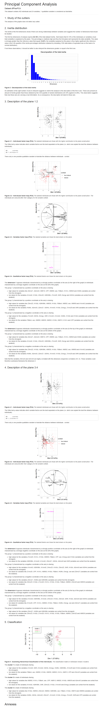

# (PART) Data reduction techniques and machine learning {-}
# Reducing Dimensionality: Correlations, Principal Component Analysis, cluster analysis and Multidimensional scaling {#chap:Corr-PCA-Cluster-MDS}

In this chapter, we will look at how to reduce dimensionality of our dataset.
This is important when you have a large number of predictors and you want to reduce the number of predictors to a smaller set.
This is particularly important when you have a large number of predictors and you want to reduce the number of predictors to a smaller set.

When you have multiple predictors (numeric or categorical) that are related to the outcome, you will need a way to assess whether all the predictors are needed.
One solution is to use a Generalised Linear Model with all predictors added to the model.
This technique, while easy to implement has several drawbacks.
We'll see this in more details next week, but usually, when two predictors (or more!) are correlated to various levels, they will cancel each other, and we cannot be sure of how to interpret the results.

We'll use the correlation plots again to verify the correlation level of our predictors and then employ Principal Component Analysis to first reduce dimensionality and then for clustering of outcomes.
We then use an alternative approach, a non-supervised cluster analysis and Multidimensional Scaling that allows us to look at our predictors in relation to the outcome.
We'll examine how these approaches can help us tackle issues of multicollinearity and of reducing dimensionality.

## Loading packages

```{r warning=FALSE, message=FALSE, error=FALSE}
### Use the code below to check if you have all required packages installed. If some are not installed already, the code below will install these. If you have all packages installed, then you could load them with the second code.
requiredPackages = c('tidyverse', 'knitr', 'Hmisc', 'corrplot', 'FactoMineR', 'factoextra', 'FactoInvestigate', 'webshot', 'RColorBrewer', 'scatterplot3d', 'recipes', 'cluster', 'cowplot', 'GGally', 'ggpubr', 'ggrepel', 'zoo')
for(p in requiredPackages){
  if(!require(p,character.only = TRUE)) install.packages(p, dependencies = TRUE)
  library(p,character.only = TRUE)
}
## below to change maximum overlap for the PCA, Cluster and MDS to draw all information. 
options(ggrepel.max.overlaps = Inf)
```

## Read dataset

The dataset comes from one of my projects; this is a subset from one speaker.
It provides acoustic correlates that can be used to distinguish between `guttural` and `non-guttural` consonants.
The former group comprises: uvular, pharyngealised and pharyngeal consonants; the latter, plain, velar and glottal.
These six classes were produced in three different vowel environments /i: a: u:/.
In each class, there were multiple consonants (total 21).
Acoustic measurements are used to quantify supralaryngeal (formant distances on the Bark scale) and laryngeal (voice quality) measurements.

```{r}
dfPharV2 <- read_csv("data/dfPharV2.csv")
dfPharV2
dfPharV2 <- dfPharV2 %>% 
  mutate(context = factor(context, levels = c("Non-Guttural", "Guttural")))
dfPharV2
```

## Correlation tests

Above, we did a correlation test on two predictors.
What if we want to obtain a nice plot of all numeric predictors and add significance levels?
We use the package `corrplot`

### Correlation plots

#### Correlation plots 1

```{r fig.height=6}
corr <- 
  dfPharV2 %>% 
  select(where(is.numeric)) %>% 
  cor() %>% 
  print()
print(corr)
corrplot(corr, method = 'ellipse', type = 'upper')

```

#### Correlation plots 2

Let's first compute the correlations between all numeric variables and plot these with the p values

```{r fig.height=15}
### correlation using "corrplot"
### based on the function `rcorr' from the `Hmisc` package
### Need to change dataframe into a matrix
corr <- 
  dfPharV2 %>% 
  select(where(is.numeric)) %>% 
  data.matrix(dfPharV2) %>% 
  rcorr(type = "pearson")
print(corr)
## use corrplot to obtain a nice correlation plot!
corrplot(corr$r, p.mat = corr$P,
         addCoef.col = "black", diag = FALSE, type = "upper", tl.srt = 55)
```

### Reduce dimensionality by selecting uncorrelated predictors

We can use the package `recipes` to allow us to only select uncorrelated predictors at a particular level.
For this to work, we need to create a recipe with our outcome.
Let's say we want to use `context` as our outcome to be predicted from all available predictors in the dataset `dfPharV2`.
We select all variables.
Let us test various R² values between all numeric predictors, at 0.9, 0.75, 0.5, 0.25 and 0.1.
Any comments?

#### R² = 0.9

```{r}
dim(dfPharV2)[2]-1
rec <- dfPharV2 %>% 
  recipe(context ~ .) %>%
  step_corr(all_numeric_predictors(), threshold = 0.9) %>% 
  prep()
bake(rec, new_data = dfPharV2)

```

#### R² = 0.75

```{r}
dim(dfPharV2)[2]-1
rec <- dfPharV2 %>% 
  recipe(context ~ .) %>%
  step_corr(all_numeric_predictors(), threshold = 0.75) %>% 
  prep()
bake(rec, new_data = dfPharV2)
```

#### R² = 0.5

```{r}
dim(dfPharV2)[2]-1
rec <- dfPharV2 %>% 
  recipe(context ~ .) %>%
  step_corr(all_numeric_predictors(), threshold = 0.5) %>% 
  prep()
bake(rec, new_data = dfPharV2)
```

#### R² = 0.25

```{r}
dim(dfPharV2)[2]-1
rec <- dfPharV2 %>% 
  recipe(context ~ .) %>%
  step_corr(all_numeric_predictors(), threshold = 0.25) %>% 
  prep()
bake(rec, new_data = dfPharV2)
```

#### R² = 0.1

```{r}
dim(dfPharV2)[2]-1
rec <- dfPharV2 %>% 
  recipe(context ~ .) %>%
  step_corr(all_numeric_predictors(), threshold = 0.1) %>% 
  prep()
bake(rec, new_data = dfPharV2)
```

This first solution allowed us to reduce the number of predictors from 23 (removing word and the outcome context) to a maximum of 4 predictors (+context).

The problem with this approach is that it depends on the decision of what to consider as an optimal value for R²!
The second solution is to use PCA to reduce dimensionality.
This is a more robust approach as it allows us to reduce the number of predictors without having to make arbitrary decisions on what R² value to use.

## Principal Component Analyses - PCA

For this next step, we use PCA to first reduce dimensionality.
PCA works by choosing a maximum number of dimensions that is always close to number of predictors - 1.
Then you need to make decisions on how many dimensions to retain (usually, those with a variance explained of 5% and above).

The dimensions are all decorrelated from each other.

### Model specification

We use the package `FactoMineR` to run our PCA.
We use all acoustic measures as predictors and our qualitative variable as the `context`.

```{r}
dfPharPCA <- dfPharV2 %>% 
  column_to_rownames(var = "contextN")
dfPharPCA
```

```{r}
pcaDat1 <- PCA(dfPharPCA,
               quali.sup = 1,
               graph = TRUE,
               scale.unit = TRUE, ncp = 5) 
```

### Scree plot

This shows the percent explained variance for our PCs.
This is equivalent to the normalized eigenvalues of the covariance matrix used in PCA.
Traditionally, any PC that explained 5% or above of the variance can be retained.
In our example below, we know that the first 2 dimensions explain most of the variance, with the third dimension contributing more than 10%.

```{r}
fviz_eig(pcaDat1)
```

### Results

#### Summary of results

Based on the summary of results, we observe that the first 5 dimensions account 88.3% of the variance in the data; each contribute individually to more than 5% of the variance (the fifth is at 4.97%!).

```{r}
summary(pcaDat1)
```

#### Contribution of predictors and groups

Below, we look at the contributions of the main 5 dimensions.

```{r}
dimdesc(pcaDat1, axes = 1:5, proba = 0.05)
```

#### Contribution of variables

We look next at the contribution of the top 10 predictors on each of the 6 dimensions

##### Dimension 1

```{r}
fviz_contrib(pcaDat1, choice = "var", axes = 1, top = 10)
```

##### Dimension 2

```{r}
fviz_contrib(pcaDat1, choice = "var", axes = 2, top = 10)
```

##### Dimension 3

```{r}
fviz_contrib(pcaDat1, choice = "var", axes = 3, top = 10)
```

##### Dimension 4

```{r}
fviz_contrib(pcaDat1, choice = "var", axes = 4, top = 10)
```

##### Dimension 5

```{r}
fviz_contrib(pcaDat1, choice = "var", axes = 5, top = 10)
```

### Plots

#### Default plots

##### PCA Individuals

```{r}
fviz_pca_ind(pcaDat1, col.ind = "cos2", 
             gradient.cols = c("#00AFBB", "#E7B800", "#FC4E07"),
             repel = FALSE ## Avoid text overlapping (slow if many points)
             )
```

##### PCA Biplot 1:2

```{r}
fviz_pca_biplot(pcaDat1, repel = FALSE, habillage = dfPharPCA$context, addEllipses = TRUE, title = "Biplot")
```

##### PCA Biplot 3:4

```{r}
fviz_pca_biplot(pcaDat1, axes = c(3, 4), repel = FALSE, habillage = dfPharPCA$context, addEllipses = TRUE, title = "Biplot")
```

#### Clustering

```{r}
fviz_pca_ind(pcaDat1,
             label = "none", ## hide individual labels
             habillage = dfPharPCA$context, ## color by groups
             addEllipses = TRUE ## Concentration ellipses
             )
```

#### 3-D By Groups

```{r}
coord <- pcaDat1$quali.sup$coord[1:2,0]
coord
#
with(pcaDat1, {
  s3d <- scatterplot3d(pcaDat1$quali.sup$coord[,1], pcaDat1$quali.sup$coord[,2], pcaDat1$quali.sup$coord[,3],        ## x y and z axis
                       color=c("blue", "red"), pch=19,        ## filled blue and red circles
                       type="h",                    ## vertical lines to the x-y plane
                       main="PCA 3-D Scatterplot",
                       xlab="Dim1(37.7%)",
                       ylab="",
                       zlab="Dim3(11.4%)",
                       #xlim = c(-1.5, 1.5), ylim = c(-1.5, 1.5), zlim = c(-0.8, 0.8)
)
  s3d.coords <- s3d$xyz.convert(pcaDat1$quali.sup$coord[,1], pcaDat1$quali.sup$coord[,2], pcaDat1$quali.sup$coord[,3]) ## convert 3D coords to 2D projection
  text(s3d.coords$x, s3d.coords$y,             ## x and y coordinates
       labels=row.names(coord), col = c("blue", "red"),              ## text to plot
       cex=1, pos=4)           ## shrink text 50% and place to right of points)
})
dims <- par("usr")
x <- dims[1]+ 0.8*diff(dims[1:2])
y <- dims[3]+ 0.08*diff(dims[3:4])
text(x, y, "Dim2(25.5%)", srt = 25,col="black")
```

Using the PCA approach allowed us to separate the two contexts and showed that we can use up to five dimensions to explain the results.

### Automatic analysis of the PCA results

The `Investigate` function from the `factoInvestigate` package allows to obtain an automatic analysis of the PCA an automatic analysis of the PCA results.
It will generate an HTML report that we can import below.
The report includes the PCA results, detection of outliers, evaluation of inertia (or % cumulative variance explained), in addition to a description of the top significant dimensions.
It also provides a classification via clustering of the predictors, and an evaluation of the results.
It should be noted that "*This interpretation of the results was carried out automatically, it cannot match the quality of a personal interpretation*"

```{r}
Investigate(pcaDat1, file = "outputs/Investigate.Rmd", language = "en")
```

```{r}
webshot::webshot(url = "outputs/Investigate.html", file = "outputs/Investigate.png", vwidth = 1000, vheight = 275)
```

{width="16cm"}

### Extracting coordinates

The PCA analysis we used above allowed us to reduce dimensionality from 23 acoustic measures into 5 dimensions.
These top five dimensions are orthogonal to each other, i.e., they are not correlated with each other, and hence we can easily reduce the collinearity levels.

What we can do next is to export the coordinates of the PCA analysis and save them on the original dataframe, which we can use further in a linear mixed effects regression or any other tools.

##### Saving coordinates

```{r}
PCA_coord <- pcaDat1$ind$coord
PCA_coord <- as.data.frame(PCA_coord)
dfPharPCAFull <- dfPharPCA %>% 
  bind_cols(PCA_coord)
dfPharPCAFull %>% 
  head(10)
```

##### Linear regression

In our case, and given that the data comes from one participant, we use a simple linear regression analysis on each of the five dimension.

###### Dimension 1

```{r}
dfPharPCAFull %>% 
  lm(Dim.1 ~ context, data = .) %>%
  summary()
```

###### Dimension 2

```{r}
dfPharPCAFull %>% 
  lm(Dim.2 ~ context, data = .) %>%
  summary()
```

###### Dimension 3

```{r}
dfPharPCAFull %>% 
  lm(Dim.3 ~ context, data = .) %>%
  summary()
```

###### Dimension 4

```{r}
dfPharPCAFull %>% 
  lm(Dim.4 ~ context, data = .) %>%
  summary()
```

###### Dimension 5

```{r}
dfPharPCAFull %>% 
  lm(Dim.5 ~ context, data = .) %>%
  summary()
```

##### Conclusion

From the analysis above, it is interesting to note that dimensions 2, 3, and 4 allowed to appropriately distinguish between the two contexts, while dimensions 1 and 5 did not.
We can explore the data further by examining the contribution of the various variables to each dimension and what they can tell us.

## Kmeans Clustering

In this section, we explore clustering techniques.
These are different from the PCA applied above as these are unsupervised learning algorithms.
For the PCA, we told the algorithm that there are two groups in our outcome `context`.
Here, we let the algorithm decide how many clusters there are.

### Nb Clusters

We compute number of clusters via hierarchical clustering, after applying 500 Monte Carlo (“bootstrap”) samples.
We specify 10 as our maximum number of clusters

```{r warning=FALSE, message=FALSE, error=FALSE}

dat1Clust <- dfPharPCA[-1]
set.seed(123)


gap_stat <- clusGap(dat1Clust, FUN = hcut, nstart = 20, K.max = 10, B = 500, spaceH0 = "scaledPCA")
print(gap_stat, method = "Tibs2001SEmax")
fviz_gap_stat(gap_stat)
```

The results in the plot above show that the optimal number of clusters is 10!
This is not helpful at all; for the moment, this is for demonstration.

#### Computing clusters

Although optimal number of clusters is 10, we perform a kMeans clustering with 2, 3, 4, 5, 6, 7, 8, 9 and 10 clusters.
The aim is to evaluate how close (or far) our groups are, and whether the the two contexts cluster together.

We use the function `hcut` from the package `factoextra`.
This will compute Hierarchical Clustering and Cut the Tree into k clusters.
By default, it uses hc_method = "ward.D2", hc_metric = "euclidean".
stand = TRUE allows for the data to be normalised (z-scored)

```{r warning=FALSE, message=FALSE, error=FALSE}
km.resdat1_2 <- hcut(dat1Clust, 2, hc_method = "ward.D2", stand = TRUE, graph = TRUE)
km.resdat1_3 <- hcut(dat1Clust, 3, hc_method = "ward.D2", stand = TRUE, graph = TRUE)
km.resdat1_4 <- hcut(dat1Clust, 4, hc_method = "ward.D2", stand = TRUE, graph = TRUE)
km.resdat1_5 <- hcut(dat1Clust, 5, hc_method = "ward.D2", stand = TRUE, graph = TRUE)
km.resdat1_6 <- hcut(dat1Clust, 6, hc_method = "ward.D2", stand = TRUE, graph = TRUE)
km.resdat1_7 <- hcut(dat1Clust, 7, hc_method = "ward.D2", stand = TRUE, graph = TRUE)
km.resdat1_8 <- hcut(dat1Clust, 8, hc_method = "ward.D2", stand = TRUE, graph = TRUE)
km.resdat1_9 <- hcut(dat1Clust, 9, hc_method = "ward.D2", stand = TRUE, graph = TRUE)
km.resdat1_10 <- hcut(dat1Clust, 10, hc_method = "ward.D2", stand = TRUE, graph = TRUE)


km.resdat1_2
km.resdat1_3
km.resdat1_4
km.resdat1_5
km.resdat1_6
km.resdat1_7
km.resdat1_8
km.resdat1_9
km.resdat1_10

```

#### Dendograms

```{r, cache=TRUE}
fviz_dend(km.resdat1_2, show_labels = TRUE, rect = TRUE, repel = TRUE, main = "Cluster Dendrogram - 2 clusters")

fviz_dend(km.resdat1_3, show_labels = TRUE, rect = TRUE, repel = TRUE, main = "Cluster Dendrogram - 3 clusters")

fviz_dend(km.resdat1_4, show_labels = TRUE, rect = TRUE, repel = TRUE, main = "Cluster Dendrogram - 4 clusters")

fviz_dend(km.resdat1_5, show_labels = TRUE, rect = TRUE, repel = TRUE, main = "Cluster Dendrogram - 5 clusters")

fviz_dend(km.resdat1_6, show_labels = TRUE, rect = TRUE, repel = TRUE, main = "Cluster Dendrogram - 6 clusters")

fviz_dend(km.resdat1_7, show_labels = TRUE, rect = TRUE, repel = TRUE, main = "Cluster Dendrogram - 7 clusters")

fviz_dend(km.resdat1_8, show_labels = TRUE, rect = TRUE, repel = TRUE, main = "Cluster Dendrogram - 8 clusters")

fviz_dend(km.resdat1_9, show_labels = TRUE, rect = TRUE, repel = TRUE, main = "Cluster Dendrogram - 9 clusters")

fviz_dend(km.resdat1_10, show_labels = TRUE, rect = TRUE, repel = TRUE, main = "Cluster Dendrogram - 10 clusters")
```

#### Plots

```{r warning=FALSE, message=FALSE, error=FALSE}
fviz_cluster(km.resdat1_2, data = dat1Clust,
             ellipse.type = "convex",
             palette = "jco",
             ggtheme = theme_minimal(),
             show.clust.cent = TRUE,
             main = "Cluster plot - 2 clusters")

fviz_cluster(km.resdat1_3, data = dat1Clust,
             ellipse.type = "convex",
             palette = "jco",
             ggtheme = theme_minimal(),
             show.clust.cent = TRUE,
             main = "Cluster plot - 3 clusters")

fviz_cluster(km.resdat1_4, data = dat1Clust,
             ellipse.type = "convex",
             palette = "jco",
             ggtheme = theme_minimal(),
             show.clust.cent = TRUE,
             main = "Cluster plot - 4 clusters")

fviz_cluster(km.resdat1_5, data = dat1Clust,
             ellipse.type = "convex",
             palette = "jco",
             ggtheme = theme_minimal(),
             show.clust.cent = TRUE,
             main = "Cluster plot - 5 clusters")

fviz_cluster(km.resdat1_6, data = dat1Clust,
             ellipse.type = "convex",
             palette = "jco",
             ggtheme = theme_minimal(),
             show.clust.cent = TRUE,
             main = "Cluster plot - 6 clusters")

fviz_cluster(km.resdat1_7, data = dat1Clust,
             ellipse.type = "convex",
             palette = "jco",
             ggtheme = theme_minimal(),
             show.clust.cent = TRUE,
             main = "Cluster plot - 7 clusters")

fviz_cluster(km.resdat1_8, data = dat1Clust,
             ellipse.type = "convex",
             palette = "jco",
             ggtheme = theme_minimal(),
             show.clust.cent = TRUE,
             main = "Cluster plot - 8 clusters")

fviz_cluster(km.resdat1_9, data = dat1Clust,
             ellipse.type = "convex",
             palette = "jco",
             ggtheme = theme_minimal(),
             show.clust.cent = TRUE,
             main = "Cluster plot - 9 clusters")

fviz_cluster(km.resdat1_10, data = dat1Clust,
             ellipse.type = "convex",
             palette = "jco",
             ggtheme = theme_minimal(),
             show.clust.cent = TRUE,
             main = "Cluster plot - 10 clusters")
```

#### Individual Clusters

```{r, cache=TRUE}
sort(km.resdat1_2$cluster)
```

```{r, cache=TRUE}
sort(km.resdat1_3$cluster)
```

```{r, cache=TRUE}
sort(km.resdat1_4$cluster)
```

```{r, cache=TRUE}
sort(km.resdat1_5$cluster)
```

```{r, cache=TRUE}
sort(km.resdat1_6$cluster)
```

```{r, cache=TRUE}
sort(km.resdat1_7$cluster)
```

```{r, cache=TRUE}
sort(km.resdat1_8$cluster)
```

```{r, cache=TRUE}
sort(km.resdat1_9$cluster)
```

```{r, cache=TRUE}
sort(km.resdat1_10$cluster)
```

### Conclusion

Cluster analysis is useful in many cases as it provides insights into how the various predictors interact with each other to allow for clusters to emerge.
Given that these are independent of the actual groupings of your dependent variable (context), one can use them to interpret the results in a more in-depth way and allow you to be critical about the original grouping.
Do not forget that the two guttural and non-guttural are composed each of three contexts (guttural = uvula, pharyngealised and pharyngeal; non-guttural = plain coronal, velar and glottal).
Each of the contexts is produced in an /i: a: u:/ contexts.
Hence, cluster analysis, which was restricted to a maximum of 10 clusters, picked this up.

## Multidimensional scaling

In this section, we explore multidimensional scaling.
This is another unsupervised learning algorithm.
As with cluster analysis, we start by running the MDS algorithm and use Kmeans clustering to allow visualisation of the two-dimensional data.
Usually, up to 5 dimensions explain a large percentage of the variance in the data; in our case, we only go for 2 dimensions to evaluate how the two groups are close (or not) to each other).
As with cluster analysis, we could compute number of clusters; something we are not doing here.

### Computing MDS

We perform a MDS Clustering with 2 Clusters.
We use a Euclidean distance matrix.
See [here](https://pages.mtu.edu/~shanem/psy5220/daily/Day16/MDS.html) for details on the available dissimilarity methods.

```{r warning=FALSE, message=FALSE, error=FALSE}
dat1MDS <- dfPharPCA

set.seed(123)

mds.resdat1 <- dat1MDS[-1] %>%
  dist(method = 'euclidean') %>%          
  cmdscale() %>%
  as_tibble()
colnames(mds.resdat1) <- c("Dim.1", "Dim.2")

mds.resdat1 %>% head(10)
```

### Kmeans clustering

```{r, cache=TRUE}
## K-means clustering
clust <- kmeans(mds.resdat1, 2)$cluster %>%
  as.factor()
mds.resdat1 <- mds.resdat1 %>%
  mutate(groups = clust)
mds.resdat1$context <- dat1MDS$context
```

### Plot

```{r, cache=TRUE}
## Plot and color by groups
ggscatter(mds.resdat1, x = "Dim.1", y = "Dim.2", col = "context",
          label = NULL,
          color = "context",
          palette = c("red", "blue"),
          size = 2, 
          ellipse = TRUE,
          ellipse.type = "convex",
          repel = FALSE,
          shape = "context",
          point = FALSE,
          mean.point = TRUE)
```

## session info

```{r warning=FALSE, message=FALSE, error=FALSE}
sessionInfo()
```
