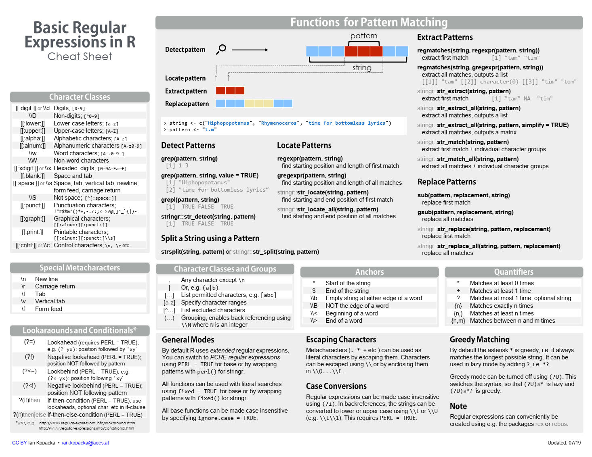
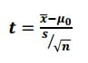

# Introduction

***This is still work in progress, with additional chapters being added.***

This book covers the basics of statistics and R programming for linguists. It is designed to be accessible to those with little or no prior experience in statistics or programming. The book is divided into two main parts: the first part covers the basics of statistics, including descriptive statistics, inferential statistics, and hypothesis testing; the second part covers the basics of R programming, including data manipulation, data visualization, and statistical modelling.

The book applies these concepts to real-world examples from linguistics, including phonetics, syntax, and semantics. The book also includes exercises and solutions to help readers practice and reinforce their understanding of the material.

The book then adds more advanced topics, including linear regression, logistic regression, cumulative logit link models and signal detection theory. It moves to mixed-effects regressions (linear, logistic, cumulative, and additive). These topics are presented in a way that is accessible to those with little or no prior experience in statistics or programming.

The book then moves to topics covered in qualitative research, including qualitative data analysis, coding, and thematic analysis. The book also includes examples of how to conduct qualitative research using R, including how to use R for text analysis and qualitative data visualization.

Towards the end, an introduction to basics of machine learning is provided, including supervised and unsupervised learning, classification, and clustering. The book also includes examples of how to use R for machine learning, including how to use R for text classification and clustering.

The structure is organised with each chapter being dedicated to a specific topic and can normally be covered in 1 or 2 sessions.

It is hoped that this book allows students to specialise in the field of statistical analyses applied to linguistic data and to be able to use R for their own research. The book is designed to be a practical guide that can be used in the classroom or for self-study. It is hoped that this book will help students to develop the skills they need to conduct their own research and to understand the research of others.

<!--chapter:end:index.Rmd-->

# Introduction to R, the Tidyverse - Visualisation {#Introduction_Tidyverse_Visualisation}

## Loading packages 

```{r}
###Use the code below to check if you have all required packages installed. If some are not installed already, the code below will install these. If you have all packages installed, then you could load them with the second code.
requiredPackages = c('tidyverse', 'languageR', 'phonR', 'summarytools')
for(p in requiredPackages){
  if(!require(p,character.only = TRUE)) install.packages(p)
  library(p,character.only = TRUE)
}
```

## Intro R Markdown
 
### General

This is an [R Markdown](http://rmarkdown.rstudio.com) Notebook. When you execute code within the notebook, the results appear beneath the code. 

Try executing this chunk by clicking the *Run* button within the chunk or by placing your cursor inside it and pressing *Ctrl+Shift+Enter*. 

```{r}
plot(cars)
```

Add a new chunk by clicking the *Insert Chunk* button on the toolbar or by pressing *Ctrl+Alt+I*. 

When you save the notebook, an HTML file containing the code and output will be saved alongside it (click the *Preview* button or press *Ctrl+Shift+K* to preview the HTML file).

The preview shows you a rendered HTML copy of the contents of the editor. Consequently, unlike *Knit*, *Preview* does not run any R code chunks. Instead, the output of the chunk when it was last run in the editor is displayed.

### Knitting to other formats

You can knit notebook into PDF or Word. Make sure to install the `tinytex` package using the following code: `install.packages("tinytex")`. If you already use \LaTeX\ with another distribution, then you do not need to install `tinytex` (though this works perfectly out of the bag). Then from the menu above (Knit), then choose `Knit to PDF` or `Knit to Word`. This is an excellent way to get your work fully written within RStudio: You will write a text (like this), have a specific structure and also have all your results in one place. This allows for transparency and replicability. 

## R and R Studio

### R

`R` is the most influential statistical software that is widely used in data science. [The R Project for Statistical Computing](https://www.r-project.org/). R allows the user to take control of their analyses and being open about how the data were analysed, etc. `R` encourages transparency and reproducible research.

###Downloading base R

If you are a windows user, download the latest version here [R version 4.3.1](https://cran.r-project.org/bin/windows/base/).
If you are a MacX user, download the latest version here [R version 4.3.1](https://cran.r-project.org/bin/macosx/). 
Other Linux versions available [here](https://cran.r-project.org/bin/linux/).

Using up-to-date versions of `R` is important as this allows you to use the latest developments of the software. You can have a look at what is new in this latest release [here](https://cran.r-project.org/bin/windows/base/NEWS.R-4.3.1.html). 

###Upgrading your current R installation

You can download the latest version from above and update. Or you can use the package `installr` and upgrade to the latest available version. If the package is not installed, use this: `install.packages("installr")` and then run with `library(installr)` then type `installr` in the console (what? what's a console?). We'll come to this later on!

### R Studio

[R Studio](https://posit.co/downloads/) is one of the mostly used free and open-source integrated development environment for `R`. It allows the user to have access to various information at the same time, e.g., the `Source`, the `Console`, the `Environment` and the `Files`, etc. When you open `R studio`, and if you have installed `R` appropriately, then `R` Studio will "talk" to `R` by sending it messages to execute commands. 

You can set up the layout to suit your needs. I always find the following layout best for my needs: 

1. The `Source` pane: the file where you write your code 
2. The `Console` where actual code is run 
3. The `Environment` pane, which shows you all variables/datasets, with the history of executed code, etc. 
4. The `Files/Viewer` pane, which shows you the files in the current folder, the plots, the installed packages, and help files, etc.

If you click on Tools and Global options, then Pane Layout, you can change the order, and add/remove options from the two panes below. You will see that I use a specific formatting as this suits me best and also have a special colour-coding used (Theme Modern et Editor theme = Tomorrow Night Bright). Use the theme that works best for you!!

### Other options?

###Text Editors

I use [Sublime Text](https://www.sublimetext.com/) to run Python, Praat and write in \LaTeX\. I use R Markdown in R to publish my code and write notebooks. I am in the process of writing my first article with R Markdown for a fully reproducible research.

There are many development environments that can be used to "talk" to R: [TinnR](https://sourceforge.net/p/tinn-r/wiki/Home/), [Visual Studio](https://visualstudio.microsoft.com/), etc...

###R GUIs

GUIs (for Graphical User Interface) for `R` are available. I list below a few. However, after trying some, I found it much easier to get to code directly in R. I don't remember all codes! I use these to my advantage, by saving my code into a script and using it later on in other scripts. 

Some of the GUIs are meant to make `R` like excel or SPSS, while others are more specialised. Here is a list of some of these GUIs... 

1. [RCommander](https://www.brunoy-osteopathe.fr/installer-et-configurer-r-commander/) is the first GUI I used (and hated!). It is the one used in Discovering Statistics using R by Andy Field. There are compatibility issues between RCommander and RStudio... Install RCommander using `install.packages("Rcmdr")`. Then using `R` base, run RCommander from using `library(Rcmdr)`.
2. [rattle](https://rattle.togaware.com/) is more of use for data mining and advanced statistics (use `library(rattle)` then `rattle()` to run)
3. [Deducer](https://www.deducer.org/pmwiki.php?n=Main.DeducerManual?from=Main.HomePage). For basic and advanced statistics (run with `library(Deducer)` after installation)
4. [RKWard](https://rkward.kde.org/). For basic and advanced statistics. Not available on CRAN and should be downloaded and installed. 
5. Etc..

You can always start by using any of the above to familiarise yourself with the code, and then move to using `R` fully via code. My recommendation is to start coding first thing and search for help on how to write the specific code you are after. 

## Am I ready to use R now?

Well almost. There is one thing we need to consider: telling `R` where is our working directory. By default `R` saves this to your documents (or somewhere else). Here, this is generally OK, though when working on your own data, things get more complicated. 

There are two schools of thought here.
1. Create `R` scripts that run the analyses and saves the output(s) directly to your working directory. Does not save the `.RData` image at the end
2. Create a project: a self-contained folder, where all your scripts, figures, etc. will be automatically saved. Saves the `.RData` at the end

I subscribe to the second, as some of the computations I run take ages to finish.

### Setting working directory

Click the menu `Session -> Set Workign Directory -> Choose Directory` or use `setwd("path/to/directory")` (choose the location where you want to save the results)

You can also use `getwd()` to know where is your current working directory. 

### Creating a project

Look at the top-right hand where you can see `Projects (none)`. You can create a new project in a new path or based on a specific folder. 

## How to use packages?

Base R comes with many packages already installed. Look at `packages` to see which ones are already installed. There are currently ``r nrow(available.packages(filters = "duplicates"))`` packages on Cran: see [here](https://cran.r-project.org/web/checks/check_summary.html) (to check all packages and their status) 
 (repository for all packages). No one uses all packages so do not try to install all of them. Simply install what you need!! RMarkdown will let you know if you are running a specific code that lacks a package and asks you to download it.  

### Installation

The best option is to use the menu above (under Tools) and click `Install packages`, or type in install.packages("package.name"). Make sure to always have `install dependencies` ticked (using the first option). 

### Loading

Use the following to load a package: `library(package.name)`. Once the package is loaded, you can use any of its functions directly into your code. Sometimes you may need to specify to use a particular function from within a particular package, in this case use: `package.name::function`. We will most probably not use this today, but this is something you need to know about otherwise undesirable results may occur (or even errors!).

### Finding packages and help 

Under the Files pane (right bottom), click on the menu Packages and you will have access to all **installed** packages. Click on a package and you can see the associated help files. 
You can also type the following to find help:
?package.name. 
??function
e.g., 

```{r}
?stats
```


```{r}
??MASS
```

Or try clicking on the function name to find details of what to specify: e.g., scroll on `lmer` (assuming `lme4` is installed). Do a Ctrl/Cmd + left mouse click on a function to display options.

```{r}
lme4::lmer
```


## Let's get started with R

### R as a calculator

#### Simple calculations

`R` can be used as a calculator. Try some of the following below:

```{r}
1 + 2
```


```{r}
1+2*3
```

Well wait a second! were you all expecting the result to be 7? how many expected the result to be 9?

Check the following:

```{r}
(1+2)*3
```


```{r}
1+(2*3)
```

So parenthesis are important! Always use these to tell R (and any other software) the order of operations. This is the order (remember PEMDAS):

1. Parentheses
2. Exponents
3. Multiplication and Division (from left to right)
4. Addition and Subtraction (from left to right)

#### Functions

There are many built-in functions in R to do some complicated mathematical calculations. 

##### Basic functions

Run some of the following.


```{r}
sqrt(3)
```


```{r}
3^2
```


```{r}
log(3)
```


```{r}
exp(3)
```


##### Creating variables 

We can also create variables (aka temporary place holders).

```{r}
x <- 2
y <- 5
b <- x*y
x
y
b
b+log(y)*x^2
```

When you create a variable and assign to it a number (or characters), you can use it later on.

##### Sequences

We can also create sequences of numbers

```{r}
seq(1, 10, 2)
?seq
```


```{r}
z <- 1:10
```

And we can do the following.. Can you explain what we have done here?

```{r}
z2 <- z+1
z*z2
```


Up to you... Write some more complex maths here just for fun!

```{r}
## Add below


```


### Objects

#### Basic objects

Objects are related to variables (we created above), but can also be dataframes, and other things we create in R. All of these are stored in memory and are shown below (under environment). You can check the type of the "object" below in the list (look at "Type") or by using `class()`.

Let's look at the variables we created so far.. We will create another one as well... 

```{r}
class(b)
class(x)
class(y)
class(z)
class(z2)

a <- "test"

class(a)
```

When we do calculations in R, we need to make sure we use numeric/integer variables only.. Try some of the below. Uncomment the following `##x + two` and run the code. 

```{r}
x+y
two <- "2"
##x + two
```

Can you explain the error? 

We have tried to add a number to a (character) string which is clearly impossible. 
To do the maths, we need to change the class using any of the following commands: `as.character`, `as.integer`, `as.numeric`, `as.factor`, e.g.:

```{r}
two <- as.numeric(two)
x + two
```

#### Other functions and objects

##### Some more calculations

We can create a vector of objects to do various things on.. We use the function `c()` and do various things on:

```{r}
numbers <- c(1,4,5,12,55,13,45,38,77,836,543)
class(numbers)
mean(numbers)
sd(numbers)
median(numbers)
min(numbers)
max(numbers)
range(numbers)
sum(numbers)
```

##### Referring to a specific position

Sometimes we may want to refer to a specific position in the list of numbers we just created... Use the following:

```{r}
numbers[2]
numbers[3:5]
numbers[-4]
numbers+numbers[6]
```

Can you explain what we have done in the last operation?


## Matrices and dataframes

### Matrix

#### General

```{r}
x <- 1:4
x <- as.matrix(x)
x
dim(x)
dim(x) <- c(2,2)
dim(x)
x
```


#### Referring to specific location

```{r}
x[1,]
x[,1]
x[1,2] 
x[,] ## = x
```


### Dataframes

A dataframe is the most important object we will be using over and over again... It is an object that contains information in both rows and columns. 

#### Creating a dataframe from scratch 

In this exercise, we will create a 4*9 dataframe. The code below creates four variables, and combines them together to make a dataframe. As you can see, variables can also be characters.
To create the dataframe, we use the functions `as.data.frame` and `cbind`.

```{r}
word <- c("a", "the", "lamp", "not", "jump", "it", "coffee", "walk", "on")
freq <- c(500, 600, 7, 200, 30, 450, 130, 33, 300)  ## note this is completely made up!!
functionword <- c("y", "y", "n", "y", "n", "y", "n", "n", "y")
length <- c(1, 3, 4, 3, 4, 2, 6, 4, 2)
df <- as.data.frame(cbind(word,freq,functionword,length))
```


#### Deleting variables from the `Environment`


If you have created various variables you do not need any more, you can use `rm` to remove these

```{r}
rm(word,freq,functionword,length)
```

BUT wait, did I remove these from my dataframe? Well no.. We have removed objects from within the `R` environment and not from the actual dataframe. Let's check this up


```{r}
df
```


#### Saving and reading the dataframe

#### Reading and Saving in .csv

The code below allows you to save the dataframe and read it again. The extension `.csv` is for "comma delimited files". This is the best format to use as it is simply a text file with no additional formatting.


```{r}
write.csv(df, paste0("outputs/df.csv"))
dfNew <- read.csv(paste0("outputs/df.csv"))
df
dfNew
```


The newly created object contains 5 columns rather than the 4 we initially created. This is normal. By default, `R` add a column that reflects the order of the list *before* it was saved. You can simply delete the column or keep as is (but be careful as this means you need to adjust any references to columns that we will use later on).


#### Reading and saving other formats

`R` allows us to read data in any format. If you have a `.txt`, `.sav`, `.xls`, `.xlsx`, etc., then there are packages specific to do that (e.g., package `xlsx` to read/save `.xlsx` files, or the function `haven` from the package `Tidyverse` to read/save `.sav` files). 


You can use the built-in plugin in `RStudio` to **import** your dataset. See `Import Dataset` within the `Environment`.


In general, any specific formatting is kept, but sometimes variable names associated with numbers (as in `.sav` files) will be lost. Hence, it is always preferable to do minimal formatting on the data.. Start with a `.csv` file, import it to `R` and do the magic!


#### Checking the structure


The first thing we will do is to check the structure of our created dataset. We will use the originally created one (i.e., `df` and not the imported one (i.e., `dfNew`).


```{r}
str(df)
```


The function `str` gives us the following information:

1. How many observations (i.e., rows) and variables (i.e., columns)
2. The name of each variable (look at `$` and what comes after it)
3. Within each variable, we have the class with number of levels

#### Changing the `class` of a variable


As we can see, the four created variables were added to the dataframe as `factors`. We need to change the `class` of the **numeric** variables: freq and length. Let's do that:


```{r}
df$freq <- as.numeric(df$freq)
df$length <- as.numeric(df$length)
str(df)
```


#### Referring to particular variables, observations

As you can see from the above, we can refer to a particular variable in the dataframe by its name and adding `$`. There are additional options to do that. Let's see what we can do. Can you tell what each of the below does? chat to your neighbour....

```{r}
df[1]
df[,1]
df[1,]
df[1,1]
```


Here are the answers:

1. Refers to the full column 1
2. Refers to first variable
3. Refers to first row
4. Refers to first observation in first column

Practice a bit and use other specifications to obtain specific observations, columns or rows...

### Descriptive statistics

#### Basic summaries, tables

We can use the function `summary` to do some basic summaries


```{r}
summary(df)
```


We can create a table with the function `table`


```{r}
table(df$functionword, df$freq)
```


#### Basic manipulations

##### Creating variables

We sometimes need to create and/or delete new variables.. Do you know how to do that?

Let's look at the structure again:


```{r}
str(df)
```


We said earlier that we can refer to a specific variable by using `$` + the name of the variable. Let's use this again and add a new name of variable not in the list of variables above


```{r}
df$newVariable
```


What does `NULL` mean? The variable does not exist!
Let's do something else


```{r}
df$newVariable <- NA
```

Ah no error messages! Let's check the structure


```{r}
str(df)
```

So we now have five variables and the last one is named "newVariable" and assigned "NA". "NA" is used in `R` to refer to missing data or is a place holder. We can replace these with any calculations, or anything else. Let's do that:


```{r}
df$newVariable <- log(df$freq)
str(df)
```


We replaced "NA" with the log of the frequencies. Let's check that this is correct only for one observation. Can you dissect the code below? what did I use to ask `R` to compute the log of the frequency (freq)? Remember rows and columns


```{r}
log(df[1,2])
df[1,5]
```


So they are the same values. 

##### Changing column names

Now we need to change the name of the variable to reflect the computations. "newVariable" is meaningless as a name, but "logFreq" is informative.

```{r}
colnames(df)[5] <- "logFreq"
str(df)
```


As can be seen from the above, using the command `colnames(df)[5] <- "logFreq"` allows us to change the column name in position 5 of the dataframe. If we were to change all of the columns names, we could use `colnames(df) <- c("col1","col2",...)`". 


##### Deleting variables

Let us now create a new compound variable that we later delete. This new compound variable will the multiplication of two numeric variables. The result is meaningless of course, but will be used for this exercise. 


```{r}
df$madeUpVariable <- df$freq*df$length
str(df)
```


Let us now delete this variable given that we are not interested in. Do you know how to do that? Think about how we referred to a variable before? We use `df[colNumber]`. What if we use `df[-colNumebr]`, what would be the result? 


```{r}
df[-6]
```


This shows all columns *minus* the one we are not interested in. If we rewrite the variable `df` and assign to it the newly created dataframe we just used above (with the minus sign), then the column we are not interested in will be deleted. 


```{r}
df <- df[-6]
str(df)
```


##### Changing names of observations

Let's say that we want to change the names of our observations. For instance, the variable "functionword" has the levels "y" and "n". Let us change the names to become "yes" and "no". We first need to change the `factor` level variable into character and then change the observations. Then we need to transform back to a factor


```{r}
df$functionword <- as.character(df$functionword)
df$functionword[df$functionword == "y"] <- "yes"
df$functionword[df$functionword == "n"] <- "no"
df$functionword <- as.factor(df$functionword)
str(df)
```


##### Checking levels of factors

We can also check the levels of  factor and change the reference value. This is useful when doing any type of statistics or when plotting the data. We use `levels`, `relevel` and `ref`


```{r}
levels(df$functionword)
df$functionword <-relevel(df$functionword, ref = "yes")
levels(df$functionword)
```


We can also use the following code to change the order of the levels of a multilevel factor

```{r}
levels(df$word)
df$word <- factor(df$word, levels = c("a","coffee","jump","lamp","not","it","on","walk","the"))
levels(df$word)
```


##### Subsetting the dataframe


We may sometimes need to subset the dataframe and use parts of it. We use the function `subset` or `which`. 

```{r}
df_Yes1 <- df[which(df$functionword == 'yes'),]
##or
df_Yes2 <- subset(df, functionword=="yes")
str(df_Yes1)
str(df_Yes2)
```


When we subset the data, the levels of a factor are kept as they are. 


```{r}
levels(df_Yes1$functionword)
levels(df_Yes2$functionword)
```


But we only have one level of our factor.. 


```{r}
df_Yes1$functionword
df_Yes2$functionword
```


By default, `R` keeps the levels of the factor as they are unless we change it by using the following:


```{r}
df_Yes1$functionword <- factor(df_Yes1$functionword)
df_Yes2$functionword <- factor(df_Yes2$functionword)
df_Yes1$functionword
df_Yes2$functionword
```

## The `Tidyverse`

### Introduction

The `Tidyverse` is a family of packages used to speed up the use of R. 


You need to first install it (if you haven't already done so) and then load it. To install, use `Tools > Install packages` or `install.packages()` then add tidyverse. To load a package, use the `library()` function.


Look at how many packages are installed within the `Tidyverse`. The messages you see are telling you which packages are loaded and which functions are in conflict (i.e., these are functions from other packages that are found within the `Tidyverse`). If you want to use the original function, simply add `package_name::function`.


### Using piping

The difference between base R and the Tidyverse's way of doing things is that base R can sometimes be more complex, while tidyverse is more straightforward and allows you to "see" within a dataframe easily. 
You need to learn how to use the "pipe" in `magrittr` that is part of the `Tidyverse`. 


Pipes are written in R as `%>%` (note you must use a percentage sign before and after the pipe). To demonstrate what pipes do, have a look at the following pseudo code. You can use a shortcut in your keyboard, type Ctrl+Shift+m to add a `pipe` (for mac users, it is Cmd+Shift+m).


Since `R` version `4.1.0`, there is a native pipe `|>`. It seems to be doing almost the same thing as the `%>%`. We will still use `%>%` as this is integrated within the `Tidyverse`.

### Demo subsetting

Below are two code lines for how to subset the dataframe using base `R` and piping from the `magrittr` package. 

With base R, we always need to refer to the dataset twice: once at the beginning and then to look into the dataset to select a variable.


```{r}
df_Yes1 <- df[which(df$functionword == 'yes'),]
df_Yes1
```


With the pipe, you only need to specify the dataset once: By adding the pipe, you can already look into the dataset and select the variable you need.

```{r}
df %>% filter(functionword =='yes')
```


And this is with the base R pipe (combined with code from the `Tidyverse` family)


```{r}
df |> filter(functionword =='yes')
```


As you can see, using the pipe (either within the `Tidyverse` or with base R) is a quick and easy way to do various operations.

Out of convenience and because we will use other packages integrated within the `Tidyverse`, we will use its pipe.

ReCap:

- `%>%` is called a "pipe"  
- It passes the previous line into the `data` argument of the next line  
- It **does not save any changes** after output 
- If you want to save the output of a particular manipulation, simply save it with xx <- 


### Basic manipulations

We will use the pipe with the `Tidyverse` to obtain summaries. We will use an `R` built-in dataset. Type `data()` to see the full list of datasets installed by default in `R`. You can use `data(package = .packages(all.available = TRUE))` to see all datasets installed within all packages.


#### First steps

Here is a list of all available datasets


```{r}
data()
data(package = .packages(all.available = TRUE))
```

#### Loading dataset

We will use the dataset `english` from the package `languageR`. This is a package that contains many linguistically-oriented datasets.
See details of the dataset [here](https://www.rdocumentation.org/packages/languageR/versions/1.5.0/topics/english). Or by typing `?languageR::english` (or simply `?english` if the package is already loaded) in the console.

You can load the dataset after loading the package. Simply refer to it by its name. 

```{r}
?english
```


#### View

To see the dataset, run the code below to visualise it. 

```{r}
english %>% 
  View()
```


#### Structure


We can use `str()` to look at the structure of the dataset. Here we have a relatively large dataset with 4568 observations (=rows) and 36 variables (=columns).

```{r}
english %>% 
  str()
```


#### See first 6 rows

```{r}
english %>% 
  head()
```

#### See last 6 rows

```{r}
english %>% 
  tail()
```

#### Selecting variables

Here, we select a few variables to use. For `variables` or `columns`, use the function `select`

```{r}
english %>% 
  select(RTlexdec, RTnaming, Familiarity) %>% 
  head(10)
```


#### Selecting observations

If we want to select observations, we use the function `filter`. We will use `select` to select particular variables and then use `filter` to select specific observations. This example shows how the pipe chain works, by combining multiple functions and using pipes

```{r}
english %>% 
  select(RTlexdec, RTnaming, Familiarity, AgeSubject) %>% 
  filter(AgeSubject == "old") %>% 
  head(10)
```


#### Changing order of levels

Use some of the code above to manipulate the dataframe but now using code from the `Tidyverse`. As you will see, once you know how to manipulate a dataset with base `R`, you can easily apply the same techniques with the `Tidyverse`. The `Tidyverse` provides additional ways to manipulate a dataframe.

For example, if I want to check levels of a variable and change the reference level, I will use the following code

```{r}
levels(english$AgeSubject)
```


To change levels of `AgeSubject`, we need to save a new dataset (do not override the original dataset!!). The `mutate` function means we are manipulating an object.

```{r}
english2<- english %>% 
  mutate(AgeSubject = factor(AgeSubject, levels = c("young", "old")))
levels(english2$AgeSubject)
```

#### Changing reference value

You can change the reference value by using `fct_relevel`. This is useful if you have many levels in one of the factors you are working with and you simply need to change the reference.

```{r}
english2<- english %>% 
  mutate(AgeSubject = fct_relevel(AgeSubject, "old"))
levels(english2$AgeSubject)
```


### String manipulation

We use the `str_func` variants from the `stringr` package within the `Tidyverse`.

```{r}
topics <- c("Phonetics", "Phonology", "Morphology", "Syntax", "Semantics", "Pragmatics", "Psycholinguistics")
```

#### str_sub

Extracting substrings (2nd to 4th)

```{r}
str_sub(topics, 2, 4)
```

#### str_detect

Detecting a particular pattern

```{r}
str_detect(topics, "p")
str_detect(topics, "n")
str_detect(topics, "pho")
str_detect(topics, "ling")
```

#### str_locate

Locate specific characters

```{r}
str_locate(topics, "n")
```

#### str_locate_all

Locate all instances of characters

```{r}
str_locate_all(topics, "n")
```

#### str_replace

replaces a single instance

```{r}
str_replace(topics, "o", "O")
```

#### str_replace_all

replaces all instances

```{r}
str_replace_all(topics, "o", "O")
```

### Regular expressions

Regular expressions are wildcards that can be used to search for particular patterns.
We can use them to identify all words that begin with a "p" or end with a "y" or "cs"?
Or any other changes?
You can already consult this cheat sheet Also, [here](https://github.com/rstudio/cheatsheets/blob/main/regex.pdf)



#### Initial and final

\^ used to identify initial position \$ used to identify final position

```{r}
str_detect(topics, "^[Pp]")
str_detect(topics, "[y]$")
str_detect(topics, "[cs]$")

```

#### Other characters

The `.` is used as a place holder asking for any character in the sequence

```{r}
str_detect(topics, "Ph.n")
```


[a-z] will detect all characters between "a" and "z"

```{r}
str_detect(topics, "[a-z]")
```

[M-P] will detect all characters between "M" and "P"

```{r}
str_detect(topics, "[M-P]")
```


[:lower:] will detect all characters in lower case


```{r}
str_detect(topics, "[:lower:]")
```


```{r}
str_detect(topics, "[:upper:]")
```

We can also use "[0-9]", "[:digit:]", "[:alpha:]", "[:alnum:]", "[:punct:]", "[:graph:]", "[:blank:]", "[:space:]", "[:print:]", etc.. See PDF of cheat sheet!


### Advanced manipulations

Sometimes, you may have a dataset that comes in a wide format (i.e., columns contain data from participants) and you want to change to long format (i.e., each row contains one observation with minimal number of columns). Let's look at the functions `pivot_longer` and `pivot_wider`

#### Columns to rows

Let's use the `english` dataset to transform it from wide to long and see the first 10 rows.

```{r}
english %>% 
  select(Word, RTlexdec, RTnaming, Familiarity) %>% 
  pivot_longer(cols = c(RTlexdec, RTnaming, Familiarity), ## you can also add index, i.e., 2:4
               names_to = "variable",
               values_to = "values") %>% 
  head(10)
```


#### Rows to columns

Let's use the same code above and change the code from long format, back to wide format. Pivot_wider allows you to go back to the original dataset. You will need to use `unnest` to get all rows in the correct place. Try without it to see the result.


```{r}
english %>% 
  select(Word, RTlexdec, RTnaming, Familiarity) %>% 
  pivot_longer(cols = c(RTlexdec, RTnaming, Familiarity), ## you can also add index, i.e., 2:4
               names_to = "variable",
               values_to = "values") %>% 
  pivot_wider(names_from = "variable",
              values_from = "values") %>% 
  head(10)
```


But wait, where are the results? They are added in lists. We need to use the function `unnest()` to obtain the full results. 

```{r}
english %>% 
  select(Word, RTlexdec, RTnaming, Familiarity) %>% 
  pivot_longer(cols = c(RTlexdec, RTnaming, Familiarity), ## you can also add index, i.e., 2:4
               names_to = "variable",
               values_to = "values") %>% 
  pivot_wider(names_from = "variable",
              values_from = "values") %>% 
  unnest() %>% 
  head(10)
```


  
Ah that is better. But we get warnings. What does the warnings tell us?
These are simple warnings and not errors. You can use the suggestions the `Tidyverse` makes. By default, we are told that the results are shown as lists of columns (what we are after). The second warning tells you to use a specific specification with unnest().


### Basic descriptive statistics


#### Basic summaries 


We can use `summary()` to obtain basic summaries of the dataset. For numeric variables, this will give you the minimum, maximum, mean, median, 1st and 3rd quartiles; for factors/characters, this will be the count. If there are missing values, you will get number of NAs. Look at the summaries of the dataset below. 


```{r}
english %>% 
  summary()
```

#### Summary for a specific variable

```{r}
english %>% 
  summarise(count = n(),
            range_RTlexdec = range(RTlexdec),
            mean_RTlexdec = mean(RTlexdec),
            sd_RTlexdec = sd(RTlexdec),
            var_RTlexdec = var(RTlexdec),
            min_RTlexdec = min(RTlexdec),
            max_RTlexdec = max(RTlexdec),
            quart1_RTlexdec = quantile(RTlexdec, 0.25),
            quart1_RTlexdec = quantile(RTlexdec, 0.75),
            median_RTlexdec = median(RTlexdec))
```

As you can see, we can add use `summarise` to obtain summaries of the dataset. We asked here for the mean, sd, variance, minimum and maximum values, etc.. In the dataset `english`, we have many numeric variables, and if we want to obtain summaries for all of numeric variables, we can use `summarise_all`. 


#### Summarise_all

If you want to add another level of summaries, e.g., for length, you can either add them as another level (with a new variable name) or use `summarise_all` to do that for you. We need to select only numeric variables to do that. This is the function to only select numeric variables `where(is.numeric)`. If you do not use it, you will get an error message


```{r}
english %>% 
  select(where(is.numeric)) %>% 
  summarise_all(funs(mean = mean, sd = sd, var = var, min = min, max = max,
                     range = range, median = median, Q1 = quantile(., probs = 0.25), Q3 = quantile(., probs = 0.75)))
```

As you can see, in this example, we see the chains of commands in the `Tidyverse`. We can continue to add commands each time we want to investigate something in particular. Keep adding pipes and commands. The most important point is that the dataset `english` did not change at all. If you want to create a new dataset with the results, simply use the assignment function `<-` at the beginning or `->` at the end and give a name to the new dataset.


#### Group_by

#### One variable

What if you want to obtain all results summarised by a specific grouping? Let's obtain the results grouped by the levels of `AgeSubject`.


```{r}
english %>% 
  group_by(AgeSubject) %>% 
  summarise(count = n(),
            range_RTlexdec = range(RTlexdec),
            mean_RTlexdec = mean(RTlexdec),
            sd_RTlexdec = sd(RTlexdec),
            var_RTlexdec = var(RTlexdec),
            min_RTlexdec = min(RTlexdec),
            max_RTlexdec = max(RTlexdec),
            quart1_RTlexdec = quantile(RTlexdec, 0.25),
            quart1_RTlexdec = quantile(RTlexdec, 0.75),
            median_RTlexdec = median(RTlexdec))
```


#### Multiple variables

What if you want to obtain all results summarised by multiple groupings? Let's obtain the results grouped by the levels of `AgeSubject`, `WordCategory` and `Voice` and we want to save the output. 


```{r}
english %>% 
  group_by(AgeSubject, WordCategory, Voice) %>% 
  summarise(count = n(),
            range_RTlexdec = range(RTlexdec),
            mean_RTlexdec = mean(RTlexdec),
            sd_RTlexdec = sd(RTlexdec),
            var_RTlexdec = var(RTlexdec),
            min_RTlexdec = min(RTlexdec),
            max_RTlexdec = max(RTlexdec),
            quart1_RTlexdec = quantile(RTlexdec, 0.25),
            quart1_RTlexdec = quantile(RTlexdec, 0.75),
            median_RTlexdec = median(RTlexdec)) -> dfMeans
dfMeans
```


### Summary tables

Using the package `summarytools` you can obtain nice table ready for publications!

#### Summary of full dataset with graphs

```{r}
english %>% 
  dfSummary(graph.col = TRUE, style = "grid", graph.magnif = 0.75) %>% 
  stview(method = "render")
```


#### Descriptive statistics for numeric variables

```{r}
english %>% 
  descr() %>% 
  stview(method = "render")
```


#### Frequencies for non-numeric variables

```{r}
english %>% 
  freq() %>% 
  stview(method = "render")
```


### Visualisation

In the `tidyverse`, the package for making elegant plots is called `ggplot2`. It works a lot like how pipes work, but since it was originally designed as a separate package, it uses `+` instead of `%>%`.

#### First steps

##### Empty plot area

Let's produce a basic plot with nothing drawn on it. 
This is the basic plotting area in `R`. We need to then add layers on top of it to show our plot

```{r}
english %>% 
  ggplot() +
  theme_bw()
```


##### Adding x and y values

Let's add the x and y values from our dataset. X = subjective familiarity rating, y = RT in Visual Lexical Decision task


```{r}
english %>% 
  ggplot(aes(x = Familiarity, 
             y = RTlexdec)) +
  theme_bw()
```


There are no differences between the two. We need to tell `ggplot2` to add a geometric function for plotting


##### Adding geoms

Geoms are integrated within `ggplot2` to obtain various types of plots. 

```{r}
english %>% 
  ggplot(aes(x = Familiarity, 
             y = RTlexdec)) +
  theme_bw() +
  geom_point()
```


##### Adding line of best fit 

We will add a line of best fit. This is used to evaluate presence/absence of a relationship between two numeric variables


```{r}
english %>% 
  ggplot(aes(x = Familiarity, 
             y = RTlexdec)) +
  theme_bw() +
  geom_point() +
  geom_smooth(method = "lm") ## line of best fit based on the lm() method
```


The result shows a nice negative correlation! RT lexical decision decreases when familiarity rating increases. 

We can ask, are there differences related to the word category, i.e., verb vs noun?


##### By word category

We change colour by levels of word category;

```{r}
english %>% 
  ggplot(aes(x = Familiarity, 
             y = RTlexdec,
             colour = WordCategory)) + ## add colour to the base aesthetics
  theme_bw() +
  geom_point() +
  geom_smooth(method = "lm")
```


##### Making final touches

Let's add a title and a subtitle, change x and y labels, change size of overall plot, and colours of the categories.


```{r}
english %>% 
  ggplot(aes(x = Familiarity, 
             y = RTlexdec,
             colour = WordCategory)) + ## add colour to the base aesthetics
  theme_bw() +
  geom_point() +
  geom_smooth(method = "lm") +
  labs(x = "Familiarity rating", y = "RT Lexical Decision", title = "Familiarity rating vs RT in a lexical decision task", subtitle = "with a trend line") + ## add labels
  theme(text = element_text(size = 15)) + ## increase size of plot
  theme(legend.position = "bottom", legend.title = element_blank()) + ## remove legend title and change position
  scale_color_manual(labels = c("Nouns", "Verbs"), values = c("blue", "red")) ## change colours and names of legend

```


To choose colours, use the addin `colourpicker` from above. See this [link](http://applied-r.com/r-color-tables/) for full list of colours available. Use colours that are colour-blind friendly [here](https://cran.r-project.org/web/packages/colorBlindness/vignettes/colorBlindness.html)


#### Additional plots

We looked above at one example of plots (with points). We could use additional types of plots.


##### A bar plot

Will show barplots of the dataset

```{r}
english %>%
  ggplot(aes(x = RTlexdec, 
             colour = AgeSubject)) +
  theme_bw() +
  geom_bar()
```


And another view with error bars! This is a nice example that shows how you can combine multiple chains with the pipe:

- Group by Age of subject
- Compute mean and SD
- use ggplot2 syntax to plot a barplot and error bars


```{r}
english %>%
  group_by(AgeSubject) %>%
  summarise(
    sd = sd(RTlexdec),
    RTlexdecM = mean(RTlexdec)
  ) %>% 
  ggplot(aes(x = AgeSubject, 
             y = RTlexdecM)) +
  theme_bw() +
  geom_col(fill = "lightgray", color = "black") +
  geom_errorbar(aes(ymin = RTlexdecM-sd, ymax = RTlexdecM+sd), width = 0.2)
```


##### A histogram

This looks at the distribution of the variable. We look at a histogram 

```{r}
english %>%
  ggplot(aes(x = RTlexdec, 
             colour = AgeSubject)) +
  theme_bw() +
  geom_histogram(fill = "white") +
  scale_color_manual(values = c("red", "blue"))
```


##### A density plot

This looks at the distribution of the variable. We see that the two variables have different means. We can superpose the density plot on top of the histogram or have the density plot on its own.


###### Histogram and density plot


```{r}
english %>%
  ggplot(aes(x = RTlexdec, 
             colour = AgeSubject)) +
  theme_bw() +
  geom_histogram(aes(y = ..density..), fill = "white") +
  scale_color_manual(values = c("red", "blue")) +
  geom_density()
```


###### Density plot only


```{r}
english %>%
  ggplot(aes(x = RTlexdec, 
             colour = AgeSubject)) +
  theme_bw() +
  geom_density()
```


##### A boxplot


This allows you to see various information, including the Median, SD, Quartiles (25% and 75%) and outliers. Looking at the medians, we see clear difference between the two distributions. 


```{r}
english %>%
  ggplot(aes(x = AgeSubject, 
             y = RTlexdec)) +
  theme_bw() +
  geom_boxplot()
```


##### A Violin plot

This allows you to see various information, including the Median, SD, Quartiles (25% and 75%) and outliers. Looking at the medians, we see clear difference between the two distributions. 

```{r}
english %>%
  ggplot(aes(x = AgeSubject, 
             y = RTlexdec)) +
  theme_bw() +
  geom_violin()
```


#### Facet_grid

The plots we used so far allowed to plot data as a function of one categorical variable, e.g., `AgeSubject`. What if we wanted to show the different patterns emerging when combining `AgeSubject` (old vs young), `WordCategory` (Noun or Verb), `CV` (Consonant or Vowel) and `Voice` (Voiced and Voiceless) ?
What if we also wanted to modify the labels and order of levels of variables? 

We will start slowly below to show how we can combine two categorical variables and extend them to additional ones 

##### Two categorical variables

###### First steps

Here we obtain a boxplot with two categorical variables `AgeSubject` and `WordCategory`


```{r}
english %>%
  ggplot(aes(x = AgeSubject, 
             y = RTlexdec)) +
  theme_bw() +
  geom_boxplot() +
  facet_grid(~ WordCategory)
```


###### Changing order of levels within a variable and its labels

What would you do to change both order of levels within a variable and its labels? We want to change order for `AgeSubject` to be Young vs Old (rather than old vs young) and change labels of `WordCategory` from N vs V to Noun vs Verb?


```{r}
english %>%
  mutate(AgeSubject = factor(AgeSubject, levels = c("young", "old"), labels = c("Young", "Old")),
         WordCategory = factor(WordCategory, labels = c("Noun", "Verb"))) %>% 
  ggplot(aes(x = AgeSubject, 
             y = RTlexdec)) +
  theme_bw() +
  geom_boxplot() +
  facet_grid(~ WordCategory)
```

##### Three or more categorical variables

Let us obtain a boxplot with four categorical variables `AgeSubject`, `WordCategory`, `CV` and `Voice`. We still need to change names.
We can also add `margins = TRUE` to obtain mean values for all categories (under `all`). We can also use `scale = "free"` to change limits of the `y-axis`.

Of course this figure is so complex that it needs a lot of interpretation. But it allows you to see how we can use `facet_grid` to get more categorical variables in. This visualisation suggests that there are no clear differences when plotting results by this 4-way interaction as we always have clear differences between "Young" and "Old" participants, with "Young" being faster than "Old" participants.


```{r}
english %>%
  mutate(AgeSubject = factor(AgeSubject, levels = c("young", "old"), labels = c("Young", "Old")),
         WordCategory = factor(WordCategory, labels = c("Noun", "Verb")),
         CV = factor(CV, labels = c("Consonant", "Vowel"))) %>% 
  ggplot(aes(x = AgeSubject, 
             y = RTlexdec)) +
  theme_bw() +
  geom_boxplot() +
  facet_grid(CV + Voice ~ WordCategory, margins = TRUE, scales = "free")
```


##### Comparing two numeric outcomes


What if we want to compare performance in relation to reaction time for the lexical decision task (RTlexdec) and reaction time for naming (RTnaming). We want to see if there are differences related to the `AgeSubject`, `WordCategory`.
We use `pivot_longer` here to do change the format of our table and then change names and use `facet_grid`.


```{r}
english %>%
  select(RTlexdec, RTnaming, AgeSubject, WordCategory) %>% 
  pivot_longer(cols = c(RTlexdec, RTnaming),
               names_to = "variable",
               values_to = "values") %>% 
  mutate(AgeSubject = factor(AgeSubject, levels = c("young", "old"), labels = c("Young", "Old")),
         WordCategory = factor(WordCategory, labels = c("Noun", "Verb"))) %>% 
  ggplot(aes(x = variable, 
             y = values)) +
  theme_bw() +
  geom_boxplot() +
  facet_grid(AgeSubject ~ WordCategory, margins = TRUE, scales = "free")
```


##### Exporting images

When you use Rmarkdown, your figures are already embedded within the generated output. If you are using an R script and/or want to add the figure in a different document, you can use the following code:


```{r}
jpeg(filename = paste0("outputs/test.jpeg"), width = 15, height = 15, units = "cm", res = 300)

english %>%
  select(RTlexdec, RTnaming, AgeSubject, WordCategory) %>% 
  pivot_longer(cols = c(RTlexdec, RTnaming),
               names_to = "variable",
               values_to = "values") %>% 
  mutate(AgeSubject = factor(AgeSubject, levels = c("young", "old"), labels = c("Young", "Old")),
         WordCategory = factor(WordCategory, labels = c("Noun", "Verb"))) %>% 
  ggplot(aes(x = variable, 
             y = values)) +
  theme_bw() +
  geom_boxplot() +
  facet_grid(AgeSubject ~ WordCategory, margins = TRUE, scales = "free")
dev.off()

```

The image is automatically saved into your working directory and you can import it to your word (\LaTeX) document.

You can use any device to save the output. Jpeg, PNG, PDF, TIFF, etc.. 
From an R script, you can run the code and then the image will appear within the "Plots" area. Simply click on export and you will be able to save the image.


##### Conclusion

As you can see, visualisations in `R` using the `Tidyverse` provide you with many options and you can explore these further.

See [here](https://ggplot2.tidyverse.org/reference/) for a full list of geoms. This will help you in thinking about visualisation.

See extensions to ggplot2 [here](https://exts.ggplot2.tidyverse.org/gallery/) for additional plugins to enhance plots.


## session info

```{r}
sessionInfo()
```


<!--chapter:end:01_Intro_R_Tidyverse_Visualisation.Rmd-->

---
editor_options: 
  markdown: 
    wrap: 72
---

# Correlation plots - LM, GLM, CLM {#Correlation_LM_GLM_STD_CLM}

## Loading packages

```{r warning=FALSE, message=FALSE, error=FALSE}
## Use the code below to check if you have all required packages installed. If some are not installed already, the code below will install these. If you have all packages installed, then you could load them with the second code.
requiredPackages = c('tidyverse', 'broom', 'knitr', 'Hmisc', 'corrplot', 'emmeans', 'ggsignif', 'PresenceAbsence', 'languageR', 'psycho', 'ordinal', 'DHARMa', 'sjPlot', 'webshot')
for(p in requiredPackages){
  if(!require(p,character.only = TRUE)) install.packages(p)
  library(p,character.only = TRUE)
}
 
```


## Correlation tests

### Basic correlations

Let us start with a basic correlation test. We want to evaluate if two
numeric variables are correlated with each other.

We use the function `cor` to obtain the pearson correlation and
`cor.test` to run a basic correlation test on our data with significance
testing

```{r}
cor(english$RTlexdec, english$RTnaming, method = "pearson")
cor.test(english$RTlexdec, english$RTnaming)
```

What these results are telling us? There is a positive correlation
between `RTlexdec` and `RTnaming`. The correlation coefficient (R²) is
0.76 (limits between -1 and 1). This correlation is statistically
significant with a t value of 78.699, degrees of freedom of 4566 and a
p-value \< 2.2e-16.

What are the degrees of freedom? These relate to number of total
observations - number of comparisons. Here we have 4568 observations in
the dataset, and two comparisons, hence 4568 - 2 = 4566.

For the p value, there is a threshold we usually use. This threshold is
p = 0.05. This threshold means we have a minimum to consider any
difference as significant or not. 0.05 means that we have a probability
to find a significant difference that is at 5% or lower. IN our case,
the p value is lower that 2.2e-16. How to interpret this number? this
tells us to add 15 0s before the 2!! i.e., 0.0000000000000002. This
probability is very (very!!) low. So we conclude that there is a
statistically significant correlation between the two variables.

The formula to calculate the t value is below.



x̄ = sample mean μ0 = population mean s = sample standard deviation n =
sample size

The p value is influenced by various factors, number of observations,
strength of the difference, mean values, etc.. You should always be
careful with interpreting p values taking everything else into account.

### Using the package `corrplot`

Above, we did a correlation test on two predictors. What if we want to
obtain a nice plot of all numeric predictors and add significance
levels?

#### Correlation plots

```{r fig.height=6}
corr <- 
  english %>% 
  select(where(is.numeric)) %>% 
  cor()
corrplot(corr, method = 'ellipse', type = 'upper')

```

#### More advanced

Let's first compute the correlations between all numeric variables and
plot these with the p values

```{r fig.height=14, fig.width==14}
## correlation using "corrplot"
## based on the function `rcorr' from the `Hmisc` package
## Need to change dataframe into a matrix
corr <- 
  english %>% 
  select(where(is.numeric)) %>% 
  data.matrix(english) %>% 
  rcorr(type = "pearson")
# use corrplot to obtain a nice correlation plot!
corrplot(corr$r, p.mat = corr$P,
         addCoef.col = "black", diag = FALSE, type = "upper", tl.srt = 55)
```

```{r}
english %>% 
  group_by(AgeSubject) %>% 
  summarise(mean = mean(RTlexdec),
            sd = sd(RTlexdec))
```

## Linear Models

Up to now, we have looked at descriptive statistics, and evaluated
summaries, correlations in the data (with p values).

We are now interested in looking at group differences.

### Introduction

The basic assumption of a Linear model is to create a regression
analysis on the data. We have an outcome (or dependent variable) and a
predictor (or an independent variable). The formula of a linear model is
as follows `outcome ~ predictor` that can be read as "outcome as a
function of the predictor". We can add "1" to specify an intercept, but
this is by default added to the model

#### Model estimation

```{r}
english2 <- english %>% 
  mutate(AgeSubject = factor(AgeSubject, levels = c("young", "old")))
mdl.lm <- english2 %>% 
  lm(RTlexdec ~ AgeSubject, data = .)
#lm(RTlexdec ~ AgeSubject, data = english)
mdl.lm #also print(mdl.lm)
summary(mdl.lm)
```

### Role of coding schemes

#### Intro

There are other coding schemes that can be used. See Schad et al.
(2020): "How to capitalize on a priori contrasts in linear (mixed)
models: A tutorial". **Journal of Memory and Language**,vol. 110,
104038.

We have:

1.  The treatment coding
2.  The contrast or sum coding
3.  The polynomial coding
4.  The Repeated coding
5.  The helmert coding

The first two are the most commonly used coding schemes, but see the
paper for why one can use the others.

#### Treatment coding

By default, `R` uses a treatment coding scheme. By this we mean that the
intercept has the outcome of a specific level in the dataset (usually,
the first in alphabetical order, unless you have changed that!). In our
example above, we changed the reference level of the variable
`AgeSubject` to be "young" vs "old". What we see as an result in our LM
is the intercept (=Young) vs "AgeSubjectold". This will mean we are
looking at the difference between the reference level and all other
levels.

The code below allows you to see what the coding scheme is.

```{r}
english2$AgeSubject2 <- english2$AgeSubject

contrasts(english2$AgeSubject2) <- contr.treatment(2)
contrasts(english2$AgeSubject2) 
mdl.lm.T <- english2 %>% 
  lm(RTlexdec ~ AgeSubject2, data = .)
#lm(RTlexdec ~ AgeSubject, data = english)
mdl.lm.T #also print(mdl.lm)
summary(mdl.lm.T)
```

#### Contrast (or sum) coding

##### Default

Let's change the coding scheme and see the difference in the output.

```{r}
english2 <- english2 %>% 
  mutate(AgeSubject2 = factor(AgeSubject2, levels = c("old", "young")))

contrasts(english2$AgeSubject2) <- contr.sum(2)
contrasts(english2$AgeSubject2)
mdl.lm.C <- english2 %>% 
  lm(RTlexdec ~ AgeSubject2, data = .)
#lm(RTlexdec ~ AgeSubject, data = english)
mdl.lm.C #also print(mdl.lm)
summary(mdl.lm.C)
```

With contrast (or sum) coding, the intercept is almost the same as
before (treatment = 6.439237 vs contrast = 6.550097). The intercept is
now the average of all of the data points

```{r}
english2 %>% 
  mutate(meanRTlexdec = mean(RTlexdec)) %>% 
  select(meanRTlexdec) %>%
  head(10)
```

The coefficient for "old" is different. It is now nearly half of that in
the treatment coding (0.221721 vs 0.110861). Why is this the case? In
treatment coding, the distance between old and young was of 1 (1- 0 =
1), in contrast coding, it is of 2 (1 - -1 = 2). The coefficient of the
intercept is exactly the same; for the second, it is half of the one
above (0.221721 / 1 = 0.221721; 0.221721 / 2 = 0.110861)!

How to interpret the coefficient for the level "old"? It is the distance
from the average!

Let's change slightly the coding scheme

##### Modified

```{r}
english2 <- english2 %>% 
  mutate(AgeSubject2 = factor(AgeSubject, levels = c("young", "old")))

contrasts(english2$AgeSubject2) <- c(-0.5, 0.5)
contrasts(english2$AgeSubject2)
mdl.lmC.2 <- english2 %>% 
  lm(RTlexdec ~ AgeSubject2, data = .)
#lm(RTlexdec ~ AgeSubject, data = english)
mdl.lmC.2 #also print(mdl.lmC.2)
summary(mdl.lmC.2)
```


Our intercept is still the average of all datapoints of the dependent
variable; that of "old" is now at 0.221721 as expected. The distance
between young and old is of 1 (0.5 - -0.5 = 1).

When and why do we use the different coding schemes? We use it to make
the intercept more interpretable. This is especially the case when
having more than two categorical predictors, or interactions between a
numeric and a categorical predictor. Read the paper and the Bodo
Winter's book for more details.

### Further steps

#### Tidying the output

We use our original model with treatment coding.


```{r}
# from library(broom)
tidy(mdl.lm) %>% 
  select(term, estimate) %>% 
  mutate(estimate = round(estimate, 3))
mycoefE <- tidy(mdl.lm) %>% pull(estimate)

```


Obtaining mean values from our model


```{r}
#old
mycoefE[1]
#young
mycoefE[1] + mycoefE[2]
```

#### Nice table of our model summary

We can also obtain a nice table of our model summary. We can use the
package `knitr` or `xtable`


##### Directly from model summary


```{r}
kable(summary(mdl.lm)$coef, digits = 3)
```


##### From the `tidy` output


```{r}
mdl.lmT <- tidy(mdl.lm)
kable(mdl.lmT, digits = 3)
```


##### Model’s fit

```{r warning=FALSE, message=FALSE, error=FALSE}
print(tab_model(mdl.lm, file = paste0("outputs/mdl.lm.html")))
webshot(paste0("outputs/mdl.lm.html"), paste0("outputs/mdl.lm.png"))
```


#### Dissecting the model

Let us dissect the model. If you use "str", you will be able to see what
is available under our linear model. To access some info from the model


##### "str" and "coef"

```{r}
str(mdl.lm)
```


```{r}
coef(mdl.lm)
## same as 
## mdl.lm$coefficients
```


##### "coef" and "coefficients"

What if I want to obtain the "Intercept"? Or the coefficient for
distance? What if I want the full row for distance?


```{r}
coef(mdl.lm)[1] # same as mdl.lm$coefficients[1]
coef(mdl.lm)[2] # same as mdl.lm$coefficients[2]
```


```{r}
summary(mdl.lm)$coefficients[2, ] # full row
summary(mdl.lm)$coefficients[2, 4] #for p value
```


##### Residuals

What about residuals (difference between the observed value and the
estimated value of the quantity) and fitted values? This allows us to
evaluate how normal our residuals are and how different they are from a
normal distribution.


###### Histogram


```{r warning=FALSE, message=FALSE, error=FALSE}
hist(residuals(mdl.lm))
```


###### qqplots


```{r warning=FALSE, message=FALSE, error=FALSE}
qqnorm(residuals(mdl.lm)); qqline(residuals(mdl.lm))
```


###### Residuals vs fitted values


```{r warning=FALSE, message=FALSE, error=FALSE}
plot(fitted(mdl.lm), residuals(mdl.lm), cex = 4)
```


###### Generating and plotting residual plot with `DHARMa`


```{r warning=FALSE, message=FALSE, error=FALSE}
sim_residuals <- simulateResiduals(mdl.lm)
plot(sim_residuals)
```


##### Goodness of fit?


```{r warning=FALSE, message=FALSE, error=FALSE}
AIC(mdl.lm)	# Akaike's Information Criterion, lower values are better
BIC(mdl.lm)	# Bayesian AIC
logLik(mdl.lm)	# log likelihood
```

Or use the following from `broom`

```{r}
glance(mdl.lm)
```

##### Significance testing

Are the above informative? of course not directly. If we want to test
for overall significance of model. We run a null model (aka intercept
only) and compare models.

```{r warning=FALSE, message=FALSE, error=FALSE}
mdl.lm.Null <- english %>% 
  lm(RTlexdec ~ 1, data = .)
mdl.comp <- anova(mdl.lm.Null, mdl.lm)
mdl.comp
```

The results show that adding the variable "AgeSubject" improves the
model fit. We can write this as follows: Model comparison showed that
the addition of AgeSubject improved the model fit when compared with an
intercept only model ($F$(`r mdl.comp[2,3]`) =
`r round(mdl.comp[2,5], 2)`, *p* \< `r mdl.comp[2,6]`) (F(1) = 4552 , p
\< 2.2e-16)

### Plotting fitted values

#### Trend line

Let's plot our fitted values but only for the trend line

```{r warning=FALSE, message=FALSE, error=FALSE}
english %>% 
  ggplot(aes(x = AgeSubject, y = RTlexdec))+
  geom_boxplot()+
  theme_bw() + theme(text = element_text(size = 15))+
  geom_smooth(aes(x = as.numeric(AgeSubject), y = predict(mdl.lm)), method = "lm", color = "blue") + 
  labs(x = "Age", y = "RTLexDec", title = "Boxplot and predicted trend line", subtitle = "with ggplot2") 
```

This allows us to plot the fitted values from our model with the
predicted linear trend. This is exactly the same as our original data.

#### Predicted means and the trend line

We can also plot the predicted means and linear trend

```{r warning=FALSE, message=FALSE, error=FALSE}
english %>% 
  ggplot(aes(x = AgeSubject, y = predict(mdl.lm)))+
  geom_boxplot(color = "blue") +
  theme_bw() + theme(text = element_text(size = 15)) +
  geom_smooth(aes(x = as.numeric(AgeSubject), y = predict(mdl.lm)), method = "lm", color = "blue") + 
    labs(x = "Age", y = "RTLexDec", title = "Predicted means and trend line", subtitle = "with ggplot2") 

```

#### Raw data, predicted means and the trend line

We can also plot the actual data, the predicted means and linear trend

```{r warning=FALSE, message=FALSE, error=FALSE}
english %>% 
  ggplot(aes(x = AgeSubject, y = RTlexdec))+
  geom_boxplot() +
  geom_boxplot(aes(x = AgeSubject, y = predict(mdl.lm)), color = "blue") +
  theme_bw() + theme(text = element_text(size = 15)) +
  geom_smooth(aes(x = as.numeric(AgeSubject), y = predict(mdl.lm)), method = "lm", color = "blue") +
    labs(x = "Species", y = "Length", title = "Boxplot raw data, predicted means (in blue) and trend line", subtitle = "with ggplot2")
```

#### Add significance levels and trend line on a plot?

We can use the p values generated from either our linear model to add
significance levels on a plot. We use the code from above and add the
significance level. We also add a trend line

```{r warning=FALSE, message=FALSE, error=FALSE}
english %>% 
  ggplot(aes(x = AgeSubject, y = RTlexdec))+
  geom_boxplot() +
  geom_boxplot(aes(x = AgeSubject, y = predict(mdl.lm)), color = "blue") +
  theme_bw() + theme(text = element_text(size = 15)) +
  geom_smooth(aes(x = as.numeric(AgeSubject), y = predict(mdl.lm)), method = "lm", color = "blue") +
    labs(x = "Species", y = "Length", title = "Boxplot raw data, predicted means (in blue) and trend line", subtitle = "with significance testing") +
    geom_signif(comparison = list(c("old", "young")), 
              map_signif_level = TRUE, test = function(a, b) {
                list(p.value = summary(mdl.lm)$coefficients[2, 4])})


```

### What about pairwise comparison?

When having three of more levels in our predictor, we can use pairwise
comparisons, with corrections to evaluate differences between each
level.

```{r}
summary(mdl.lm)
```

```{r}
mdl.lm %>% emmeans(pairwise ~ AgeSubject, adjust = "fdr") -> mdl.emmeans
mdl.emmeans
```

How to interpret the output? Discuss with your neighbour and share with
the group.

Hint... Look at the emmeans values for each level of our factor
"Species" and the contrasts.

### Multiple predictors?

Linear models require a numeric outcome, but the predictor can be either
numeric or a factor. We can have more than one predictor. The only issue
is that this complicates the interpretation of results

```{r warning=FALSE, message=FALSE, error=FALSE}
english %>% 
  lm(RTlexdec ~ AgeSubject * WordCategory, data = .) %>% 
  summary()
```

And with an Anova

```{r warning=FALSE, message=FALSE, error=FALSE}
english %>% 
  lm(RTlexdec ~ AgeSubject * WordCategory, data = .) %>% 
  anova()
```

The results above tell us that all predictors used are significantly
different.

## Generalised Linear Models

Here we will look at an example when the outcome is binary. This
simulated data is structured as follows. We asked one participant to
listen to 165 sentences, and to judge whether these are "grammatical" or
"ungrammatical". There were 105 sentences that were "grammatical" and 60
"ungrammatical". Responses varied, with 110 "yes" responses and 55 "no"
responses, spread across the grammatical.

This fictitious example can apply in any other situation. Let's think
Geography: 165 lands: 105 "flat" and 60 "non-flat", etc. This applies to
any case where you need to "categorise" the outcome into two groups.

### Load and summaries

Let's create this dataset from scratch (you can load the
"grammatical.csv file as well) and do some basic summaries

```{r warning=FALSE, message=FALSE, error=FALSE}
grammatical <- as.data.frame(
  cbind("grammaticality" = c("grammatical" = rep("grammatical", 105),
                             "ungrammatical" = rep("ungrammatical", 60)),
        "response" = c("yes" = rep("yes", 100),
                       "no" = rep("no", 5),
                       "yes" = rep("yes", 10),
                       "no" = rep("no", 50))),
  row.names = FALSE)
grammatical %>% 
  head(20)
str(grammatical)
head(grammatical)
table(grammatical$response, grammatical$grammaticality)
```

### GLM - Categorical predictors

Let's run a first GLM (Generalised Linear Model). A GLM uses a special
family "binomial" as it assumes the outcome has a binomial distribution.
In general, results from a Logistic Regression are close to what we get
from SDT (see above).

To run the results, we will change the reference level for both response
and grammaticality. The basic assumption about GLM is that we start with
our reference level being the "no" responses to the "ungrammatical"
category. Any changes to this reference will be seen in the coefficients
as "yes" responses to the "grammatical" category.

#### Model estimation and results

The results below show the logodds for our model.

```{r warning=FALSE, message=FALSE, error=FALSE}
grammatical <- grammatical %>% 
  mutate(response = factor(response, levels = c("no", "yes")),
         grammaticality = factor(grammaticality, levels = c("ungrammatical", "grammatical")))

grammatical %>% 
  group_by(grammaticality, response) %>% 
  table()

mdl.glm <- grammatical %>% 
  glm(response ~ grammaticality, data = ., family = binomial)
summary(mdl.glm)

tidy(mdl.glm) %>% 
  select(term, estimate) %>% 
  mutate(estimate = round(estimate, 3))
# to only get the coefficients
mycoef2 <- tidy(mdl.glm) %>% pull(estimate)
```


#### Model’s fit

```{r warning=FALSE, message=FALSE, error=FALSE}
print(tab_model(mdl.glm, file = paste0("outputs/mdl.glm.html")))
webshot(paste0("outputs/mdl.glm.html"), paste0("outputs/mdl.glm.png"))
```


The results show that for one unit increase in the response (i.e., from
no to yes), the logodds of being "grammatical" is increased by
`r mycoef2[2]` (the intercept shows that when the response is "no", the
logodds are `r mycoef2[1]`). The actual logodds for the response "yes"
to grammatical is `r mycoef2[1]+mycoef2[2]`

#### Logodds to Odd ratios

Logodds can be modified to talk about the odds of an event. For our
model above, the odds of "grammatical" receiving a "no" response is a
mere 0.2; the odds of "grammatical" to receive a "yes" is a 20; i.e., 20
times more likely

```{r warning=FALSE, message=FALSE, error=FALSE}
exp(mycoef2[1])
exp(mycoef2[1] + mycoef2[2])

```

#### LogOdds to proportions

If you want to talk about the percentage "accuracy" of our model, then
we can transform our loggodds into proportions. This shows that the
proportion of "grammatical" receiving a "yes" response increases by 99%
(or 95% based on our "true" coefficients)

```{r warning=FALSE, message=FALSE, error=FALSE}
plogis(mycoef2[1])
plogis(mycoef2[1] + mycoef2[2])
```

#### Plotting

```{r warning=FALSE, message=FALSE, error=FALSE}
grammatical <- grammatical %>% 
  mutate(prob = predict(mdl.glm, type = "response"))
grammatical %>% 
  ggplot(aes(x = as.numeric(grammaticality), y = prob)) +
  geom_point() +
  geom_smooth(method = "glm", 
    method.args = list(family = "binomial"), 
    se = T) + theme_bw(base_size = 20)+
    labs(y = "Probability", x = "")+
    coord_cartesian(ylim = c(0,1))+
    scale_x_discrete(limits = c("Ungrammatical", "Grammatical"))
```

### GLM - Numeric predictors

In this example, we will run a GLM model using a similar technique to
that used in `Al-Tamimi (2017)` and `Baumann & Winter (2018)`. We use
the package `LanguageR` and the dataset `English`.

In the model above, we used the equation as lm(RTlexdec \~ AgeSubject).
We were interested in examining the impact of age of subject on reaction
time in a lexical decision task. In this section, we are interested in
understanding how reaction time allows to differentiate the participants
based on their age. We use `AgeSubject` as our outcome and `RTlexdec` as
our predictor using the equation glm(AgeSubject \~ RTlexdec). We usually
can use `RTlexdec` as is, but due to a possible quasi separation and the
fact that we may want to compare coefficients using multiple acoustic
metrics, we will z-score our predictor. We run below two models, with
and without z-scoring

For the glm model, we need to specify `family = "binomial"`.

#### Without z-scoring of predictor

##### Model estimation

```{r warning=FALSE, message=FALSE, error=FALSE}
mdl.glm2 <- english2 %>% 
  glm(AgeSubject ~ RTlexdec, data = ., family = "binomial")

tidy(mdl.glm2) %>% 
  select(term, estimate) %>% 
  mutate(estimate = round(estimate, 3))
# to only get the coefficients
mycoef2 <- tidy(mdl.glm2) %>% pull(estimate)
```


##### Model’s fit

```{r warning=FALSE, message=FALSE, error=FALSE}
print(tab_model(mdl.glm2, file = paste0("outputs/mdl.glm2.html")))
webshot(paste0("outputs/mdl.glm2.html"), paste0("outputs/mdl.glm2.png"))
```


##### LogOdds to proportions

If you want to talk about the percentage "accuracy" of our model, then
we can transform our loggodds into proportions.


```{r warning=FALSE, message=FALSE, error=FALSE}
plogis(mycoef2[1])
plogis(mycoef2[1] + mycoef2[2])
```


##### Plotting


```{r warning=FALSE, message=FALSE, error=FALSE}
english2 <- english2 %>% 
  mutate(prob = predict(mdl.glm2, type = "response"))
english2 %>% 
  ggplot(aes(x = as.numeric(AgeSubject), y = prob)) +
  geom_point() +
  geom_smooth(method = "glm", 
    method.args = list(family = "binomial"), 
    se = T) + theme_bw(base_size = 20)+
    labs(y = "Probability", x = "")+
    coord_cartesian(ylim = c(0,1))+
    scale_x_discrete(limits = c("Young", "Old"))
```


The plot above show how the two groups differ using a glm. The results
point to an overall increase in the proportion of reaction time when
moving from the "Young" to the "Old" group. Let's use z-scoring next

#### With z-scoring of predictor

##### Model estimation


```{r warning=FALSE, message=FALSE, error=FALSE}
english2 <- english2 %>% 
  mutate(`RTlexdec_z` = scale(RTlexdec, center = TRUE, scale = TRUE))

english2['RTlexdec_z'] <- as.data.frame(scale(english2$RTlexdec))


mdl.glm3 <- english2 %>% 
  glm(AgeSubject ~ RTlexdec_z, data = ., family = "binomial")

tidy(mdl.glm3) %>% 
  select(term, estimate) %>% 
  mutate(estimate = round(estimate, 3))
# to only get the coefficients
mycoef2 <- tidy(mdl.glm3) %>% pull(estimate)
```


##### Model’s fit

```{r warning=FALSE, message=FALSE, error=FALSE}
print(tab_model(mdl.glm3, file = paste0("outputs/mdl.glm3.html")))
webshot(paste0("outputs/mdl.glm3.html"), paste0("outputs/mdl.glm3.png"))
```


##### LogOdds to proportions

If you want to talk about the percentage "accuracy" of our model, then
we can transform our loggodds into proportions.


```{r warning=FALSE, message=FALSE, error=FALSE}
plogis(mycoef2[1])
plogis(mycoef2[1] + mycoef2[2])
```

##### Plotting

###### Normal


```{r warning=FALSE, message=FALSE, error=FALSE}
english2 <- english2 %>% 
  mutate(prob = predict(mdl.glm3, type = "response"))
english2 %>% 
  ggplot(aes(x = as.numeric(AgeSubject), y = prob)) +
  geom_point() +
  geom_smooth(method = "glm", 
    method.args = list(family = "binomial"), 
    se = T) + theme_bw(base_size = 20)+
    labs(y = "Probability", x = "")+
    coord_cartesian(ylim = c(0,1))+
    scale_x_discrete(limits = c("Young", "Old"))
```


We obtain the exact same plots, but the model estimations are different.
Let's use another type of predictions


###### z-scores


```{r warning=FALSE, message=FALSE, error=FALSE}
z_vals <- seq(-3, 3, 0.01)

dfPredNew <- data.frame(RTlexdec_z = z_vals)

## store the predicted probabilities for each value of RTlexdec_z
pp <- cbind(dfPredNew, prob = predict(mdl.glm3, newdata = dfPredNew, type = "response"))

pp %>% 
  ggplot(aes(x = RTlexdec_z, y = prob)) +
  geom_point() +
  theme_bw(base_size = 20)+
    labs(y = "Probability", x = "") +
    coord_cartesian(ylim = c(-0.1, 1.1), expand = FALSE) +
    scale_y_discrete(limits = c(0,1), labels = c("Young", "Old")) +
  scale_x_continuous(breaks = c(-3, -2, -1, 0, 1, 2, 3))
```


We obtain the exact same plots, but the model estimations are different.


### Signal Detection Theory {#STD}

#### Rationale

We are generally interested in performance, i.e., whether the we have
"accurately" categorised the outcome or not and at the same time want to
evaluate our biases in responses. When deciding on categories, we are
usually biased in our selection.

Let's ask the question: How many of you have a Mac laptop and how many a
Windows laptop? For those with a Mac, what was the main reason for
choosing it? Are you biased in anyway by your decision?

To correct for these biases, we use some variants from Signal Detection
Theory to obtain the true estimates without being influenced by the
biases.

#### Running stats

Let's do some stats on this

|   | Yes | No | Total |
|----------------------|-----------------|-----------------|-----------------|
| Grammatical (Yes Actual) | TP = 100 | FN = 5 | (Yes Actual) 105 |
| Ungrammatical (No Actual) | FP = 10 | TN = 50 | (No Actual) 60 |
| Total | (Yes Response) 110 | (No Response) 55 | 165 |

```{r warning=FALSE, message=FALSE, error=FALSE}
grammatical <- grammatical %>% 
  mutate(response = factor(response, levels = c("yes", "no")),
         grammaticality = factor(grammaticality, levels = c("grammatical", "ungrammatical")))

```

#### Below we obtain multiple measures

##### TP, FP, FN, TN

TP = True Positive (Hit); FP = False Positive; FN = False Negative; TN =
True Negative

```{r warning=FALSE, message=FALSE, error=FALSE}
TP <- nrow(grammatical %>% 
             filter(grammaticality == "grammatical" &
                      response == "yes"))
FN <- nrow(grammatical %>% 
             filter(grammaticality == "grammatical" &
                      response == "no"))
FP <- nrow(grammatical %>% 
             filter(grammaticality == "ungrammatical" &
                      response == "yes"))
TN <- nrow(grammatical %>% 
             filter(grammaticality == "ungrammatical" &
                      response == "no"))
TP
FN
FP
TN
```

##### Accuracy, Error, Sensitivity, Specificity, Precision, etc.

###### Accuracy and Error

```{r warning=FALSE, message=FALSE, error=FALSE}
(TP+TN)/nrow(grammatical) # accuracy
(FP+FN)/nrow(grammatical) # error, also 1-accuracy
```

###### Sensitivity, Specificity, Precision, etc.

```{r warning=FALSE, message=FALSE, error=FALSE}

# When stimulus = yes, how many times response = yes?
TP/(TP+FN) # also True Positive Rate or Specificity

# When stimulus = no, how many times response = yes?
FP/(FP+TN) # False Positive Rate, 

# When stimulus = no, how many times response = no?
TN/(FP+TN) # True Negative Rate or Sensitivity 

# When subject responds "yes" how many times is (s)he correct?
TP/(TP+FP) # precision
```

###### STD measures

We can get various measures from Signal Detection Theory. using the
package `psycho`.

-   dprime (or the sensitivity index)

-   beta (bias criterion, 0-1, lower = increase in "yes")

-   Aprime (estimate of discriminability, 0-1, 1 = good discrimination;
    0 at chance)

-   bppd (b prime prime d, -1 to 1; 0 = no bias, negative = tendency to
    respond "yes", positive = tendency to respond "no")

-   c (index of bias, equals to SD)

See
[here](https://www.r-bloggers.com/compute-signal-detection-theory-indices-with-r/amp/)
for more details

```{r warning=FALSE, message=FALSE, error=FALSE}
psycho::dprime(TP, FP, FN, TN, 
               n_targets = TP+FN, 
               n_distractors = FP+TN,
               adjust=F)

```

The most important from above, is d-prime. This is modelling the
difference between the rate of "True Positive" responses and "False
Positive" responses in standard unit (or z-scores). The formula can be
written as:

`d' (d prime) = Z(True Positive Rate) - Z(False Positive Rate)`


#### GLM and d prime

The values obtained here match those obtained from SDT. For d prime, the
difference stems from the use of the logit variant of the Binomial
family. By using a probit variant, one obtains the same values ([see
here](https://stats.idre.ucla.edu/r/dae/probit-regression/) for more
details). A probit variant models the z-score differences in the outcome
and is evaluated in change in 1-standard unit. This is modelling the
change from "ungrammatical" "no" responses into "grammatical" "yes"
responses in z-scores. The same conceptual underpinnings of d-prime from
Signal Detection Theory.

```{r}
## d prime
psycho::dprime(TP, FP, FN, TN, 
               n_targets = TP+FN, 
               n_distractors = FP+TN,
               adjust=F)$dprime

## GLM with probit
coef(glm(response ~ grammaticality, data = grammatical, family = binomial(probit)))[2]

```


#### GLM as a classification tool

The code below demonstrates the links between our GLM model and what we
had obtained above from SDT. The predictions' table shows that our GLM
was successful at obtaining prediction that are identical to our initial
data setup. Look at the table here and the table above. Once we have
created our table of outcome, we can compute percent correct, the
specificity, the sensitivity, the Kappa score, etc.. this yields the
actual value with the SD that is related to variations in responses.

```{r}
## predict(mdl.glm)>0.5 is identical to 
## predict(glm(response~grammaticality,data=grammatical,family = binomial),type="response")
grammatical <- grammatical %>% 
  mutate(response = factor(response, levels = c("yes", "no")),
         grammaticality = factor(grammaticality, levels = c("grammatical", "ungrammatical")))


mdl.glm.C <- grammatical %>% 
  glm(response ~ grammaticality, data = .,family = binomial)

tbl.glm <- table(grammatical$response, predict(mdl.glm.C, type = "response")>0.5)
colnames(tbl.glm) <- c("grammatical", "ungrammatical")
tbl.glm
PresenceAbsence::pcc(tbl.glm)
PresenceAbsence::specificity(tbl.glm)
PresenceAbsence::sensitivity(tbl.glm)
###etc..
```

If you look at the results from SDT above, these results are the same as
the following

Accuracy: (TP+TN)/Total (`r (TP+TN)/nrow(grammatical)`)

True Positive Rate (or Specificity) TP/(TP+FN) (`r TP/(TP+FN)`)

True Negative Rate (or Sensitivity) TN/(FP+TN) (`r TN/(FP+TN)`)


#### GLM: Other distributions

If your data does not fit a binomial distribution, and is a multinomial
(i.e., three or more response categories) or poisson (count data), then
you need to use the glm function with a specific family function.

```{r warning=FALSE, message=FALSE, error=FALSE, echo=FALSE}
## For a multinomial (3 or more response categories), see below and use the following specification
## https://stats.idre.ucla.edu/r/dae/multinomial-logistic-regression/
## mdl.multi <- nnet::multinom(outcome~predictor, data=data)

## For a poisson (count data), see below and use the following specification
## https://stats.idre.ucla.edu/r/dae/poisson-regression/

## mdl.poisson <- glm(outcome~predictor, data = data, family = "poisson")


```


## Cumulative Logit Link Models

These models work perfectly with rating data. Ratings are inherently ordered, 1, 2, ... n, and expect to observe an increase (or decrease) in overall ratings from 1 to n. To demonstrate this, we will use an example using the package "ordinal". 

We use two datasets. We previously ran these two models, however, in this subset of the full dataset, we did not take into account the fact that there were multiple producing speakers and items. 

### Ratings of percept of nasality

The first comes from a likert-scale a rating experiment where six participants rated the percept of nasality in the production of particular consonants in Arabic. The data came from nine producing subjects. The ratings were from 1 to 5, with 1 reflecting an `oral` percept; 5 a `nasal` percept.

#### Importing and pre-processing

We start by importing the data and process it. We change the reference
level in the predictor

```{r warning=FALSE, message=FALSE, error=FALSE}
rating <- read_csv("data/rating.csv")[-1]
rating
rating <- rating %>% 
  mutate(Response = factor(Response),
         Context = factor(Context)) %>% 
  mutate(Context = relevel(Context, "isolation"))
rating
```

#### Our first model

We run our first clm model as a simple, i.e., with no random effects

```{r warning=FALSE, message=FALSE, error=FALSE}
mdl.clm <- rating %>% 
  clm(Response ~ Context, data = .)
summary(mdl.clm)
```

#### Testing significance

We can evaluate whether "Context" improves the model fit, by comparing a
null model with our model. Of course "Context" is improving the model
fit.

```{r warning=FALSE, message=FALSE, error=FALSE}
mdl.clm.Null <- rating %>% 
  clm(Response ~ 1, data = .)
anova(mdl.clm, mdl.clm.Null)

```


#### Model’s fit

```{r warning=FALSE, message=FALSE, error=FALSE}
print(tab_model(mdl.clm, file = paste0("outputs/mdl.clm.html")))
webshot(paste0("outputs/mdl.clm.html"), paste0("outputs/mdl.clm.png"))
```


#### Interpreting a cumulative model

As a way to interpret the model, we can look at the coefficients and
make sense of the results. A CLM model is a Logistic model with a
cumulative effect. The "Coefficients" are the estimates for each level
of the fixed effect; the "Threshold coefficients" are those of the
response. For the former, a negative coefficient indicates a negative
association with the response; and a positive is positively associated
with the response. The p values are indicating the significance of each
level. For the "Threshold coefficients", we can see the cumulative
effects of ratings 1\|2, 2\|3, 3\|4 and 4\|5 which indicate an overall
increase in the ratings from 1 to 5.

##### Plotting

##### No confidence intervals

We use a modified version of a plotting function that allows us to
visualise the effects. For this, we use the base R plotting functions.
The version below is without confidence intervals.

```{r warning=FALSE, message=FALSE, error=FALSE}
par(oma=c(1, 0, 0, 3),mgp=c(2, 1, 0))
xlimNas = c(min(mdl.clm$beta), max(mdl.clm$beta))
ylimNas = c(0,1)
plot(0,0,xlim=xlimNas, ylim=ylimNas, type="n", ylab=expression(Probability), xlab="", xaxt = "n",main="Predicted curves - Nasalisation",cex=2,cex.lab=1.5,cex.main=1.5,cex.axis=1.5)
axis(side = 1, at = c(0,mdl.clm$beta),labels = levels(rating$Context), las=2,cex=2,cex.lab=1.5,cex.axis=1.5)
xsNas = seq(xlimNas[1], xlimNas[2], length.out=100)
lines(xsNas, plogis(mdl.clm$Theta[1] - xsNas), col='black')
lines(xsNas, plogis(mdl.clm$Theta[2] - xsNas)-plogis(mdl.clm$Theta[1] - xsNas), col='red')
lines(xsNas, plogis(mdl.clm$Theta[3] - xsNas)-plogis(mdl.clm$Theta[2] - xsNas), col='green')
lines(xsNas, plogis(mdl.clm$Theta[4] - xsNas)-plogis(mdl.clm$Theta[3] - xsNas), col='orange')
lines(xsNas, 1-(plogis(mdl.clm$Theta[4] - xsNas)), col='blue')
abline(v=c(0,mdl.clm$beta),lty=3)
abline(h=0, lty="dashed")
abline(h=0.2, lty="dashed")
abline(h=0.4, lty="dashed")
abline(h=0.6, lty="dashed")
abline(h=0.8, lty="dashed")
abline(h=1, lty="dashed")

legend(par('usr')[2], par('usr')[4], bty='n', xpd=NA,lty=1, col=c("black", "red", "green", "orange", "blue"), 
       legend=c("Oral", "2", "3", "4", "Nasal"),cex=0.75)

```

##### With confidence intervals

Here is an attempt to add the 97.5% confidence intervals to these plots.
This is an experimental attempt and any feedback is welcome!

```{r warning=FALSE, message=FALSE, error=FALSE}
par(oma=c(1, 0, 0, 3),mgp=c(2, 1, 0))
xlimNas = c(min(mdl.clm$beta), max(mdl.clm$beta))
ylimNas = c(0,1)
plot(0,0,xlim=xlimNas, ylim=ylimNas, type="n", ylab=expression(Probability), xlab="", xaxt = "n",main="Predicted curves - Nasalisation",cex=2,cex.lab=1.5,cex.main=1.5,cex.axis=1.5)
axis(side = 1, at = c(0,mdl.clm$beta),labels = levels(rating$Context), las=2,cex=2,cex.lab=1.5,cex.axis=1.5)
xsNas = seq(xlimNas[1], xlimNas[2], length.out=100)


#+CI 
lines(xsNas, plogis(mdl.clm$Theta[1]+(summary(mdl.clm)$coefficient[,2][[1]]/1.96) - xsNas), col='black')
lines(xsNas, plogis(mdl.clm$Theta[2]+(summary(mdl.clm)$coefficient[,2][[2]]/1.96) - xsNas)-plogis(mdl.clm$Theta[1]+(summary(mdl.clm)$coefficient[,2][[1]]/1.96) - xsNas), col='red')
lines(xsNas, plogis(mdl.clm$Theta[3]+(summary(mdl.clm)$coefficient[,2][[3]]/1.96) - xsNas)-plogis(mdl.clm$Theta[2]+(summary(mdl.clm)$coefficient[,2][[2]]/1.96) - xsNas), col='green')
lines(xsNas, plogis(mdl.clm$Theta[4]+(summary(mdl.clm)$coefficient[,2][[4]]/1.96) - xsNas)-plogis(mdl.clm$Theta[3]+(summary(mdl.clm)$coefficient[,2][[3]]/1.96) - xsNas), col='orange')
lines(xsNas, 1-(plogis(mdl.clm$Theta[4]+(summary(mdl.clm)$coefficient[,2][[4]]/1.96) - xsNas)), col='blue')

#-CI 
lines(xsNas, plogis(mdl.clm$Theta[1]-(summary(mdl.clm)$coefficient[,2][[1]]/1.96) - xsNas), col='black')
lines(xsNas, plogis(mdl.clm$Theta[2]-(summary(mdl.clm)$coefficient[,2][[2]]/1.96) - xsNas)-plogis(mdl.clm$Theta[1]-(summary(mdl.clm)$coefficient[,2][[1]]/1.96) - xsNas), col='red')
lines(xsNas, plogis(mdl.clm$Theta[3]-(summary(mdl.clm)$coefficient[,2][[3]]/1.96) - xsNas)-plogis(mdl.clm$Theta[2]-(summary(mdl.clm)$coefficient[,2][[2]]/1.96) - xsNas), col='green')
lines(xsNas, plogis(mdl.clm$Theta[4]-(summary(mdl.clm)$coefficient[,2][[4]]/1.96) - xsNas)-plogis(mdl.clm$Theta[3]-(summary(mdl.clm)$coefficient[,2][[3]]/1.96) - xsNas), col='orange')
lines(xsNas, 1-(plogis(mdl.clm$Theta[4]-(summary(mdl.clm)$coefficient[,2][[4]]/1.96) - xsNas)), col='blue')

# fill area around CI using c(x, rev(x)), c(y2, rev(y1))
polygon(c(xsNas, rev(xsNas)),
        c(plogis(mdl.clm$Theta[1]+(summary(mdl.clm)$coefficient[,2][[1]]/1.96) - xsNas), rev(plogis(mdl.clm$Theta[1]-(summary(mdl.clm)$coefficient[,2][[1]]/1.96) - xsNas))), col = "gray90")

polygon(c(xsNas, rev(xsNas)),
        c(plogis(mdl.clm$Theta[2]+(summary(mdl.clm)$coefficient[,2][[2]]/1.96) - xsNas)-plogis(mdl.clm$Theta[1]+(summary(mdl.clm)$coefficient[,2][[1]]/1.96) - xsNas), rev(plogis(mdl.clm$Theta[2]-(summary(mdl.clm)$coefficient[,2][[2]]/1.96) - xsNas)-plogis(mdl.clm$Theta[1]-(summary(mdl.clm)$coefficient[,2][[1]]/1.96) - xsNas))), col = "gray90")


polygon(c(xsNas, rev(xsNas)),
        c(plogis(mdl.clm$Theta[3]+(summary(mdl.clm)$coefficient[,2][[3]]/1.96) - xsNas)-plogis(mdl.clm$Theta[2]+(summary(mdl.clm)$coefficient[,2][[2]]/1.96) - xsNas), rev(plogis(mdl.clm$Theta[3]-(summary(mdl.clm)$coefficient[,2][[3]]/1.96) - xsNas)-plogis(mdl.clm$Theta[2]-(summary(mdl.clm)$coefficient[,2][[2]]/1.96) - xsNas))), col = "gray90")

polygon(c(xsNas, rev(xsNas)),
        c(plogis(mdl.clm$Theta[4]+(summary(mdl.clm)$coefficient[,2][[4]]/1.96) - xsNas)-plogis(mdl.clm$Theta[3]+(summary(mdl.clm)$coefficient[,2][[3]]/1.96) - xsNas), rev(plogis(mdl.clm$Theta[4]-(summary(mdl.clm)$coefficient[,2][[4]]/1.96) - xsNas)-plogis(mdl.clm$Theta[3]-(summary(mdl.clm)$coefficient[,2][[3]]/1.96) - xsNas))), col = "gray90")

        
polygon(c(xsNas, rev(xsNas)),
        c(1-(plogis(mdl.clm$Theta[4]-(summary(mdl.clm)$coefficient[,2][[4]]/1.96) - xsNas)), rev(1-(plogis(mdl.clm$Theta[4]+(summary(mdl.clm)$coefficient[,2][[4]]/1.96) - xsNas)))), col = "gray90")       

lines(xsNas, plogis(mdl.clm$Theta[1] - xsNas), col='black')
lines(xsNas, plogis(mdl.clm$Theta[2] - xsNas)-plogis(mdl.clm$Theta[1] - xsNas), col='red')
lines(xsNas, plogis(mdl.clm$Theta[3] - xsNas)-plogis(mdl.clm$Theta[2] - xsNas), col='green')
lines(xsNas, plogis(mdl.clm$Theta[4] - xsNas)-plogis(mdl.clm$Theta[3] - xsNas), col='orange')
lines(xsNas, 1-(plogis(mdl.clm$Theta[4] - xsNas)), col='blue')
abline(v=c(0,mdl.clm$beta),lty=3)

abline(h=0, lty="dashed")
abline(h=0.2, lty="dashed")
abline(h=0.4, lty="dashed")
abline(h=0.6, lty="dashed")
abline(h=0.8, lty="dashed")
abline(h=1, lty="dashed")


legend(par('usr')[2], par('usr')[4], bty='n', xpd=NA,lty=1, col=c("black", "red", "green", "orange", "blue"), 
       legend=c("Oral", "2", "3", "4", "Nasal"),cex=0.75)

```

### Subjective estimates of the weight of the referents of 81 English nouns.

This dataset comes from the `LanguageR` package. It contains the subjective estimates of the weight of the referents of 81 English nouns. 
This dataset is a little complex. Data comes from multiple subjects who rated 81 nouns. The nouns are from a a class of animals and plants. The subjects are either males or females.

We can model it in various ways. Here we decided to explore whether the ratings given to a particular word are different, when the class is either animal or a plant and if males rated the nouns differently from males.


#### Importing and pre-processing


```{r warning=FALSE, message=FALSE, error=FALSE}
weightRatings <- weightRatings %>%
  mutate(Rating = factor(Rating),
         Sex = factor(Sex),
         Class = factor(Class))
weightRatings %>% 
  head(10)
```

#### Model specifications

##### No random effects

We run our first clm model as a simple, i.e., with no random effects

```{r warning=FALSE, message=FALSE, error=FALSE, cache=TRUE}
system.time(mdl.clm <- weightRatings %>% 
  clm(Rating ~ Class * Sex  * Frequency, data = .))
summary(mdl.clm)
```


#### Testing significance 

We can evaluate whether "Context" improves the model fit, by comparing a null model with our model. Of course "Context" is improving the model fit.

```{r warning=FALSE, message=FALSE, error=FALSE, cache=TRUE}
mdl.clm.Null <- weightRatings %>% 
  clm(Rating ~ 1, data = .)
```


##### Null vs no random

```{r}
anova(mdl.clm, mdl.clm.Null)
```


The model comparison above shows that our full model is enough. 


#### Model’s fit

```{r warning=FALSE, message=FALSE, error=FALSE}
print(tab_model(mdl.clm, file = paste0("outputs/mdl.clm.html")))
webshot(paste0("outputs/mdl.clm.html"), paste0("outputs/mdl.clm.png"))
```


#### Interpreting a cumulative model

As a way to interpret the model, we can look at the coefficients and make sense of the results. A CLM model is a Logistic model with a cumulative effect. The "Coefficients" are the estimates for each level of the fixed effect; the "Threshold coefficients" are those of the response. For the former, a negative coefficient indicates a negative association with the response; and a positive is positively associated with the response. The p values are indicating the significance of each level. For the "Threshold coefficients", we can see the cumulative effects of ratings 1|2, 2|3, 3|4 and 4|5 which indicate an overall increase in the ratings from 1 to 5. 

#### Plotting 

##### No confidence intervals

We use a modified version of a plotting function that allows us to visualise the effects. For this, we use the base R plotting functions. The version below is without confidence intervals.

```{r warning = FALSE, message = FALSE, error = FALSE}
par(oma = c(4, 0, 0, 3), mgp = c(2, 1, 0))
xlim  =  c(min(mdl.clm$beta), max(mdl.clm$beta))
ylim  =  c(0, 1)
plot(0, 0, xlim = xlim, ylim = ylim, type = "n", ylab = expression(Probability), xlab = "", xaxt = "n", main = "Predicted curves", cex = 2, cex.lab = 1.5, cex.main = 1.5, cex.axis = 1.5)
axis(side = 1, at = mdl.clm$beta, labels = names(mdl.clm$beta), las = 2, cex = 0.75, cex.lab = 0.75, cex.axis = 0.75)
xs  =  seq(xlim[1], xlim[2], length.out = 100)
lines(xs, plogis(mdl.clm$Theta[1] - xs), col = 'black')
lines(xs, plogis(mdl.clm$Theta[2] - xs) - plogis(mdl.clm$Theta[1] - xs), col = 'red')
lines(xs, plogis(mdl.clm$Theta[3] - xs) - plogis(mdl.clm$Theta[2] - xs), col = 'green')
lines(xs, plogis(mdl.clm$Theta[4] - xs) - plogis(mdl.clm$Theta[3] - xs), col = 'orange')
lines(xs, plogis(mdl.clm$Theta[5] - xs) - plogis(mdl.clm$Theta[4] - xs), col = 'yellow')
lines(xs, plogis(mdl.clm$Theta[6] - xs) - plogis(mdl.clm$Theta[5] - xs), col = 'grey')
lines(xs, 1 - (plogis(mdl.clm$Theta[6] - xs)), col = 'blue')
abline(v = c(0,mdl.clm$beta),lty = 3)
abline(h = 0, lty = "dashed")
abline(h = 0.2, lty = "dashed")
abline(h = 0.4, lty = "dashed")
abline(h = 0.6, lty = "dashed")
abline(h = 0.8, lty = "dashed")
abline(h = 1, lty = "dashed")

legend(par('usr')[2], par('usr')[4], bty = 'n', xpd = NA, lty = 1, 
       col = c("black", "red", "green", "orange", "yellow", "grey", "blue"), 
       legend = c("1", "2", "3", "4", "5", "6", "7"), cex = 0.75)
```


##### With confidence intervals

Here is an attempt to add the 97.5% confidence intervals to these plots. This is an experimental attempt and any feedback is welcome!


```{r warning=FALSE, message=FALSE, error=FALSE}
par(oma = c(4, 0, 0, 3), mgp = c(2, 1, 0))
xlim  =  c(min(mdl.clm$beta), max(mdl.clm$beta))
ylim  =  c(0, 1)
plot(0, 0, xlim = xlim, ylim = ylim, type = "n", ylab = expression(Probability), xlab = "", xaxt = "n", main = "Predicted curves", cex = 2, cex.lab = 1.5, cex.main = 1.5, cex.axis = 1.5)
axis(side = 1, at = mdl.clm$beta, labels = names(mdl.clm$beta), las = 2, cex = 0.75, cex.lab = 0.75, cex.axis = 0.75)
xs  =  seq(xlim[1], xlim[2], length.out = 100)


#+CI 
lines(xs, plogis(mdl.clm$Theta[1]+(summary(mdl.clm)$coefficient[,2][[1]]/1.96) - xs), col='black')
lines(xs, plogis(mdl.clm$Theta[2]+(summary(mdl.clm)$coefficient[,2][[2]]/1.96) - xs)-plogis(mdl.clm$Theta[1]+(summary(mdl.clm)$coefficient[,2][[1]]/1.96) - xs), col='red')
lines(xs, plogis(mdl.clm$Theta[3]+(summary(mdl.clm)$coefficient[,2][[3]]/1.96) - xs)-plogis(mdl.clm$Theta[2]+(summary(mdl.clm)$coefficient[,2][[2]]/1.96) - xs), col='green')
lines(xs, plogis(mdl.clm$Theta[4]+(summary(mdl.clm)$coefficient[,2][[4]]/1.96) - xs)-plogis(mdl.clm$Theta[3]+(summary(mdl.clm)$coefficient[,2][[3]]/1.96) - xs), col='orange')
lines(xs, plogis(mdl.clm$Theta[5]-(summary(mdl.clm)$coefficient[,2][[5]]/1.96) - xs)-plogis(mdl.clm$Theta[4]-(summary(mdl.clm)$coefficient[,2][[4]]/1.96) - xs), col='yellow')
lines(xs, plogis(mdl.clm$Theta[6]-(summary(mdl.clm)$coefficient[,2][[6]]/1.96) - xs)-plogis(mdl.clm$Theta[5]-(summary(mdl.clm)$coefficient[,2][[5]]/1.96) - xs), col='grey')
lines(xs, 1-(plogis(mdl.clm$Theta[6]-(summary(mdl.clm)$coefficient[,2][[6]]/1.96) - xs)), col='blue')

#-CI 
lines(xs, plogis(mdl.clm$Theta[1]-(summary(mdl.clm)$coefficient[,2][[1]]/1.96) - xs), col='black')
lines(xs, plogis(mdl.clm$Theta[2]-(summary(mdl.clm)$coefficient[,2][[2]]/1.96) - xs)-plogis(mdl.clm$Theta[1]-(summary(mdl.clm)$coefficient[,2][[1]]/1.96) - xs), col='red')
lines(xs, plogis(mdl.clm$Theta[3]-(summary(mdl.clm)$coefficient[,2][[3]]/1.96) - xs)-plogis(mdl.clm$Theta[2]-(summary(mdl.clm)$coefficient[,2][[2]]/1.96) - xs), col='green')
lines(xs, plogis(mdl.clm$Theta[4]-(summary(mdl.clm)$coefficient[,2][[4]]/1.96) - xs)-plogis(mdl.clm$Theta[3]-(summary(mdl.clm)$coefficient[,2][[3]]/1.96) - xs), col='orange')
lines(xs, plogis(mdl.clm$Theta[5]-(summary(mdl.clm)$coefficient[,2][[5]]/1.96) - xs)-plogis(mdl.clm$Theta[4]-(summary(mdl.clm)$coefficient[,2][[4]]/1.96) - xs), col='yellow')
lines(xs, plogis(mdl.clm$Theta[6]-(summary(mdl.clm)$coefficient[,2][[6]]/1.96) - xs)-plogis(mdl.clm$Theta[5]-(summary(mdl.clm)$coefficient[,2][[5]]/1.96) - xs), col='grey')
lines(xs, 1-(plogis(mdl.clm$Theta[6]-(summary(mdl.clm)$coefficient[,2][[6]]/1.96) - xs)), col='blue')

## fill area around CI using c(x, rev(x)), c(y2, rev(y1))
polygon(c(xs, rev(xs)),
        c(plogis(mdl.clm$Theta[1]+(summary(mdl.clm)$coefficient[,2][[1]]/1.96) - xs), rev(plogis(mdl.clm$Theta[1]-(summary(mdl.clm)$coefficient[,2][[1]]/1.96) - xs))), col = "gray90")

polygon(c(xs, rev(xs)),
        c(plogis(mdl.clm$Theta[2]+(summary(mdl.clm)$coefficient[,2][[2]]/1.96) - xs)-plogis(mdl.clm$Theta[1]+(summary(mdl.clm)$coefficient[,2][[1]]/1.96) - xs), rev(plogis(mdl.clm$Theta[2]-(summary(mdl.clm)$coefficient[,2][[2]]/1.96) - xs)-plogis(mdl.clm$Theta[1]-(summary(mdl.clm)$coefficient[,2][[1]]/1.96) - xs))), col = "gray90")


polygon(c(xs, rev(xs)),
        c(plogis(mdl.clm$Theta[3]+(summary(mdl.clm)$coefficient[,2][[3]]/1.96) - xs)-plogis(mdl.clm$Theta[2]+(summary(mdl.clm)$coefficient[,2][[2]]/1.96) - xs), rev(plogis(mdl.clm$Theta[3]-(summary(mdl.clm)$coefficient[,2][[3]]/1.96) - xs)-plogis(mdl.clm$Theta[2]-(summary(mdl.clm)$coefficient[,2][[2]]/1.96) - xs))), col = "gray90")

polygon(c(xs, rev(xs)),
        c(plogis(mdl.clm$Theta[4]+(summary(mdl.clm)$coefficient[,2][[4]]/1.96) - xs)-plogis(mdl.clm$Theta[3]+(summary(mdl.clm)$coefficient[,2][[3]]/1.96) - xs), rev(plogis(mdl.clm$Theta[4]-(summary(mdl.clm)$coefficient[,2][[4]]/1.96) - xs)-plogis(mdl.clm$Theta[3]-(summary(mdl.clm)$coefficient[,2][[3]]/1.96) - xs))), col = "gray90")

polygon(c(xs, rev(xs)),
        c(plogis(mdl.clm$Theta[5]+(summary(mdl.clm)$coefficient[,2][[5]]/1.96) - xs)-plogis(mdl.clm$Theta[4]+(summary(mdl.clm)$coefficient[,2][[4]]/1.96) - xs), rev(plogis(mdl.clm$Theta[5]-(summary(mdl.clm)$coefficient[,2][[5]]/1.96) - xs)-plogis(mdl.clm$Theta[4]-(summary(mdl.clm)$coefficient[,2][[4]]/1.96) - xs))), col = "gray90")

polygon(c(xs, rev(xs)),
        c(plogis(mdl.clm$Theta[6]+(summary(mdl.clm)$coefficient[,2][[6]]/1.96) - xs)-plogis(mdl.clm$Theta[5]+(summary(mdl.clm)$coefficient[,2][[5]]/1.96) - xs), rev(plogis(mdl.clm$Theta[6]-(summary(mdl.clm)$coefficient[,2][[6]]/1.96) - xs)-plogis(mdl.clm$Theta[5]-(summary(mdl.clm)$coefficient[,2][[5]]/1.96) - xs))), col = "gray90")

        
polygon(c(xs, rev(xs)),
        c(1-(plogis(mdl.clm$Theta[6]-(summary(mdl.clm)$coefficient[,2][[6]]/1.96) - xs)), rev(1-(plogis(mdl.clm$Theta[6]+(summary(mdl.clm)$coefficient[,2][[6]]/1.96) - xs)))), col = "gray90")     


lines(xs, plogis(mdl.clm$Theta[1] - xs), col = 'black')
lines(xs, plogis(mdl.clm$Theta[2] - xs) - plogis(mdl.clm$Theta[1] - xs), col = 'red')
lines(xs, plogis(mdl.clm$Theta[3] - xs) - plogis(mdl.clm$Theta[2] - xs), col = 'green')
lines(xs, plogis(mdl.clm$Theta[4] - xs) - plogis(mdl.clm$Theta[3] - xs), col = 'orange')
lines(xs, plogis(mdl.clm$Theta[5] - xs) - plogis(mdl.clm$Theta[4] - xs), col = 'yellow')
lines(xs, plogis(mdl.clm$Theta[6] - xs) - plogis(mdl.clm$Theta[5] - xs), col = 'grey')
lines(xs, 1 - (plogis(mdl.clm$Theta[6] - xs)), col = 'blue')
abline(v = c(0,mdl.clm$beta),lty = 3)
abline(h = 0, lty = "dashed")
abline(h = 0.2, lty = "dashed")
abline(h = 0.4, lty = "dashed")
abline(h = 0.6, lty = "dashed")
abline(h = 0.8, lty = "dashed")
abline(h = 1, lty = "dashed")

legend(par('usr')[2], par('usr')[4], bty = 'n', xpd = NA, lty = 1, 
       col = c("black", "red", "green", "orange", "yellow", "grey", "blue"), 
       legend = c("1", "2", "3", "4", "5", "6", "7"), cex = 0.75)
```


## session info

```{r warning=FALSE, message=FALSE, error=FALSE}
sessionInfo()
```

<!--chapter:end:02_LM_GLM_CLM.Rmd-->

# Random effects - LMM, GLMM, CLMM, GAMMs {#Random_LMM_GLMM_CLMM_GAMM}


## Loading packages 

```{r warning=FALSE, message=FALSE, error=FALSE}
### Use the code below to check if you have all required packages installed. If some are not installed already, the code below will install these. If you have all packages installed, then you could load them with the second code.
requiredPackages = c('tidyverse', 'broom', 'knitr', 'Hmisc', 'corrplot', 'lme4', 'lmerTest', 'emmeans', 'ggsignif', 'PresenceAbsence', 'languageR', 'ordinal', 'mgcv', 'itsadug', 'ggstats', 'ggstatsplot', 'sjPlot', 'paletteer', 'lattice', 'car', 'webshot')
for(p in requiredPackages){
  if(!require(p,character.only = TRUE)) install.packages(p, dependencies = TRUE)
  library(p,character.only = TRUE)
}

detach("package:lmerTest", unload = TRUE)
```


## Introduction

When looking at any study in Linguistics (and beyond), we rarely use productions of one vowel, from one speaker and from one item. If this were the case, we are unable to quantify changes in specific languages. To be able to generalise our results, we go for data collected from:

1. Multiple speakers
2. Multiple vowels and consonants
3. Multiple Items (words)
4. Multiple utterances where words are embedded
5. Multiple listeners in perception experiments.

In the last case, when designing our perception experiment, we can sometimes use multiple items, coming from multiple utterances and from multiple speakers!

If we do not account for these inter-dependencies in our dataset, we are increasing Type I Error. 

Type I error, is when you easily find statistical differences when they are not there. Type II error is when you fail to find statistical difference when it is there. There are other types of errors [see this reference for more details](https://github.com/msonderegger/rmld-v1.1?s=09).

### Fixed and random effects

#### How to choose fixed and random effects

Fixed effects are those that are part of the experimental conditions. If you have exhausted all levels of an experimental condition, then this goes into fixed effects. 
Random effects are random selections of the population you have and you want to generalise over them.

E.g., Speakers, listeners, items, utterances are all random effects because you are not using all the population of speakers, listeners, items, or utterances in your data! 

BUT.. Can Speakers, listeners, items, or utterances be included as fixed effects? Yes!! When you do this, it means you are interested in this specific population and want to evaluate differences specific to the population!!

#### What about Random Intercepts and Random Slopes

Random Intercepts are used to obtain averages of your population and these are used in your statistical model to estimate variations. 

Random Slopes are adjustments to your participants' observations as a function of your variables of interest. Usually, any within-subject (or within-item) variable is to be included as a random slope, but you need to use model comparison to evaluate the need to use it.


## Linear Mixed-effects Models. Why random effects matter

Let's generate a new dataframe that we will use later on for our mixed models

We will use the `faux` package. It is not available on CRAN, but you can install it via github. First install the package `devtools`, and then install the package `faux` using the function `devtools::install_github`. 


```{r warning=FALSE, message=FALSE, error=FALSE}
# install.packages("devtools")
# devtools::install_github("debruine/faux")
library(faux)
```


### Dataframe (simulated)

Our experiment has the following structure: we asked 40 subjects to respond to 40 items in a fully crossed design. There were two IVs: Condition with `congruent` and `incongruent` and Age with `young` and `old`. The Condition is a within subject variable; age is a between subject. However, Condition and Age were both within item variables. The dependant variable was LookingTime. 

This meant that we used items within each of the `young` and the `old` subjects in addition to items within each of the `congurent` and `incongruent` conditions.  

Our research question is as follows: `Age` of subject will impact the `Looking Time` in the two conditions. 
Our hypothesis is: The older a subject is, the more the looking time it is to the incongruent condition. 

We will use the package `faux` to simulate a dataframe. This step is crucial in assessing contributions of particular predictors and for testing ideas as we already know the distribution of the data and what to expect as an outcome when it comes to the fixed effect in question.


The simulated data has the following parameters

```{r warning=FALSE, message=FALSE, error=FALSE}
set.seed(42)
# define parameters
Subj_n = 40  # number of subjects
Item_n = 40  # number of items
b0 = 100       # intercept
b1 = 2.5 * b0   # fixed effect of condition
u0s_sd = 300   # random intercept SD for subjects
u0i_sd = 200   # random intercept SD for items
u1s_sd = 100   # random b1 slope SD for subjects
u1i_sd = 50   # random b1 slope SD for items
r01s = -0.3     # correlation between random effects 0 and 1 for subjects
r01i = 0.2     # correlation between random effects 0 and 1 for items
sigma_sd = 150 # error SD

# set up data structure
dataCong <- add_random(Subj = Subj_n, Item = Item_n) %>%
  # add within categorical variable for subject
  add_within("Subj", Cond = c("Congruent", "Incongruent")) %>%
  add_recode("Cond", "Cond.Incongruent", Congruent = 0, Incongruent = 1) %>%
  # add between categorical variable for subject
  add_between("Subj", Age = c("Young", "Old")) %>%
  add_recode("Age", "Age.Old", Young = 0, Old = 1) %>%
  # add random effects 
  add_ranef("Subj", u0s = u0s_sd, u1s = u1s_sd, .cors = r01s) %>%
  add_ranef("Item", u0i = u0i_sd, u1i = u1i_sd, .cors = r01i) %>%
  ##add_ranef(c("Subj", "Item"), u0si = u0s_sd + u0i_sd) %>%
  ##add_ranef(c("Subj", "Item"), u1si = u1s_sd + u1i_sd) %>%
  add_ranef(sigma = sigma_sd) %>%
  # calculate DV
  mutate(LookingTime = b0 + b1 + u0s + u0i + #u0si + u1si +
           (((b1 + u1s) + 0.5) * Cond.Incongruent) + (((b1 + u1s) + 0.9) * Age.Old) + # subject specific variation
           (((b1 + u1i) - 0.3) * Cond.Incongruent) + (((b1 + u1i) - 0.25) * Age.Old) + # item specific variation  
           sigma)
write.csv(dataCong, "data/dataCong.csv")
```


If you were not able to install the `faux` package, simply uncomment the following line of code below to import the dataset

```{r warning=FALSE, message=FALSE, error=FALSE}
#dataCong <- read.csv("dataCong.csv")[-1]
```


#### Counts

```{r warning=FALSE, message=FALSE, error=FALSE}
dataCong <- dataCong %>% 
  mutate(Subj = factor(Subj),
         Item = factor(Item))
dataCong
```


##### Subjects

```{r warning=FALSE, message=FALSE, error=FALSE}
dataCong %>% 
  group_by(Cond, Age, Subj) %>% 
  summarise(count = n())
```


##### Items

##### Age

```{r warning=FALSE, message=FALSE, error=FALSE}
dataCong %>% 
  group_by(Age, Item) %>% 
  summarise(count = n())
```


##### Cond

```{r warning=FALSE, message=FALSE, error=FALSE}
dataCong %>% 
  group_by(Cond, Item) %>% 
  summarise(count = n())
```


#### Visualisations

##### Condition by Age

The figure below confirms this, where we see an increase in LookingTime in the `incongruent` condition and oevrall, `older` participants show an increase in LookingTime


```{r warning=FALSE, message=FALSE, error=FALSE}
dataCong %>% 
  ggplot(aes(x = Cond,
             y = LookingTime,
             colour = Age)) +
  theme_bw() + 
  geom_boxplot() +
  geom_smooth(aes(as.numeric(Cond)), method = "lm")
```

##### Subject by Condition

This figure shows that subjects are variable in how they responded to this task


```{r echo=TRUE, error=FALSE, message=FALSE, warning=FALSE}
dataCong %>% 
  ggplot(aes(x = Cond,
             y = LookingTime,
             colour = Subj)) +
  theme_bw() + 
  geom_point() +
  geom_smooth(aes(as.numeric(Cond)), method = "lm", se = FALSE) +
  scale_colour_manual(values = paletteer_c("grDevices::rainbow", length(unique(dataCong$Subj))))
```


##### Subject by Age

This figure shows that subjects had an impact on the LookingTime in both age groups, simply due to their variable responses to the different items


```{r echo=TRUE, error=FALSE, message=FALSE, warning=FALSE}
dataCong %>% 
  ggplot(aes(x = Age,
             y = LookingTime,
             colour = Subj)) +
  theme_bw() + 
  geom_point() +
  geom_smooth(aes(as.numeric(Cond)), method = "lm", se = FALSE) +
  scale_colour_manual(values = paletteer_c("grDevices::rainbow", length(unique(dataCong$Subj))))
```


##### Item by Condition

This figure shows that items had an impact on the LookingTime in both conditions


```{r echo=TRUE, error=FALSE, message=FALSE, warning=FALSE}
dataCong %>% 
  ggplot(aes(x = Cond,
             y = LookingTime,
             colour = Item)) +
  theme_bw() + 
  geom_point() +
  geom_smooth(aes(as.numeric(Cond)), method = "lm", se = FALSE) +
  scale_colour_manual(values = paletteer_c("grDevices::rainbow", length(unique(dataCong$Item))))
```


##### Subject by Age

This figure shows that items had an impact on the LookingTime in both age groups


```{r echo=TRUE, error=FALSE, message=FALSE, warning=FALSE}
dataCong %>% 
  ggplot(aes(x = Age,
             y = LookingTime,
             colour = Item)) +
  theme_bw() + 
  geom_point() +
  geom_smooth(aes(as.numeric(Cond)), method = "lm", se = FALSE) +
  scale_colour_manual(values = paletteer_c("grDevices::rainbow", length(unique(dataCong$Item))))
```


### Modelling strategy

We use an LMER model with a crossed random effect. To choose our optimal model, we start first by a simple model with only random intercepts, increasing complexity by accounting for random slopes for both subjects and items. It is clear from our visualisation above, that there is no interaction between the two predictors. However, for demonstration purposes, we do test for this


#### Simple Linear Model

```{r warning=FALSE, message=FALSE, error=FALSE}
mdl.lm <- dataCong %>% 
  lm(LookingTime ~ Cond + Age, data = .)
summary(mdl.lm)
hist(residuals(mdl.lm))
qqnorm(residuals(mdl.lm)); qqline(residuals(mdl.lm))
plot(fitted(mdl.lm), residuals(mdl.lm), cex = 4)
```

#### No interaction

##### Crossed random intercepts

```{r warning=FALSE, message=FALSE, error=FALSE}
xmdl.rand.Interc <- dataCong %>% 
  lmer(LookingTime ~ Cond + Age + 
         (1 | Subj) + 
         (1 | Item), data = ., REML = FALSE,
       control = lmerControl(optimizer = "bobyqa", optCtrl = list(maxfun = 1e5)))
```


##### Crossed random intercepts + By-speaker random slopes

```{r warning=FALSE, message=FALSE, error=FALSE}
xmdl.rand.Slope1 <- dataCong %>% 
  lmer(LookingTime ~ Cond + Age + 
         (1 + Cond | Subj) + 
         (1 | Item), data = ., REML = FALSE,
       control = lmerControl(optimizer = "bobyqa", optCtrl = list(maxfun = 1e5)))
```

##### Crossed random intercepts + By-speaker and by-item random slopes

```{r warning=FALSE, message=FALSE, error=FALSE}
xmdl.rand.Slope2 <- dataCong %>% 
  lmer(LookingTime ~ Cond + Age + 
         (1 + Cond | Subj) + 
         (1 + Cond | Item), data = ., REML = FALSE,
       control = lmerControl(optimizer = "bobyqa", optCtrl = list(maxfun = 1e5)))
```


##### Crossed random intercepts + By-speaker and by-item random slopes

```{r warning=FALSE, message=FALSE, error=FALSE}
xmdl.rand.Slope3 <- dataCong %>% 
  lmer(LookingTime ~ Cond + Age + 
         (1 + Cond | Subj) + 
         (1 + Cond + Age| Item), data = ., REML = FALSE,
       control = lmerControl(optimizer = "bobyqa", optCtrl = list(maxfun = 1e5)))
```


#### With interaction

##### Crossed random intercepts + Interaction

```{r warning=FALSE, message=FALSE, error=FALSE}
xmdl.rand.Interc.Int <- dataCong %>% 
  lmer(LookingTime ~ Cond * Age + 
         (1 | Subj) + 
         (1 | Item), data = ., REML = FALSE,
       control = lmerControl(optimizer = "bobyqa", optCtrl = list(maxfun = 1e5)))
```


##### Crossed random intercepts + By-speaker random slopes + Interaction

```{r warning=FALSE, message=FALSE, error=FALSE}
xmdl.rand.Slope1.Int <- dataCong %>% 
  lmer(LookingTime ~ Cond * Age + 
         (1 + Cond | Subj) + 
         (1 | Item), data = ., REML = FALSE,
       control = lmerControl(optimizer = "bobyqa", optCtrl = list(maxfun = 1e5)))
```

##### Crossed random intercepts + By-speaker and by-item random slopes + Interaction

```{r warning=FALSE, message=FALSE, error=FALSE}
xmdl.rand.Slope2.Int <- dataCong %>% 
  lmer(LookingTime ~ Cond * Age + 
         (1 + Cond | Subj) + 
         (1 + Cond | Item), data = ., REML = FALSE,
       control = lmerControl(optimizer = "bobyqa", optCtrl = list(maxfun = 1e5)))
```


##### Crossed random intercepts + By-speaker and by-item random slopes

```{r warning=FALSE, message=FALSE, error=FALSE}
xmdl.rand.Slope3.Int <- dataCong %>% 
  lmer(LookingTime ~ Cond * Age + 
         (1 + Cond | Subj) + 
         (1 + Cond * Age| Item), data = ., REML = FALSE,
       control = lmerControl(optimizer = "bobyqa", optCtrl = list(maxfun = 1e5)))
```


#### Model comparison


```{r warning=FALSE, message=FALSE, error=FALSE}
anova(xmdl.rand.Interc, xmdl.rand.Slope1, xmdl.rand.Slope2, xmdl.rand.Slope3, xmdl.rand.Interc.Int, xmdl.rand.Slope1.Int, xmdl.rand.Slope2.Int, xmdl.rand.Slope3.Int)
```


The results above highlight that the model accounting for both by-subject and by-item random intercepts and random slopes for Condition are improving the model fit in comparison to a more complex model. We rerun the model with `REML = False`

#### Optimal model

```{r warning=FALSE, message=FALSE, error=FALSE}
xmdl.Optimal <- dataCong %>% 
  lmer(LookingTime ~ Cond + Age + 
         (1 + Cond | Subj) + 
         (1 + Cond + Age | Item), data = ., REML = TRUE,
       control = lmerControl(optimizer = "bobyqa", optCtrl = list(maxfun = 1e5)))
```


##### Model criticism

###### Histogram

```{r warning=FALSE, message=FALSE, error=FALSE}
hist(residuals(xmdl.Optimal))
```


###### QQ-plot

```{r warning=FALSE, message=FALSE, error=FALSE}
qqnorm(residuals(xmdl.Optimal)); qqline(residuals(xmdl.Optimal))
```


###### Residuals vs Fitted


```{r warning=FALSE, message=FALSE, error=FALSE}
plot(fitted(xmdl.Optimal), residuals(xmdl.Optimal), cex = 4)
```

##### Summary

```{r warning=FALSE, message=FALSE, error=FALSE}
xmdl.Optimal %>% 
  summary()
```


##### ANOVA


```{r warning=FALSE, message=FALSE, error=FALSE}
Anova(xmdl.Optimal)
```


##### Model’s fit

```{r warning=FALSE, message=FALSE, error=FALSE}
print(tab_model(xmdl.Optimal, file = paste0("outputs/xmdl.Optimal.html")))
webshot(paste0("outputs/xmdl.Optimal.html"), paste0("outputs/xmdl.Optimal.png"))
```


### Plotting model's output

#### With `ggstats`

We use two functions from the package `ggstats`. 

##### A plot


```{r warning=FALSE, message=FALSE, error=FALSE}
ggcoef_model(xmdl.Optimal)
```


#### A plot + a table + 95% CI

```{r warning=FALSE, message=FALSE, error=FALSE}
ggcoef_table(xmdl.Optimal)
```


#### With `ggstatsplot`

```{r}
ggcoefstats(xmdl.Optimal, point.args = list(color = paletteer_c("grDevices::rainbow", 13), stats.label.color = paletteer_c("grDevices::rainbow", 13)))

```


### Exploring random effects


#### Subject random effects


```{r warning=FALSE, message=FALSE, error=FALSE}
random_effects <- ranef(xmdl.Optimal) %>%
  pluck(1) %>%
  rownames_to_column() %>%
  rename(Subject = rowname, Intercept = "(Intercept)") 
 
random_effects %>%
  knitr::kable()

```


#### Items random effects


```{r warning=FALSE, message=FALSE, error=FALSE}
random_effects <- ranef(xmdl.Optimal) %>%
  pluck(2) %>%
  rownames_to_column() %>%
  rename(Items = rowname, Intercept = "(Intercept)") 
 
random_effects %>%
  knitr::kable()

```


#### Plots

These plots below are produced with the `sjPlot` package.


##### Fixed effects

###### Condition


```{r}
plot_model(xmdl.Optimal, type="pred", terms=c("Cond"), ci.lvl = NA, dodge = 0) + theme_bw() + geom_line()

```


###### Age


```{r}
plot_model(xmdl.Optimal, type="pred", terms=c("Age"), ci.lvl = NA, dodge = 0) + theme_bw() + geom_line()
```


###### Condition by Age


```{r}
plot_model(xmdl.Optimal, type="emm", terms=c("Cond", "Age"), ci.lvl = NA, dodge = 0) + theme_bw() + geom_line()

```


##### Random effects

###### Subject


```{r}
plot_model(xmdl.Optimal, type="pred", terms=c("Subj"), pred.type="re", ci.lvl = NA, dodge = 0) + theme_bw() + geom_line()
```


###### Subject by Condition


```{r}
plot_model(xmdl.Optimal, type="pred", terms=c("Cond", "Subj"), pred.type="re", ci.lvl = NA, dodge = 0, colors = paletteer_c("grDevices::rainbow", length(unique(dataCong$Subj)))) + theme_bw() + geom_line() 
```


###### Subject by Age


```{r}
plot_model(xmdl.Optimal, type="pred", terms=c("Age", "Subj"), pred.type="re", ci.lvl = NA, dodge = 0, colors = paletteer_c("grDevices::rainbow", length(unique(dataCong$Subj)))) + theme_bw() + geom_line()
```


###### Item


```{r}
plot_model(xmdl.Optimal, type="pred", terms=c("Item"), pred.type="re", ci.lvl = NA, dodge = 0) + theme_bw() + geom_line()
```


###### Item by Cond

```{r}
plot_model(xmdl.Optimal, type="pred", terms=c("Cond", "Item"), pred.type="re", ci.lvl = NA, dodge = 0, colors = paletteer_c("grDevices::rainbow", length(unique(dataCong$Item)))) + theme_bw() + geom_line()
```


###### Item by Age

```{r}
plot_model(xmdl.Optimal, type="pred", terms=c("Age", "Item"), pred.type="re", ci.lvl = NA, dodge = 0, colors = paletteer_c("grDevices::rainbow", length(unique(dataCong$Item)))) + theme_bw() + geom_line()
```


###### Item by Cond facetted by Age

```{r}
plot_model(xmdl.Optimal, type="pred", terms=c("Cond", "Item", "Age"), pred.type="re", ci.lvl = NA, dodge = 0, colors = paletteer_c("grDevices::rainbow", length(unique(dataCong$Item)))) + theme_bw() + geom_line()
```


###### Subject by Item


```{r}
plot_model(xmdl.Optimal, type="pred", terms=c("Subj", "Item"), pred.type="re", ci.lvl = NA, dodge = 0, colors = paletteer_c("grDevices::rainbow", length(unique(dataCong$Subj)))) + theme_bw() + geom_line()
```


###### Subject by Item facetted by Cond


```{r}
plot_model(xmdl.Optimal, type="pred", terms=c("Subj", "Item", "Cond"), pred.type="re", ci.lvl = NA, dodge = 0, colors = paletteer_c("grDevices::rainbow", length(unique(dataCong$Subj)))) + theme_bw() + geom_line()
```


###### Subject by Item facetted by Age


```{r}
plot_model(xmdl.Optimal, type="pred", terms=c("Subj", "Item", "Age"), pred.type="re", ci.lvl = NA, dodge = 0, colors = paletteer_c("grDevices::rainbow", length(unique(dataCong$Subj)))) + theme_bw() + geom_line()
```


##### With `Lattice`

###### Subject Intercepts


```{r}
dotplot(ranef(xmdl.Optimal))$Subj[1]
```


###### Subject Slopes

```{r}
dotplot(ranef(xmdl.Optimal), xlim = c(-350, 350))$Subj[2]
```


###### Item Intercepts

```{r}
dotplot(ranef(xmdl.Optimal))$Item[1]
```


###### Item Slopes for Cond


```{r}
dotplot(ranef(xmdl.Optimal), xlim = c(-150, 150))$Item[2]
```

###### Item Slopes for Age

```{r}
dotplot(ranef(xmdl.Optimal), xlim = c(-150, 150))$Item[3]
```


I hope this tutorial helped you to uncover the role of participants and items and what they can tell us beyond the fixed effect!


### Conclusion

In this simulated dataset, we showed how to use Linear Mixed-effects Models, and used a specific approach, named "maximal specification model". This maximal specification model uses both random intercepts and random slopes. Usually, on any dataset, you are required to formally assess the need for Random slopes.

As a rule of thumb: Any within-subject (or within-item) should be tested for a potential inclusion as a random slope.

Fixed effects provide averages over all observations, even when using mixed effects regressions; we need to explore what random effects (intercepts and slopes) tell us.

In this example, we see that many subjects vary beyond the fixed effect; Standard Errors are not enough to quantify this type of variation. The same is true for items that are not explored routinely!

The approach above used a maximal specification model. This of course depends on the dataset you are working on and requires formal testing. See the package [RePsychLing](https://github.com/dmbates/RePsychLing) that is on github. The function `RePCA` is part of the package `lme4`. You can use it to verify if the model structure is appropriate. However, `lme4` will give you directly a warning "is singular" that you can interpret as "over specified model".


## Generalised Linear Mixed-effects Models

Here we will look at an example when the outcome is binary. This simulated data is structured as follows. We asked one participant to listen to 165 sentences, and to judge whether these are "grammatical" or "ungrammatical". There were 105 sentences that were "grammatical" and 60 "ungrammatical". This fictitious example can apply in any other situation. Let's think Geography: 165 lands: 105 "flat" and 60 "non-flat", etc. This applies to any case where you need to "categorise" the outcome into two groups. 


### GLMM - Categorical predictors

Let's run a first GLMM (Generalised Linear Model). 

#### Simulating a new dataset


```{r}
grammatical2 <- as.data.frame(
  cbind("participant" = c("participant" = rep("p1", 165), rep("p2", 165)),
    "grammaticality" = c("grammatical" = rep("grammatical", 105), 
 "ungrammatical" = rep("ungrammatical", 60),
 "grammatical" = rep("grammatical", 105), 
 "ungrammatical" = rep("ungrammatical", 60)),
        "response" = c("yes" = rep("yes", 100), 
                       "no" = rep("no", 5),
                       "yes" = rep("yes", 10),
                       "no" = rep("no", 50),
    "yes" = rep("yes", 90), 
                       "no" = rep("no", 15),
                       "yes" = rep("yes", 30),
                       "no" = rep("no", 30))),
  row.names = FALSE)
grammatical2 %>% 
  head(10)
```


#### Manipulations and a table


```{r warning=FALSE, message=FALSE, error=FALSE}
grammatical2 <- grammatical2 %>% 
  mutate(response = factor(response, levels = c("no", "yes")),
         grammaticality = factor(grammaticality, levels = c("ungrammatical", "grammatical")))

grammatical2 %>% 
  select(response, grammaticality) %>% 
  group_by(response, grammaticality) %>% 
  table()

```


#### Model estimation and results

##### Random Intercepts

The results below show the logodds for our model. 


```{r warning=FALSE, message=FALSE, error=FALSE}
mdl.glmm <- grammatical2 %>% 
  glmer(response ~ grammaticality + (1|participant), data = ., family = binomial)
summary(mdl.glmm)
```


##### Random Slopes

The results below show the logodds for our model. 

```{r warning=FALSE, message=FALSE, error=FALSE}
mdl.glmmSlope <- grammatical2 %>% 
  glmer(response ~ grammaticality + (grammaticality|participant), data = ., family = binomial)
summary(mdl.glmmSlope)
```


##### Random Slopes decorrelated

The results below show the logodds for our model. 

```{r warning=FALSE, message=FALSE, error=FALSE}
mdl.glmmSlopeDec <- grammatical2 %>% 
  glmer(response ~ grammaticality + (grammaticality||participant), data = ., family = binomial)
summary(mdl.glmmSlopeDec)
```


#### Model comparison


```{r}
anova(mdl.glmm, mdl.glmmSlope)
```


```{r}
anova(mdl.glmmSlope, mdl.glmmSlopeDec)
```


The model comparisons show that the model with both random intercepts and random slopes is improving the model fit. The `Is.Singular` message tells us that there is a chance there is a complete separation in the model.


#### Getting results


##### Model’s fit

```{r warning=FALSE, message=FALSE, error=FALSE}
print(tab_model(mdl.glmmSlope, file = paste0("outputs/mdl.glmmSlope.html")))
webshot(paste0("outputs/mdl.glmmSlope.html"), paste0("outputs/mdl.glmmSlope.png"))
```


##### Fixed effects

```{r warning=FALSE, message=FALSE, error=FALSE}
fixef(mdl.glmmSlope)
fixef(mdl.glmmSlope)[1]
fixef(mdl.glmmSlope)[2]
```


##### Random effects

```{r warning=FALSE, message=FALSE, error=FALSE}
coef(mdl.glmmSlope)$`participant`[1]
coef(mdl.glmmSlope)$`participant`[2]
```


##### Logodds to Odd ratios

Logodds can be modified to talk about the odds of an event. 


```{r warning=FALSE, message=FALSE, error=FALSE}
exp(fixef(mdl.glmmSlope)[1])
exp(fixef(mdl.glmmSlope)[1] + fixef(mdl.glmmSlope)[2])
```


##### LogOdds to proportions

If you want to talk about the percentage "accuracy" of our model, then we can transform our loggodds into proportions. This shows that the proportion of "grammatical" receiving a "yes" response increases by 99% (or 95% based on our "true" coefficients).


```{r warning=FALSE, message=FALSE, error=FALSE}
plogis(fixef(mdl.glmmSlope)[1])
plogis(fixef(mdl.glmmSlope)[1] + fixef(mdl.glmmSlope)[2])
```


##### Plotting

```{r warning=FALSE, message=FALSE, error=FALSE}
grammatical2 <- grammatical2 %>% 
  mutate(prob = predict(mdl.glmmSlope, type = "response"))
grammatical2 %>% 
  ggplot(aes(x = as.numeric(grammaticality), y = prob)) +
  geom_point() +
  geom_smooth(method = "glm", 
    method.args = list(family = "binomial"), 
    se = T) + theme_bw(base_size = 20)+
    labs(y = "Probability", x = "")+
    coord_cartesian(ylim = c(0,1))+
    scale_x_discrete(limits = c("Ungrammatical", "Grammatical")) +
  facet_grid(~ participant, margins = TRUE, scales = "free")
```


### GLMM - Numeric predictors

In this example, we will run a GLM model using a similar technique to that used in `Al-Tamimi (2017)` and `Baumann & Winter (2018)`. We use the package `LanguageR` and the dataset `English`.


In the model above, we used the equation as lm(RTlexdec ~ AgeSubject). We were interested in examining the impact of age of subject on reaction time in a lexical decision task. In this section, we are interested in understanding how reaction time allows to differentiate the participants based on their age. We use `AgeSubject` as our outcome and `RTlexdec` as our predictor using the equation glm(AgeSubject ~ RTlexdec). We usually can use `RTlexdec` as is, but due to a possible quasi separation and the fact that we may want to compare coefficients using multiple acoustic metrics, we will z-score our predictor. We run below two models, with and without z-scoring

For the glm model, we need to specify `family = "binomial"`.

#### Without z-scoring of predictor

##### Model estimation

In the `english` dataset, we have a random factor: "Word". We include it here.

###### Random Intercepts


```{r warning=FALSE, message=FALSE, error=FALSE}
english2 <- english %>% 
  mutate(AgeSubject = factor(AgeSubject, levels = c("young", "old")))

mdl.glmm2 <- english2 %>% 
  glmer(AgeSubject ~ RTlexdec + (1|Word), data = ., family = "binomial")
summary(mdl.glmm2)
```


###### Random Slopes


```{r warning=FALSE, message=FALSE, error=FALSE}
mdl.glmmSlope2 <- english2 %>% 
  glmer(AgeSubject ~ RTlexdec + (RTlexdec|Word), data = ., family = "binomial")
summary(mdl.glmmSlope2)
```


#### Model comparison


```{r}
anova(mdl.glmm2, mdl.glmmSlope2)
```


The model comparisons show that the model with both random intercepts and random slopes is improving the model fit. The `Is.Singular` message tells us that there is a chance there is a complete separation in the model.


#### Gettings results


##### Model’s fit

```{r warning=FALSE, message=FALSE, error=FALSE}
print(tab_model(mdl.glmmSlope2, file = paste0("outputs/mdl.glmmSlope2.html")))
webshot(paste0("outputs/mdl.glmmSlope2.html"), paste0("outputs/mdl.glmmSlope2.png"))
```


##### Fixed effects

```{r warning=FALSE, message=FALSE, error=FALSE}
fixef(mdl.glmmSlope2)
fixef(mdl.glmmSlope2)[1]
fixef(mdl.glmmSlope2)[2]
```


##### Random effects

```{r warning=FALSE, message=FALSE, error=FALSE}
coef(mdl.glmmSlope2)$`Word`[1]
coef(mdl.glmmSlope2)$`Word`[2]
```


##### Logodds to Odd ratios

Logodds can be modified to talk about the odds of an event. 


```{r warning=FALSE, message=FALSE, error=FALSE}
exp(fixef(mdl.glmmSlope2)[1])
exp(fixef(mdl.glmmSlope2)[1] + fixef(mdl.glmmSlope2)[2])
```


##### LogOdds to proportions

If you want to talk about the percentage "accuracy" of our model, then we can transform our loggodds into proportions. This shows that the proportion of "grammatical" receiving a "yes" response increases by 99% (or 95% based on our "true" coefficients)

```{r warning=FALSE, message=FALSE, error=FALSE}
plogis(fixef(mdl.glmmSlope2)[1])
plogis(fixef(mdl.glmmSlope2)[1] + fixef(mdl.glmmSlope2)[2])
```


##### Plotting

```{r warning=FALSE, message=FALSE, error=FALSE}
english2 <- english2 %>% 
  mutate(prob2 = predict(mdl.glmmSlope2, type = "response"))
english2 %>% 
  ggplot(aes(x = as.numeric(AgeSubject), y = prob2)) +
  geom_point() +
  geom_smooth(method = "glm", 
    method.args = list(family = "binomial"), 
    se = T) + theme_bw(base_size = 20)+
    labs(y = "Probability", x = "")+
    coord_cartesian(ylim = c(0,1))+
    scale_x_discrete(limits = c("Young", "Old"))
```
 
 
The plot above shows how the two groups differ using a glmm. The results point to an overall increase in the proportion of reaction time when moving from the "Young" to the "Old" group.

Let's use z-scoring next


#### With z-scoring of predictor

##### Model estimation


```{r warning=FALSE, message=FALSE, error=FALSE}
english2 <- english2 %>% 
  mutate(`RTlexdec_z` = scale(RTlexdec, center = TRUE, scale = TRUE))

english2['RTlexdec_z'] <- as.data.frame(scale(english2$RTlexdec))
```


###### Random Intercepts

```{r warning=FALSE, message=FALSE, error=FALSE}
mdl.glmm3 <- english2 %>% 
  glmer(AgeSubject ~ RTlexdec_z + (1|Word), data = ., family = "binomial")
summary(mdl.glmm3)
```


###### Random Slopes


```{r warning=FALSE, message=FALSE, error=FALSE}
mdl.glmmSlope3 <- english2 %>% 
  glmer(AgeSubject ~ RTlexdec_z + (RTlexdec_z|Word), data = ., family = "binomial")
summary(mdl.glmmSlope3)
```


##### Model comparison

```{r}
anova(mdl.glmm3, mdl.glmmSlope3)
```


The model comparisons show that the model with both random intercepts and random slopes is improving the model fit. The `Is.Singular` message tells us that there is a chance there is a complete separation in the model.


##### Gettings results


###### Model’s fit

```{r warning=FALSE, message=FALSE, error=FALSE}
print(tab_model(mdl.glmmSlope3, file = paste0("outputs/mdl.glmmSlope3.html")))
webshot(paste0("outputs/mdl.glmmSlope3.html"), paste0("outputs/mdl.glmmSlope3.png"))
```


###### Fixed effects

```{r warning=FALSE, message=FALSE, error=FALSE}
fixef(mdl.glmmSlope3)
fixef(mdl.glmmSlope3)[1]
fixef(mdl.glmmSlope3)[2]
```


###### Random effects

```{r warning=FALSE, message=FALSE, error=FALSE}
coef(mdl.glmmSlope3)$`Word`[1]
coef(mdl.glmmSlope3)$`Word`[2]
```


##### Plotting

###### Normal

```{r warning=FALSE, message=FALSE, error=FALSE}
english2 <- english2 %>% 
  mutate(prob3 = predict(mdl.glmmSlope3, type = "response"))
english2 %>% 
  ggplot(aes(x = as.numeric(AgeSubject), y = prob3)) +
  geom_point() +
  geom_smooth(method = "glm", 
    method.args = list(family = "binomial"), 
    se = T) + theme_bw(base_size = 20)+
    labs(y = "Probability", x = "")+
    coord_cartesian(ylim = c(0,1))+
    scale_x_discrete(limits = c("Young", "Old"))
```
 
 
We obtain the exact same plots, but the model estimations are different. Let's use another type of predictions


###### z-scores

```{r warning=FALSE, message=FALSE, error=FALSE, cache=TRUE}
z_vals <- seq(-3, 3, 0.01)
n = nrow(english2)

dfPredNew <- data.frame(RTlexdec_z = z_vals)

### store the predicted probabilities for each value of RTlexdec_z
pp <- cbind(dfPredNew, prob = predict(mdl.glmmSlope3, newdata = dfPredNew, type = "response", re.form = NA))#re.form is used to cancel random effects

pp %>% 
  ggplot(aes(x = RTlexdec_z, y = prob)) +
  geom_point() +
  theme_bw(base_size = 20)+
    labs(y = "Probability", x = "")+
    coord_cartesian(ylim = c(-0.1, 1.1), expand = FALSE) +
    scale_y_discrete(limits = c(0,1), labels = c("Young", "Old")) +
  scale_x_continuous(breaks = c(-3, -2, -1, 0, 1, 2, 3)) + 
  annotate("rect", xmin = -0.5, xmax = 0.5, ymin = -Inf, ymax = Inf, show.legend = FALSE, alpha=0.15)
```
 
 
We obtain the exact same plots, but the model estimations are different. 


## Cumulative Logit Link Mixed-effects Models

These models work perfectly with rating data. Ratings are inherently ordered, 1, 2, ... n, and expect to observe an increase (or decrease) in overall ratings from 1 to n. To demonstrate this, we will use an example using the package "ordinal". 

We use two datasets. We previously ran these two models, however, in this subset of the full dataset, we did not take into account the fact that there were multiple producing speakers and items. 

### Ratings of percept of nasality

The first comes from a likert-scale a rating experiment where six participants rated the percept of nasality in the production of particular consonants in Arabic. The data came from nine producing subjects. The ratings were from 1 to 5, with 1 reflecting an `oral` percept; 5 a `nasal` percept.

#### Importing and pre-processing

We start by importing the data and process it. We change the reference level in the predictor

```{r warning=FALSE, message=FALSE, error=FALSE}
rating <- read_csv("data/rating.csv")[-1]
rating
rating <- rating %>% 
  mutate(Response = factor(Response),
         Context = factor(Context),
         Subject = factor(Subject),
         Item = factor(Item)) %>% 
  mutate(Context = relevel(Context, "isolation"))
rating %>% 
  head(10)
```

#### Model specifications

##### No random effects

We run our first clm model as a simple, i.e., with no random effects

```{r warning=FALSE, message=FALSE, error=FALSE, cache=TRUE}
system.time(mdl.clm <- rating %>% 
  clm(Response ~ Context, data = .))
summary(mdl.clm)
```


##### Random effects 1 - Intercepts only

We run our first clmm model as a simple, i.e., with random intercepts

```{r warning=FALSE, message=FALSE, error=FALSE, cache=TRUE}
system.time(mdl.clmm.Int <- rating %>% 
  clmm(Response ~ Context + (1|Subject) + (1|Item), data = .))
summary(mdl.clmm.Int)
```


##### Random effects 2 - Intercepts and Slopes

We run our second clmm model as a simple, i.e., with random intercepts and random slopes. Because the model will run for a while, we added an if condition to say f the model was run previously, simply load the rds file rather than running it.


```{r warning=FALSE, message=FALSE, error=FALSE, cache=TRUE}
system.time(mdl.clmm.Slope <- rating %>% 
                                       clmm(Response ~ Context + (Context|Subject) + (1|Item), data = .))
summary(mdl.clmm.Slope)
```


#### Testing significance 

We can evaluate whether "Context" improves the model fit, by comparing a null model with our model. Of course "Context" is improving the model fit.

```{r warning=FALSE, message=FALSE, error=FALSE, cache=TRUE}
mdl.clm.Null <- rating %>% 
  clm(Response ~ 1, data = .)
```


##### Null vs no random

```{r}
anova(mdl.clm, mdl.clm.Null)
```


##### No random vs Random Intercepts

```{r}
anova(mdl.clm, mdl.clmm.Int)
```


##### No random vs Random Intercepts

```{r}
anova(mdl.clmm.Int, mdl.clmm.Slope)
```


The model comparison above shows that using random intercepts is enough in our case. By subject Random Slopes are not needed; subjects "seem" to show similarities in how they produced the items. 
In our publication, by Rater Random Slopes for context were needed.


#### Model’s fit

```{r warning=FALSE, message=FALSE, error=FALSE}
print(tab_model(mdl.clmm.Int, file = paste0("outputs/mdl.clmm.Int.html")))
webshot(paste0("outputs/mdl.clmm.Int.html"), paste0("outputs/mdl.clmm.Int.png"))
```


#### Interpreting a cumulative model

As a way to interpret the model, we can look at the coefficients and make sense of the results. A CLM model is a Logistic model with a cumulative effect. The "Coefficients" are the estimates for each level of the fixed effect; the "Threshold coefficients" are those of the response. For the former, a negative coefficient indicates a negative association with the response; and a positive is positively associated with the response. The p values are indicating the significance of each level. For the "Threshold coefficients", we can see the cumulative effects of ratings 1|2, 2|3, 3|4 and 4|5 which indicate an overall increase in the ratings from 1 to 5. 

#### Plotting 

##### No confidence intervals

We use a modified version of a plotting function that allows us to visualise the effects. For this, we use the base R plotting functions. The version below is without confidence intervals.

```{r warning=FALSE, message=FALSE, error=FALSE}
par(oma=c(1, 0, 0, 3),mgp=c(2, 1, 0))
xlimNas = c(min(mdl.clmm.Int$beta), max(mdl.clmm.Int$beta))
ylimNas = c(0,1)
plot(0,0,xlim=xlimNas, ylim=ylimNas, type="n", ylab=expression(Probability), xlab="", xaxt = "n",main="Predicted curves - Nasalisation",cex=2,cex.lab=1.5,cex.main=1.5,cex.axis=1.5)
axis(side = 1, at = c(0,mdl.clmm.Int$beta),labels = levels(rating$Context), las=2,cex=2,cex.lab=1.5,cex.axis=1.5)
xsNas = seq(xlimNas[1], xlimNas[2], length.out=100)
lines(xsNas, plogis(mdl.clmm.Int$Theta[1] - xsNas), col='black')
lines(xsNas, plogis(mdl.clmm.Int$Theta[2] - xsNas)-plogis(mdl.clmm.Int$Theta[1] - xsNas), col='red')
lines(xsNas, plogis(mdl.clmm.Int$Theta[3] - xsNas)-plogis(mdl.clmm.Int$Theta[2] - xsNas), col='green')
lines(xsNas, plogis(mdl.clmm.Int$Theta[4] - xsNas)-plogis(mdl.clmm.Int$Theta[3] - xsNas), col='orange')
lines(xsNas, 1-(plogis(mdl.clmm.Int$Theta[4] - xsNas)), col='blue')
abline(v=c(0,mdl.clmm.Int$beta),lty=3)
abline(h=0, lty="dashed")
abline(h=0.2, lty="dashed")
abline(h=0.4, lty="dashed")
abline(h=0.6, lty="dashed")
abline(h=0.8, lty="dashed")
abline(h=1, lty="dashed")

legend(par('usr')[2], par('usr')[4], bty='n', xpd=NA,lty=1, col=c("black", "red", "green", "orange", "blue"), 
       legend=c("Oral", "2", "3", "4", "Nasal"),cex=0.75)

```


##### With confidence intervals

Here is an attempt to add the 97.5% confidence intervals to these plots. This is an experimental attempt and any feedback is welcome!


```{r warning=FALSE, message=FALSE, error=FALSE}
par(oma=c(1, 0, 0, 3),mgp=c(2, 1, 0))
xlimNas = c(min(mdl.clmm.Int$beta), max(mdl.clmm.Int$beta))
ylimNas = c(0,1)
plot(0,0,xlim=xlimNas, ylim=ylimNas, type="n", ylab=expression(Probability), xlab="", xaxt = "n",main="Predicted curves - Nasalisation",cex=2,cex.lab=1.5,cex.main=1.5,cex.axis=1.5)
axis(side = 1, at = c(0,mdl.clmm.Int$beta),labels = levels(rating$Context), las=2,cex=2,cex.lab=1.5,cex.axis=1.5)
xsNas = seq(xlimNas[1], xlimNas[2], length.out=100)


#+CI 
lines(xsNas, plogis(mdl.clmm.Int$Theta[1]+(summary(mdl.clmm.Int)$coefficient[,2][[1]]/1.96) - xsNas), col='black')
lines(xsNas, plogis(mdl.clmm.Int$Theta[2]+(summary(mdl.clmm.Int)$coefficient[,2][[2]]/1.96) - xsNas)-plogis(mdl.clmm.Int$Theta[1]+(summary(mdl.clmm.Int)$coefficient[,2][[1]]/1.96) - xsNas), col='red')
lines(xsNas, plogis(mdl.clmm.Int$Theta[3]+(summary(mdl.clmm.Int)$coefficient[,2][[3]]/1.96) - xsNas)-plogis(mdl.clmm.Int$Theta[2]+(summary(mdl.clmm.Int)$coefficient[,2][[2]]/1.96) - xsNas), col='green')
lines(xsNas, plogis(mdl.clmm.Int$Theta[4]+(summary(mdl.clmm.Int)$coefficient[,2][[4]]/1.96) - xsNas)-plogis(mdl.clmm.Int$Theta[3]+(summary(mdl.clmm.Int)$coefficient[,2][[3]]/1.96) - xsNas), col='orange')
lines(xsNas, 1-(plogis(mdl.clmm.Int$Theta[4]+(summary(mdl.clmm.Int)$coefficient[,2][[4]]/1.96) - xsNas)), col='blue')

#-CI 
lines(xsNas, plogis(mdl.clmm.Int$Theta[1]-(summary(mdl.clmm.Int)$coefficient[,2][[1]]/1.96) - xsNas), col='black')
lines(xsNas, plogis(mdl.clmm.Int$Theta[2]-(summary(mdl.clmm.Int)$coefficient[,2][[2]]/1.96) - xsNas)-plogis(mdl.clmm.Int$Theta[1]-(summary(mdl.clmm.Int)$coefficient[,2][[1]]/1.96) - xsNas), col='red')
lines(xsNas, plogis(mdl.clmm.Int$Theta[3]-(summary(mdl.clmm.Int)$coefficient[,2][[3]]/1.96) - xsNas)-plogis(mdl.clmm.Int$Theta[2]-(summary(mdl.clmm.Int)$coefficient[,2][[2]]/1.96) - xsNas), col='green')
lines(xsNas, plogis(mdl.clmm.Int$Theta[4]-(summary(mdl.clmm.Int)$coefficient[,2][[4]]/1.96) - xsNas)-plogis(mdl.clmm.Int$Theta[3]-(summary(mdl.clmm.Int)$coefficient[,2][[3]]/1.96) - xsNas), col='orange')
lines(xsNas, 1-(plogis(mdl.clmm.Int$Theta[4]-(summary(mdl.clmm.Int)$coefficient[,2][[4]]/1.96) - xsNas)), col='blue')

## fill area around CI using c(x, rev(x)), c(y2, rev(y1))
polygon(c(xsNas, rev(xsNas)),
        c(plogis(mdl.clmm.Int$Theta[1]+(summary(mdl.clmm.Int)$coefficient[,2][[1]]/1.96) - xsNas), rev(plogis(mdl.clmm.Int$Theta[1]-(summary(mdl.clmm.Int)$coefficient[,2][[1]]/1.96) - xsNas))), col = "gray90")

polygon(c(xsNas, rev(xsNas)),
        c(plogis(mdl.clmm.Int$Theta[2]+(summary(mdl.clmm.Int)$coefficient[,2][[2]]/1.96) - xsNas)-plogis(mdl.clmm.Int$Theta[1]+(summary(mdl.clmm.Int)$coefficient[,2][[1]]/1.96) - xsNas), rev(plogis(mdl.clmm.Int$Theta[2]-(summary(mdl.clmm.Int)$coefficient[,2][[2]]/1.96) - xsNas)-plogis(mdl.clmm.Int$Theta[1]-(summary(mdl.clmm.Int)$coefficient[,2][[1]]/1.96) - xsNas))), col = "gray90")


polygon(c(xsNas, rev(xsNas)),
        c(plogis(mdl.clmm.Int$Theta[3]+(summary(mdl.clmm.Int)$coefficient[,2][[3]]/1.96) - xsNas)-plogis(mdl.clmm.Int$Theta[2]+(summary(mdl.clmm.Int)$coefficient[,2][[2]]/1.96) - xsNas), rev(plogis(mdl.clmm.Int$Theta[3]-(summary(mdl.clmm.Int)$coefficient[,2][[3]]/1.96) - xsNas)-plogis(mdl.clmm.Int$Theta[2]-(summary(mdl.clmm.Int)$coefficient[,2][[2]]/1.96) - xsNas))), col = "gray90")

polygon(c(xsNas, rev(xsNas)),
        c(plogis(mdl.clmm.Int$Theta[4]+(summary(mdl.clmm.Int)$coefficient[,2][[4]]/1.96) - xsNas)-plogis(mdl.clmm.Int$Theta[3]+(summary(mdl.clmm.Int)$coefficient[,2][[3]]/1.96) - xsNas), rev(plogis(mdl.clmm.Int$Theta[4]-(summary(mdl.clmm.Int)$coefficient[,2][[4]]/1.96) - xsNas)-plogis(mdl.clmm.Int$Theta[3]-(summary(mdl.clmm.Int)$coefficient[,2][[3]]/1.96) - xsNas))), col = "gray90")

        
polygon(c(xsNas, rev(xsNas)),
        c(1-(plogis(mdl.clmm.Int$Theta[4]-(summary(mdl.clmm.Int)$coefficient[,2][[4]]/1.96) - xsNas)), rev(1-(plogis(mdl.clmm.Int$Theta[4]+(summary(mdl.clmm.Int)$coefficient[,2][[4]]/1.96) - xsNas)))), col = "gray90")       

lines(xsNas, plogis(mdl.clmm.Int$Theta[1] - xsNas), col='black')
lines(xsNas, plogis(mdl.clmm.Int$Theta[2] - xsNas)-plogis(mdl.clmm.Int$Theta[1] - xsNas), col='red')
lines(xsNas, plogis(mdl.clmm.Int$Theta[3] - xsNas)-plogis(mdl.clmm.Int$Theta[2] - xsNas), col='green')
lines(xsNas, plogis(mdl.clmm.Int$Theta[4] - xsNas)-plogis(mdl.clmm.Int$Theta[3] - xsNas), col='orange')
lines(xsNas, 1-(plogis(mdl.clmm.Int$Theta[4] - xsNas)), col='blue')
abline(v=c(0,mdl.clmm.Int$beta),lty=3)

abline(h=0, lty="dashed")
abline(h=0.2, lty="dashed")
abline(h=0.4, lty="dashed")
abline(h=0.6, lty="dashed")
abline(h=0.8, lty="dashed")
abline(h=1, lty="dashed")


legend(par('usr')[2], par('usr')[4], bty='n', xpd=NA,lty=1, col=c("black", "red", "green", "orange", "blue"), 
       legend=c("Oral", "2", "3", "4", "Nasal"),cex=0.75)

```


Check if the results are different between our initial model (with clm) and our new model (with clmm).


### Subjective estimates of the weight of the referents of 81 English nouns.

This dataset comes from the `LanguageR` package. It contains the subjective estimates of the weight of the referents of 81 English nouns. 
This dataset is a little complex. Data comes from multiple subjects who rated 81 nouns. The nouns are from a a class of animals and plants. The subjects are either males or females.

We can model it in various ways. Here we decided to explore whether the ratings given to a particular word are different, when the class is either animal or a plant and if males rated the nouns differently from males. We will only use subject as a random effect. We also model the contribution of frequency. 


#### Importing and pre-processing


```{r warning=FALSE, message=FALSE, error=FALSE}
weightRatings <- weightRatings %>%
  mutate(Rating = factor(Rating),
         Subject = factor(Subject),
         Sex = factor(Sex),
         Word = factor(Word),
         Class = factor(Class))
weightRatings %>% 
  head(10)
```

#### Model specifications

##### No random effects

We run our first clm model as a simple, i.e., with no random effects

```{r warning=FALSE, message=FALSE, error=FALSE, cache=TRUE}
system.time(mdl.clm.1 <- weightRatings %>% 
  clm(Rating ~ Class * Sex  * Frequency, data = .))
summary(mdl.clm)
```


##### Random effects 1 - Intercepts only

We run our first model as a simple, i.e., with random intercepts

```{r warning=FALSE, message=FALSE, error=FALSE, cache=TRUE}
system.time(mdl.clmm.Int.1 <- weightRatings %>% 
  clmm(Rating ~ Class * Sex  * Frequency + (1|Subject:Word), data = .))
summary(mdl.clmm.Int)
```


##### Random effects 2 - Intercepts and Slopes

We run our second model as a simple, i.e., with random intercepts and random slopes for subject by class.


```{r warning=FALSE, message=FALSE, error=FALSE, cache=TRUE}
system.time(mdl.clmm.Slope.1 <- weightRatings %>% 
  clmm(Rating ~ Class * Sex  * Frequency + (Class|Subject:Word), data = .))
summary(mdl.clmm.Slope)
```


#### Testing significance 

We can evaluate whether "Context" improves the model fit, by comparing a null model with our model. Of course "Context" is improving the model fit.

```{r warning=FALSE, message=FALSE, error=FALSE, cache=TRUE}
mdl.clm.Null.1 <- weightRatings %>% 
  clm(Rating ~ 1, data = .)
```


##### Null vs no random

```{r}
anova(mdl.clm.1, mdl.clm.Null.1)
```


##### No random vs Random Intercepts

```{r}
anova(mdl.clm.1, mdl.clmm.Int.1)
```


##### Random Intercepts vs Random Slope

```{r}
anova(mdl.clmm.Int.1, mdl.clmm.Slope.1)
```

The model comparison above shows that using random intercepts is enough in our case. By subject Random Slopes are not needed; subjects "seem" to show similarities in how they produced the items. 


#### Model’s fit

```{r warning=FALSE, message=FALSE, error=FALSE}
print(tab_model(mdl.clmm.Int.1, file = paste0("outputs/mdl.clmm.Int.1.html")))
webshot(paste0("outputs/mdl.clmm.Int.1.html"), paste0("outputs/mdl.clmm.Int.1.png"))
```


#### Interpreting a cumulative model

As a way to interpret the model, we can look at the coefficients and make sense of the results. A CLM model is a Logistic model with a cumulative effect. The "Coefficients" are the estimates for each level of the fixed effect; the "Threshold coefficients" are those of the response. For the former, a negative coefficient indicates a negative association with the response; and a positive is positively associated with the response. The p values are indicating the significance of each level. For the "Threshold coefficients", we can see the cumulative effects of ratings 1|2, 2|3, 3|4 and 4|5 which indicate an overall increase in the ratings from 1 to 5. 

#### Plotting 

##### No confidence intervals

We use a modified version of a plotting function that allows us to visualise the effects. For this, we use the base R plotting functions. The version below is without confidence intervals.

```{r warning = FALSE, message = FALSE, error = FALSE}
par(oma = c(4, 0, 0, 3), mgp = c(2, 1, 0))
xlim  =  c(min(mdl.clmm.Int.1$beta), max(mdl.clmm.Int.1$beta))
ylim  =  c(0, 1)
plot(0, 0, xlim = xlim, ylim = ylim, type = "n", ylab = expression(Probability), xlab = "", xaxt = "n", main = "Predicted curves", cex = 2, cex.lab = 1.5, cex.main = 1.5, cex.axis = 1.5)
axis(side = 1, at = mdl.clmm.Int.1$beta, labels = names(mdl.clmm.Int.1$beta), las = 2, cex = 0.75, cex.lab = 0.75, cex.axis = 0.75)
xs  =  seq(xlim[1], xlim[2], length.out = 100)
lines(xs, plogis(mdl.clmm.Int.1$Theta[1] - xs), col = 'black')
lines(xs, plogis(mdl.clmm.Int.1$Theta[2] - xs) - plogis(mdl.clmm.Int.1$Theta[1] - xs), col = 'red')
lines(xs, plogis(mdl.clmm.Int.1$Theta[3] - xs) - plogis(mdl.clmm.Int.1$Theta[2] - xs), col = 'green')
lines(xs, plogis(mdl.clmm.Int.1$Theta[4] - xs) - plogis(mdl.clmm.Int.1$Theta[3] - xs), col = 'orange')
lines(xs, plogis(mdl.clmm.Int.1$Theta[5] - xs) - plogis(mdl.clmm.Int.1$Theta[4] - xs), col = 'yellow')
lines(xs, plogis(mdl.clmm.Int.1$Theta[6] - xs) - plogis(mdl.clmm.Int.1$Theta[5] - xs), col = 'grey')
lines(xs, 1 - (plogis(mdl.clmm.Int.1$Theta[6] - xs)), col = 'blue')
abline(v = c(0,mdl.clmm.Int.1$beta),lty = 3)
abline(h = 0, lty = "dashed")
abline(h = 0.2, lty = "dashed")
abline(h = 0.4, lty = "dashed")
abline(h = 0.6, lty = "dashed")
abline(h = 0.8, lty = "dashed")
abline(h = 1, lty = "dashed")

legend(par('usr')[2], par('usr')[4], bty = 'n', xpd = NA, lty = 1, 
       col = c("black", "red", "green", "orange", "yellow", "grey", "blue"), 
       legend = c("1", "2", "3", "4", "5", "6", "7"), cex = 0.75)
```


##### With confidence intervals

Here is an attempt to add the 97.5% confidence intervals to these plots. This is an experimental attempt and any feedback is welcome!


```{r warning=FALSE, message=FALSE, error=FALSE}
par(oma = c(4, 0, 0, 3), mgp = c(2, 1, 0))
xlim  =  c(min(mdl.clmm.Int.1$beta), max(mdl.clmm.Int.1$beta))
ylim  =  c(0, 1)
plot(0, 0, xlim = xlim, ylim = ylim, type = "n", ylab = expression(Probability), xlab = "", xaxt = "n", main = "Predicted curves", cex = 2, cex.lab = 1.5, cex.main = 1.5, cex.axis = 1.5)
axis(side = 1, at = mdl.clmm.Int.1$beta, labels = names(mdl.clmm.Int.1$beta), las = 2, cex = 0.75, cex.lab = 0.75, cex.axis = 0.75)
xs  =  seq(xlim[1], xlim[2], length.out = 100)


#+CI 
lines(xs, plogis(mdl.clmm.Int.1$Theta[1]+(summary(mdl.clmm.Int.1)$coefficient[,2][[1]]/1.96) - xs), col='black')
lines(xs, plogis(mdl.clmm.Int.1$Theta[2]+(summary(mdl.clmm.Int.1)$coefficient[,2][[2]]/1.96) - xs)-plogis(mdl.clmm.Int.1$Theta[1]+(summary(mdl.clmm.Int.1)$coefficient[,2][[1]]/1.96) - xs), col='red')
lines(xs, plogis(mdl.clmm.Int.1$Theta[3]+(summary(mdl.clmm.Int.1)$coefficient[,2][[3]]/1.96) - xs)-plogis(mdl.clmm.Int.1$Theta[2]+(summary(mdl.clmm.Int.1)$coefficient[,2][[2]]/1.96) - xs), col='green')
lines(xs, plogis(mdl.clmm.Int.1$Theta[4]+(summary(mdl.clmm.Int.1)$coefficient[,2][[4]]/1.96) - xs)-plogis(mdl.clmm.Int.1$Theta[3]+(summary(mdl.clmm.Int.1)$coefficient[,2][[3]]/1.96) - xs), col='orange')
lines(xs, plogis(mdl.clmm.Int.1$Theta[5]-(summary(mdl.clmm.Int.1)$coefficient[,2][[5]]/1.96) - xs)-plogis(mdl.clmm.Int.1$Theta[4]-(summary(mdl.clmm.Int.1)$coefficient[,2][[4]]/1.96) - xs), col='yellow')
lines(xs, plogis(mdl.clmm.Int.1$Theta[6]-(summary(mdl.clmm.Int.1)$coefficient[,2][[6]]/1.96) - xs)-plogis(mdl.clmm.Int.1$Theta[5]-(summary(mdl.clmm.Int.1)$coefficient[,2][[5]]/1.96) - xs), col='grey')
lines(xs, 1-(plogis(mdl.clmm.Int.1$Theta[6]-(summary(mdl.clmm.Int.1)$coefficient[,2][[6]]/1.96) - xs)), col='blue')

#-CI 
lines(xs, plogis(mdl.clmm.Int.1$Theta[1]-(summary(mdl.clmm.Int.1)$coefficient[,2][[1]]/1.96) - xs), col='black')
lines(xs, plogis(mdl.clmm.Int.1$Theta[2]-(summary(mdl.clmm.Int.1)$coefficient[,2][[2]]/1.96) - xs)-plogis(mdl.clmm.Int.1$Theta[1]-(summary(mdl.clmm.Int.1)$coefficient[,2][[1]]/1.96) - xs), col='red')
lines(xs, plogis(mdl.clmm.Int.1$Theta[3]-(summary(mdl.clmm.Int.1)$coefficient[,2][[3]]/1.96) - xs)-plogis(mdl.clmm.Int.1$Theta[2]-(summary(mdl.clmm.Int.1)$coefficient[,2][[2]]/1.96) - xs), col='green')
lines(xs, plogis(mdl.clmm.Int.1$Theta[4]-(summary(mdl.clmm.Int.1)$coefficient[,2][[4]]/1.96) - xs)-plogis(mdl.clmm.Int.1$Theta[3]-(summary(mdl.clmm.Int.1)$coefficient[,2][[3]]/1.96) - xs), col='orange')
lines(xs, plogis(mdl.clmm.Int.1$Theta[5]-(summary(mdl.clmm.Int.1)$coefficient[,2][[5]]/1.96) - xs)-plogis(mdl.clmm.Int.1$Theta[4]-(summary(mdl.clmm.Int.1)$coefficient[,2][[4]]/1.96) - xs), col='yellow')
lines(xs, plogis(mdl.clmm.Int.1$Theta[6]-(summary(mdl.clmm.Int.1)$coefficient[,2][[6]]/1.96) - xs)-plogis(mdl.clmm.Int.1$Theta[5]-(summary(mdl.clmm.Int.1)$coefficient[,2][[5]]/1.96) - xs), col='grey')
lines(xs, 1-(plogis(mdl.clmm.Int.1$Theta[6]-(summary(mdl.clmm.Int.1)$coefficient[,2][[6]]/1.96) - xs)), col='blue')

## fill area around CI using c(x, rev(x)), c(y2, rev(y1))
polygon(c(xs, rev(xs)),
        c(plogis(mdl.clmm.Int.1$Theta[1]+(summary(mdl.clmm.Int.1)$coefficient[,2][[1]]/1.96) - xs), rev(plogis(mdl.clmm.Int.1$Theta[1]-(summary(mdl.clmm.Int.1)$coefficient[,2][[1]]/1.96) - xs))), col = "gray90")

polygon(c(xs, rev(xs)),
        c(plogis(mdl.clmm.Int.1$Theta[2]+(summary(mdl.clmm.Int.1)$coefficient[,2][[2]]/1.96) - xs)-plogis(mdl.clmm.Int.1$Theta[1]+(summary(mdl.clmm.Int.1)$coefficient[,2][[1]]/1.96) - xs), rev(plogis(mdl.clmm.Int.1$Theta[2]-(summary(mdl.clmm.Int.1)$coefficient[,2][[2]]/1.96) - xs)-plogis(mdl.clmm.Int.1$Theta[1]-(summary(mdl.clmm.Int.1)$coefficient[,2][[1]]/1.96) - xs))), col = "gray90")


polygon(c(xs, rev(xs)),
        c(plogis(mdl.clmm.Int.1$Theta[3]+(summary(mdl.clmm.Int.1)$coefficient[,2][[3]]/1.96) - xs)-plogis(mdl.clmm.Int.1$Theta[2]+(summary(mdl.clmm.Int.1)$coefficient[,2][[2]]/1.96) - xs), rev(plogis(mdl.clmm.Int.1$Theta[3]-(summary(mdl.clmm.Int.1)$coefficient[,2][[3]]/1.96) - xs)-plogis(mdl.clmm.Int.1$Theta[2]-(summary(mdl.clmm.Int.1)$coefficient[,2][[2]]/1.96) - xs))), col = "gray90")

polygon(c(xs, rev(xs)),
        c(plogis(mdl.clmm.Int.1$Theta[4]+(summary(mdl.clmm.Int.1)$coefficient[,2][[4]]/1.96) - xs)-plogis(mdl.clmm.Int.1$Theta[3]+(summary(mdl.clmm.Int.1)$coefficient[,2][[3]]/1.96) - xs), rev(plogis(mdl.clmm.Int.1$Theta[4]-(summary(mdl.clmm.Int.1)$coefficient[,2][[4]]/1.96) - xs)-plogis(mdl.clmm.Int.1$Theta[3]-(summary(mdl.clmm.Int.1)$coefficient[,2][[3]]/1.96) - xs))), col = "gray90")

polygon(c(xs, rev(xs)),
        c(plogis(mdl.clmm.Int.1$Theta[5]+(summary(mdl.clmm.Int.1)$coefficient[,2][[5]]/1.96) - xs)-plogis(mdl.clmm.Int.1$Theta[4]+(summary(mdl.clmm.Int.1)$coefficient[,2][[4]]/1.96) - xs), rev(plogis(mdl.clmm.Int.1$Theta[5]-(summary(mdl.clmm.Int.1)$coefficient[,2][[5]]/1.96) - xs)-plogis(mdl.clmm.Int.1$Theta[4]-(summary(mdl.clmm.Int.1)$coefficient[,2][[4]]/1.96) - xs))), col = "gray90")

polygon(c(xs, rev(xs)),
        c(plogis(mdl.clmm.Int.1$Theta[6]+(summary(mdl.clmm.Int.1)$coefficient[,2][[6]]/1.96) - xs)-plogis(mdl.clmm.Int.1$Theta[5]+(summary(mdl.clmm.Int.1)$coefficient[,2][[5]]/1.96) - xs), rev(plogis(mdl.clmm.Int.1$Theta[6]-(summary(mdl.clmm.Int.1)$coefficient[,2][[6]]/1.96) - xs)-plogis(mdl.clmm.Int.1$Theta[5]-(summary(mdl.clmm.Int.1)$coefficient[,2][[5]]/1.96) - xs))), col = "gray90")

        
polygon(c(xs, rev(xs)),
        c(1-(plogis(mdl.clmm.Int.1$Theta[6]-(summary(mdl.clmm.Int.1)$coefficient[,2][[6]]/1.96) - xs)), rev(1-(plogis(mdl.clmm.Int.1$Theta[6]+(summary(mdl.clmm.Int.1)$coefficient[,2][[6]]/1.96) - xs)))), col = "gray90")     


lines(xs, plogis(mdl.clmm.Int.1$Theta[1] - xs), col = 'black')
lines(xs, plogis(mdl.clmm.Int.1$Theta[2] - xs) - plogis(mdl.clmm.Int.1$Theta[1] - xs), col = 'red')
lines(xs, plogis(mdl.clmm.Int.1$Theta[3] - xs) - plogis(mdl.clmm.Int.1$Theta[2] - xs), col = 'green')
lines(xs, plogis(mdl.clmm.Int.1$Theta[4] - xs) - plogis(mdl.clmm.Int.1$Theta[3] - xs), col = 'orange')
lines(xs, plogis(mdl.clmm.Int.1$Theta[5] - xs) - plogis(mdl.clmm.Int.1$Theta[4] - xs), col = 'yellow')
lines(xs, plogis(mdl.clmm.Int.1$Theta[6] - xs) - plogis(mdl.clmm.Int.1$Theta[5] - xs), col = 'grey')
lines(xs, 1 - (plogis(mdl.clmm.Int.1$Theta[6] - xs)), col = 'blue')
abline(v = c(0,mdl.clmm.Int.1$beta),lty = 3)
abline(h = 0, lty = "dashed")
abline(h = 0.2, lty = "dashed")
abline(h = 0.4, lty = "dashed")
abline(h = 0.6, lty = "dashed")
abline(h = 0.8, lty = "dashed")
abline(h = 1, lty = "dashed")

legend(par('usr')[2], par('usr')[4], bty = 'n', xpd = NA, lty = 1, 
       col = c("black", "red", "green", "orange", "yellow", "grey", "blue"), 
       legend = c("1", "2", "3", "4", "5", "6", "7"), cex = 0.75)
```


Check if the results are different between our initial model (with clm) and our new model (with clmm).


## Generalised Additive Mixed-effects Models (GAMMs)

Generalised Additive Mixed-effects Models (GAMMs) are currently used for dynamic data. By dynamic data we mean, where the "time" component is accounted for. These can be vowel formants or *f*0 obtained at 11 intervals; dynamic tongue contours obtained at multiple time points, etc. 

We first use GAMMs (with random effects) to demonstrate its usage

### Loading dataframe

```{r warning=FALSE, message=FALSE, error=FALSE}
dynamicDF <- read_csv("data/dynamicData.csv")
dynamicDF %>% 
  head(10)
```


The dataframe was extracted from a Praat script and comes in a wide format. For it to work properly with GAMMs, we convert it to a long format

### Manipulation

#### Wide to Long format

```{r warning=FALSE, message=FALSE, error=FALSE}
dynamicDF <- dynamicDF %>% 
  pivot_longer(-c(1:8), 
               names_sep = "_",               
               names_to = c("Correlate", "Interval"),
               values_to = "Vals",
               names_repair = "minimal") %>% 
  pivot_wider(names_from = "Correlate", 
              values_from = "Vals") %>% 
  unnest() 
dynamicDF %>% 
  head(10)
```


#### Transforming and arranging dataframe

```{r warning=FALSE, message=FALSE, error=FALSE}
dynamicDF <- dynamicDF %>% 
  mutate(Speaker = as.factor(Speaker),
         Sex = as.factor(Sex),
         Word = as.factor(Word),
         repetition = as.factor(repetition),
         context = as.factor(context),
         vowel = as.factor(vowel),
         Interval = as.numeric(Interval)) %>% 
  arrange(Speaker, Word, context, vowel)
dynamicDF %>% 
  head(10)
```


#### Ordering predictors

It is important to use an ordered predictor in GAMs. By default, GAMs provides computations similar to an ANOVA (with sum coding). Here, we use a treatment coding to allow for an increase in power. Also, we create an interaction factor; the results are to be modelled as a function of the interaction between the context and the vowel

```{r warning=FALSE, message=FALSE, error=FALSE}
dynamicDF$ContVowInt <- interaction(dynamicDF$context, dynamicDF$vowel)

dynamicDF$ContVowInt.ord <-  as.ordered(dynamicDF$ContVowInt)  
contrasts(dynamicDF$ContVowInt.ord) <- "contr.treatment"

dynamicDF$Sex.ord <- as.ordered(dynamicDF$Sex)
contrasts(dynamicDF$Sex.ord) <- "contr.treatment"
```


#### Start value for autocorrelation

Given that time series are heavily correlated, we need to account for this autocorrelation in any analyses. We add a variable "start" to indicate when the Interval == 1

```{r warning=FALSE, message=FALSE, error=FALSE}
dynamicDF$start <-dynamicDF$Interval == 1
```


### Model specifications

#### No AR1 model

##### Model estimation

```{r warning=FALSE, message=FALSE, error=FALSE, cache=TRUE}
system.time(mdl.gamm.F2.noAR <- bam(F2 ~ ContVowInt.ord * Sex.ord +
                                      ### 1d smooths
                                      s(Interval, bs = "cr", k = 11) +
                                      ### 1d smooths * factor
                                      s(Interval, bs = "cr", k = 11, by = ContVowInt.ord) +
                                      s(Interval, bs = "cr", k = 11, by = Sex.ord) +
                                      ### random smooths by speaker
                                                                                s(Interval, Speaker, bs = "fs", k = 11, m = 1, xt=list(bs = "tp")) +            s(Interval, Speaker, bs = "fs", k = 11, m = 1, xt=list(bs = "tp"), by = ContVowInt.ord) +
                                     ### random smooths by word
s(Interval, Word, bs = "fs", k = 11, m = 1, xt=list(bs = "tp")) +             s(Interval, Word, bs = "fs", k = 11, m = 1, xt=list(bs = "tp"), by = Sex.ord),
                                      data = dynamicDF, discrete = TRUE, nthreads = 2))
```


###### ACF No AR1

```{r warning=FALSE, message=FALSE, error=FALSE}
acf_resid(mdl.gamm.F2.noAR, main = "Average ACF No.AR F2",cex.lab=1.5,cex.axis=1.5)
```


###### Gam check

```{r warning=FALSE, message=FALSE, error=FALSE}
gam.check(mdl.gamm.F2.noAR)
```

###### Estimating Rho

```{r warning=FALSE, message=FALSE, error=FALSE}
rho_est <- start_value_rho(mdl.gamm.F2.noAR)
rho_est
```


#### AR1 model

###### Model estimation

```{r warning=FALSE, message=FALSE, error=FALSE, cache=TRUE}
system.time(mdl.gamm.F2.AR <- bam(F2 ~ ContVowInt.ord * Sex.ord +
                                      ### 1d smooths
                                      s(Interval, bs = "cr", k = 11) +
                                      ### 1d smooths * factor
                                      s(Interval, bs = "cr", k = 11, by = ContVowInt.ord) +
                                      s(Interval, bs = "cr", k = 11, by = Sex.ord) +
                                      ### random smooths by speaker
                                                                                s(Interval, Speaker, bs = "fs", k = 11, m = 1, xt=list(bs = "tp")) +            s(Interval, Speaker, bs = "fs", k = 11, m = 1, xt=list(bs = "tp"), by = ContVowInt.ord) +
                                     ### random smooths by word
s(Interval, Word, bs = "fs", k = 11, m = 1, xt=list(bs = "tp")) +             s(Interval, Word, bs = "fs", k = 11, m = 1, xt=list(bs = "tp"), by = Sex.ord), data = dynamicDF, discrete = TRUE, nthreads = 2, AR.start = dynamicDF$start, rho = rho_est))
```


###### ACF AR1

```{r warning=FALSE, message=FALSE, error=FALSE}
acf_resid(mdl.gamm.F2.AR, main = "Average ACF AR F2",cex.lab=1.5,cex.axis=1.5)
```


###### Summary

```{r warning=FALSE, message=FALSE, error=FALSE, results='asis'}
summary(mdl.gamm.F2.AR)
```


###### Model’s fit

```{r warning=FALSE, message=FALSE, error=FALSE}
print(tab_model(mdl.gamm.F2.AR, file = paste0("outputs/mdl.gamm.F2.AR.html")))
webshot(paste0("outputs/mdl.gamm.F2.AR.html"), paste0("outputs/mdl.gamm.F2.AR.png"))
```


### Significance testing second Autoregressive GAM

To test for significance of context, we run a model with a ML as method and evaluate significance through a maximum likelihood estimate. 

#### Models

We run two models

1. A full model with all predictors (mdl.gamm.F2.AR.ML)
2. A reduced model without any terms associated with the predictor "context" (mdl.gamm.F2.AR.Min.ContVowInt.ord.ML)
3. An intercept only model (=Null) without any terms associated with the predictor "vowel" (mdl.gamm.F2.AR.Min.ContVowInt.ord.Sex.ord.ML)

##### Full Model

```{r warning=FALSE, message=FALSE, error=FALSE, cache=TRUE}
system.time(mdl.gamm.F2.AR.ML <- bam(F2 ~ ContVowInt.ord * Sex.ord +
                                      ### 1d smooths
                                      s(Interval, bs = "cr", k = 11) +
                                      ### 1d smooths * factor
                                      s(Interval, bs = "cr", k = 11, by = ContVowInt.ord) +
                                      s(Interval, bs = "cr", k = 11, by = Sex.ord) +
                                      ### random smooths by speaker
                                                                                s(Interval, Speaker, bs = "fs", k = 11, m = 1, xt=list(bs = "tp")) +            s(Interval, Speaker, bs = "fs", k = 11, m = 1, xt=list(bs = "tp"), by = ContVowInt.ord) +
                                     ### random smooths by word
s(Interval, Word, bs = "fs", k = 11, m = 1, xt=list(bs = "tp")) +             s(Interval, Word, bs = "fs", k = 11, m = 1, xt=list(bs = "tp"), by = Sex.ord), data = dynamicDF, discrete = TRUE, nthreads = 2, AR.start = dynamicDF$start, rho = rho_est, method="ML"))
```

##### Model 2 (without ConVowelInt.ord)

```{r warning=FALSE, message=FALSE, error=FALSE, cache=TRUE}
system.time(mdl.gamm.F2.AR.Min.ContVowInt.ord.ML <- bam(F2 ~ Sex.ord +
                                      ### 1d smooths
                                      s(Interval, bs = "cr", k = 11) +
                                      ### 1d smooths * factor
                                      s(Interval, bs = "cr", k = 11, by = Sex.ord) +
                                      ### random smooths by speaker
                                                                                s(Interval, Speaker, bs = "fs", k = 11, m = 1, xt=list(bs = "tp")) +   
                                     ### random smooths by word
s(Interval, Word, bs = "fs", k = 11, m = 1, xt=list(bs = "tp")) +             s(Interval, Word, bs = "fs", k = 11, m = 1, xt=list(bs = "tp"), by = Sex.ord), data = dynamicDF, discrete = TRUE, nthreads = 2, AR.start = dynamicDF$start, rho = rho_est, method="ML"))
```


##### Null Model

```{r warning=FALSE, message=FALSE, error=FALSE, cache=TRUE}
system.time(mdl.gamm.F2.AR.Min.ContVowInt.ord.Sex.ord.ML <- bam(F2 ~ 
                                      ### 1d smooths
                                      s(Interval, bs = "cr", k = 11) +
                                      ### 1d smooths * factor
                                      ### random smooths by speaker
                                                                                s(Interval, Speaker, bs = "fs", k = 11, m = 1, xt=list(bs = "tp")) +    
                                     ### random smooths by word
s(Interval, Word, bs = "fs", k = 11, m = 1, xt=list(bs = "tp")), data = dynamicDF, discrete = TRUE, nthreads = 2, AR.start = dynamicDF$start, rho = rho_est, method="ML"))
```


#### Testing significance

```{r warning=FALSE, message=FALSE, error=FALSE}
compareML(mdl.gamm.F2.AR.ML, mdl.gamm.F2.AR.Min.ContVowInt.ord.ML)
```


```{r warning=FALSE, message=FALSE, error=FALSE}
compareML(mdl.gamm.F2.AR.ML, mdl.gamm.F2.AR.Min.ContVowInt.ord.Sex.ord.ML)
```


### Visualising smooths

#### /i:/

```{r warning=FALSE, message=FALSE, error=FALSE}
plot_smooth(mdl.gamm.F2.AR, view = "Interval", cond = list(ContVowInt.ord = "Plain.i:"), col = "blue", ylab = "", xlab = "", main = "GAMM smooths in /i:/ ", hide.label = TRUE, cex.axis = 1.3, ylim = c(1700, 2800), rm.ranef = TRUE)

plot_smooth(mdl.gamm.F2.AR, view = "Interval", cond = list(ContVowInt.ord = "Pharyngealised.i:"), col = "red", ylab = "", xlab = "", hide.label = TRUE, cex.axis = 1.3, ylim = c(1700, 2800), rm.ranef = TRUE, add = TRUE)
```


#### /a:/

```{r warning=FALSE, message=FALSE, error=FALSE}
plot_smooth(mdl.gamm.F2.AR, view = "Interval", cond = list(ContVowInt.ord = "Plain.a:"), col = "blue", ylab = "", xlab = "", main = "GAMM smooths in /a:/ ", hide.label = TRUE, cex.axis = 1.3, ylim = c(1000, 1800), rm.ranef = TRUE)

plot_smooth(mdl.gamm.F2.AR, view = "Interval", cond = list(ContVowInt.ord = "Pharyngealised.a:"), col = "red", ylab = "", xlab = "", hide.label = TRUE, cex.axis = 1.3, ylim = c(1000, 1800), rm.ranef = TRUE, add = TRUE)
```


#### /u:/

```{r warning=FALSE, message=FALSE, error=FALSE}
plot_smooth(mdl.gamm.F2.AR, view = "Interval", cond = list(ContVowInt.ord = "Plain.u:"), col = "blue", ylab = "", xlab = "", main = "GAMM smooths in /u:/ ", hide.label = TRUE, cex.axis = 1.3, ylim = c(700, 1500), rm.ranef = TRUE)

plot_smooth(mdl.gamm.F2.AR, view = "Interval", cond = list(ContVowInt.ord = "Pharyngealised.u:"), col = "red", ylab = "", xlab = "", hide.label = TRUE, cex.axis = 1.3, ylim = c(700, 1500), rm.ranef = TRUE, add = TRUE)
```


### Difference smooths

#### /i:/

```{r warning=FALSE, message=FALSE, error=FALSE}
plot_diff(mdl.gamm.F2.AR, view = "Interval", comp = list(ContVowInt.ord = c("Pharyngealised.i:","Plain.i:")),
          xlab = "",
          col = 'red', mark.diff =  TRUE, col.diff = "red",
          hide.label = TRUE, rm.ranef = TRUE)
```

#### /a:/

```{r warning=FALSE, message=FALSE, error=FALSE}
plot_diff(mdl.gamm.F2.AR, view = "Interval", comp = list(ContVowInt.ord = c("Pharyngealised.a:","Plain.a:")),
          xlab = "",
          col = 'red', mark.diff =  TRUE, col.diff = "red",
          hide.label = TRUE, rm.ranef = TRUE)
```

#### /u:/

```{r warning=FALSE, message=FALSE, error=FALSE}
plot_diff(mdl.gamm.F2.AR, view = "Interval", comp = list(ContVowInt.ord = c("Pharyngealised.u:","Plain.u:")),
          xlab = "",
          col = 'red', mark.diff =  TRUE, col.diff = "red",
          hide.label = TRUE, rm.ranef = TRUE)
```


## Other distibutions

The code above was using a Linear Mixed Effects Modelling. The outcome was a numeric object. We also used it in the case of Generalised Linear Models with a Binomial distribution and a Cumulative function. In some cases (as we have seen above), we may have: 

1. Count data (poisson), 
2. Multi-category outcome (multinomial)

The code below gives you an idea of how to specify these models

```{r warning=FALSE, message=FALSE, error=FALSE}


### Poisson family
### lme4::glmer(outcome~predictor(s)+(1|subject)+(1|items)..., data=data, family=poisson)

### Multinomial family
### a bit complicated as there is a need to use Bayesian approaches, see e.g., 
### glmmADMB
### mixcat
### MCMCglmm
### see https://gist.github.com/casallas/8263818

```


## session info

```{r warning=FALSE, message=FALSE, error=FALSE}
sessionInfo()
```


<!--chapter:end:03_LMM_GLMM_CLMM_GAMMs.Rmd-->

# Reducing Dimensionality: Correlations, Principal Component Analysis, cluster analysis and Multidimensional scaling {#Corr_PCA_Cluster_MDS}


## Loading packages 

```{r warning=FALSE, message=FALSE, error=FALSE}
### Use the code below to check if you have all required packages installed. If some are not installed already, the code below will install these. If you have all packages installed, then you could load them with the second code.
requiredPackages = c('tidyverse', 'knitr', 'Hmisc', 'corrplot', 'FactoMineR', 'factoextra', 'RColorBrewer', 'scatterplot3d', 'recipes', 'cluster', 'cowplot', 'GGally', 'ggpubr', 'ggrepel', 'zoo')
for(p in requiredPackages){
  if(!require(p,character.only = TRUE)) install.packages(p, dependencies = TRUE)
  library(p,character.only = TRUE)
}

```


## Interim-summary


So far, we looked at how to use various types of confirmatory data analyses. The aim was to test a specific hypothesis and to see how well the data fit the model. We also looked at how to use linear regression to predict a continuous outcome from one or more predictors. We looked at logistic regression to predict a binary outcome from one or more predictors. We also looked at Cumulative Link Models to predict an ordinal outcome from one or more predictors. 
Then we looked at how to use mixed effects regressions, with linear, generalised linear and cumulative link models using mixed effects regressions. We explored generalised additive models to predict a continuous outcome from one or more predictors, with or without random effects.

## Introduction

In this section, we will look at how to reduce dimensionality of our dataset. This is important when you have a large number of predictors and you want to reduce the number of predictors to a smaller set. This is particularly important when you have a large number of predictors and you want to reduce the number of predictors to a smaller set.

When you have multiple predictors (numeric or categorical) that are related to the outcome, you will need a way to assess whether all the predictors are needed. One solution is to use a Generalised Linear Model with all predictors added to the model. This technique, while easy to implement has several drawbacks. We'll see this in more details next week, but usually, when two predictors (or more!) are correlated to various levels, they will cancel each other, and we cannot be sure of how to interpret the results. 

We'll use the correlation plots again to verify the correlation level of our predictors and then employ Principal Component Analysis to first reduce dimensionality and then for clustering of outcomes. We then use an alternative approach, a non-supervised cluster analysis and Multidimensional Scaling that allows us to look at our predictors in relation to the outcome. We'll examine how these approaches can help us tackle issues of multicollinearity and of reducing dimensionality. 

## Read dataset

The dataset comes from one of my projects; this is a subset from one speaker. It provides acoustic correlates that can be used to distinguish between `guttural` and `non-guttural` consonants. The former group comprises: uvular, pharyngealised and pharyngeal consonants; the latter, plain, velar and glottal. These six classes were produced in three different vowel environments /i: a: u:/. In each class, there were multiple consonants (total 21).
Acoustic measurements are used to quantify supralaryngeal (formant distances on the Bark scale) and laryngeal (voice quality) measurements.

```{r}
dfPharV2 <- read_csv("data/dfPharV2.csv")
dfPharV2
dfPharV2 <- dfPharV2 %>% 
  mutate(context = factor(context, levels = c("Non-Guttural", "Guttural")))
dfPharV2
```


## Correlation tests

Above, we did a correlation test on two predictors. 
What if we want to obtain a nice plot of all numeric predictors and add significance levels? We use the package `corrplot`

### Correlation plots

#### Correlation plots 1

```{r fig.height=6}
corr <- 
  dfPharV2 %>% 
  select(where(is.numeric)) %>% 
  cor() %>% 
  print()
print(corr)
corrplot(corr, method = 'ellipse', type = 'upper')

```


#### Correlation plots 2


Let's first compute the correlations between all numeric variables and plot these with the p values

```{r fig.height=15}
### correlation using "corrplot"
### based on the function `rcorr' from the `Hmisc` package
### Need to change dataframe into a matrix
corr <- 
  dfPharV2 %>% 
  select(where(is.numeric)) %>% 
  data.matrix(dfPharV2) %>% 
  rcorr(type = "pearson")
print(corr)
## use corrplot to obtain a nice correlation plot!
corrplot(corr$r, p.mat = corr$P,
         addCoef.col = "black", diag = FALSE, type = "upper", tl.srt = 55)
```


### Reduce dimensionality by selecting uncorrelated predictors

We can use the package `recipes` to allow us to only select uncorrelated predictors at a particular level.
For this to work, we need to create a recipe with our outcome. Let's say we want to use `context` as our outcome to be predicted from all available predictors in the dataset `dfPharV2`.
We select all variables.
Let us test various R² values between all numeric predictors, at 0.9, 0.75, 0.5, 0.25 and 0.1. Any comments?

#### R² = 0.9

```{r}
dim(dfPharV2)[2]-1
rec <- dfPharV2 %>% 
  recipe(context ~ .) %>%
  step_corr(all_numeric_predictors(), threshold = 0.9) %>% 
  prep()
bake(rec, new_data = dfPharV2)

```


#### R² = 0.75

```{r}
dim(dfPharV2)[2]-1
rec <- dfPharV2 %>% 
  recipe(context ~ .) %>%
  step_corr(all_numeric_predictors(), threshold = 0.75) %>% 
  prep()
bake(rec, new_data = dfPharV2)
```


#### R² = 0.5

```{r}
dim(dfPharV2)[2]-1
rec <- dfPharV2 %>% 
  recipe(context ~ .) %>%
  step_corr(all_numeric_predictors(), threshold = 0.5) %>% 
  prep()
bake(rec, new_data = dfPharV2)
```


#### R² = 0.25

```{r}
dim(dfPharV2)[2]-1
rec <- dfPharV2 %>% 
  recipe(context ~ .) %>%
  step_corr(all_numeric_predictors(), threshold = 0.25) %>% 
  prep()
bake(rec, new_data = dfPharV2)
```


#### R² = 0.1

```{r}
dim(dfPharV2)[2]-1
rec <- dfPharV2 %>% 
  recipe(context ~ .) %>%
  step_corr(all_numeric_predictors(), threshold = 0.1) %>% 
  prep()
bake(rec, new_data = dfPharV2)
```

This first solution allowed us to reduce the number of predictors from 23 (removing word and the outcome context) to a maximum of 4 predictors (+context).

The problem with this approach is that it depends on the decision of what to consider as an optimal value for R²!
The second solution is to use PCA to reduce dimensionality. This is a more robust approach as it allows us to reduce the number of predictors without having to make arbitrary decisions on what R² value to use.

## Principal Component Analyses (PCA)

For this next step, we use PCA to first reduce dimensionality. PCA works by choosing a maximum number of dimensions that is always close to number of predictors - 1. Then you need to make decisions on how many dimensions to retain (usually, those with a variance explained of 5% and above). 

The dimensions are all decorrelated from each other. 


### Model specification

We use the package `FactoMineR` to run our PCA. We use all acoustic measures as predictors and our qualitative variable as the `context`.

```{r}

### below to change maximum overlap for the PCA, Cluster and MDS to draw all information. 
options(ggrepel.max.overlaps = Inf)
```


```{r}
dfPharPCA <- dfPharV2 %>% 
  column_to_rownames(var = "contextN")
dfPharPCA
```


```{r}
pcaDat1 <- PCA(dfPharPCA,
               quali.sup = 1,
               graph = TRUE,
               scale.unit = TRUE, ncp = 5) 
```


### Scree plot

This shows the percent explained variance for our PCs. This is equivalent to the normalized eigenvalues of the covariance matrix used in PCA. Traditionally, any PC that explained 5% or above of the variance can be retained. In our example below, we know that the first 2 dimensions explain most of the variance, with the third dimension contributing more than 10%.

```{r}
fviz_eig(pcaDat1)
```


### Results

#### Summary of results

Based on the summary of results, we observe that the first 5 dimensions account 88.3% of the variance in the data; each contribute individually to more than 5% of the variance (the fifth is at 4.97%!).


```{r}
summary(pcaDat1)
```

#### Contribution of predictors and groups

Below, we look at the contributions of the main 5 dimensions.

```{r}
dimdesc(pcaDat1, axes = 1:5, proba = 0.05)
```


#### Contribution of variables

We look next at the contribution of the top 10 predictors on each of the 6 dimensions

##### Dimension 1

```{r}
fviz_contrib(pcaDat1, choice = "var", axes = 1, top = 10)
```

##### Dimension 2

```{r}
fviz_contrib(pcaDat1, choice = "var", axes = 2, top = 10)
```

##### Dimension 3

```{r}
fviz_contrib(pcaDat1, choice = "var", axes = 3, top = 10)
```


##### Dimension 4

```{r}
fviz_contrib(pcaDat1, choice = "var", axes = 4, top = 10)
```


##### Dimension 5

```{r}
fviz_contrib(pcaDat1, choice = "var", axes = 5, top = 10)
```


### Plots

#### PCA Individuals

```{r}
fviz_pca_ind(pcaDat1, col.ind = "cos2", 
             gradient.cols = c("#00AFBB", "#E7B800", "#FC4E07"),
             repel = FALSE ## Avoid text overlapping (slow if many points)
             )
```

#### PCA Biplot 1:2

```{r}
fviz_pca_biplot(pcaDat1, repel = FALSE, habillage = dfPharPCA$context, addEllipses = TRUE, title = "Biplot")
```

#### PCA Biplot 3:4

```{r}
fviz_pca_biplot(pcaDat1, axes = c(3, 4), repel = FALSE, habillage = dfPharPCA$context, addEllipses = TRUE, title = "Biplot")
```


### Clustering

```{r}
fviz_pca_ind(pcaDat1,
             label = "none", ## hide individual labels
             habillage = dfPharPCA$context, ## color by groups
             addEllipses = TRUE ## Concentration ellipses
             )
```


### 3-D By Groups

```{r}
coord <- pcaDat1$quali.sup$coord[1:2,0]
coord
#
with(pcaDat1, {
  s3d <- scatterplot3d(pcaDat1$quali.sup$coord[,1], pcaDat1$quali.sup$coord[,2], pcaDat1$quali.sup$coord[,3],        ## x y and z axis
                       color=c("blue", "red"), pch=19,        ## filled blue and red circles
                       type="h",                    ## vertical lines to the x-y plane
                       main="PCA 3-D Scatterplot",
                       xlab="Dim1(37.7%)",
                       ylab="",
                       zlab="Dim3(11.4%)",
                       #xlim = c(-1.5, 1.5), ylim = c(-1.5, 1.5), zlim = c(-0.8, 0.8)
)
  s3d.coords <- s3d$xyz.convert(pcaDat1$quali.sup$coord[,1], pcaDat1$quali.sup$coord[,2], pcaDat1$quali.sup$coord[,3]) ## convert 3D coords to 2D projection
  text(s3d.coords$x, s3d.coords$y,             ## x and y coordinates
       labels=row.names(coord), col = c("blue", "red"),              ## text to plot
       cex=1, pos=4)           ## shrink text 50% and place to right of points)
})
dims <- par("usr")
x <- dims[1]+ 0.8*diff(dims[1:2])
y <- dims[3]+ 0.08*diff(dims[3:4])
text(x, y, "Dim2(25.5%)", srt = 25,col="black")
```


Using the PCA approach allowed us to separate the two contexts and showed that we can use up to five dimensions to explain the results. 


## Kmeans Clustering

In this section, we explore clustering techniques. These are different from the PCA applied above as these are unsupervised learning algorithms. For the PCA, we told the algorithm that there are two groups in our outcome `context`. Here, we let the algorithm decide how many clusters there are.

### Nb Clusters

We compute number of clusters via hierarchical clustering, after applying 500 Monte Carlo (“bootstrap”) samples. We specify 10 as our maximum number of clusters

```{r warning=FALSE, message=FALSE, error=FALSE}

dat1Clust <- dfPharPCA[-1]
set.seed(123)


gap_stat <- clusGap(dat1Clust, FUN = hcut, nstart = 20, K.max = 10, B = 500, spaceH0 = "scaledPCA")
print(gap_stat, method = "Tibs2001SEmax")
fviz_gap_stat(gap_stat)
```

The results in the plot above show that the optimal number of clusters is 10! This is not helpful at all; for the moment, this is for demonstration.

#### Computing clusters

Although optimal number of clusters is 10, we perform a kMeans clustering with 2, 3, 4, 5, 6, 7, 8, and 9 clusters. The aim is to evaluate how close (or far) our groups are, and whether the the two contexts cluster together.

We use the function `hcut` from the package `factoextra`. This will compute Hierarchical Clustering and Cut the Tree into k clusters. By default, it uses hc_method = "ward.D2", hc_metric = "euclidean". stand = TRUE allows for the data to be normalised (z-scored)

```{r warning=FALSE, message=FALSE, error=FALSE}
km.resdat1_2 <- hcut(dat1Clust, 2, hc_method = "ward.D2", stand = TRUE, graph = TRUE)
km.resdat1_3 <- hcut(dat1Clust, 3, hc_method = "ward.D2", stand = TRUE, graph = TRUE)
km.resdat1_4 <- hcut(dat1Clust, 4, hc_method = "ward.D2", stand = TRUE, graph = TRUE)
km.resdat1_5 <- hcut(dat1Clust, 5, hc_method = "ward.D2", stand = TRUE, graph = TRUE)
km.resdat1_6 <- hcut(dat1Clust, 6, hc_method = "ward.D2", stand = TRUE, graph = TRUE)
km.resdat1_7 <- hcut(dat1Clust, 7, hc_method = "ward.D2", stand = TRUE, graph = TRUE)
km.resdat1_8 <- hcut(dat1Clust, 8, hc_method = "ward.D2", stand = TRUE, graph = TRUE)
km.resdat1_9 <- hcut(dat1Clust, 9, hc_method = "ward.D2", stand = TRUE, graph = TRUE)
km.resdat1_10 <- hcut(dat1Clust, 10, hc_method = "ward.D2", stand = TRUE, graph = TRUE)


km.resdat1_2
km.resdat1_3
km.resdat1_4
km.resdat1_5
km.resdat1_6
km.resdat1_7
km.resdat1_8
km.resdat1_9
km.resdat1_10

```


#### Dendograms

```{r}
fviz_dend(km.resdat1_2, show_labels = TRUE, rect = TRUE, repel = TRUE, main = "Cluster Dendrogram - 2 clusters")

fviz_dend(km.resdat1_3, show_labels = TRUE, rect = TRUE, repel = TRUE, main = "Cluster Dendrogram - 3 clusters")

fviz_dend(km.resdat1_4, show_labels = TRUE, rect = TRUE, repel = TRUE, main = "Cluster Dendrogram - 4 clusters")

fviz_dend(km.resdat1_5, show_labels = TRUE, rect = TRUE, repel = TRUE, main = "Cluster Dendrogram - 5 clusters")

fviz_dend(km.resdat1_6, show_labels = TRUE, rect = TRUE, repel = TRUE, main = "Cluster Dendrogram - 6 clusters")

fviz_dend(km.resdat1_7, show_labels = TRUE, rect = TRUE, repel = TRUE, main = "Cluster Dendrogram - 7 clusters")

fviz_dend(km.resdat1_8, show_labels = TRUE, rect = TRUE, repel = TRUE, main = "Cluster Dendrogram - 8 clusters")

fviz_dend(km.resdat1_9, show_labels = TRUE, rect = TRUE, repel = TRUE, main = "Cluster Dendrogram - 9 clusters")

fviz_dend(km.resdat1_10, show_labels = TRUE, rect = TRUE, repel = TRUE, main = "Cluster Dendrogram - 10 clusters")
```


#### Plots


```{r warning=FALSE, message=FALSE, error=FALSE}
fviz_cluster(km.resdat1_2, data = dat1Clust,
             ellipse.type = "convex",
             palette = "jco",
             ggtheme = theme_minimal(),
             show.clust.cent = TRUE,
             main = "Cluster plot - 2 clusters")

fviz_cluster(km.resdat1_3, data = dat1Clust,
             ellipse.type = "convex",
             palette = "jco",
             ggtheme = theme_minimal(),
             show.clust.cent = TRUE,
             main = "Cluster plot - 3 clusters")

fviz_cluster(km.resdat1_4, data = dat1Clust,
             ellipse.type = "convex",
             palette = "jco",
             ggtheme = theme_minimal(),
             show.clust.cent = TRUE,
             main = "Cluster plot - 4 clusters")

fviz_cluster(km.resdat1_5, data = dat1Clust,
             ellipse.type = "convex",
             palette = "jco",
             ggtheme = theme_minimal(),
             show.clust.cent = TRUE,
             main = "Cluster plot - 5 clusters")

fviz_cluster(km.resdat1_6, data = dat1Clust,
             ellipse.type = "convex",
             palette = "jco",
             ggtheme = theme_minimal(),
             show.clust.cent = TRUE,
             main = "Cluster plot - 6 clusters")

fviz_cluster(km.resdat1_7, data = dat1Clust,
             ellipse.type = "convex",
             palette = "jco",
             ggtheme = theme_minimal(),
             show.clust.cent = TRUE,
             main = "Cluster plot - 7 clusters")

fviz_cluster(km.resdat1_8, data = dat1Clust,
             ellipse.type = "convex",
             palette = "jco",
             ggtheme = theme_minimal(),
             show.clust.cent = TRUE,
             main = "Cluster plot - 8 clusters")

fviz_cluster(km.resdat1_9, data = dat1Clust,
             ellipse.type = "convex",
             palette = "jco",
             ggtheme = theme_minimal(),
             show.clust.cent = TRUE,
             main = "Cluster plot - 9 clusters")

fviz_cluster(km.resdat1_10, data = dat1Clust,
             ellipse.type = "convex",
             palette = "jco",
             ggtheme = theme_minimal(),
             show.clust.cent = TRUE,
             main = "Cluster plot - 10 clusters")
```


#### Individual Clusters

```{r}
sort(km.resdat1_2$cluster)
```


```{r}
sort(km.resdat1_3$cluster)
```


```{r}
sort(km.resdat1_4$cluster)
```


```{r}
sort(km.resdat1_5$cluster)
```


```{r}
sort(km.resdat1_6$cluster)
```


```{r}
sort(km.resdat1_7$cluster)
```


```{r}
sort(km.resdat1_8$cluster)
```


```{r}
sort(km.resdat1_9$cluster)
```


```{r}
sort(km.resdat1_10$cluster)
```


### Conclusion

Cluster analysis is useful in many cases as it provides insights into how the various predictors interact with each other to allow for clusters to emerge. Given that these are independent of the actual groupings of your dependent variable (context), one can use them to interpret the results in a more in-depth way and allow you to be critical about the original grouping. Do not forget that the two guttural and non-guttural are composed each of three contexts (guttural = uvula, pharyngealised and pharyngeal; non-guttural = plain coronal, velar and glottal). Each of the contexts is produced in an /i: a: u:/ contexts. Hence, cluster analysis, which was restricted to a maximum of 10 clusters, picked this up.

## Multidimensional scaling

In this section, we explore multidimensional scaling. This is another unsupervised learning algorithm. As with cluster analysis, we start by running the MDS algorithm and use Kmeans clustering to allow visualisation of the two-dimensional data. Usually, up to 5 dimensions explain a large percentage of the variance in the data; in our case, we only go for 2 dimensions to evaluate how the two groups are close (or not) to each other). As with cluster analysis, we could compute number of clusters; something we are not doing here.


### Computing MDS

We perform a MDS Clustering with 2 Clusters. We use a Euclidean distance matrix. See [here](https://pages.mtu.edu/~shanem/psy5220/daily/Day16/MDS.html) for details on the available dissimilarity methods.


```{r warning=FALSE, message=FALSE, error=FALSE}
dat1MDS <- dfPharPCA

set.seed(123)

mds.resdat1 <- dat1MDS[-1] %>%
  dist(method = 'euclidean') %>%          
  cmdscale() %>%
  as_tibble()
colnames(mds.resdat1) <- c("Dim.1", "Dim.2")

mds.resdat1 %>% head(10)
```


### Kmeans clustering

```{r}
## K-means clustering
clust <- kmeans(mds.resdat1, 2)$cluster %>%
  as.factor()
mds.resdat1 <- mds.resdat1 %>%
  mutate(groups = clust)
mds.resdat1$context <- dat1MDS$context
```


### Plot

```{r}
## Plot and color by groups
ggscatter(mds.resdat1, x = "Dim.1", y = "Dim.2", col = "context",
          label = NULL,
          color = "context",
          palette = c("red", "blue"),
          size = 2, 
          ellipse = TRUE,
          ellipse.type = "convex",
          repel = FALSE,
          shape = "context",
          point = FALSE,
          mean.point = TRUE)
```


## session info

```{r warning=FALSE, message=FALSE, error=FALSE}
sessionInfo()
```


<!--chapter:end:04_Corr_PCA_Cluster_MDS.Rmd-->

# Decision trees and Random Forests {#DT_RF}


## Introduction

This notebook provides details of how to grow Random Forests for phonetic data. This is not exclusive to phonetic data and can be used for any other type of data. 

We will start by looking at the basics of predictive modelling. We will look at some issues with logistic regression related to multicollinearity. In chapter~\@ref(Correlation_LM_GLM_STD_CLM), we looked at various notions obtained from Signal Detection Theory~\@ref(SDT). We will use these to evaluate the performance of our models. We introduce decision trees to understand how they work, before attempting to replicate how Random Forests work. We then grow our first Random Forests using the `party` and the `ranger` packages and try to capture as much information as possible from it. At the end, we look at the approach advocated by  `tidymodels`.

## What is predictive modelling

The majority of research in phonetics and linguistics looks at traditional statistical techniques to evaluate group differences, using either frequentest or Bayesian frameworks. What is important in these frameworks is to assess whether a particular outcome can be explained by the potential differences that exist in a predictor. For example, we may want to examine if the differences observed in F2 frequency at the vowel midpoint can be explained by place of articulation, or age or gender. For this we use a linear regression (with or without mixed effects modelling) with the following formula: `lm(F2 ~ place + age + gender)`. 

This approach can potentially explain the differences associated with the predictors, i.e., we evaluate their influence on the outcome. But let's ask the following question: can the observed differences on F2 frequency at the vowel midpoint be predictive of group differences associated with gender? Let's put it differently: can we predict gender differences based on F2 frequencies? What would happen in the future? This is where predictive modelling comes to the rescue.

Predictive modelling is a statistical technique that uses either traditional or machine learning approaches to evaluate group differences and how they inform group separation. They can be used to predict changes either on the current data or in the future. If you build a predictive model based on pre-existing data, you can use the model's predictions to:

1. Validate the results on the current set
2. Predict results on new ranges (e.g., if you have results on age group 30-50, in theory, you could predict the patterns for age 20 or 70)
3. Predict results on new data, either on the testing set or any new data you obtain in the future. 

To understand this further, we will start with a simple Generalised Linear Model predicting a perception experiment on grammaticality judgement, before moving to Decision Trees and Random Forests. 


## Loading packages 

```{r warning=FALSE, message=FALSE, error=FALSE}
### Use the code below to check if you have all required packages installed. If some are not installed already, the code below will install these. If you have all packages installed, then you could load them with the second code.
requiredPackages = c('tidyverse', 'broom', 'knitr', 'party', 'ranger','doFuture', 'tidymodels', 'pROC', 'varImp', 'lattice', 'vip',  'PresenceAbsence', 'cowplot')
for(p in requiredPackages){
  if(!require(p,character.only = TRUE)) install.packages(p, dependencies = TRUE)
  library(p,character.only = TRUE)
}

```


## Read dataset

```{r}
dfPharV2 <- read_csv("data/dfPharV2.csv")
dfPharV2
dfPharV2 <- dfPharV2 %>% 
  select(-contextN) %>% 
  mutate(context = factor(context, levels = c("Non-Guttural", "Guttural")))
```

## GLM as a classification tool

### Model specification


Let's run a first GLM (Generalised Linear Model). A GLM uses a special family "binomial" as it assumes the outcome has a binomial distribution. In general, results from a Logistic Regression are close to what we get from SDT.

We will use the same dataset that comes from phonetic research. This dataset is from my current work on the `phonetic basis of the guttural natural class in Levantine Arabic`. Acoustic analyses were conducted on multiple portions of the VCV sequence, and we report here the averaged results on the first half of V2. Acoustic metrics were obtained via VoiceSauce: various acoustic metrics of supralaryngeal (bark difference) and laryngeal (voice quality via amplitude harmonic differences, noise, energy) were obtained. A total of 23 different acoustic metrics were obtained from 10 participants. Here, we use the data from the first two participants for demonstration purposes (one male and one female). The grouping factor of interest is context with two levels: `guttural` vs `non-guttural`. Gutturals include  uvular, pharyngealised and pharyngeal consonants; non-gutturals include coronal plain, velar and glottal consonants.  

The aim of the study was to evaluate whether the combination of the acoustic metrics provides support for a difference between the two classes of gutturals vs non-gutturals. 

We run a GLM with `context` as our outcome, and `Z2-Z1` as our predictor. We want to evaluate whether the two classes can be separated when using the acoustic metric `Z2-Z1`. Context has two levels, and this will be considered as a binomial distribution. 


```{r}
mdl.glm.Z2mnZ1 <- dfPharV2 %>% 
  glm(context ~ Z2mnZ1, data = ., family = binomial)
summary(mdl.glm.Z2mnZ1)
tidy(mdl.glm.Z2mnZ1) %>% 
  select(term, estimate) %>% 
  mutate(estimate = round(estimate, 3))
## to only get the coefficients
mycoef2 <- tidy(mdl.glm.Z2mnZ1) %>% pull(estimate)
```

### Plogis

The result above shows that when moving from the `non-guttural` (intercept), a unit increase (i.e., `guttural`) yields a statistically significant decrease in the logodds associated with `Z2-Z1`. We can evaluate this further from a classification point of view, using `plogis`.


```{r}
## non-guttural
plogis(mycoef2[1])
#guttural
plogis(mycoef2[1] + mycoef2[2])
```


This shows that `Z2-Z1` is able to explain the difference in the `guttural` class with an accuracy of 59%. Let's continue with this model further.

### Model predictions

As above, we obtain predictions from the model. Because we are using a numeric predictor, we need to assign a threshold for the predict function. The threshold can be thought of as telling the predict function to assign any predictions lower than 50% to one group, and any higher to another. 

```{r}
pred.glm.Z2mnZ1 <- predict(mdl.glm.Z2mnZ1, type = "response")>0.5

tbl.glm.Z2mnZ1 <- table(pred.glm.Z2mnZ1, dfPharV2$context)
rownames(tbl.glm.Z2mnZ1) <- c("Non-Guttural", "Guttural")
tbl.glm.Z2mnZ1
## from PresenceAbsence
PresenceAbsence::pcc(tbl.glm.Z2mnZ1)
PresenceAbsence::specificity(tbl.glm.Z2mnZ1)
PresenceAbsence::sensitivity(tbl.glm.Z2mnZ1)

roc.glm.Z2mnZ1 <- pROC::roc(dfPharV2$context, as.numeric(pred.glm.Z2mnZ1))
roc.glm.Z2mnZ1
pROC::plot.roc(roc.glm.Z2mnZ1, legacy.axes = TRUE)
```


The model above was able to explain the difference between the two classes with an accuracy of 67.7%. It has a slightly low specificity (``r specificity(tbl.glm.Z2mnZ1)``) to detect `gutturals`, but a sightly high sensitivity (``r sensitivity(tbl.glm.Z2mnZ1)``) to reject the `non-gutturals`. Looking at the confusion matrix, we observe that both groups were relatively accurately identified, but we have relatively large errors (or confusions). The AUC is at ``r roc.glm.Z2mnZ1``, which is not too high. 

Let's continue with GLM to evaluate it further. We start by running a correlation test to evaluate issues with GLM.


## Issues with GLM (and regression analyses in general)


### Correlation tests


Below, we look at two predictors that are correlated with each other:  `Z3-Z2` (F3-F2 in Bark) and `A2*-A3*` (normalised amplitude differences between harmonics closest to F2 and F3). The results of the correlation test shows the two predictors to negatively correlate with each other at a rate of -0.87.


```{r}
cor.test(dfPharV2$Z3mnZ2, dfPharV2$A2mnA3)
```


### Plots to visualise the data

```{r}
dfPharV2 %>% 
  ggplot(aes(x = context, y = Z3mnZ2)) + 
  geom_boxplot()

dfPharV2 %>% 
  ggplot(aes(x = context, y = A2mnA3)) + 
  geom_boxplot()  
```


As we see from the plot, `Z3-Z2` is higher in the guttural, whereas  `A2*-A3*` is lower. 

### GLM on correlated data


Let's run a logistic regression as a classification tool to predict the  context as a function of each predictor separately and then combined. 

```{r}
dfPharV2 %>% glm(context ~ Z3mnZ2, data = ., family = binomial) %>% summary()

dfPharV2 %>% glm(context ~ A2mnA3, data = ., family = binomial) %>% summary()

dfPharV2 %>% glm(context ~ Z3mnZ2 + A2mnA3, data = ., family = binomial) %>% summary()
```


When looking at the three models above, it is clear that the logodd value for `Z3-Z2` is positive, whereas it is negative for `A2*-A3*`. When adding the two predictors together, there is clear **suppression**: the coefficients for both predictors are now negative. The relatively high correlation between the predictors affected the coefficients and changed the direction of the slope; collinearity is harmful for any regression analysis. 

In the following, we introduce decision trees followed by Random Forest as a way to deal with collinearity and to make sense of multivariate predictors. 


## Decision Trees {.tabset .tabset-fade .tabset-pills}

Decision trees are a statistical tool that uses the combination of predictors to identify patterns in the data and provides classification accuracy for the model. 

The decision tree used is based on `conditional inference trees` that looks at each predictor and splits the data into multiple nodes (branches) through recursive partitioning in a `tree-structured regression model`. Each node is also split into leaves (difference between levels of outcome).

Decision trees via `ctree` does the following: 

1. Test global null hypothesis of independence between predictors and outcome. 
2. Select the predictor with the strongest association with the outcome measured based on a multiplicity adjusted p-values with Bonferroni correction
3. Implement a binary split in the selected input variable. 
4. Recursively repeat steps 1), 2). and 3).

Let's see this in an example using the same dataset. To understand what the decision tree is doing, we will dissect it, by creating one tree with one predictor and move to the next.


### Individual trees

#### Tree 1

```{r}
### from the package party
set.seed(42)
tree1 <- dfPharV2 %>% 
  ctree(
    context ~ Z2mnZ1, 
    data = .)
print(tree1)
plot(tree1, main = "Conditional Inference Tree ")
```


How to interpret this figure? Let's look at mean values and a plot for this variable. This is the difference between `F2` and `F1` using the bark scale. Because gutturals are produced within the pharynx (regardless of where), the predictions is that a high `F1` and a low `F2` will be the acoustic correlates related to this constriction location. The closeness between these formants yields a lower `Z2-Z1`. Hence, the prediction is as follow: the smaller the difference, the more pharyngeal-like constriction these consonants have (all else being equal!). Let's compute the mean/median and plot the difference between the two contexts.

```{r}
dfPharV2 %>% 
  group_by(context) %>% 
  summarise(mean = mean(Z2mnZ1),
            median = median(Z2mnZ1), 
            count = n())

dfPharV2 %>% 
  ggplot(aes(x = context, y = Z2mnZ1)) + 
  geom_boxplot()  
```


The table above reports the mean and median of `Z2-Z1` for both levels of context and the plots show the difference between the two. We have a total of 180 cases in the `guttural`, and 222 in the `non-guttural`. 
When considering the conditional inference tree output, various splits were obtained. 
The first is any value higher than 9.55 being assigned to the `non-guttural` class (around 98% of 75 cases)
Then, with anything lower than 9.55, a second split was obtained. A threshold of 6.78: higher assigned to `guttural` (around 98% of 64 cases), lower, were split again with a threshold of 4 Bark. A third split was obtained: values lower of equal to 4 Bark are assigned to the `guttural` (around 70% of 157 cases) and values higher than 4 Barks assigned to the `non-guttural` (around 90% of 106 cases).

Dissecting the tree like this allows interpretation of the output. In this example, this is quite a complex case and `ctree` allowed to fine tune the different patterns seen with 
Now let's look at the full dataset to make sense of the combination of predictors to the difference. 

### Model 1

#### Model specification

```{r}
set.seed(42)
fit <- dfPharV2  %>% 
  ctree(
    context ~ ., 
    data = .)
print(fit)
plot(fit, main = "Conditional Inference Tree")
```


How to interpret this complex decision tree? 

Let's obtain the median value for each predictor grouped by context. Discuss some of the patterns. 

```{r}
dfPharV2 %>% 
  group_by(context) %>% 
  summarize_all(list(mean = mean))
```


We started with `context` as our outcome, and all 23 acoustic measures as predictors. A total of 8 terminal nodes were identified with multiple binary splits in their leaves, allowing separation of the two categories. Looking specifically at the output, we observe a few things.

The first node was based on `A2*-A3*`, detecting a difference between non-gutturals and gutturals. For the first binary split, a threshold of -13.78 Bark was used (mean non guttural = -7.86; mean guttural = -14.58), then for values lower of equal to this threshold, a second split was performed using `Z4-Z3` (mean non guttural = 1.67; mean guttural = 1.43) with any value smaller and equal to 1.59, then another binary split using `H2*-H4*`, etc...

Once done, the `ctree` provides multiple binary splits into guttural or non-guttural. 

Any possible issues/interesting patterns you can identify? Look at the interactions between predictors. 


#### Predictions from the full model

Let's obtain some predictions from the model and evaluate how successful it is in dealing with the data. 

```{r}
set.seed(42)
pred.ctree <- predict(fit)
tbl.ctree <- table(pred.ctree, dfPharV2$context)
tbl.ctree
PresenceAbsence::pcc(tbl.ctree)
PresenceAbsence::specificity(tbl.ctree)
PresenceAbsence::sensitivity(tbl.ctree)

roc.ctree <- pROC::roc(dfPharV2$context, as.numeric(pred.ctree))
roc.ctree
pROC::plot.roc(roc.ctree, legacy.axes = TRUE)
```

This full model has a classification accuracy of ``r pcc(tbl.ctree)``%. This is not bad!! It has a relatively moderate specificity at ``r specificity(tbl.ctree)`` (at detecting the gutturals) but a high sensitivity at ``r sensitivity(tbl.ctree)`` (at detecting the non-gutturals). The ROC curve shows the relationship between the two with an AUC of ``r roc.ctree``
This is a good model, but it is not perfect. The confusion matrix shows that the model was able to detect 80% of the gutturals, but 20% were misclassified as non-gutturals. The opposite is true for the non-gutturals: 80% were detected, but 20% were misclassified as gutturals.

### Random selection

One important issue is that the trees we grew above are biased. They are based on the full dataset, which means they are very likely to overfit the data. We did not add any random selection and we only grew one tree each time. If you think about it, is it possible that we obtained such results simply by chance? 

What if we add some randomness in the process of creating a conditional inference tree?


We change a small option in `ctree` to allow for random selection of variables, to mimic what Random Forests will do. We use `controls` to specify `mtry = 5`, which is the rounded square root of number of predictors. 


#### Model 2

```{r}
set.seed(42)
fit1 <- dfPharV2  %>% 
  ctree(
    context ~ ., 
    data = .,
    controls = ctree_control(mtry = 5))

plot(fit1, main = "Conditional Inference Tree")
pred.ctree1 <- predict(fit1)
tbl.ctree1 <- table(pred.ctree1, dfPharV2$context)
tbl.ctree1
PresenceAbsence::pcc(tbl.ctree1)
PresenceAbsence::specificity(tbl.ctree1)
PresenceAbsence::sensitivity(tbl.ctree1)

roc.ctree1 <- pROC::roc(dfPharV2$context, as.numeric(pred.ctree1))
roc.ctree1
pROC::plot.roc(roc.ctree1, legacy.axes = TRUE)
```


Can you compare results between you and discuss what is going on? 

When adding one random selection process to our `ctree`, we allow it to obtain more robust predictions. We could even go further and grow multiple small trees with a portion of datapoints (e.g., 100 rows, 200 rows). When doing these multiple random selections, you are growing multiple trees that are decorrelated from each other. These become independent trees and one can combine the results of these trees to come with clear predictions. 

This is how Random Forests work. You would start from a dataset, then grow multiple trees, vary number of observations used (nrow), and number of predictors used (mtry), adjust branches, and depth of nodes and at the end, combine the results in a forest. You can also run permutation tests to evaluate contributions of each predictor to the outcome. This is the beauty of Random Forests. They do all of these steps automatically at once for you! 


## Random Forests {.tabset .tabset-fade .tabset-pills}

As their name indicate, a Random Forest is a forest of trees implemented through bagging ensemble algorithms. Each tree has multiple branches (nodes), and will provide predictions based on recursive partitioning of the data. Then using the predictions from the multiple grown trees, Random Forests will create `averaged` predictions and come up with prediction accuracy, etc. 

There are multiple packages that one can use to grow Random Forests:

1. `randomForest`: The original implementation of Random Forests.
2. `party` and `partykit`: using conditional inference trees as base learners
3. `ranger`: a reimplementation of Random Forests; faster and more flexible than original implementation

The first implementation of Random Forests is widely used in research. One of the issues in this first implementation is that it favoured specific types of predictors (e.g., categorical predictors, predictors with multiple cut-offs, etc.). Random Forests grown via Conditional Inference Trees as implemented in `party` guard against this bias, but they are computationally demanding. Random Forests grown via permutation tests as implemented in `ranger` speed up the computations and can mimic the unbiased selection process. 

### Party

Random Forests grown via conditional inference trees, are different from the original implementation. They offer an unbiased selection process that guards against overfitting of the data. There are various points we need to consider in growing the forest, including number of trees and predictors to use each time. Let us run our first Random Forest via conditional inference trees. To make sure the code runs as fast as it can, we use a very low number of trees: only 100 It is well known that the more trees you grow, the more confidence you have in the results, as model estimation will be more stable. In this example, I would easily go with 500 trees..

#### Model specification

To grow the forest, we use the function `cforest`. We use all of the dataset for the moment. We need to specify a few options within controls: 

1. `ntree = 100` = number of trees to grow. Default = 500.
2. `mtry = round(sqrt(23))`: number of predictors to use each time. Default is 5, but specifying it is advised to account for the structure of the data

By default, `cforest_unbiased` has two additional important options that are used for an unbiased selection process. **WARNING**: you should not change these unless you know what you are doing. Also, by default, the data are split into a training and a testing set. The training is equal to 2/3s of the data; the testing is 1/3.

1. `replace = FALSE` = Use subsampling with or without replacement. Default is `FALSE`, i.e., use subsets of the data without replacing these.  
2. `fraction = 0.632` = Use 63.2% of the data in each split. 


```{r}
set.seed(42)
mdl.cforest <- dfPharV2 %>% 
  cforest(context ~ ., data = ., 
          controls = cforest_unbiased(ntree = 100, 
                                      mtry = round(sqrt(23))))
```


#### Predictions

To obtain predictions from the model, we use the `predict` function and add `OOB = TRUE`. This uses the out-of-bag sample (i.e., 1/3 of the data). 

```{r}
set.seed(42)
pred.cforest <- predict(mdl.cforest, OOB = TRUE)
tbl.cforest <- table(pred.cforest, dfPharV2$context)
tbl.cforest
PresenceAbsence::pcc(tbl.cforest)
PresenceAbsence::specificity(tbl.cforest)
PresenceAbsence::sensitivity(tbl.cforest)

roc.cforest <- pROC::roc(dfPharV2$context, as.numeric(pred.cforest))
roc.cforest
pROC::plot.roc(roc.cforest, legacy.axes = TRUE)
```

Compared with the ``r pcc(tbl.ctree)``% classification accuracy we obtained using `ctree` using our full dataset above (model 1), here we obtain ``r pcc(tbl.cforest)``; a ``r pcc(tbl.cforest)-pcc(tbl.ctree)``% increase in classification accuracy. The specificity is slightly lower at ``r specificity(tbl.cforest)`` (at detecting the gutturals), but the sensitivity is higher at ``r sensitivity(tbl.cforest)`` (at detecting the non-gutturals). The ROC curve shows the relationship between the two with an AUC of ``r roc.cforest``.


86.3% with a 3.5% increase. Compared with the ``r pcc(tbl.ctree1)``% from model 2 from `ctree` with random selection of predictors, we have an ``r pcc(tbl.cforest)-pcc(tbl.ctree)``% increase in classification accuracy!

We could test whether there is statistically significant difference between our `ctree` and `cforest` models. Using the ROC curves, the `roc.test` conducts a non-parametric Z test of significance on the correlated ROC curves. The results show a statistically significant improvement using the `cforest` model. This is normal because we are growing 100 different trees, with random selection of both predictors and samples and provide an `averaged` prediction. 

```{r}
pROC::roc.test(roc.ctree, roc.cforest)
pROC::roc.test(roc.ctree1, roc.cforest)
```


#### Variable Importance Scores

One important feature in `ctree` was to show which predictor was used first is splitting the data, which was then followed by the other predictors. We use a similar functionality with `cforest` to obtain variable importance scores to pinpoint `strong` and `weak` predictors. 

There are two ways to obtain this:

1. Simple permutation tests (conditional = FALSE)
2. Conditional permutation tests (conditional = TRUE)

The former is generally comparable across packages and provides a normal permutation test; the latter runs a permutation test on a grid defined by the correlation matrix and corrects for possible collinearity. This is similar to a regression analysis, but looks at both main effects and interactions. 

You could use the normal `varimp` as implemented in `party`. This uses mean decrease in accuracy scores. We will use variable importance scores via an AUC based permutation tests as this uses both accuracy and errors in the model, using `varImpAUC` from the `varImp` package.

**DANGER ZONE**: using conditional permutation test requires a lot of RAMs, unless you have access to a cluster, and/or a lot of RAMs, do not attempt running it. We will run the non-conditional version here for demonstration.

##### Non-conditional permutation tests

```{r}
set.seed(42)
VarImp.cforest <- varImp::varImpAUC(mdl.cforest, conditional = FALSE)
lattice::barchart(sort(VarImp.cforest))
```

The Variable Importance Scores via non-conditional permutation tests showed that `A2*-A3*` (i.e., energy in mid-high frequencies around F2 and F3) is the most important variable at explaining the difference between gutturals and non-gutturals, followed by `Z4-Z3` (pharyngeal constriction), `H1*-A3*` (energy in mid-high frequency component), `Z2-Z1` (degree of compactness), `Z3-Z2` (spectral divergence), `H1*-A2` (energy in mid frequency component) and `Z1-Z0` (degree of openness). All other predictors contribute to the contrast but to varying degrees (from `H1*-H2*` to `H1*-A1*`). The last 5 predictors are the least important and and the CPP has a 0 mean decrease in accuracy and can even be ignored. 


##### Conditional permutation tests

On this relatively small dataset, the conditional permutation tests were relatively fast. Be careful with larger datasets.

```{r}
set.seed(42)
VarImp.cforest <- varImp::varImpAUC(mdl.cforest, conditional = TRUE)
lattice::barchart(sort(VarImp.cforest))
```


#### Conclusion

The `party` package is powerful at growing Random Forests via conditional Inference trees, but is computationally prohibitive when increasing number of trees and using conditional permutation tests of variable importance scores. We look next at the package `ranger` due to its speed in computation and flexibility. 

### Ranger

#### Declare parallel computing

We start by declaring parallel computing on your devices. This is essential to run these complex computations. The code below is designed to only use 1 core from your machine (and it is not too complex), but if you try to increase the complexity of your computations, you will need parallel computing. 


```{r}

set.seed(42)

#Declare parallel computing 
ncores <- availableCores()
cat(paste0("Number of cores available for model calculations set to ", ncores, "."))
registerDoFuture()
makeClusterPSOCK(ncores)
plan(multisession)
ncores

## below we register our random number generator. This will mostly be used within the tidymodels below. This allows replication of the results
## below to suppress any warnings from doFuture
options(doFuture.rng.onMisuse = "ignore")
```


The `ranger` package proposes a reimplementation of the original Random Forests algorithms, written in C++ and allows for parallel computing. It offers more flexibility in terms of model specification. 

#### Model specification

In the model below specification below, there are already a few options we are familiar with, with additional ones described below:

1. `num.tree` = Number of trees to grow. We use the default value
2. `mtry` = Number of predictors to use. Default = `floor(sqrt(Variables))`. For compatibility with `party`, we use `round(sqrt(23))`
3. `replace = FALSE` = Use subsampling with or without replacement. Default `replace = TRUE`, i.e., is **with** replacement. 
4. `sample.fraction = 0.632` = Use 63.2% of the data in each split. Default is full dataset, i.e., `sample.fraction = 1`
5. `importance = "permutation"` = Compute variable importance scores via permutation tests
6. `scale.permutation.importance = FALSE` = whether to scale variable importance scores to be out of 100%. Default is TRUE. This is likely to introduce biases in variable importance estimation. 
7. `splitrule = "extratrees"` = rule used for splitting trees. 
8. `num.threads` = allow for parallel computing. Here we only specify 1 thread, but can use all thread on your computer (or cluster).


We use options 2-7 to make sure we have an unbiased selection process with `ranger`. You can try on your own running the model below by using the defaults to see how the rate of classification increases more, but with the caveat that it has a biased selection process. 

```{r}
set.seed(42)
mdl.ranger <- dfPharV2 %>% 
  ranger(context ~ ., data = ., num.trees = 500, mtry = round(sqrt(23)),
         replace = FALSE, sample.fraction = 0.632, 
         importance = "permutation", scale.permutation.importance = FALSE,
         splitrule = "extratrees", num.threads = ncores)
mdl.ranger
```


Results of our Random Forest shows an OOB (Out-Of-Bag) error rate of 7.46%, i.e., an accuracy of 92.54%.

#### Going further

Unfortunately, when growing a tree with `ranger`, we cannot use predictions from the OOB sample as there are no comparable options to do so on the predictions. We need to hard-code this. We split the data into a training and a testing sets. The training will be on 2/3s of the data; the testing is on the remaining 1/3. 

##### Create a training and a testing set

```{r}
set.seed(42)
train.idx <- sample(nrow(dfPharV2), 2/3 * nrow(dfPharV2))
gutt.train <- dfPharV2[train.idx, ]
gutt.test <- dfPharV2[-train.idx, ]
```


##### Model specification

We use the same model specification as above, except from using the training set and saving the forest (with `write.forest = TRUE`).

```{r}
set.seed(42)
mdl.ranger2 <- gutt.train %>% 
  ranger(context ~ ., data = ., num.trees = 500, mtry = round(sqrt(23)),
         replace = FALSE, sample.fraction = 0.632, 
         importance = "permutation", scale.permutation.importance = FALSE,
         splitrule = "extratrees", num.threads = ncores, write.forest = TRUE)
mdl.ranger2
```

With the training set, we have an OOB error rate of 10.82%; i.e., an accuracy rate of 89.18%.

##### Predictions
 
For the predictions, we use the testing set as a validation set. This is to be considered as a true reflection of the model. This is unseen data not used in the training set.


```{r}
set.seed(42)
pred.ranger2 <- predict(mdl.ranger2, data = gutt.test)
tbl.ranger2 <- table(pred.ranger2$predictions, gutt.test$context)
tbl.ranger2
PresenceAbsence::pcc(tbl.ranger2)
PresenceAbsence::specificity(tbl.ranger2)
PresenceAbsence::sensitivity(tbl.ranger2)

roc.ranger <- pROC::roc(gutt.test$context, as.numeric(pred.ranger2$predictions))
roc.ranger
pROC::plot.roc(roc.ranger, legacy.axes = TRUE)
```


The classification rate based on the testing set is ``r pcc(tbl.ranger2)``%. This is comparable to the one we obtained with `cforest`. The changes in the settings allow for similarities in the predictions obtained from both `party` and `ranger`. 

##### Variable Importance Scores

###### Default

For the variable importance scores, we obtain them from either the training set or the full model above.


```{r}
set.seed(42)
lattice::barchart(sort(mdl.ranger2$variable.importance), main = "Variable Importance scores - training set")
lattice::barchart(sort(mdl.ranger$variable.importance), main = "Variable Importance scores - full set")
```


There are similarities between `cforest` and `ranger`, with minor differences. `Z2-Z1` is the best predictor at explaining the differences between gutturals and non-gutturals with `ranger` followed by `Z3-Z2` and then `A2*-A3*`, (reverse with `cforest`!). The order of the additional predictors is sightly different between the two models. This is expected as the `cforest` model only used 100 trees, whereas the `ranger` model used 500 trees.


A clear difference between the packages `party` and `ranger` is that the former allows for conditional permutation tests for variable importance scores; this is absent from `ranger`. However, there is a debate in the literature on whether correlated data are harmful within Random Forests. It is clear that how Random Forests work, i.e., the randomness in the selection process in number of data points, predictors, splitting rules, etc. allow the trees to be decorrelated from each other. Hence, the conditional permutation tests may not be required. But what they offer is to condition variable importance scores on each other (based on correlation tests) to mimic what a multiple regression analysis does (but without suffering from suppression!). Strong predictors will show major contribution, while weak ones will be squashed giving them extremely low (or even negative) scores. Within `ranger`, it is possible to evaluate this by estimating p values associated with each variable importance.We use the `altman` method. See documentation for more details. 

**DANGER ZONE**: This requires heavy computations. Use with all cores on your machine or in the cluster. Recommendations are to use a minimum of 500 permutations or more, i.e., `num.permutations = 500`; ideally 1000 or more permutations are needed to get an accurate picture...

###### With p values

```{r}
set.seed(42)
VarImp.pval <- importance_pvalues(mdl.ranger2, method = "altmann",
                                  num.permutations = 500, 
                                  formula = context ~ ., data = gutt.train,
                                  num.threads = ncores)
VarImp.pval
```


Of course, the output above shows variable p values. The lowest is at 0.009 for all predictors; one at 0.09 for CPP. Recall that CPP received the lowest variable importance score within `ranger` and `cforest`. If you increase permutations to 200 or 500, you will get more confidence in your results and can report the p values


In the next part, we look at the `tidymodels` and introduce their philosophy. 

### Random forests with Tidymodels

The `tidymodels` are a bundle of packages used to streamline and simplify the use of machine learning. The `tidymodels` are not restricted to Random Forests, and you can even use them to run simple linear models, logistic regressions, PCA, Random Forests, Deep Learning, etc.

The `tidymodels`' philosophy is to separate data processing on the training and testing sets, and use of a workflow. Below, is an full example of how one can run Random Forests with via `ranger` using the `tidymodels`.

#### Training and testing sets

We start by creating a training and a testing set using the function `initial_split`. Using `strata = context` allows the model to split the data taking into account its structure and splits the data according to proportions of each group. 

```{r}
set.seed(42)
train_test_split <-
  initial_split(
    data = dfPharV2,
    strata = "context",
    prop = 0.667) 
train_test_split
train_tbl <- train_test_split %>% training() 
test_tbl  <- train_test_split %>% testing()
```


#### Set for cross-validation

We can (if we want to), create a 10-folds cross-validation on the training set. This allows to fine tune the training by obtaining the forest with the highest accuracy. This is a clear difference with `ranger`. While it is not impossible to hard code that, `tidymodels` simplify it for us!!

```{r}
set.seed(42)
train_cv <- vfold_cv(train_tbl, v = 10, strata = "context")
```

#### Model Specification

Within the model specification, we need to specify multiple options:

1. A `recipe`: This is the recipe and is related to any data processing one wants to apply on the data.
2. An `engine`: We need to specify the `engine` to use. Here we want to run a Random Forest.
3. A `tuning`: Here we can tune our engine
4. A `workflow`: here we specify the various steps of the workflow


##### Recipe

When defining the recipe, you need to think of the type of "transformations" you will apply to your data. 

1. Z-scoring is the first thing that comes to mind. When you z-score the data, you are allowing all strong and weak predictors to be considered equally by the model. This is important as some of our predictors have very large differences related to the levels of context and have different measurement scales. We could have applied it above, but we need to make sure to apply it separately on both training and testing sets (otherwise, our model suffers from data leakage)
2. If you have any missing data, you can use central imputations to fill in missing data (random forests do not like missing data, though they can work with them). 
3. You can apply PCA on all your predictors to remove collinearity before running random forests. This is a great option to consider, but adds more complexity to your model. 
4.Finally, if you have categorical predictors, you can transform them into dummy variables using `step_dummy()`: 1s and 2s for binary; or use one-hot-encoding `step_dummy(predictor, one_hot = TRUE)`

See documentations of `tidymodels` for what you can apply!!


```{r}
set.seed(42)
recipe <-  
  train_tbl %>%
  recipe(context ~ .) %>%
  step_center(all_predictors(), -all_outcomes()) %>%
  step_scale(all_predictors(), -all_outcomes()) %>% 
  prep()

trainData_baked <- bake(recipe, new_data = train_tbl) ## convert to the train data to the newly imputed data
trainData_baked

```

Once we have prepared the `recipe`, we can `bake it` to see the changes applied to it.

##### Setting the engine

We set the engine here as a `rand_forest`. We specify a classification mode. Then, we set an engine with engine specific parameters. 

```{r}
set.seed(42)
engine_tidym <- rand_forest(
    mode = "classification",
    engine = "ranger",
    mtry %>% tune(),
    trees %>% tune(),
    min_n = 1
  ) %>% 
  set_engine("ranger", importance = "permutation", sample.fraction = 0.632,
             replace = FALSE, write.forest = T, splitrule = "extratrees",
             scale.permutation.importance = FALSE) ## we add engine specific settings
```

##### Settings for tuning

If we want to tune the model, then uncomment the lines below. It is important to use an mtry that hovers around the round(sqrt(Variables)). If you use all available variables, then your forest is biased as it is able to see all predictors. For number of trees, low numbers are not great, as you can easily underfit the data and not produce meaningful results. Large numbers are fine and Random Forests do not overfit (in theory). 

The full dataset has around 2000 observations, and 23 predictors (well even more, but let's ignore it for the moment). I tuned `mtry` to be between 4 and 6, and `trees` to be between 1000 and 5000 in a 30 step increment. In total, with a 10-folds cross validation, I grew 30 random forests on each fold for a total of 300 Random Forests on the training set!!! This of course will take a loooooong time to compute on your computer if using one thread. So use parallel computing or a cluster. When running in the cluster with 20 cores, each with 11GB RAMs, and it took around 260.442 seconds to run with 220GB RAMS! Of course, with smaller RAMs and number of cores, the code will still run but will take longer.  


```{r}
set.seed(42)
gridy_tidym <- grid_random(
  mtry() %>% range_set(c(4, 6)),
  trees() %>% range_set(c(1000, 2000)),
  size = 30
  )
```

##### Workflow

Now we define the workflow adding the `recipe` and the `model`.

```{r}
set.seed(42)
wkfl_tidym <- workflow() %>% 
  add_recipe(recipe) %>% 
  add_model(engine_tidym)
```

##### Tuning and running model

Here we run the model starting with the workflow, the cross-validation sample, the tuning parameters and asking for specific metrics. 

The model below will do the following:
1. Use a 10-folds cross validation on the training test
2. Tune the hyper-parameters to reach the model with the best predictions
3. Within each fold, we grow 30 random forests; we have a total of 300 Random Forests, and we use an ROC-AUC based search for the best performing model

Of course, you could use a larger size to grow more trees, with this will take longer to run!

The model will run for about 2-3 minutes with an 8 cores machine and 32GB of RAMs. For demonstration purposes, the tuning of number of trees is restricted to between 1000 and 2000 trees. This can of course be increased to 5000 trees (or more) depending on the size of the dataset
 

```{r}
set.seed(42)
system.time(grid_tidym <- 
  tune_grid(wkfl_tidym, 
            resamples = train_cv,
            grid = gridy_tidym,
            metrics = metric_set(accuracy, roc_auc, sens, spec,f_meas, precision, recall),
            control = control_grid(save_pred = TRUE, parallel_over = NULL))
)
print(grid_tidym)
```


##### Finalise model

We obtain the best performing model from cross-validation, then finalise the workflow by predicting the results on the testing set and obtain the results of the best performing model 

```{r}
set.seed(42)
collect_metrics(grid_tidym)
grid_tidym_best <- select_best(grid_tidym, metric = "roc_auc")
grid_tidym_best
wkfl_tidym_best <- finalize_workflow(wkfl_tidym, grid_tidym_best)
wkfl_tidym_final <- last_fit(wkfl_tidym_best, split = train_test_split)
```

#### Results

For the results, we can obtain various metrics on the training and testing sets. 

##### Cross-validation on training set

###### Accuracy

```{r}
percent(show_best(grid_tidym, metric = "accuracy", n = 1)$mean)
```

###### ROC-AUC

```{r}
## Cross-validated training performance
show_best(grid_tidym, metric = "roc_auc", n = 1)$mean
```


###### Sensitivity

```{r}
show_best(grid_tidym, metric = "sens", n = 1)$mean
```

###### Specificity

```{r}
show_best(grid_tidym, metric = "spec", n = 1)$mean
```


###### F-measure

```{r}
## Cross-validated training performance
show_best(grid_tidym, metric = "f_meas", n = 1)$mean
```


###### Precision

```{r}
## Cross-validated training performance
show_best(grid_tidym, metric = "precision", n = 1)$mean
```


###### Recall

```{r}
## Cross-validated training performance
show_best(grid_tidym, metric = "recall", n = 1)$mean
```


##### Predictions testing set

###### Overall

```{r}
wkfl_tidym_final$.metrics
```

###### Accuracy

```{r}
#accuracy
percent(wkfl_tidym_final$.metrics[[1]]$.estimate[[1]])
```

###### ROC-AUC


```{r}
#roc-auc
wkfl_tidym_final$.metrics[[1]]$.estimate[[2]]
```

##### Confusion Matrix training set

```{r warning=FALSE, message=FALSE, error=FALSE, fig.height = 6, fig.width = 8}
wkfl_tidym_final$.predictions[[1]] %>%
  conf_mat(context, .pred_class) %>%
  pluck(1) %>%
  as_tibble() %>%
  group_by(Truth) %>% ## group by Truth to compute percentages
  mutate(prop =percent(prop.table(n))) %>% ## calculate percentages row-wise
  ggplot(aes(Prediction, Truth, alpha = prop)) +
  geom_tile(show.legend = FALSE) +
  geom_text(aes(label = prop), colour = "white", alpha = 1, size = 8)
```


##### Variable Importance

###### Best 10

```{r}
vip(pull_workflow_fit(wkfl_tidym_final$.workflow[[1]]))
```


###### All predictors


```{r}
vip(pull_workflow_fit(wkfl_tidym_final$.workflow[[1]]), num_features = 23)
```


###### P-values computed with permutation importance (PIMP)

```{r}
testData_baked <- bake(recipePrep, new_data = test_tbl) ## convert  the test data to the newly imputed data

set.seed(42)
system.time(VarImp.pval <- wkfl_tidym_final %>% extract_fit_engine() %>%  importance_pvalues(method = "altmann", formula = GroupFull ~., data = testData_baked, num.permutations = 500, num.threads = ncores))
VarImp.pvaldf <- VarImp.pval %>% 
  as.data.frame() %>% 
  rownames_to_column(var = "correlate") %>% 
  arrange(pvalue)
VarImp.pvaldf
```


##### Gains curves

This is an interesting features that show how much is gained when looking at various portions of the data. We see a gradual increase in the values. When 50% of the data were tested, around 83% of the results within the non-guttural class were already identified. The more testing was performed, the more confidence in the results there are and then when 84.96% of the data were tested, 100% of the cases were found. 

```{r}
wkfl_tidym_final$.predictions[[1]] %>%
  gain_curve(context, `.pred_Non-Guttural`) %>%
  autoplot() 
```       

##### ROC Curves

```{r}
wkfl_tidym_final$.predictions[[1]] %>%
  roc_curve(context, `.pred_Non-Guttural`) %>%
  autoplot() 
``` 


This is the end of this chapter introducing Random Forests. We have seen how to run them using `party`, `ranger` and `tidymodels`. The latter is a great package that allows to streamline the process of running machine learning models. It is not restricted to Random Forests, and can be used for any type of model!


## session info

```{r warning=FALSE, message=FALSE, error=FALSE}
sessionInfo()
```


<!--chapter:end:05_GLM_DT_RF.Rmd-->

# Accessing textual datasets {#Text_Data}

## Introduction

The following chapters will introduce you to qualitative analyses of textual corpora using `R`. 

We start in this chapter by looking at how to access textual datasets. We will use various packages to access textual datasets. We will use corpora in French and English. We will also import multiple text files, convert PDF files, use X data (ex-twitter), in addition to webscrapping. 


## Loading packages

```{r}
### Use the code below to check if you have all required packages installed. If some are not installed already, the code below will install these. If you have all packages installed, then you could load them with the second code.
requiredPackages = c('tidyverse', 'tidytext', 'rvest', 'janeaustenr', 'proustr', 'textdata', 'gutenbergr', 'quanteda', 'readtext')
for(p in requiredPackages){
  if(!require(p,character.only = TRUE)) install.packages(p)
  library(p,character.only = TRUE)
}
```

## Where to find textual datasets?

There are various sources where one can easily find textual corpora. You can look here [link](https://github.com/EmilHvitfeldt/R-text-data). 

This session is inspired by data manipulations from the [Quanteda Tutorials](https://tutorials.quanteda.io/)

We have installed various packages which allow you to obtain textual data. Here are a few examples

### janeaustenr

#### Look at books

This library includes 6 books by Jane Austen

```{r}
austen_books() %>% 
  glimpse()
```

#### Summary

Books are named as: emma, mansfieldpark, northangerabbey, persuasion, prideprejudice and sensesensibility

We use `summary()` to get number of characters in each 

```{r}
austen_books() %>%
  summary()
```

#### Import into `Global Environment`

Adding data from the first book into the `Global Environment`

```{r}
data(sensesensibility)
#data(prideprejudice)
#data(mansfieldpark)
#data(emma)
#data(northangerabbey)
#data(persuasion)
```


#### Look into data

And we can get the top 60 rows from "sensesensibility"

```{r}
sensesensibility %>% 
  head(n = 60)
```


### proustr

#### Look at books

This library includes 7 books written in French

```{r}
proust_books() %>% 
  glimpse()
```

#### Summary

We use `summary()` to get number of characters in each 

```{r}
proust_books() %>%
  mutate(book = factor(book)) %>% 
  summary()
```

#### Import into `Global Environment`

Adding data from the first book into the Global environment

```{r}
data(ducotedechezswann)
#data(alombredesjeunesfillesenfleurs)
#data(lecotedeguermantes)
#data(sodomeetgomorrhe)
#data(laprisonniere)
#data(albertinedisparue)
#data(letempretrouve)
```


#### Look into data

And we can get the top 60 rows from the first one 

```{r}
ducotedechezswann %>%
  head(n = 60)
```

### gutenbergr

The gutenbergr package allows for search and download of public domain texts from [Project Gutenberg](https://www.gutenberg.org/)

To use gutenbergr you must know the Gutenberg id of the work you wish to analyse. A text search of the works can be done using the `gutenberg_metadata` function.

#### Search for available work

```{r}
gutenberg_metadata
```

#### Filter available text

We can filter only available text

```{r}
gutenberg_works(only_text = TRUE)
```


#### Look at a specific work

Then we can search for a specific work

```{r}
gutenberg_works(title == "Wuthering Heights")
```


#### Download specific work

Then use the `gutenberg_download()` function with the ID to download the book


```{r}
book_768 <- gutenberg_download(768)
```

#### Summary

We use `summary()` to get number of characters in each 

```{r}
book_768 %>%
  summary()
```

#### Look into data

And we can get the top 60 rows 

```{r}
book_768 %>%
  head(n = 60)
```


### textdata

The textdata package allows to find and download textual datasets. See this [link](https://emilhvitfeldt.github.io/textdata/) for details of datasets.

#### Available datasets

```{r}
catalogue
```


```{r}
with(catalogue, split(name, type))
```

#### Download datasets

We download the smallest datasets from `textdata`: 

```{r}
#AFINN-111 sentiment lexicon
lexicon_afinn()
```


```{r}
lexicon_afinn() %>% 
  group_by(factor(word)) %>% 
  summary()
```

#### Look into data

```{r}
lexicon_afinn() %>% 
  head(n = 60)
```

### readtext

The readtext package comes with various datasets. We specify the path to where to find the datasets and upload them

```{r}
Data_Dir <- system.file("extdata/", package = "readtext")
```


#### Inaugural Corpus USA

##### Importing data

```{r}
dat_inaug <- read.csv(paste0(Data_Dir, "/csv/inaugCorpus.csv"))
```


##### Checking structure

```{r}
dat_inaug %>% 
  str()
```


##### Unnest

```{r}
dat_inaug %>% 
  unnest()
```


#### Universal Declaration of Human Rights

We import multiple files containing the Universal Declaration of Human Rights in 13 languages. There are 13 different textfiles


##### Importing data

```{r}
dat_udhr <- readtext(paste0(Data_Dir, "/txt/UDHR/*"),
                      docvarsfrom = "filenames", 
                      docvarnames = c("document", "language"))
```


##### Checking structure

```{r}
dat_udhr %>% 
  str()
```


##### Unnest

```{r}
dat_udhr %>% 
  unnest()
```

#### Twitter data

We the twitter.json data accessed from [here](https://github.com/quanteda/tutorials.quanteda.io/blob/master/content/data/twitter.json). This is a JSON file (.json) downloaded from the Twitter stream API.

##### Importing data

```{r}
dat_twitter <- readtext("data/twitter.json", source = "twitter")
```


##### Checking structure

```{r}
dat_twitter %>% 
  str()
```


##### Unnest

```{r}
dat_twitter %>% 
  unnest()
```


#### Converting from a PDF file

We can also import data in a PDF format and obtain details from file name. 

##### Importing data

```{r}
dat_udhr_PDF <- readtext(paste0(Data_Dir, "/pdf/UDHR/*.pdf"), 
                      docvarsfrom = "filenames", 
                      docvarnames = c("document", "language"),
                      sep = "_")
```


##### Check encoding

```{r}
Encoding(dat_udhr_PDF$text)

```

##### Checking structure

```{r}
dat_udhr_PDF %>% 
  str()
```


##### Unnest

```{r}
dat_udhr_PDF %>% 
  unnest()
```


#### Different encodings

We look into data with different encoding. This is important as the type of data you will generate can be of different encodings.

##### Temp path

```{r}
path_temp <- tempdir()
unzip(system.file("extdata", "data_files_encodedtexts.zip", package = "readtext"), exdir = path_temp)
```

##### Importing data

We use regular expressions to search for all files starting with "Indian_" or "UDHR_" and containing any characters, up to the ending with ".text"

```{r}
filename <- list.files(path_temp, "^(Indian|UDHR_).*\\.txt$")
head(filename)
```

##### Export encoding

We use various functions to delete `.txt` at the end of each file name and then we split each string as a function of `_` and obtain the third row in each list of item. 

```{r}
filename <- filename %>% 
  str_replace(".txt$", "")
encoding <- purrr::map(str_split(filename, "_"), 3)
head(encoding)
```

We feed the encoding to `readtext()` to convert various character encodings into UTF-8. 

```{r}
dat_txt <- readtext(paste0(Data_Dir, "/data_files_encodedtexts.zip"), 
                     encoding = encoding,
                     docvarsfrom = "filenames", 
                     docvarnames = c("document", "language", "input_encoding"))
```


```{r}
dat_txt %>% 
  unnest()
```


### Webscrapping

We use the `rvest` package to obtain data from a specific URL. See [here](https://ladal.edu.au/webcrawling.html) for advanced webscrapping. Look at this [link](https://jakobtures.github.io/web-scraping/index.html) as well for a more straightforward way.

#### A single webpage

##### Read_html

```{r}
web_page <- rvest::read_html("https://www.tidyverse.org/packages/")
web_page
```

Because the downloaded file contains a unnecessary information. We process the data to extract only the text from the webpage.

##### Extract headline

```{r}
header_web_page <- web_page %>%
  ## extract paragraphs
  rvest::html_nodes("h1") %>%
  ## extract text
  rvest::html_text() 
head(header_web_page)
```


##### Extract text

```{r}
web_page_txt <- web_page %>%
  ## extract paragraphs
  rvest::html_nodes("p") %>%
  ## extract text
  rvest::html_text()
head(web_page_txt)
```


#### Multiple webpages


##### Read_html

```{r}
website <- "https://www.tidyverse.org/packages/" %>% 
  rvest::read_html()
website
```

```{r}
a_elements <- website %>% 
  rvest::html_elements(css = "div.package > a")
a_elements
```


##### Extract headline

```{r}
links <- a_elements %>%
  rvest::html_attr(name = "href")
links
```


##### Extract subpages

```{r}
pages <- links %>% 
  map(rvest::read_html)
pages
```


The structure seems to be similar across all pages

```{r}
pages %>% 
  map(rvest::html_element, css = "a.navbar-brand") %>% 
  map_chr(rvest::html_text)

```

and extracting version number

```{r}
pages %>% 
  map(rvest::html_element, css = "small.nav-text.text-muted.me-auto") %>% 
  map_chr(rvest::html_text)
```


##### Extract text

and we can also add all into a tibble

```{r}
pages_table <- tibble(
  name = pages %>% 
    map(rvest::html_element, css = "a.navbar-brand") %>% 
    map_chr(rvest::html_text),
  version = pages %>% 
    map(rvest::html_element, css = "small.nav-text.text-muted.me-auto") %>% 
    map_chr(rvest::html_text),
  CRAN = pages %>% 
    map(rvest::html_element, css = "ul.list-unstyled > li:nth-child(1) > a") %>% 
    map_chr(rvest::html_attr, name = "href"),
  Learn = pages %>% 
    map(rvest::html_element, css = "ul.list-unstyled > li:nth-child(4) > a") %>% 
    map_chr(rvest::html_attr, name = "href"), 
  text = pages %>%
    map(rvest::html_element,  css = "body") %>%
    map_chr(rvest::html_text2)
)
pages_table
```


## session info

```{r}
sessionInfo()
```

<!--chapter:end:06_Importing_datasets.Rmd-->

# Creating a corpus and basic manipulations {#Corpus_Basic}

## Introduction

In this chapter, we will continue using `R` for the qualitative analyses of textual corpora.

After importing textual data, we will use various packages to create a corpus, and start manipulating it. We will use various functions to select portions of the files, transform the dataframes and segment the corpus into tokens and types. We ill also use stop words and wordstemming. 


## Loading packages

```{r}
## Use the code below to check if you have all required packages installed. If some are not installed already, the code below will install these. If you have all packages installed, then you could load them with the second code.
requiredPackages = c('tidyverse', 'tidytext', 'rvest', 'janeaustenr', 'proustr', 'textdata', 'gutenbergr', 'quanteda', 'readtext', 'tm', 'SnowballC', 'stopwords', 'quanteda.textplots')
for(p in requiredPackages){
  if(!require(p,character.only = TRUE)) install.packages(p)
  library(p,character.only = TRUE)
}
```

There are various sources where one can easily find textual corpora. You can look here [link](https://github.com/EmilHvitfeldt/R-text-data). 

This session is inspired by data manipulations from the [Quanteda Tutorials](https://tutorials.quanteda.io/)

## janeaustenr

### Import into `Global Environment`

Adding data from the first book into the `Global Environment`

```{r}
data(sensesensibility)
#data(prideprejudice)
#data(mansfieldpark)
#data(emma)
#data(northangerabbey)
#data(persuasion)
```


### Look into data

And we can get the top 60 rows from "sensesensibility"

```{r}
sensesensibility %>% 
  head(n = 60)
```


### Transform to a dataframe 


```{r}
sensesensibility_DF <- sensesensibility %>% 
  data.frame()
sensesensibility_DF
sensesensibility_DF <- sensesensibility_DF[-c(1:12),]
sensesensibility_DF
```


### Create a corpus

```{r}
sensesensibility_corpus <- corpus(sensesensibility_DF)
print(sensesensibility_corpus)
```

Given that we have many empty lines in this corpus, we clean it by excluding any empty line.

```{r}
sensesensibility_corpus <- corpus_subset(sensesensibility_corpus, ntoken(sensesensibility_corpus) >= 1)
```

#### Summary

```{r}
summary(sensesensibility_corpus, 10)
```

#### Accessing parts of corpus

```{r}
ndoc(sensesensibility_corpus)
sensesensibility_corpus[[1]]
```


### Basic manipulations

By default, a corpus is created based on the "documents" (= lines). We can reshape it to show "sentences" or "paragraphs".

#### Sentences

##### Transform

```{r}
sensesensibility_corpus_sent <- corpus_reshape(sensesensibility_corpus, to = "sentences")
sensesensibility_corpus_sent
```

##### Summary

```{r}
summary(sensesensibility_corpus_sent)
```

##### Subset

We can subset sentences with 10 or more words

```{r}
sensesensibility_corpus_sent_long <- corpus_subset(sensesensibility_corpus_sent, ntoken(sensesensibility_corpus_sent) >= 10)
ndoc(sensesensibility_corpus_sent_long)
summary(sensesensibility_corpus_sent_long)
```


#### Paragraphs

##### Transform

```{r}
sensesensibility_corpus_para <- corpus_reshape(sensesensibility_corpus, to = "paragraphs")
sensesensibility_corpus_para
```

##### Summary

```{r}
summary(sensesensibility_corpus_para)
```


##### Subset

We can subset sentences with 10 or more words

```{r}
sensesensibility_corpus_para_long <- corpus_subset(sensesensibility_corpus_para, ntoken(sensesensibility_corpus_para) >= 10)
ndoc(sensesensibility_corpus_para_long)
summary(sensesensibility_corpus_para_long)
```


#### Tokens

`tokens()` segments texts in a corpus into tokens (words or sentences) by word boundaries. We can remove punctuations or not

##### With punctuations

```{r}
sensesensibility_corpus_tok <- tokens(sensesensibility_corpus)
sensesensibility_corpus_tok
```

##### Without punctuations

```{r}
sensesensibility_corpus_tok_no_punct <- tokens(sensesensibility_corpus, remove_punct = TRUE)
sensesensibility_corpus_tok_no_punct
```

#### Types

We can also generate `types` on the tokenised corpus (without punctuations)

```{r}
sensesensibility_corpus_types <- types(sensesensibility_corpus_tok_no_punct)
sensesensibility_corpus_types
```


#### Keyword-in-contexts (kwic)

##### Pattern

You can see how keywords are used in the actual contexts in a concordance view produced by `kwic()`. `Pattern` is used to search for the pattern we are interested in (with * as a wildcard). `Window` used to display number of words/tokens around it.

```{r}
sensesensibility_corpus_tok_no_punct_hus <- kwic(sensesensibility_corpus_tok_no_punct, pattern =  "hus*", window = 6)
head(sensesensibility_corpus_tok_no_punct_hus, 10)
```


##### Phrase


```{r}
sensesensibility_corpus_tok_no_punct_phrase <- kwic(sensesensibility_corpus_tok_no_punct, pattern =  phrase("the house"), window = 6)
head(sensesensibility_corpus_tok_no_punct_phrase, 10)
```


#### stopwords

`stopwords` are function words (or grammatical words). We can search for these and remove them (if not necessary). This step is often useful because we are not interested in these stop_words.

`tokens_remove()` is an alias to `tokens_select(selection = "remove")`

```{r}
sensesensibility_corpus_tok_no_punct_no_Stop <- tokens_select(sensesensibility_corpus_tok_no_punct, pattern = stopwords("en", source = "stopwords-iso"), selection = "remove")
sensesensibility_corpus_tok_no_punct_no_Stop
```

#### wordstem

To be able to extract the stems of each of the given words, we use the function `tokens_wordstem`, `char_wordstem` or `dfm_wordstem`


##### Simple example

Here is a simple example (obtained from the manual: type `?tokens_wordstem`)

```{r}
txt <- c(one = "eating eater eaters eats ate",
         two = "taxing taxes taxed my tax return")
th <- tokens(txt)
tokens_wordstem(th)

## simple example
char_wordstem(c("win", "winning", "wins", "won", "winner"))

## example applied to a dfm
(origdfm <- dfm(tokens(txt)))

dfm_wordstem(origdfm)
```


##### `tokens_wordstem`

```{r}
sensesensibility_corpus_tok_no_punct_no_Stop_stem <- tokens_wordstem(sensesensibility_corpus_tok_no_punct_no_Stop)
sensesensibility_corpus_tok_no_punct_no_Stop_stem
```


##### `dfm_wordstem`

Here we can use the `dfm` (for Document Feature Matrix) to obtain details of the  wordstems used in each of the texts

```{r}
sensesensibility_corpus_tok_no_punct_no_Stop_dfm <- dfm(sensesensibility_corpus_tok_no_punct_no_Stop)
dfm_wordstem(sensesensibility_corpus_tok_no_punct_no_Stop_dfm)
```


## proustr

### Import into `Global Environment`

Adding data from the first book into the Global environment

```{r}
data(ducotedechezswann)
#data(alombredesjeunesfillesenfleurs)
#data(lecotedeguermantes)
#data(sodomeetgomorrhe)
#data(laprisonniere)
#data(albertinedisparue)
#data(letempretrouve)
```


### Look into data

And we can get the top 60 rows from the first one 

```{r}
ducotedechezswann %>%
  head(n = 60)
```


### Create a corpus

```{r}
ducotedechezswann_corpus <- corpus(ducotedechezswann, text_field = "text")
print(ducotedechezswann_corpus)
```


#### Summary

```{r}
summary(ducotedechezswann_corpus, 10)
```

#### Accessing parts of corpus

```{r}
ducotedechezswann_corpus[[1]]
```


#### Document-level information


```{r}
head(docvars(ducotedechezswann_corpus))

```


#### Unique variable names (for volume)

```{r}
unique(docvars(ducotedechezswann_corpus, field = "volume"))

```

### Basic manipulations

By default, a corpus is created based on the "documents" (= lines). We can reshape it to show "sentences" or "paragraphs".

#### Sentences

##### Transform

```{r}
ducotedechezswann_corpus_sent <- corpus_reshape(ducotedechezswann_corpus, to = "sentences")
ducotedechezswann_corpus_sent
```

##### Summary

```{r}
summary(ducotedechezswann_corpus_sent)
```

##### Subset

We can subset sentences with 10 or more words

```{r}
ducotedechezswann_corpus_sent_long <- corpus_subset(ducotedechezswann_corpus_sent, ntoken(ducotedechezswann_corpus_sent) >= 10)
ndoc(ducotedechezswann_corpus_sent_long)
summary(ducotedechezswann_corpus_sent_long)
```


#### Paragraphs

##### Transform

```{r}
ducotedechezswann_corpus_para <- corpus_reshape(ducotedechezswann_corpus, to = "paragraphs")
ducotedechezswann_corpus_para
```


##### Summary

```{r}
summary(ducotedechezswann_corpus_para)
```


##### Subset

We can subset sentences with 10 or more words

```{r}
ducotedechezswann_corpus_para_long <- corpus_subset(ducotedechezswann_corpus_para, ntoken(ducotedechezswann_corpus_para) >= 10)
ndoc(ducotedechezswann_corpus_para_long)
summary(ducotedechezswann_corpus_para_long)
```


#### Tokens

`tokens()` segments texts in a corpus into tokens (words or sentences) by word boundaries. We can remove punctuations or not

##### With punctuations

```{r}
ducotedechezswann_corpus_tok <- tokens(ducotedechezswann_corpus)
ducotedechezswann_corpus_tok
```

##### Without punctuations

```{r}
ducotedechezswann_corpus_tok_no_punct <- tokens(ducotedechezswann_corpus, remove_punct = TRUE)
ducotedechezswann_corpus_tok_no_punct
```

#### Types

We can also generate `types` on the tokenised corpus (without punctuations)

```{r}
ducotedechezswann_corpus_types <- types(ducotedechezswann_corpus_tok_no_punct)
ducotedechezswann_corpus_types
```


#### Keyword-in-contexts (kwic)

##### Pattern

You can see how keywords are used in the actual contexts in a concordance view produced by `kwic()`. `Pattern` is used to search for the pattern we are interested in (with * as a wildcard). `Window` used to display number of words/tokens around it.

```{r}
ducotedechezswann_corpus_tok_no_punct_hus <- kwic(ducotedechezswann_corpus_tok_no_punct, pattern =  "hom*", window = 6)
head(ducotedechezswann_corpus_tok_no_punct_hus, 10)
```


##### Phrase


```{r}
ducotedechezswann_corpus_tok_no_punct_phrase <- kwic(ducotedechezswann_corpus_tok_no_punct, pattern =  phrase("un homme"), window = 6)
head(ducotedechezswann_corpus_tok_no_punct_phrase, 10)
```


#### stopwords

`stopwords` are function words (or grammatical words). We can search for these and remove them (if not necessary). This step is often useful because we are not interested in these stop_words.

`tokens_remove()` is an alias to `tokens_select(selection = "remove")`

```{r}
ducotedechezswann_corpus_tok_no_punct_no_Stop <- tokens_select(ducotedechezswann_corpus_tok_no_punct, pattern = stopwords("fr", source = "stopwords-iso"), selection = "remove")
ducotedechezswann_corpus_tok_no_punct_no_Stop
```

#### wordstem

To be able to extract the stems of each of the given words, we use the function `tokens_wordstem`, `char_wordstem` or `dfm_wordstem`


##### `tokens_wordstem`

```{r}
ducotedechezswann_corpus_tok_no_punct_no_Stop_stem <- tokens_wordstem(ducotedechezswann_corpus_tok_no_punct_no_Stop)
ducotedechezswann_corpus_tok_no_punct_no_Stop_stem
```


##### `dfm_wordstem`

Here we can use the `dfm` (for Document Feature Matrix) to obtain details of the  wordstems used in each of the texts

```{r}
ducotedechezswann_corpus_tok_no_punct_no_Stop_dfm <- dfm(ducotedechezswann_corpus_tok_no_punct_no_Stop)
dfm_wordstem(ducotedechezswann_corpus_tok_no_punct_no_Stop_dfm)
```


## Inaugural Corpus USA

The readtext package comes with various datasets. We specify the path to where to find the datasets and upload them

```{r}
Data_Dir <- system.file("extdata/", package = "readtext")
```


### Importing data

```{r}
dat_inaug <- read.csv(paste0(Data_Dir, "/csv/inaugCorpus.csv"))
```


### Create a corpus

```{r}
dat_inaug_corpus <- corpus(dat_inaug, text_field = "texts")
print(dat_inaug_corpus)
```


#### Summary

```{r}
summary(dat_inaug_corpus, 10)
```


#### Editing docnames

```{r}
docid <- paste(dat_inaug$Year, 
               dat_inaug$FirstName, 
               dat_inaug$President, sep = " ")
docnames(dat_inaug_corpus) <- docid
print(dat_inaug_corpus)
```


#### Accessing parts of corpus

```{r}
dat_inaug_corpus[[1]]
```


```{r}
dat_inaug_corpus[["1789 George Washington"]]
```


#### Document-level information


```{r}
head(docvars(dat_inaug_corpus))

```


#### Unique variable names (for volume)

```{r}
unique(docvars(dat_inaug_corpus, field = "Year"))

```


### Basic manipulations

By default, a corpus is created based on the "documents" (= lines). We can reshape it to show "sentences" or "paragraphs".

#### Sentences

##### Transform

```{r}
dat_inaug_corpus_sent <- corpus_reshape(dat_inaug_corpus, to = "sentences")
dat_inaug_corpus_sent
```

##### Summary

```{r}
summary(dat_inaug_corpus_sent)
```

##### Subset

We can subset sentences with 10 or more words

```{r}
dat_inaug_corpus_sent_long <- corpus_subset(dat_inaug_corpus_sent, ntoken(dat_inaug_corpus_sent) >= 10)
ndoc(dat_inaug_corpus_sent_long)
summary(dat_inaug_corpus_sent_long)
```


#### Paragraphs

##### Transform

```{r}
dat_inaug_corpus_para <- corpus_reshape(dat_inaug_corpus, to = "paragraphs")
dat_inaug_corpus_para
```


##### Summary

```{r}
summary(dat_inaug_corpus_para)
```


##### Subset

We can subset sentences with 10 or more words

```{r}
dat_inaug_corpus_para_long <- corpus_subset(dat_inaug_corpus_para, ntoken(dat_inaug_corpus_para) >= 10)
ndoc(dat_inaug_corpus_para_long)
summary(dat_inaug_corpus_para_long)
```


#### Tokens

`tokens()` segments texts in a corpus into tokens (words or sentences) by word boundaries. We can remove punctuations or not

##### With punctuations

```{r}
dat_inaug_corpus_tok <- tokens(dat_inaug_corpus)
dat_inaug_corpus_tok
```

##### Without punctuations

```{r}
dat_inaug_corpus_tok_no_punct <- tokens(dat_inaug_corpus, remove_punct = TRUE)
dat_inaug_corpus_tok_no_punct
```

#### Types

We can also generate `types` on the tokenised corpus (without punctuations)

```{r}
dat_inaug_corpus_tok_no_punct_types <- types(dat_inaug_corpus_tok_no_punct)
dat_inaug_corpus_tok_no_punct_types
```


#### Keyword-in-contexts (kwic)

##### Pattern

You can see how keywords are used in the actual contexts in a concordance view produced by `kwic()`. `Pattern` is used to search for the pattern we are interested in (with * as a wildcard). `Window` used to display number of words/tokens around it.

```{r}
dat_inaug_corpus_tok_no_punct_hus <- kwic(dat_inaug_corpus_tok_no_punct, pattern =  "pres*", window = 6)
head(dat_inaug_corpus_tok_no_punct_hus, 10)
```


##### Phrase


```{r}
dat_inaug_corpus_tok_no_punct_phrase <- kwic(dat_inaug_corpus_tok_no_punct, pattern =  phrase("the Constitution"), window = 6)
head(dat_inaug_corpus_tok_no_punct_phrase, 10)
```


#### stopwords

`stopwords` are function words (or grammatical words). We can search for these and remove them (if not necessary). This step is often useful because we are not interested in these stop_words.

`tokens_remove()` is an alias to `tokens_select(selection = "remove")`

```{r}
dat_inaug_corpus_tok_no_punct_no_Stop <- tokens_select(dat_inaug_corpus_tok_no_punct, pattern = stopwords("en", source = "stopwords-iso"), selection = "remove")
dat_inaug_corpus_tok_no_punct_no_Stop
```

#### wordstem

To be able to extract the stems of each of the given words, we use the function `tokens_wordstem`, `char_wordstem` or `dfm_wordstem`


##### `tokens_wordstem`

```{r}
dat_inaug_corpus_tok_no_punct_no_Stop_stem <- tokens_wordstem(dat_inaug_corpus_tok_no_punct_no_Stop)
dat_inaug_corpus_tok_no_punct_no_Stop_stem
```


##### `dfm_wordstem`

Here we can use the `dfm` (for Document Feature Matrix) to obtain details of the  wordstems used in each of the texts

```{r}
dat_inaug_corpus_tok_no_punct_no_Stop_dfm <- dfm(dat_inaug_corpus_tok_no_punct_no_Stop)
dfm_wordstem(dat_inaug_corpus_tok_no_punct_no_Stop_dfm)
```


## Universal Declaration of Human Rights

We import multiple files containing the Universal Declaration of Human Rights in 13 languages. There are 13 different textfiles


### Importing data

```{r}
dat_udhr <- readtext(paste0(Data_Dir, "/txt/UDHR/*"),
                      docvarsfrom = "filenames", 
                      docvarnames = c("document", "language"))
```


### Create a corpus

```{r}
dat_udhr_corpus <- corpus(dat_udhr)
print(dat_udhr_corpus)
```

#### Summary

```{r}
summary(dat_udhr_corpus, 13)
```


#### Accessing parts of corpus

```{r}
dat_udhr_corpus[[4]]
```


#### Document-level information


```{r}
head(docvars(dat_udhr_corpus))

```


### Basic manipulations

By default, a corpus is created based on the "documents" (= lines). We can reshape it to show "sentences" or "paragraphs".

#### Sentences

##### Transform

```{r}
dat_udhr_corpus_sent <- corpus_reshape(dat_udhr_corpus, to = "sentences")
dat_udhr_corpus_sent
```

##### Summary

```{r}
summary(dat_udhr_corpus_sent)
```

##### Subset

We can subset sentences with 10 or more words

```{r}
dat_udhr_corpus_sent_long <- corpus_subset(dat_udhr_corpus_sent, ntoken(dat_udhr_corpus_sent) >= 10)
ndoc(dat_udhr_corpus_sent_long)
summary(dat_udhr_corpus_sent_long)
```


#### Paragraphs

##### Transform

```{r}
dat_udhr_corpus_para <- corpus_reshape(dat_udhr_corpus, to = "paragraphs")
dat_udhr_corpus_para
```


##### Summary

```{r}
summary(dat_udhr_corpus_para)
```


##### Subset

We can subset sentences with 10 or more words

```{r}
dat_udhr_corpus_para_long <- corpus_subset(dat_udhr_corpus_para, ntoken(dat_udhr_corpus_para) >= 10)
ndoc(dat_udhr_corpus_para_long)
summary(dat_udhr_corpus_para_long)
```


#### Tokens

`tokens()` segments texts in a corpus into tokens (words or sentences) by word boundaries. We can remove punctuations or not

##### With punctuations

```{r}
dat_udhr_corpus_tok <- tokens(dat_udhr_corpus)
dat_udhr_corpus_tok
```

##### Without punctuations

```{r}
dat_udhr_corpus_tok_no_punct <- tokens(dat_udhr_corpus, remove_punct = TRUE)
dat_udhr_corpus_tok_no_punct
```

#### Types

We can also generate `types` on the tokenised corpus (without punctuations)

```{r}
dat_udhr_corpus_tok_no_punct_types <- types(dat_udhr_corpus_tok_no_punct)
dat_udhr_corpus_tok_no_punct_types
```


#### Keyword-in-contexts (kwic)

##### Pattern

You can see how keywords are used in the actual contexts in a concordance view produced by `kwic()`. `Pattern` is used to search for the pattern we are interested in (with * as a wildcard). `Window` used to display number of words/tokens around it.

```{r}
dat_udhr_corpus_tok_no_punct_pond <- kwic(dat_udhr_corpus_tok_no_punct, pattern =  "*pond*", window = 6)
head(dat_udhr_corpus_tok_no_punct_pond, 10)
```


##### Phrase


```{r}
dat_udhr_corpus_tok_no_punct_phrase <- kwic(dat_udhr_corpus_tok_no_punct, pattern =  phrase("Human Rights"), window = 6)
head(dat_udhr_corpus_tok_no_punct_phrase, 10)
```


#### stopwords

`stopwords` are function words (or grammatical words). We can search for these and remove them (if not necessary). This step is often useful because we are not interested in these stop_words.

`tokens_remove()` is an alias to `tokens_select(selection = "remove")`

##### Single language

Unfortunately, we cannot use stopwords on multilingual corpora. What you need to do is either run the stop words on each language you are interested in (by rewriting the object and changing the language's ISO name ([see here](https://cran.r-project.org/web/packages/stopwords/readme/README.html))) 

```{r}
dat_udhr_corpus_tok_no_punct_no_Stop <- tokens_select(dat_udhr_corpus_tok_no_punct, pattern = stopwords("en", source = "stopwords-iso"), selection = "remove")
dat_udhr_corpus_tok_no_punct_no_Stop
```

##### Multiple language

An alternative, is following [this link](https://stackoverflow.com/a/58670223), to use a function that allows the mapping of the multiple languages we have, and then to use stopword and specifying `source = "stopwords-iso"`. This allows to remove the stops words from multiple languages

```{r}
## language assignment function
setlang <- Vectorize(
  vectorize.args = "language",
  FUN = function(language) {
    switch(language,
      "chinese" = "zh",#no stopwords defined for this language
      "czech" = "cs",#no stopwords defined for this language
      "danish" = "da",
      "english" = "en",
      "french" = "fr",
      "georgian" = "en",#we do not have Georgian in the list of languages with stopwords!
      "greek" = "el",#no stopwords defined for this language
      "hungarian" = "hu",
      "icelandic" = "en",#we do not have Icelandic in the list of languages with stopwords!
      "irish" = "ga",#no stopwords defined for this language
      "japanese" = "ja",#no stopwords defined for this language
      "russian" = "ru",
      "vietnamese" = "vi"#no stopwords defined for this language
    )
  }
)

## set a language docvar
docvars(dat_udhr_corpus, "lang") <- setlang(docvars(dat_udhr_corpus, "language"))
summary(dat_udhr_corpus)
```

```{r}
dat_udhr_corpus_toks <- tokens(dat_udhr_corpus, remove_punct = TRUE)

dat_udhr_corpus_toks_no_stop <- NULL
for (l in unique(docvars(dat_udhr_corpus_toks, "lang"))) {
  toksthislang <- tokens_subset(dat_udhr_corpus_toks, lang == l) %>%
    tokens_remove(stopwords(language = l, source = "stopwords-iso"), padding = TRUE)
  dat_udhr_corpus_toks_no_stop <- if (!is.null(dat_udhr_corpus_toks_no_stop)) c(dat_udhr_corpus_toks_no_stop, toksthislang) else toksthislang
}
dat_udhr_corpus_toks_no_stop
```


#### wordstem

To be able to extract the stems of each of the given words, we use the function `tokens_wordstem`, `char_wordstem` or `dfm_wordstem`


##### `tokens_wordstem`

```{r}
dat_udhr_corpus_toks_no_stop_stem <- tokens_wordstem(dat_udhr_corpus_toks_no_stop)
dat_udhr_corpus_toks_no_stop_stem
```


##### `dfm_wordstem`

Here we can use the `dfm` (for Document Feature Matrix) to obtain details of the  wordstems used in each of the texts

```{r}
dat_udhr_corpus_toks_no_stop_stem_dfm <- dfm(dat_udhr_corpus_toks_no_stop)
dfm_wordstem(dat_udhr_corpus_toks_no_stop_stem_dfm)
```


## Twitter data

We the twitter.json data accessed from [here](https://github.com/quanteda/tutorials.quanteda.io/blob/master/content/data/twitter.json). This is a JSON file (.json) downloaded from the Twitter stream API.

### Importing data

```{r}
dat_twitter <- readtext("data/twitter.json", source = "twitter")
```


### Create a corpus

```{r}
dat_twitter_corpus <- corpus(dat_twitter)
print(dat_twitter_corpus)
```


#### Summary

```{r}
summary(dat_twitter_corpus, 10)
```


#### Accessing parts of corpus

```{r}
dat_twitter_corpus[,1]
```


#### Document-level information


```{r}
head(docvars(dat_twitter_corpus))

```


#### Unique variable names (for volume)

```{r}
unique(docvars(dat_twitter_corpus, field = "lang"))

```


### Basic manipulations

By default, a corpus is created based on the "documents" (= lines). We can reshape it to show "sentences" or "paragraphs".

#### Sentences

##### Transform

```{r}
dat_twitter_corpus_sent <- corpus_reshape(dat_twitter_corpus, to = "sentences")
dat_twitter_corpus_sent
```

##### Summary

```{r}
summary(dat_twitter_corpus_sent)
```

##### Subset

We can subset sentences with 10 or more words

```{r}
dat_twitter_corpus_sent_long <- corpus_subset(dat_twitter_corpus_sent, ntoken(dat_twitter_corpus_sent) >= 10)
ndoc(dat_twitter_corpus_sent_long)
summary(dat_twitter_corpus_sent_long)
```


#### Paragraphs

##### Transform

```{r}
dat_twitter_corpus_para <- corpus_reshape(dat_twitter_corpus, to = "paragraphs")
dat_twitter_corpus_para
```


##### Summary

```{r}
summary(dat_twitter_corpus_para)
```


##### Subset

We can subset sentences with 10 or more words

```{r}
dat_twitter_corpus_para_long <- corpus_subset(dat_twitter_corpus_para, ntoken(dat_twitter_corpus_para) >= 10)
ndoc(dat_twitter_corpus_para_long)
summary(dat_twitter_corpus_para_long)
```


#### Tokens

`tokens()` segments texts in a corpus into tokens (words or sentences) by word boundaries. We can remove punctuations or not

##### With punctuations

```{r}
dat_twitter_corpus_tok <- tokens(dat_twitter_corpus)
dat_twitter_corpus_tok
```

##### Without punctuations

```{r}
dat_twitter_corpus_tok_no_punct <- tokens(dat_twitter_corpus, remove_punct = TRUE)
dat_twitter_corpus_tok_no_punct
```

#### Types

We can also generate `types` on the tokenised corpus (without punctuations)

```{r}
dat_twitter_corpus_tok_no_punct_types <- types(dat_twitter_corpus_tok_no_punct)
dat_twitter_corpus_tok_no_punct_types
```


#### Keyword-in-contexts (kwic)

##### Pattern

You can see how keywords are used in the actual contexts in a concordance view produced by `kwic()`. `Pattern` is used to search for the pattern we are interested in (with * as a wildcard). `Window` used to display number of words/tokens around it.

```{r}
dat_twitter_corpus_tok_no_punct_pres <- kwic(dat_twitter_corpus_tok_no_punct, pattern =  "pres*", window = 6)
head(dat_twitter_corpus_tok_no_punct_pres, 10)
```


##### Phrase


```{r}
dat_twitter_corpus_tok_no_punct_phrase <- kwic(dat_twitter_corpus_tok_no_punct, pattern =  phrase("the tory"), window = 6)
head(dat_twitter_corpus_tok_no_punct_phrase, 10)
```


#### stopwords

`stopwords` are function words (or grammatical words). We can search for these and remove them (if not necessary). This step is often useful because we are not interested in these stop_words.

`tokens_remove()` is an alias to `tokens_select(selection = "remove")`

```{r}
dat_twitter_corpus_tok_no_punct_no_Stop <- tokens_select(dat_twitter_corpus_tok_no_punct, pattern = stopwords("en", source = "stopwords-iso"), selection = "remove")
dat_twitter_corpus_tok_no_punct_no_Stop
```

#### wordstem

To be able to extract the stems of each of the given words, we use the function `tokens_wordstem`, `char_wordstem` or `dfm_wordstem`


##### `tokens_wordstem`

```{r}
dat_twitter_corpus_tok_no_punct_no_Stop_stem <- tokens_wordstem(dat_twitter_corpus_tok_no_punct_no_Stop)
dat_twitter_corpus_tok_no_punct_no_Stop_stem
```


##### `dfm_wordstem`

Here we can use the `dfm` (for Document Feature Matrix) to obtain details of the  wordstems used in each of the texts

```{r}
dat_twitter_corpus_tok_no_punct_no_Stop_stem_dfm <- dfm(dat_twitter_corpus_tok_no_punct_no_Stop)
dfm_wordstem(dat_twitter_corpus_tok_no_punct_no_Stop_stem_dfm)
```


We use the `rvest` package to obtain data from a specific URL. See [here](https://ladal.edu.au/webcrawling.html) for advanced webscrapping. Look at this [link](https://jakobtures.github.io/web-scraping/index.html) as well for a more straightforward way.

## Single web page

### Read_html

```{r}
web_page <- rvest::read_html("https://www.tidyverse.org/packages/")
web_page
```

Because the downloaded file contains a unnecessary information. We process the data to extract only the text from the webpage.

### Extract headline

```{r}
header_web_page <- web_page %>%
  ## extract paragraphs
  rvest::html_nodes("h1") %>%
  ## extract text
  rvest::html_text() 
head(header_web_page)
```


### Extract text

```{r}
web_page_txt <- web_page %>%
  ## extract paragraphs
  rvest::html_nodes("p") %>%
  ## extract text
  rvest::html_text()
head(web_page_txt)
```


### Create a corpus

```{r}
web_page_txt_corpus <- corpus(web_page_txt)
print(web_page_txt_corpus)
```


#### Summary

```{r}
summary(web_page_txt_corpus, 10)
```


#### Accessing parts of corpus

```{r}
web_page_txt_corpus[[4]]
```


#### Document-level information


```{r}
head(docvars(web_page_txt_corpus))

```


### Basic manipulations

By default, a corpus is created based on the "documents" (= lines). We can reshape it to show "sentences" or "paragraphs".

#### Sentences

##### Transform

```{r}
web_page_txt_corpus_sent <- corpus_reshape(web_page_txt_corpus, to = "sentences")
web_page_txt_corpus_sent
```

##### Summary

```{r}
summary(web_page_txt_corpus_sent)
```

##### Subset

We can subset sentences with 10 or more words

```{r}
web_page_txt_corpus_sent_long <- corpus_subset(web_page_txt_corpus_sent, ntoken(web_page_txt_corpus_sent) >= 10)
ndoc(web_page_txt_corpus_sent_long)
summary(web_page_txt_corpus_sent_long)
```


#### Paragraphs

##### Transform

```{r}
web_page_txt_corpus_para <- corpus_reshape(web_page_txt_corpus, to = "paragraphs")
web_page_txt_corpus_para
```


##### Summary

```{r}
summary(web_page_txt_corpus_para)
```


##### Subset

We can subset sentences with 10 or more words

```{r}
web_page_txt_corpus_para_long <- corpus_subset(web_page_txt_corpus_para, ntoken(web_page_txt_corpus_para) >= 10)
ndoc(web_page_txt_corpus_para_long)
summary(web_page_txt_corpus_para_long)
```


#### Tokens

`tokens()` segments texts in a corpus into tokens (words or sentences) by word boundaries. We can remove punctuations or not

##### With punctuations

```{r}
web_page_txt_corpus_tok <- tokens(web_page_txt_corpus)
web_page_txt_corpus_tok
```

##### Without punctuations

```{r}
web_page_txt_corpus_tok_no_punct <- tokens(web_page_txt_corpus, remove_punct = TRUE)
web_page_txt_corpus_tok_no_punct
```

#### Types

We can also generate `types` on the tokenised corpus (without punctuations)

```{r}
web_page_txt_corpus_tok_no_punct_types <- types(web_page_txt_corpus_tok_no_punct)
web_page_txt_corpus_tok_no_punct_types
```


#### Keyword-in-contexts (kwic)

##### Pattern

You can see how keywords are used in the actual contexts in a concordance view produced by `kwic()`. `Pattern` is used to search for the pattern we are interested in (with * as a wildcard). `Window` used to display number of words/tokens around it.

```{r}
web_page_txt_corpus_tok_no_punct_types_tidy <- kwic(web_page_txt_corpus_tok_no_punct, pattern =  "tidy*", window = 6)
head(web_page_txt_corpus_tok_no_punct_types_tidy, 10)
```


##### Phrase


```{r}
web_page_txt_corpus_tok_no_punct_phrase <- kwic(web_page_txt_corpus_tok_no_punct, pattern =  phrase("the tidy*"), window = 6)
head(web_page_txt_corpus_tok_no_punct_phrase, 10)
```


#### stopwords

`stopwords` are function words (or grammatical words). We can search for these and remove them (if not necessary). This step is often useful because we are not interested in these stop_words.

`tokens_remove()` is an alias to `tokens_select(selection = "remove")`

```{r}
web_page_txt_corpus_tok_no_punct_no_Stop <- tokens_select(web_page_txt_corpus_tok_no_punct, pattern = stopwords("en", source = "stopwords-iso"), selection = "remove")
web_page_txt_corpus_tok_no_punct_no_Stop
```

#### wordstem

To be able to extract the stems of each of the given words, we use the function `tokens_wordstem`, `char_wordstem` or `dfm_wordstem`


##### `tokens_wordstem`

```{r}
web_page_txt_corpus_tok_no_punct_no_Stop_stem <- tokens_wordstem(web_page_txt_corpus_tok_no_punct_no_Stop)
web_page_txt_corpus_tok_no_punct_no_Stop_stem
```


##### `dfm_wordstem`

Here we can use the `dfm` (for Document Feature Matrix) to obtain details of the  wordstems used in each of the texts

```{r}
web_page_txt_corpus_tok_no_punct_no_Stop_stem_dfm <- dfm(web_page_txt_corpus_tok_no_punct_no_Stop)
dfm_wordstem(web_page_txt_corpus_tok_no_punct_no_Stop_stem_dfm)
```
 


## Multiple webpages


### Read_html

```{r}
website <- "https://www.tidyverse.org/packages/" %>% 
  rvest::read_html()
website
```

```{r}
a_elements <- website %>% 
  rvest::html_elements(css = "div.package > a")
a_elements
```


### Extract headline

```{r}
links <- a_elements %>%
  rvest::html_attr(name = "href")
links
```


### Extract subpages

```{r}
pages <- links %>% 
  map(rvest::read_html)
pages
```


The structure seems to be similar across all pages

```{r}
pages %>% 
  map(rvest::html_element, css = "a.navbar-brand") %>% 
  map_chr(rvest::html_text)

```

and extracting version number

```{r}
pages %>% 
  map(rvest::html_element, css = "small.nav-text.text-muted.me-auto") %>% 
  map_chr(rvest::html_text)
```

and we can also add all into a tibble

### Extract text

```{r}
pages_table <- tibble(
  name = pages %>% 
    map(rvest::html_element, css = "a.navbar-brand") %>% 
    map_chr(rvest::html_text),
  version = pages %>% 
    map(rvest::html_element, css = "small.nav-text.text-muted.me-auto") %>% 
    map_chr(rvest::html_text),
  CRAN = pages %>% 
    map(rvest::html_element, css = "ul.list-unstyled > li:nth-child(1) > a") %>% 
    map_chr(rvest::html_attr, name = "href"),
  Learn = pages %>% 
    map(rvest::html_element, css = "ul.list-unstyled > li:nth-child(4) > a") %>% 
    map_chr(rvest::html_attr, name = "href"), 
  text = pages %>%
    map(rvest::html_element,  css = "body") %>%
    map_chr(rvest::html_text2)
)
pages_table
```


### Create a corpus

```{r}
web_pages_txt_corpus <- corpus(pages_table)
print(web_pages_txt_corpus)
```


#### Summary

```{r}
summary(web_pages_txt_corpus, 10)
```


#### Accessing parts of corpus

```{r}
web_pages_txt_corpus[[4]]
```


#### Document-level information


```{r}
head(docvars(web_pages_txt_corpus))

```


### Basic manipulations

By default, a corpus is created based on the "documents" (= lines). We can reshape it to show "sentences" or "paragraphs".

#### Sentences

##### Transform

```{r}
web_pages_txt_corpus_sent <- corpus_reshape(web_pages_txt_corpus, to = "sentences")
web_pages_txt_corpus_sent
```

##### Summary

```{r}
summary(web_pages_txt_corpus_sent)
```

##### Subset

We can subset sentences with 10 or more words

```{r}
web_pages_txt_corpus_sent_long <- corpus_subset(web_pages_txt_corpus_sent, ntoken(web_pages_txt_corpus_sent) >= 10)
ndoc(web_pages_txt_corpus_sent_long)
summary(web_pages_txt_corpus_sent_long)
```


#### Paragraphs

##### Transform

```{r}
web_pages_txt_corpus_para <- corpus_reshape(web_pages_txt_corpus, to = "paragraphs")
web_pages_txt_corpus_para
```


##### Summary

```{r}
summary(web_pages_txt_corpus)
```


##### Subset

We can subset sentences with 10 or more words

```{r}
web_pages_txt_corpus_para_long <- corpus_subset(web_pages_txt_corpus_para, ntoken(web_pages_txt_corpus_para) >= 10)
ndoc(web_pages_txt_corpus_para_long)
summary(web_pages_txt_corpus_para_long)
```


#### Tokens

`tokens()` segments texts in a corpus into tokens (words or sentences) by word boundaries. We can remove punctuations or not

##### With punctuations

```{r}
web_pages_txt_corpus_tok <- tokens(web_pages_txt_corpus)
web_pages_txt_corpus_tok
```

##### Without punctuations

```{r}
web_pages_txt_corpus_tok_no_punct <- tokens(web_pages_txt_corpus, remove_punct = TRUE)
web_pages_txt_corpus_tok_no_punct
```

#### Types

We can also generate `types` on the tokenised corpus (without punctuations)

```{r}
web_pages_txt_corpus_tok_no_punct_types <- types(web_pages_txt_corpus_tok_no_punct)
web_pages_txt_corpus_tok_no_punct_types
```


#### Keyword-in-contexts (kwic)

##### Pattern

You can see how keywords are used in the actual contexts in a concordance view produced by `kwic()`. `Pattern` is used to search for the pattern we are interested in (with * as a wildcard). `Window` used to display number of words/tokens around it.

```{r}
web_pages_txt_corpus_tok_no_punct_types_tidy <- kwic(web_pages_txt_corpus_tok_no_punct, pattern =  "tidy*", window = 6)
head(web_pages_txt_corpus_tok_no_punct_types_tidy, 10)
```


##### Phrase


```{r}
web_pages_txt_corpus_tok_no_punct_phrase <- kwic(web_pages_txt_corpus_tok_no_punct, pattern =  phrase("the tidy*"), window = 6)
head(web_pages_txt_corpus_tok_no_punct_phrase, 10)
```


#### stopwords

`stopwords` are function words (or grammatical words). We can search for these and remove them (if not necessary). This step is often useful because we are not interested in these stop_words.

`tokens_remove()` is an alias to `tokens_select(selection = "remove")`

```{r}
web_pages_txt_corpus_tok_no_punct_no_Stop <- tokens_select(web_pages_txt_corpus_tok_no_punct, pattern = stopwords("en", source = "stopwords-iso"), selection = "remove")
web_pages_txt_corpus_tok_no_punct_no_Stop
```

#### wordstem

To be able to extract the stems of each of the given words, we use the function `tokens_wordstem`, `char_wordstem` or `dfm_wordstem`


##### `tokens_wordstem`

```{r}
web_pages_txt_corpus_tok_no_punct_no_Stop_stem <- tokens_wordstem(web_pages_txt_corpus_tok_no_punct_no_Stop)
web_pages_txt_corpus_tok_no_punct_no_Stop_stem
```


##### `dfm_wordstem`

Here we can use the `dfm` (for Document Feature Matrix) to obtain details of the  wordstems used in each of the texts

```{r}
web_pages_txt_corpus_tok_no_punct_no_Stop_stem_dfm <- dfm(web_pages_txt_corpus_tok_no_punct_no_Stop)
dfm_wordstem(web_pages_txt_corpus_tok_no_punct_no_Stop_stem_dfm)
```


## session info

```{r}
sessionInfo()
```

<!--chapter:end:07_Corpus_Manipulations_I.Rmd-->

# Advanced manipulations of corpora {#Corpus_Advanced}

## Introduction

In this chapter, we will continue using `R` for the qualitative analyses of textual corpora.

After importing textual datasets, we will look at how to manipulate these datasets. We will introduce some new notions, including kwics (key-words in context), compound words, n-grams, dictionaries, part-of-speech tagging, and feature co-occurrence matrices (FCM). We will also look at how to visualise these datasets.

## Loading packages

```{r}
## Use the code below to check if you have all required packages installed. If some are not installed already, the code below will install these. If you have all packages installed, then you could load them with the second code.
requiredPackages = c('tidyverse', 'tidytext', 'rvest', 'janeaustenr', 'proustr', 'textdata', 'gutenbergr', 'quanteda', 'readtext', 'tm', 'SnowballC', 'stopwords', 'quanteda.textplots', 'udpipe', 'textplot', 'ggraph')
for(p in requiredPackages){
  if(!require(p,character.only = TRUE)) install.packages(p)
  library(p,character.only = TRUE)
}
```

There are various sources where one can easily find textual corpora.
You can look here [link](https://github.com/EmilHvitfeldt/R-text-data).

This session is inspired by data manipulations from the [Quanteda Tutorials](https://tutorials.quanteda.io/)

## janeaustenr

### Import into `Global Environment`

Adding data from the first book into the `Global Environment`

```{r}
data(sensesensibility)
#data(prideprejudice)
#data(mansfieldpark)
#data(emma)
#data(northangerabbey)
#data(persuasion)
```

### Look into data

And we can get the top 60 rows from "sensesensibility"

```{r}
sensesensibility %>% 
  head(n = 60)
```

### Transform to a dataframe

```{r}
sensesensibility_DF <- sensesensibility %>% 
  data.frame()
sensesensibility_DF
sensesensibility_DF <- sensesensibility_DF[-c(1:12),]
sensesensibility_DF
```

### Create a corpus

```{r}
sensesensibility_corpus <- corpus(sensesensibility_DF)
print(sensesensibility_corpus)
```

Given that we have many empty lines in this corpus, we clean it by excluding any empty line.

```{r}
sensesensibility_corpus <- corpus_subset(sensesensibility_corpus, ntoken(sensesensibility_corpus) >= 1)
```

#### Summary

```{r}
summary(sensesensibility_corpus, 10)
```

#### Accessing parts of corpus

```{r}
ndoc(sensesensibility_corpus)
sensesensibility_corpus[[1]]
```

### Advanced manipulations

#### Tokens

`tokens()` segments texts in a corpus into tokens (words or sentences) by word boundaries.
We can remove punctuations or not

##### With punctuations

```{r}
sensesensibility_corpus_tok <- tokens(sensesensibility_corpus)
sensesensibility_corpus_tok
```

##### Without punctuations

```{r}
sensesensibility_corpus_tok_no_punct <- tokens(sensesensibility_corpus, remove_punct = TRUE)
sensesensibility_corpus_tok_no_punct
```

#### Compound words

Compound words are multi-word expressions that are relevant for our analysis.
We already found these based the `kwic` function

##### `kwic` Phrase

```{r}
sensesensibility_corpus_tok_no_punct_phrase <- kwic(sensesensibility_corpus_tok_no_punct, pattern =  phrase("the house"), window = 6)
head(sensesensibility_corpus_tok_no_punct_phrase, 10)
```

##### Compounds

However, these are computed as individual words not compound words.
To do so, we can use the following code.
As you see the phrase we were interested in is now added as compound words

```{r}
sensesensibility_corpus_tok_no_punct_comp <- tokens_compound(sensesensibility_corpus_tok_no_punct, pattern = phrase("the house"))
sensesensibility_corpus_tok_no_punct_comp_kwic <- kwic(sensesensibility_corpus_tok_no_punct_comp, pattern = phrase("the_house"))
head(sensesensibility_corpus_tok_no_punct_comp_kwic, 10)
```

#### N-grams

N-grams are a subfamily of compound words.
They can be named as "bi-grams", "tri-grams", etc.
N-grams yield a sequence of tokens from already tokenised text object.

##### Multi-grams

The code below allows to obtain the sequences of consecutive compound words, with 2, 3 or 4 compound words.

```{r}
sensesensibility_corpus_tok_no_punct_ngram <- tokens_ngrams(sensesensibility_corpus_tok_no_punct, n = 2:4) %>% 
  unlist() %>%
  tolower() %>%
  table()
## Top 10 rows
head(sensesensibility_corpus_tok_no_punct_ngram, 10)

## Last 10 rows
tail(sensesensibility_corpus_tok_no_punct_ngram, 10)
```

##### Skip-grams

Skip-grams allow to obtain non consecutive n-grams

```{r}
sensesensibility_corpus_tok_no_punct_ngram_skip <- tokens_ngrams(sensesensibility_corpus_tok_no_punct, n = 2:4, skip = 1:2) %>% 
  unlist() %>%
  tolower() %>%
  table()
## Top 10 rows
head(sensesensibility_corpus_tok_no_punct_ngram_skip, 10)

## Last 10 rows
tail(sensesensibility_corpus_tok_no_punct_ngram_skip, 10)
```

#### Dictionary

If you have a dictionary with various words that fall within a generic word (e.g., variants of pronunciation of a word), then you can look these up.
Here, we will create a dictionary that we populate ourselves and we show how to use it to search for items

##### Create dictionary

```{r}
dict_sensesensibility <- dictionary(list(large = c("large", "big"),
                        property = c("property", "house"),
                        good = c("good", "great")))
print(dict_sensesensibility)
```

##### Token lookup

```{r}
sensesensibility_corpus_tok_no_punct_dict_toks <- tokens_lookup(sensesensibility_corpus_tok_no_punct, dictionary = dict_sensesensibility)
print(sensesensibility_corpus_tok_no_punct_dict_toks)
```

##### DFM

```{r}
dfm(sensesensibility_corpus_tok_no_punct_dict_toks)
```

#### Part of Speech tagging

This section borrows many features from [here](https://ladal.edu.au/tagging.html).
Part-of-Speech tagging (or PoS-Tagging) is used to distinguish different part of speech, e.g., the sentence: "Jane likes the girl" can be tagged as "Jane/NNP likes/VBZ the/DT girl/NN", where NNP = proper noun (singular), VBZ = 3rd person singular present tense verb, DT = determiner, and NN = noun (singular or mass).
We will use the [udpipe](https://cran.r-project.org/web/packages/udpipe/index.html) package

{width="700"}


##### Download and load language model

Before using the PoS-tagger, we need to download a language model.
As you can see from typing `?udpipe_download_model`, there are 65 languages trained on 101 treebanks from [here](https://universaldependencies.org/)

```{r}
file_to_check <- "models/english-ewt-ud-2.5-191206.udpipe"

if (file.exists(file = file_to_check)){
  m_english <- udpipe_load_model(file = "models/english-ewt-ud-2.5-191206.udpipe")
}else{
  m_english <- udpipe_download_model(model_dir = "models/", language = "english-ewt")
  m_english <- udpipe_load_model(file = "models/english-ewt-ud-2.5-191206.udpipe")
}
```


##### Tokenise, tag, dependency parsing

```{r}
sensesensibility_corpus_tok_no_punct_anndf <- udpipe_annotate(m_english, x = sensesensibility_corpus_tok_no_punct[[1]]) %>%
  as.data.frame() 
## inspect
head(sensesensibility_corpus_tok_no_punct_anndf, 10)
```

##### Dependency parsing

```{r}
## parse text
sensesensibility_corpus_sent <- udpipe_annotate(m_english, x = sensesensibility_corpus[[1]]) %>%
  as.data.frame()
## inspect
head(sensesensibility_corpus_sent)
```


```{r}
sensesensibility_corpus_sent_dplot <- textplot_dependencyparser(sensesensibility_corpus_sent, size = 3) 
## show plot
sensesensibility_corpus_sent_dplot
```

#### Feature co-occurrence matrix (FCM)

Feature co-occurrence matrix (FCM) records the number of co-occurrences of tokens

##### Computing number of co-occurrences

```{r}
sensesensibility_corpus_dfmat <- dfm(sensesensibility_corpus_tok_no_punct)
sensesensibility_corpus_dfmat_trim <- dfm_trim(sensesensibility_corpus_dfmat, min_termfreq = 500)

topfeatures_sensesensibility_corpus <- topfeatures(sensesensibility_corpus_dfmat_trim)
topfeatures_sensesensibility_corpus
nfeat(sensesensibility_corpus_dfmat_trim)
```

##### Features co-occurrences

```{r}
sensesensibility_corpus_fcmat <- fcm(sensesensibility_corpus_dfmat_trim)
sensesensibility_corpus_fcmat
```

## proustr

### Import into `Global Environment`

Adding data from the first book into the Global environment

```{r}
data(ducotedechezswann)
#data(alombredesjeunesfillesenfleurs)
#data(lecotedeguermantes)
#data(sodomeetgomorrhe)
#data(laprisonniere)
#data(albertinedisparue)
#data(letempretrouve)
```

### Look into data

And we can get the top 60 rows from the first one

```{r}
ducotedechezswann %>%
  head(n = 60)
```


### Create a corpus

```{r}
ducotedechezswann_corpus <- corpus(ducotedechezswann, text_field = "text")
print(ducotedechezswann_corpus)
```

#### Summary

```{r}
summary(ducotedechezswann_corpus, 10)
```

#### Accessing parts of corpus

```{r}
ducotedechezswann_corpus[[1]]
```

#### Document-level information

```{r}
head(docvars(ducotedechezswann_corpus))

```

#### Unique variable names (for volume)

```{r}
unique(docvars(ducotedechezswann_corpus, field = "volume"))

```

### Advanced manipulations

#### Tokens

`tokens()` segments texts in a corpus into tokens (words or sentences) by word boundaries.
We can remove punctuations or not

##### With punctuations

```{r}
ducotedechezswann_corpus_tok <- tokens(ducotedechezswann_corpus)
ducotedechezswann_corpus_tok
```

##### Without punctuations

```{r}
ducotedechezswann_corpus_tok_no_punct <- tokens(ducotedechezswann_corpus, remove_punct = TRUE)
ducotedechezswann_corpus_tok_no_punct
```

#### Compound words

##### `kwic` Phrase

```{r}
ducotedechezswann_corpus_tok_no_punct_phrase <- kwic(ducotedechezswann_corpus_tok_no_punct, pattern =  phrase("un homme"), window = 6)
head(ducotedechezswann_corpus_tok_no_punct_phrase, 10)
```

##### Compounds

```{r}
ducotedechezswann_corpus_tok_no_punct_comp <- tokens_compound(ducotedechezswann_corpus_tok_no_punct, pattern = phrase("un homme"))
ducotedechezswann_corpus_tok_no_punct_comp_kwic <- kwic(ducotedechezswann_corpus_tok_no_punct_comp, pattern = phrase("un_homme"))
head(ducotedechezswann_corpus_tok_no_punct_comp_kwic, 10)
```

#### N-grams

N-grams are a subfamily of compound words.
They can be named as "bi-grams", "tri-grams", etc.
N-grams yield a sequence of tokens from already tokenised text object.

##### Multi-grams

The code below allows to obtain the sequences of consecutive compound words, with 2, 3 or 4 compound words.

```{r}
ducotedechezswann_corpus_tok_no_punct_ngram <- tokens_ngrams(ducotedechezswann_corpus_tok_no_punct, n = 2:4) %>% 
  unlist() %>%
  tolower() %>%
  table()
## Top 10 rows
head(ducotedechezswann_corpus_tok_no_punct_ngram, 10)

## Last 10 rows
tail(ducotedechezswann_corpus_tok_no_punct_ngram, 10)
```

##### Skip-grams

Skip-grams allow to obtain non consecutive n-grams

```{r}
ducotedechezswann_corpus_tok_no_punct_ngram_skip <- tokens_ngrams(ducotedechezswann_corpus_tok_no_punct, n = 2:4, skip = 1:2) %>% 
  unlist() %>%
  tolower() %>%
  table()
## Top 10 rows
head(ducotedechezswann_corpus_tok_no_punct_ngram_skip, 10)

## Last 10 rows
tail(ducotedechezswann_corpus_tok_no_punct_ngram_skip, 10)
```

#### Dictionary

If you have a dictionary with various words that fall within a generic word (e.g., variants of pronunciation of a word), then you can look these up.
Here, we will create a dictionary that we populate ourselves and we show how to use it to search for items

##### Create dictionary

```{r}
dict_ducotedechezswann <- dictionary(list(famille = c("grand-père", "femme", "homme", "oncle"),
                        dormir = c("rendormais", "dors", "dort")))
print(dict_ducotedechezswann)
```

##### Token lookup

```{r}
ducotedechezswann_corpus_tok_no_punct_dict_toks <- tokens_lookup(ducotedechezswann_corpus_tok_no_punct, dictionary = dict_ducotedechezswann)
print(ducotedechezswann_corpus_tok_no_punct_dict_toks)
```

##### DFM

```{r}
dfm(ducotedechezswann_corpus_tok_no_punct_dict_toks)
```

#### Part of Speech tagging

Part-of-Speech tagging (or PoS-Tagging) is used to distinguish different part of speech, e.g., the sentence: "Jane likes the girl" can be tagged as "Jane/NNP likes/VBZ the/DT girl/NN", where NNP = proper noun (singular), VBZ = 3rd person singular present tense verb, DT = determiner, and NN = noun (singular or mass).
We will use the [udpipe](https://cran.r-project.org/web/packages/udpipe/index.html) package

##### Download and load language model

Before using the PoS-tagger, we need to download a language model.
As you can see from typing `?udpipe_download_model`, there are 65 languages trained on 101 treebanks from [here](https://universaldependencies.org/)

```{r}
file_to_check <- "models/french-partut-ud-2.5-191206.udpipe"

if (file.exists(file = file_to_check)){
  m_french <- udpipe_load_model(file = "models/french-partut-ud-2.5-191206.udpipe")
}else{
  m_french <- udpipe_download_model(model_dir = "models/", language = "french-partut")
  m_french <- udpipe_load_model(file = "models/french-partut-ud-2.5-191206.udpipe")
}
```

##### Tokenise, tag, dependency parsing

We use the already tokenised text, with no punctuations.

```{r}
ducotedechezswann_anndf <- udpipe_annotate(m_french, x = ducotedechezswann_corpus_tok_no_punct[[1]]) %>%
  as.data.frame() 
## inspect
head(ducotedechezswann_anndf, 10)
```

##### Dependency parsing

```{r}
## parse text
ducotedechezswann_corpus_sent <- udpipe_annotate(m_french, x = ducotedechezswann_corpus[[1]]) %>%
  as.data.frame()
## inspect
head(ducotedechezswann_corpus_sent)
```

```{r}
ducotedechezswann_corpus_sent_dplot <- textplot_dependencyparser(ducotedechezswann_corpus_sent, size = 3) 
## show plot
ducotedechezswann_corpus_sent_dplot
```

#### Feature co-occurrence matrix (FCM)

Feature co-occurrence matrix (FCM) records the number of co-occurrences of tokens

##### Computing number of co-occurrences

```{r}
ducotedechezswann_corpus_dfmat <- dfm(ducotedechezswann_corpus_tok_no_punct)
ducotedechezswann_corpus_dfmat_trim <- dfm_trim(ducotedechezswann_corpus_dfmat, min_termfreq = 500)

topfeatures_ducotedechezswann_corpus <- topfeatures(ducotedechezswann_corpus_dfmat_trim)
topfeatures_ducotedechezswann_corpus
nfeat(ducotedechezswann_corpus_dfmat_trim)
```

##### Features co-occurrences

```{r}
ducotedechezswann_corpus_fcmat <- fcm(ducotedechezswann_corpus_dfmat_trim)
ducotedechezswann_corpus_fcmat
```


## Inaugural Corpus USA

The readtext package comes with various datasets.
We specify the path to where to find the datasets and upload them

```{r}
Data_Dir <- system.file("extdata/", package = "readtext")
```

### Importing data

```{r}
dat_inaug <- read.csv(paste0(Data_Dir, "/csv/inaugCorpus.csv"))
```

### Create a corpus

```{r}
dat_inaug_corpus <- corpus(dat_inaug, text_field = "texts")
print(dat_inaug_corpus)
```

#### Summary

```{r}
summary(dat_inaug_corpus, 10)
```

#### Editing docnames

```{r}
docid <- paste(dat_inaug$Year, 
               dat_inaug$FirstName, 
               dat_inaug$President, sep = " ")
docnames(dat_inaug_corpus) <- docid
print(dat_inaug_corpus)
```

#### Accessing parts of corpus

```{r}
dat_inaug_corpus[[1]]
```

```{r}
dat_inaug_corpus[["1789 George Washington"]]
```

#### Document-level information

```{r}
head(docvars(dat_inaug_corpus))

```

#### Unique variable names (for volume)

```{r}
unique(docvars(dat_inaug_corpus, field = "Year"))

```

### Advanced manipulations

#### Tokens

`tokens()` segments texts in a corpus into tokens (words or sentences) by word boundaries.
We can remove punctuations or not

##### With punctuations

```{r}
dat_inaug_corpus_tok <- tokens(dat_inaug_corpus)
dat_inaug_corpus_tok
```

##### Without punctuations

```{r}
dat_inaug_corpus_tok_no_punct <- tokens(dat_inaug_corpus, remove_punct = TRUE)
dat_inaug_corpus_tok_no_punct
```

#### Compound words

##### `kwic` Phrase

```{r}
dat_inaug_corpus_tok_no_punct_phrase <- kwic(dat_inaug_corpus_tok_no_punct, pattern =  phrase("the Constitution"), window = 6)
head(dat_inaug_corpus_tok_no_punct_phrase, 10)
```

##### Compounds

```{r}
dat_inaug_corpus_tok_no_punct_comp <- tokens_compound(dat_inaug_corpus_tok_no_punct, pattern = phrase("the Constitution"))
dat_inaug_corpus_tok_no_punct_comp_kwic <- kwic(dat_inaug_corpus_tok_no_punct_comp, pattern = phrase("the_Constitution"))
head(dat_inaug_corpus_tok_no_punct_comp_kwic, 10)
```

#### N-grams

N-grams are a subfamily of compound words.
They can be named as "bi-grams", "tri-grams", etc.
N-grams yield a sequence of tokens from already tokenised text object.

##### Multi-grams

The code below allows to obtain the sequences of consecutive compound words, with 2, 3 or 4 compound words.

```{r}
dat_inaug_corpus_tok_no_punct_ngram <- tokens_ngrams(dat_inaug_corpus_tok_no_punct, n = 2:4) %>% 
  unlist() %>%
  tolower() %>%
  table()
## Top 10 rows
head(dat_inaug_corpus_tok_no_punct_ngram, 10)

## Last 10 rows
tail(dat_inaug_corpus_tok_no_punct_ngram, 10)
```

##### Skip-grams

Skip-grams allow to obtain non consecutive n-grams

```{r}
dat_inaug_corpus_tok_no_punct_ngram_skip <- tokens_ngrams(dat_inaug_corpus_tok_no_punct, n = 2:4, skip = 1:2) %>% 
  unlist() %>%
  tolower() %>%
  table()
## Top 10 rows
head(dat_inaug_corpus_tok_no_punct_ngram_skip, 10)

## Last 10 rows
tail(dat_inaug_corpus_tok_no_punct_ngram_skip, 10)
```

#### Dictionary

If you have a dictionary with various words that fall within a generic word (e.g., variants of pronunciation of a word), then you can look these up.
Here, we will create a dictionary that we populate ourselves and we show how to use it to search for items

##### Create dictionary

```{r}
dict_dat_inaug <- dictionary(list(Population = c("Citizens*", "people"),
                        upper_house = c("Representatives", "senat")))
print(dict_dat_inaug)
```

##### Token lookup

```{r}
dat_inaug_corpus_tok_no_punct_dict_toks <- tokens_lookup(dat_inaug_corpus_tok_no_punct, dictionary = dict_dat_inaug)
print(dat_inaug_corpus_tok_no_punct_dict_toks)
```

##### DFM

```{r}
dfm(dat_inaug_corpus_tok_no_punct_dict_toks)
```

#### Part of Speech tagging

Part-of-Speech tagging (or PoS-Tagging) is used to distinguish different part of speech, e.g., the sentence: "Jane likes the girl" can be tagged as "Jane/NNP likes/VBZ the/DT girl/NN", where NNP = proper noun (singular), VBZ = 3rd person singular present tense verb, DT = determiner, and NN = noun (singular or mass).
We will use the [udpipe](https://cran.r-project.org/web/packages/udpipe/index.html) package

##### Download and load language model

Before using the PoS-tagger, we need to download a language model.
As you can see from typing `?udpipe_download_model`, there are 65 languages trained on 101 treebanks from [here](https://universaldependencies.org/)

```{r}
file_to_check <- "models/english-ewt-ud-2.5-191206.udpipe"

if (file.exists(file = file_to_check)){
  m_english <- udpipe_load_model(file = "models/english-ewt-ud-2.5-191206.udpipe")
}else{
  m_english <- udpipe_download_model(model_dir = "models/", language = "english-ewt")
  m_english <- udpipe_load_model(file = "models/english-ewt-ud-2.5-191206.udpipe")
}
```


##### Tokenise, tag, dependency parsing

We use the already tokenised text, with no punctuations.

```{r}
dat_inaug_anndf <- udpipe_annotate(m_english, x = dat_inaug_corpus_tok_no_punct[[1]]) %>%
  as.data.frame() 
## inspect
head(dat_inaug_anndf, 10)
```

##### Dependency parsing

```{r}
## parse text
dat_inaug_corpus_sent <- udpipe_annotate(m_english, x = dat_inaug_corpus[[1]]) %>%
  as.data.frame()
## inspect
head(dat_inaug_corpus_sent)
```

```{r}
dat_inaug_corpus_sent_dplot <- textplot_dependencyparser(dat_inaug_corpus_sent, size = 3) 
## show plot
dat_inaug_corpus_sent_dplot
```

#### Feature co-occurrence matrix (FCM)

Feature co-occurrence matrix (FCM) records the number of co-occurrences of tokens

##### Computing number of co-occurrences

```{r}
dat_inaug_corpus_dfmat <- dfm(dat_inaug_corpus_tok_no_punct)
dat_inaug_corpus_dfmat_trim <- dfm_trim(dat_inaug_corpus_dfmat, min_termfreq = 50)

topfeatures_dat_inaug_corpus <- topfeatures(dat_inaug_corpus_dfmat_trim)
topfeatures_dat_inaug_corpus
nfeat(dat_inaug_corpus_dfmat_trim)
```

##### Features co-occurrences

```{r}
dat_inaug_corpus_fcmat <- fcm(dat_inaug_corpus_dfmat_trim)
dat_inaug_corpus_fcmat
```

## Universal Declaration of Human Rights

We import multiple files containing the Universal Declaration of Human Rights in 13 languages.
There are 13 different textfiles

### Importing data

```{r}
dat_udhr <- readtext(paste0(Data_Dir, "/txt/UDHR/*"),
                      docvarsfrom = "filenames", 
                      docvarnames = c("document", "language"))
```


### Create a corpus

```{r}
dat_udhr_corpus <- corpus(dat_udhr)
print(dat_udhr_corpus)
```

#### Summary

```{r}
summary(dat_udhr_corpus, 13)
```

#### Accessing parts of corpus

```{r}
dat_udhr_corpus[[4]]
```

#### Document-level information

```{r}
head(docvars(dat_udhr_corpus))

```

### Advanced manipulations

#### Tokens

`tokens()` segments texts in a corpus into tokens (words or sentences) by word boundaries.
We can remove punctuations or not

##### With punctuations

```{r}
dat_udhr_corpus_tok <- tokens(dat_udhr_corpus)
dat_udhr_corpus_tok
```

##### Without punctuations

```{r}
dat_udhr_corpus_tok_no_punct <- tokens(dat_udhr_corpus, remove_punct = TRUE)
dat_udhr_corpus_tok_no_punct
```

#### Compound words

##### `kwic` Phrase

```{r}
dat_udhr_corpus_tok_no_punct_phrase <- kwic(dat_udhr_corpus_tok_no_punct, pattern =  phrase("Human Rights"), window = 6)
head(dat_udhr_corpus_tok_no_punct_phrase, 10)
```

##### Compounds

```{r}
dat_udhr_corpus_tok_no_punct_comp <- tokens_compound(dat_udhr_corpus_tok_no_punct, pattern = phrase("Human Rights"))
dat_udhr_corpus_tok_no_punct_comp_kwic <- kwic(dat_udhr_corpus_tok_no_punct_comp, pattern = phrase("Human_Rights"))
head(dat_udhr_corpus_tok_no_punct_comp_kwic, 10)
```

#### N-grams

N-grams are a subfamily of compound words.
They can be named as "bi-grams", "tri-grams", etc.
N-grams yield a sequence of tokens from already tokenised text object.

##### Multi-grams

The code below allows to obtain the sequences of consecutive compound words, with 2, 3 or 4 compound words.

```{r}
dat_udhr_corpus_tok_no_punct_ngram <- tokens_ngrams(dat_udhr_corpus_tok_no_punct, n = 2:4) %>% 
  unlist() %>%
  tolower() %>%
  table()
## Top 10 rows
head(dat_udhr_corpus_tok_no_punct_ngram, 10)

## Last 10 rows
tail(dat_udhr_corpus_tok_no_punct_ngram, 10)
```

##### Skip-grams

Skip-grams allow to obtain non consecutive n-grams

```{r}
dat_udhr_corpus_tok_no_punct_ngram_skip <- tokens_ngrams(dat_udhr_corpus_tok_no_punct, n = 2:4, skip = 1:2) %>% 
  unlist() %>%
  tolower() %>%
  table()
## Top 10 rows
head(dat_udhr_corpus_tok_no_punct_ngram_skip, 10)

## Last 10 rows
tail(dat_udhr_corpus_tok_no_punct_ngram_skip, 10)
```

#### Dictionary

If you have a dictionary with various words that fall within a generic word (e.g., variants of pronunciation of a word), then you can look these up.
Here, we will create a dictionary that we populate ourselves and we show how to use it to search for items

##### Create dictionary

```{r}
dict_dat_udhr <- dictionary(list(Human = c("Human*", "people"),
                        bad_aspects = c("tyranny", "barbarous", "oppression", "disregard")))
print(dict_dat_udhr)
```

##### Token lookup

```{r}
dat_udhr_corpus_tok_no_punct_dict_toks <- tokens_lookup(dat_udhr_corpus_tok_no_punct, dictionary = dict_dat_udhr)
print(dat_udhr_corpus_tok_no_punct_dict_toks)
```

##### DFM

```{r}
dfm(dat_udhr_corpus_tok_no_punct_dict_toks)
```

#### Part of Speech tagging

Part-of-Speech tagging (or PoS-Tagging) is used to distinguish different part of speech, e.g., the sentence: "Jane likes the girl" can be tagged as "Jane/NNP likes/VBZ the/DT girl/NN", where NNP = proper noun (singular), VBZ = 3rd person singular present tense verb, DT = determiner, and NN = noun (singular or mass).
We will use the [udpipe](https://cran.r-project.org/web/packages/udpipe/index.html) package

##### Download and load language models

Before using the PoS-tagger, we need to download a language model.
As you can see from typing `?udpipe_download_model`, there are 65 languages trained on 101 treebanks from [here](https://universaldependencies.org/)

Because we have 13 languages in our document, we can download the language models for all of the ones available.

These are the models available: - chinese: chinese-gsd - czech: czech-cac - danish: danish-ddt - english: english-ewt - french: french-partut - georgian: NO language model!
- greek: greek-gdt - hungarian: hungarian-szeged - icelandic: NO language model!
- irish: irish-idt - japanese: japanese-gsd - russian: russian-gsd - vietnamese: vietnamese-vtb

With the function below, we check if the file exists and if this is the case, we load it; otherwise, we download it and load it later on

```{r}
file_to_check <- list("models/chinese-gsd-ud-2.5-191206.udpipe", "models/czech-cac-ud-2.5-191206.udpipe", 
  "models/danish-ddt-ud-2.5-191206.udpipe", "models/english-ewt-ud-2.5-191206.udpipe",
  "models/french-partut-ud-2.5-191206.udpipe", "models/greek-gdt-ud-2.5-191206.udpipe", 
  "models/hungarian-szeged-ud-2.5-191206.udpipe", "models/irish-idt-ud-2.5-191206.udpipe", 
  "models/japanese-gsd-ud-2.5-191206.udpipe", "models/russian-gsd-ud-2.5-191206.udpipe", 
  "models/vietnamese-vtb-ud-2.5-191206.udpipe")


for (x in file_to_check){
if (file.exists(file = x)){
  m_chinese <- udpipe_load_model(file = "models/chinese-gsd-ud-2.5-191206.udpipe")
  m_czech <- udpipe_load_model(file = "models/czech-cac-ud-2.5-191206.udpipe")
  m_danish <- udpipe_load_model(file = "models/danish-ddt-ud-2.5-191206.udpipe")
  m_english <- udpipe_load_model(file = "models/english-ewt-ud-2.5-191206.udpipe")
  m_french <- udpipe_load_model(file = "models/french-partut-ud-2.5-191206.udpipe")
  m_greek <- udpipe_load_model(file = "models/greek-gdt-ud-2.5-191206.udpipe")
  m_hungarian <- udpipe_load_model(file = "models/hungarian-szeged-ud-2.5-191206.udpipe")
  m_irish <- udpipe_load_model(file = "models/irish-idt-ud-2.5-191206.udpipe")
  m_japanese <- udpipe_load_model(file = "models/japanese-gsd-ud-2.5-191206.udpipe")
  m_russian <- udpipe_load_model(file = "models/russian-gsd-ud-2.5-191206.udpipe")
  m_vietnamese <- udpipe_load_model(file = "models/vietnamese-vtb-ud-2.5-191206.udpipe")
}else{
  m_chinese <- udpipe_download_model(model_dir = "models/", language = "chinese-gsd")
  m_chinese <- udpipe_load_model(file = "models/chinese-gsd-ud-2.5-191206.udpipe")
  m_czech <- udpipe_download_model(model_dir = "models/", language = "czech-cac")
  m_czech <- udpipe_load_model(file = "models/czech-cac-ud-2.5-191206.udpipe")
  m_danish <- udpipe_download_model(model_dir = "models/", language = "danish-ddt")
  m_danish <- udpipe_load_model(file = "models/danish-ddt-ud-2.5-191206.udpipe")
  m_english <- udpipe_download_model(model_dir = "models/", language = "english-ewt")
  m_english <- udpipe_load_model(file = "models/english-ewt-ud-2.5-191206.udpipe")
  m_french <- udpipe_download_model(model_dir = "models/", language = "french-partut")
  m_french <- udpipe_load_model(file = "models/french-partut-ud-2.5-191206.udpipe")
  m_greek <- udpipe_download_model(model_dir = "models/", language = "greek-gdt")
  m_greek <- udpipe_load_model(file = "models/greek-gdt-ud-2.5-191206.udpipe")
  m_hungarian <- udpipe_download_model(model_dir = "models/", language = "hungarian-szeged")
  m_hungarian <- udpipe_load_model(file = "models/hungarian-szeged-ud-2.5-191206.udpipe")
  m_irish <- udpipe_download_model(model_dir = "models/", language = "irish-idt")
  m_irish <- udpipe_load_model(file = "models/irish-idt-ud-2.5-191206.udpipe")
  m_japanese <- udpipe_download_model(model_dir = "models/", language = "japanese-gsd")
  m_japanese <- udpipe_load_model(file = "models/japanese-gsd-ud-2.5-191206.udpipe")
  m_russian <- udpipe_download_model(model_dir = "models/", language = "russian-gsd")
  m_russian <- udpipe_load_model(file = "models/russian-gsd-ud-2.5-191206.udpipe")
  m_vietnamese <- udpipe_download_model(model_dir = "models/", language = "vietnamese-vtb")
  m_vietnamese <- udpipe_load_model(file = "models/vietnamese-vtb-ud-2.5-191206.udpipe")
}
}
```


##### Tokenise, tag, dependency parsing

We use the already tokenised text, with no punctuations.

###### [**Chinese**]{.smallcaps}

```{r}
dat_udhr_anndf_chinese <- udpipe_annotate(m_chinese, x = dat_udhr_corpus_tok_no_punct[[1]]) %>%
  as.data.frame() 
## inspect
head(dat_udhr_anndf_chinese, 10)
```

###### [**Czech**]{.smallcaps}

```{r}
dat_udhr_anndf_czech <- udpipe_annotate(m_czech, x = dat_udhr_corpus_tok_no_punct[[2]]) %>%
  as.data.frame() 
## inspect
head(dat_udhr_anndf_czech, 10)
```

###### [**Danish**]{.smallcaps}

```{r}
dat_udhr_anndf_danish <- udpipe_annotate(m_danish, x = dat_udhr_corpus_tok_no_punct[[3]]) %>%
  as.data.frame() 
## inspect
head(dat_udhr_anndf_danish, 10)
```

###### [**English**]{.smallcaps}

```{r}
dat_udhr_anndf_english <- udpipe_annotate(m_english, x = dat_udhr_corpus_tok_no_punct[[4]]) %>%
  as.data.frame() 
## inspect
head(dat_udhr_anndf_english, 10)
```

###### [**French**]{.smallcaps}

```{r}
dat_udhr_anndf_french <- udpipe_annotate(m_french, x = dat_udhr_corpus_tok_no_punct[[5]]) %>%
  as.data.frame() 
## inspect
head(dat_udhr_anndf_french, 10)
```

###### [**Greek**]{.smallcaps}

```{r}
dat_udhr_anndf_greek <- udpipe_annotate(m_greek, x = dat_udhr_corpus_tok_no_punct[[7]]) %>%
  as.data.frame() 
## inspect
head(dat_udhr_anndf_greek, 10)
```

###### [**Hungarian**]{.smallcaps}

```{r}
dat_udhr_anndf_hungarian <- udpipe_annotate(m_hungarian, x = dat_udhr_corpus_tok_no_punct[[8]]) %>%
  as.data.frame() 
## inspect
head(dat_udhr_anndf_hungarian, 10)
```

###### [**Irish**]{.smallcaps}

```{r}
dat_udhr_anndf_irish <- udpipe_annotate(m_irish, x = dat_udhr_corpus_tok_no_punct[[10]]) %>%
  as.data.frame() 
## inspect
head(dat_udhr_anndf_irish, 10)
```

###### [**Japanese**]{.smallcaps}

```{r}
dat_udhr_anndf_japanese <- udpipe_annotate(m_japanese, x = dat_udhr_corpus_tok_no_punct[[11]]) %>%
  as.data.frame() 
## inspect
head(dat_udhr_anndf_japanese, 10)
```

###### [**Russian**]{.smallcaps}

```{r}
dat_udhr_anndf_russian <- udpipe_annotate(m_russian, x = dat_udhr_corpus_tok_no_punct[[12]]) %>%
  as.data.frame() 
## inspect
head(dat_udhr_anndf_russian, 10)
```

###### [**Vietnamese**]{.smallcaps}

```{r}
dat_udhr_anndf_vietnamese <- udpipe_annotate(m_vietnamese, x = dat_udhr_corpus_tok_no_punct[[13]]) %>%
  as.data.frame() 
## inspect
head(dat_udhr_anndf_vietnamese, 10)
```


##### Dependency parsing

Below, we look into the data and identify when there is a punctuation mark and use that as our limit for generating the dependency parsing plot.
We start by obtaining the corpus for hte full textfile and then filter out.

###### [**Chinese**]{.smallcaps}

```{r}
## parse text
dat_inaug_corpus_sent_chinese <- udpipe_annotate(m_chinese, x = dat_udhr_corpus[[1]]) %>%
  as.data.frame()
## inspect
head(dat_inaug_corpus_sent_chinese)
```


```{r}
dat_inaug_corpus_sent_chinese_short <- dat_inaug_corpus_sent_chinese[1:32,]
dat_inaug_corpus_sent_dplot_chinese <- textplot_dependencyparser(dat_inaug_corpus_sent_chinese_short, size = 3) 
## show plot
dat_inaug_corpus_sent_dplot_chinese
```

###### [**Czech**]{.smallcaps}

```{r}
## parse text
dat_inaug_corpus_sent_czech <- udpipe_annotate(m_czech, x = dat_udhr_corpus[[2]]) %>%
  as.data.frame()
## inspect
head(dat_inaug_corpus_sent_czech)
```

```{r}
dat_inaug_corpus_sent_czech_short <- dat_inaug_corpus_sent_czech[1:9,]
dat_inaug_corpus_sent_dplot_czech <- textplot_dependencyparser(dat_inaug_corpus_sent_czech_short, size = 3) 
## show plot
dat_inaug_corpus_sent_dplot_czech
```

###### [**Danish**]{.smallcaps}

```{r}
## parse text
dat_inaug_corpus_sent_danish <- udpipe_annotate(m_danish, x = dat_udhr_corpus[[3]]) %>%
  as.data.frame()
## inspect
head(dat_inaug_corpus_sent_danish)
```

```{r}
dat_inaug_corpus_sent_danish_short <- dat_inaug_corpus_sent_danish[1:14,]
dat_inaug_corpus_sent_dplot_danish <- textplot_dependencyparser(dat_inaug_corpus_sent_danish_short, size = 3) 
## show plot
dat_inaug_corpus_sent_dplot_danish
```

###### [**English**]{.smallcaps}

```{r}
## parse text
dat_udhr_corpus_english <- dat_udhr_corpus[[4]]
dat_udhr_corpus_english_short <- str_extract(dat_udhr_corpus_english, "Whereas recognition of the inherent dignity and of the equal and inalienable rights of all members of the human family is the foundation of freedom, justice and peace in the world")
dat_inaug_corpus_sent_english <- udpipe_annotate(m_english, x = dat_udhr_corpus_english_short) %>%
  as.data.frame()
## inspect
head(dat_inaug_corpus_sent_english)
```

```{r}
dat_inaug_corpus_sent_dplot_english <- textplot_dependencyparser(dat_inaug_corpus_sent_english, size = 3) 
## show plot
dat_inaug_corpus_sent_dplot_english
```

###### [**French**]{.smallcaps}

```{r}
## parse text
dat_udhr_corpus_french <- dat_udhr_corpus[[5]]
dat_udhr_corpus_french_short <- str_extract(dat_udhr_corpus_french, "Considérant que la reconnaissance de la dignité inhérente à tous les membres de la famille humaine et de leurs droits égaux et inaliénables constitue le fondement de la liberté, de la justice et de la paix dans le monde")
dat_inaug_corpus_sent_french <- udpipe_annotate(m_french, x = dat_udhr_corpus_french_short) %>%
  as.data.frame()
## inspect
head(dat_inaug_corpus_sent_french)
```

```{r}
dat_inaug_corpus_sent_dplot_french <- textplot_dependencyparser(dat_inaug_corpus_sent_french, size = 3) 
## show plot
dat_inaug_corpus_sent_dplot_french
```

###### [**Greek**]{.smallcaps}

```{r}
## parse text
dat_inaug_corpus_sent_greek <- udpipe_annotate(m_greek, x = dat_udhr_corpus[[7]]) %>%
  as.data.frame()
## inspect
head(dat_inaug_corpus_sent_greek)
```

```{r}
dat_inaug_corpus_sent_greek_short <- dat_inaug_corpus_sent_greek[4:51,]
dat_inaug_corpus_sent_dplot_greek <- textplot_dependencyparser(dat_inaug_corpus_sent_greek_short, size = 3) 
## show plot
dat_inaug_corpus_sent_dplot_greek
```

###### [**Hungarian**]{.smallcaps}

```{r}
## parse text
dat_inaug_corpus_sent_hungarian <- udpipe_annotate(m_hungarian, x = dat_udhr_corpus[[8]]) %>%
  as.data.frame()
## inspect
head(dat_inaug_corpus_sent_hungarian)
```

```{r}
dat_inaug_corpus_sent_hungarian_short <- dat_inaug_corpus_sent_hungarian[1:36,]
dat_inaug_corpus_sent_dplot_hungarian <- textplot_dependencyparser(dat_inaug_corpus_sent_hungarian_short, size = 3) 
## show plot
dat_inaug_corpus_sent_dplot_hungarian
```

###### [**Irish**]{.smallcaps}

```{r}
## parse text
dat_inaug_corpus_sent_irish <- udpipe_annotate(m_irish, x = dat_udhr_corpus[[10]]) %>%
  as.data.frame()
## inspect
head(dat_inaug_corpus_sent_irish)
```

```{r}
dat_inaug_corpus_sent_irish_short <- dat_inaug_corpus_sent_irish[1:37,]
dat_inaug_corpus_sent_dplot_irish <- textplot_dependencyparser(dat_inaug_corpus_sent_irish_short, size = 3) 
## show plot
dat_inaug_corpus_sent_dplot_irish
```

###### [**Japanese**]{.smallcaps}

```{r}
## parse text
dat_udhr_corpus_japanese <- dat_udhr_corpus[[11]]
dat_udhr_corpus_japanese_short <- str_extract(dat_udhr_corpus_japanese, "人類社会のすべての構成員の固有の尊厳と平等で譲ることのできない権利とを承 認することは、世界における自由、正義及び平和の基礎であるので")
dat_inaug_corpus_sent_japanese <- udpipe_annotate(m_japanese, x = dat_udhr_corpus_japanese_short) %>%
  as.data.frame()
## inspect
head(dat_inaug_corpus_sent_japanese)
```

```{r}
dat_inaug_corpus_sent_dplot_japanese <- textplot_dependencyparser(dat_inaug_corpus_sent_japanese, size = 3) 
## show plot
dat_inaug_corpus_sent_dplot_japanese
```

###### [**Russian**]{.smallcaps}

```{r}
## parse text
dat_udhr_corpus_russian <- dat_udhr_corpus[[12]]
dat_udhr_corpus_russian_short <- str_extract(dat_udhr_corpus_russian, "Принимая во внимание, что признание достоинства, присущего всем\nчленам человеческой семьи, и равных и неотъемлемых прав их является основой свободы, справедливости и всеобщего мира;")
dat_inaug_corpus_sent_russian <- udpipe_annotate(m_russian, x = dat_udhr_corpus_russian_short) %>%
  as.data.frame()
## inspect
head(dat_inaug_corpus_sent_russian)
```

```{r}
dat_inaug_corpus_sent_dplot_russian <- textplot_dependencyparser(dat_inaug_corpus_sent_russian, size = 3) 
## show plot
dat_inaug_corpus_sent_dplot_russian
```

###### [**Vietnamese**]{.smallcaps}

```{r}
## parse text
dat_inaug_corpus_sent_vietnamese <- udpipe_annotate(m_vietnamese, x = dat_udhr_corpus[[13]]) %>%
  as.data.frame()
## inspect
head(dat_inaug_corpus_sent_vietnamese)
```

```{r}
dat_inaug_corpus_sent_vietnamese_short <- dat_inaug_corpus_sent_vietnamese[1:26,]
dat_inaug_corpus_sent_dplot_vietnamese <- textplot_dependencyparser(dat_inaug_corpus_sent_vietnamese_short, size = 3) 
## show plot
dat_inaug_corpus_sent_dplot_vietnamese
```

#### Feature co-occurrence matrix (FCM)

Feature co-occurrence matrix (FCM) records the number of co-occurrences of tokens

##### Computing number of co-occurrences

###### [**English**]{.smallcaps}

```{r}
dat_udhr_corpus_english <- dat_udhr_corpus[[4]]
dat_udhr_corpus_english_dfmat <- dfm(tokens(dat_udhr_corpus_english, remove_punct = TRUE))
dat_udhr_corpus_english_dfmat_trim <- dfm_trim(dat_udhr_corpus_english_dfmat, min_termfreq = 10)

topfeatures_dat_udhr_corpus_english <- topfeatures(dat_udhr_corpus_english_dfmat_trim)
topfeatures_dat_udhr_corpus_english
nfeat(dat_udhr_corpus_english_dfmat_trim)
```

###### [**French**]{.smallcaps}

```{r}
dat_udhr_corpus_french <- dat_udhr_corpus[[5]]
dat_udhr_corpus_french_dfmat <- dfm(tokens(dat_udhr_corpus_french, remove_punct = TRUE))
dat_udhr_corpus_french_dfmat_trim <- dfm_trim(dat_udhr_corpus_french_dfmat, min_termfreq = 10)

topfeatures_dat_udhr_corpus_french <- topfeatures(dat_udhr_corpus_french_dfmat_trim)
topfeatures_dat_udhr_corpus_french
nfeat(dat_udhr_corpus_french_dfmat_trim)
```

##### Features co-occurrences

###### [**English**]{.smallcaps}

```{r}
dat_udhr_corpus_english_fcmat <- fcm(dat_udhr_corpus_english_dfmat_trim)
dat_udhr_corpus_english_fcmat
```

###### [**French**]{.smallcaps}

```{r}
dat_udhr_corpus_french_fcmat <- fcm(dat_udhr_corpus_french_dfmat_trim, context = "document")
dat_udhr_corpus_french_fcmat
```

You can test it on the other languages

## Twitter data

We the twitter.json data accessed from [here](https://github.com/quanteda/tutorials.quanteda.io/blob/master/content/data/twitter.json).
This is a JSON file (.json) downloaded from the Twitter stream API.

### Importing data

```{r}
dat_twitter <- readtext("data/twitter.json", source = "twitter")
```


#### Create a corpus

```{r}
dat_twitter_corpus <- corpus(dat_twitter)
print(dat_twitter_corpus)
```

#### Summary

```{r}
summary(dat_twitter_corpus, 10)
```

#### Accessing parts of corpus

```{r}
dat_twitter_corpus[,1]
```

#### Document-level information

```{r}
head(docvars(dat_twitter_corpus))

```

#### Unique variable names (for volume)

```{r}
unique(docvars(dat_twitter_corpus, field = "lang"))

```

### Advanced manipulations

#### Tokens

`tokens()` segments texts in a corpus into tokens (words or sentences) by word boundaries.
We can remove punctuations or not

##### With punctuations

```{r}
dat_twitter_corpus_tok <- tokens(dat_twitter_corpus)
dat_twitter_corpus_tok
```

##### Without punctuations

```{r}
dat_twitter_corpus_tok_no_punct <- tokens(dat_twitter_corpus, remove_punct = TRUE)
dat_twitter_corpus_tok_no_punct
```

#### Compound words

##### `kwic` Phrase

```{r}
dat_twitter_corpus_tok_no_punct_phrase <- kwic(dat_twitter_corpus_tok_no_punct, pattern =  phrase("the tory"), window = 6)
head(dat_twitter_corpus_tok_no_punct_phrase, 10)
```

##### Compounds

```{r}
dat_twitter_corpus_tok_no_punct_comp <- tokens_compound(dat_twitter_corpus_tok_no_punct, pattern = phrase("the tory"))
dat_twitter_corpus_tok_no_punct_comp_kwic <- kwic(dat_twitter_corpus_tok_no_punct_comp, pattern = phrase("the_tory"))
head(dat_twitter_corpus_tok_no_punct_comp_kwic, 10)
```

#### N-grams

N-grams are a subfamily of compound words.
They can be named as "bi-grams", "tri-grams", etc.
N-grams yield a sequence of tokens from already tokenised text object.

##### Multi-grams

The code below allows to obtain the sequences of consecutive compound words, with 2, 3 or 4 compound words.

```{r}
dat_twitter_corpus_tok_no_punct_ngram <- tokens_ngrams(dat_twitter_corpus_tok_no_punct, n = 2:4) %>% 
  unlist() %>%
  tolower() %>%
  table()
## Top 10 rows
head(dat_twitter_corpus_tok_no_punct_ngram, 10)

## Last 10 rows
tail(dat_twitter_corpus_tok_no_punct_ngram, 10)
```

##### Skip-grams

Skip-grams allow to obtain non consecutive n-grams

```{r}
dat_twitter_corpus_tok_no_punct_ngram_skip <- tokens_ngrams(dat_twitter_corpus_tok_no_punct, n = 2:4, skip = 1:2) %>% 
  unlist() %>%
  tolower() %>%
  table()
## Top 10 rows
head(dat_twitter_corpus_tok_no_punct_ngram_skip, 10)

## Last 10 rows
tail(dat_twitter_corpus_tok_no_punct_ngram_skip, 10)
```

#### Dictionary

If you have a dictionary with various words that fall within a generic word (e.g., variants of pronunciation of a word), then you can look these up.
Here, we will create a dictionary that we populate ourselves and we show how to use it to search for items

##### Create dictionary

```{r}
dict_dat_twitter <- dictionary(list(Tories = c("Tory*", "Conservative*"),
                        Labour = c("Socialist*", "Labour*")))
print(dict_dat_twitter)
```

##### Token lookup

```{r}
dat_twitter_corpus_tok_no_punct_dict_toks <- tokens_lookup(dat_twitter_corpus_tok_no_punct, dictionary = dict_dat_twitter)
print(dat_twitter_corpus_tok_no_punct_dict_toks)
```

##### DFM

```{r}
dfm(dat_twitter_corpus_tok_no_punct_dict_toks)
```

#### Part of Speech tagging

Part-of-Speech tagging (or PoS-Tagging) is used to distinguish different part of speech, e.g., the sentence: "Jane likes the girl" can be tagged as "Jane/NNP likes/VBZ the/DT girl/NN", where NNP = proper noun (singular), VBZ = 3rd person singular present tense verb, DT = determiner, and NN = noun (singular or mass).
We will use the [udpipe](https://cran.r-project.org/web/packages/udpipe/index.html) package

##### Download and load language model

Before using the PoS-tagger, we need to download a language model.
As you can see from typing `?udpipe_download_model`, there are 65 languages trained on 101 treebanks from [here](https://universaldependencies.org/)

```{r}
file_to_check <- "models/english-ewt-ud-2.5-191206.udpipe"

if (file.exists(file = file_to_check)){
  m_english <- udpipe_load_model(file = "models/english-ewt-ud-2.5-191206.udpipe")
}else{
  m_english <- udpipe_download_model(model_dir = "models/", language = "english-ewt")
  m_english <- udpipe_load_model(file = "models/english-ewt-ud-2.5-191206.udpipe")
}
```

##### Tokenise, tag, dependency parsing

We use the already tokenised text, with no punctuations.

```{r}
dat_twitter_anndf <- udpipe_annotate(m_english, x = dat_twitter_corpus_tok_no_punct[[2]]) %>%
  as.data.frame() 
## inspect
head(dat_twitter_anndf, 10)
```

##### Dependency parsing

```{r}
## parse text
dat_twitter_corpus_sent <- udpipe_annotate(m_english, x = dat_twitter_corpus[[2]]) %>%
  as.data.frame()
## inspect
head(dat_twitter_corpus_sent)
```

```{r}
dat_twitter_corpus_sent_short <- dat_twitter_corpus_sent[3:21,]
dat_twitter_corpus_sent_dplot <- textplot_dependencyparser(dat_twitter_corpus_sent_short, size = 3) 
## show plot
dat_twitter_corpus_sent_dplot
```

#### Feature co-occurrence matrix (FCM)

Feature co-occurrence matrix (FCM) records the number of co-occurrences of tokens

##### Computing number of co-occurrences

```{r}
dat_twitter_corpus_dfmat <- dfm(dat_twitter_corpus_tok_no_punct)
dat_twitter_corpus_dfmat_trim <- dfm_trim(dat_twitter_corpus_dfmat, min_termfreq = 50)

topfeatures_dat_twitter_corpus <- topfeatures(dat_twitter_corpus_dfmat_trim)
topfeatures_dat_twitter_corpus
nfeat(dat_twitter_corpus_dfmat_trim)
```

##### Features co-occurrences

```{r}
dat_twitter_corpus_fcmat <- fcm(dat_twitter_corpus_dfmat_trim)
dat_twitter_corpus_fcmat
```

## Single web page

### Read_html

```{r}
web_page <- rvest::read_html("https://www.tidyverse.org/packages/")
web_page
```

Because the downloaded file contains a unnecessary information.
We process the data to extract only the text from the webpage.

### Extract headline

```{r}
header_web_page <- web_page %>%
  ## extract paragraphs
  rvest::html_nodes("h1") %>%
  ## extract text
  rvest::html_text() 
head(header_web_page)
```

### Extract text

```{r}
web_page_txt <- web_page %>%
  ## extract paragraphs
  rvest::html_nodes("p") %>%
  ## extract text
  rvest::html_text()
head(web_page_txt)
```


### Create a corpus

```{r}
web_page_txt_corpus <- corpus(web_page_txt)
print(web_page_txt_corpus)
```

#### Summary

```{r}
summary(web_page_txt_corpus, 10)
```

#### Accessing parts of corpus

```{r}
web_page_txt_corpus[[4]]
```

#### Document-level information

```{r}
head(docvars(web_page_txt_corpus))

```

### Advanced manipulations

#### Tokens

`tokens()` segments texts in a corpus into tokens (words or sentences) by word boundaries.
We can remove punctuations or not

##### With punctuations

```{r}
web_page_txt_corpus_tok <- tokens(web_page_txt_corpus)
web_page_txt_corpus_tok
```

##### Without punctuations

```{r}
web_page_txt_corpus_tok_no_punct <- tokens(web_page_txt_corpus, remove_punct = TRUE)
web_page_txt_corpus_tok_no_punct
```

#### Compound words

##### `kwic` Phrase

```{r}
web_page_txt_corpus_tok_no_punct_phrase <- kwic(web_page_txt_corpus_tok_no_punct, pattern =  phrase("the tidy*"), window = 6)
head(web_page_txt_corpus_tok_no_punct_phrase, 10)
```

##### Compounds

```{r}
web_page_txt_corpus_tok_no_punct_comp <- tokens_compound(web_page_txt_corpus_tok_no_punct, pattern = phrase("the tidy*"))
web_page_txt_corpus_tok_no_punct_comp_kwic <- kwic(web_page_txt_corpus_tok_no_punct_comp, pattern = phrase("the_tidy*"))
head(web_page_txt_corpus_tok_no_punct_comp_kwic, 10)
```

#### N-grams

N-grams are a subfamily of compound words.
They can be named as "bi-grams", "tri-grams", etc.
N-grams yield a sequence of tokens from already tokenised text object.

##### Multi-grams

The code below allows to obtain the sequences of consecutive compound words, with 2, 3 or 4 compound words.

```{r}
web_page_txt_corpus_tok_no_punct_ngram <- tokens_ngrams(web_page_txt_corpus_tok_no_punct, n = 2:4) %>% 
  unlist() %>%
  tolower() %>%
  table()
## Top 10 rows
head(web_page_txt_corpus_tok_no_punct_ngram, 10)

## Last 10 rows
tail(web_page_txt_corpus_tok_no_punct_ngram, 10)
```

##### Skip-grams

Skip-grams allow to obtain non consecutive n-grams

```{r}
web_page_txt_corpus_tok_no_punct_ngram_skip <- tokens_ngrams(web_page_txt_corpus_tok_no_punct, n = 2:4, skip = 1:2)
## Top 10 rows
head(web_page_txt_corpus_tok_no_punct_ngram_skip[[1]], 10)

## Last 10 rows
tail(web_page_txt_corpus_tok_no_punct_ngram_skip[[1]], 10)
```

#### Dictionary

If you have a dictionary with various words that fall within a generic word (e.g., variants of pronunciation of a word), then you can look these up.
Here, we will create a dictionary that we populate ourselves and we show how to use it to search for items

##### Create dictionary

```{r}
dict_web_page_txt <- dictionary(list(tidy_family = c("tidy*", "ggplot**"),
                        r_packages = "*r"))
print(dict_web_page_txt)
```

##### Token lookup

```{r}
web_page_txt_corpus_tok_no_punct_dict_toks <- tokens_lookup(web_page_txt_corpus_tok_no_punct, dictionary = dict_web_page_txt)
print(web_page_txt_corpus_tok_no_punct_dict_toks)
```

##### DFM

```{r}
dfm(web_page_txt_corpus_tok_no_punct_dict_toks)
```

#### Part of Speech tagging

Part-of-Speech tagging (or PoS-Tagging) is used to distinguish different part of speech, e.g., the sentence: "Jane likes the girl" can be tagged as "Jane/NNP likes/VBZ the/DT girl/NN", where NNP = proper noun (singular), VBZ = 3rd person singular present tense verb, DT = determiner, and NN = noun (singular or mass).
We will use the [udpipe](https://cran.r-project.org/web/packages/udpipe/index.html) package

##### Download and load language model

Before using the PoS-tagger, we need to download a language model.
As you can see from typing `?udpipe_download_model`, there are 65 languages trained on 101 treebanks from [here](https://universaldependencies.org/)

```{r}
file_to_check <- "models/english-ewt-ud-2.5-191206.udpipe"

if (file.exists(file = file_to_check)){
  m_english <- udpipe_load_model(file = "models/english-ewt-ud-2.5-191206.udpipe")
}else{
  m_english <- udpipe_download_model(model_dir = "models/", language = "english-ewt")
  m_english <- udpipe_load_model(file = "models/english-ewt-ud-2.5-191206.udpipe")
}
```

##### Tokenise, tag, dependency parsing

We use the already tokenised text, with no punctuations.

```{r}
web_page_txt_anndf <- udpipe_annotate(m_english, x = web_page_txt_corpus_tok_no_punct[[1]]) %>%
  as.data.frame() 
## inspect
head(web_page_txt_anndf, 10)
```

##### Dependency parsing

```{r}
## parse text
web_page_txt_corpus_sent <- udpipe_annotate(m_english, x = web_page_txt_corpus[[1]]) %>%
  as.data.frame()
## inspect
head(web_page_txt_corpus_sent)
```

```{r}
web_page_txt_corpus_sent_dplot <- textplot_dependencyparser(web_page_txt_corpus_sent, size = 3) 
## show plot
web_page_txt_corpus_sent_dplot
```

#### Feature co-occurrence matrix (FCM)

Feature co-occurrence matrix (FCM) records the number of co-occurrences of tokens

##### Computing number of co-occurrences

```{r}
web_page_txt_corpus_dfmat <- dfm(web_page_txt_corpus_tok_no_punct)
web_page_txt_corpus_dfmat_trim <- dfm_trim(web_page_txt_corpus_dfmat, min_termfreq = 5)

topfeatures_web_page_txt_corpus <- topfeatures(web_page_txt_corpus_dfmat_trim)
topfeatures_web_page_txt_corpus
nfeat(web_page_txt_corpus_dfmat_trim)
```

##### Features co-occurrences

```{r}
web_page_txt_corpus_fcmat <- fcm(web_page_txt_corpus_dfmat_trim)
web_page_txt_corpus_fcmat
```

## Multiple webpages

### Read_html

```{r}
website <- "https://www.tidyverse.org/packages/" %>% 
  rvest::read_html()
website
```

```{r}
a_elements <- website %>% 
  rvest::html_elements(css = "div.package > a")
a_elements
```

### Extract headline

```{r}
links <- a_elements %>%
  rvest::html_attr(name = "href")
links
```

### Extract subpages

```{r}
pages <- links %>% 
  map(rvest::read_html)
pages
```

The structure seems to be similar across all pages

```{r}
pages %>% 
  map(rvest::html_element, css = "a.navbar-brand") %>% 
  map_chr(rvest::html_text)

```

and extracting version number

```{r}
pages %>% 
  map(rvest::html_element, css = "small.nav-text.text-muted.me-auto") %>% 
  map_chr(rvest::html_text)
```

and we can also add all into a tibble

### Extract text

```{r}
pages_table <- tibble(
  name = pages %>% 
    map(rvest::html_element, css = "a.navbar-brand") %>% 
    map_chr(rvest::html_text),
  version = pages %>% 
    map(rvest::html_element, css = "small.nav-text.text-muted.me-auto") %>% 
    map_chr(rvest::html_text),
  CRAN = pages %>% 
    map(rvest::html_element, css = "ul.list-unstyled > li:nth-child(1) > a") %>% 
    map_chr(rvest::html_attr, name = "href"),
  Learn = pages %>% 
    map(rvest::html_element, css = "ul.list-unstyled > li:nth-child(4) > a") %>% 
    map_chr(rvest::html_attr, name = "href"), 
  text = pages %>%
    map(rvest::html_element,  css = "body") %>%
    map_chr(rvest::html_text2)
)
pages_table
```

### Create a corpus

```{r}
web_pages_txt_corpus <- corpus(pages_table)
print(web_pages_txt_corpus)
```

#### Summary

```{r}
summary(web_pages_txt_corpus, 10)
```

#### Accessing parts of corpus

```{r}
web_pages_txt_corpus[[4]]
```

#### Document-level information

```{r}
head(docvars(web_pages_txt_corpus))

```

### Advanced manipulations

#### Tokens

`tokens()` segments texts in a corpus into tokens (words or sentences) by word boundaries.
We can remove punctuations or not

##### With punctuations

```{r}
web_pages_txt_corpus_tok <- tokens(web_pages_txt_corpus)
web_pages_txt_corpus_tok
```

##### Without punctuations

```{r}
web_pages_txt_corpus_tok_no_punct <- tokens(web_pages_txt_corpus, remove_punct = TRUE)
web_pages_txt_corpus_tok_no_punct
```

#### Compound words

##### `kwic` Phrase

```{r}
web_pages_txt_corpus_tok_no_punct_phrase <- kwic(web_pages_txt_corpus_tok_no_punct, pattern =  phrase("the tidy*"), window = 6)
head(web_pages_txt_corpus_tok_no_punct_phrase, 10)
```

##### Compounds

```{r}
web_pages_txt_corpus_tok_no_punct_comp <- tokens_compound(web_pages_txt_corpus_tok_no_punct, pattern = phrase("the tidy*"))
web_pages_txt_corpus_tok_no_punct_comp_kwic <- kwic(web_pages_txt_corpus_tok_no_punct_comp, pattern = phrase("the_tidy*"))
head(web_pages_txt_corpus_tok_no_punct_comp_kwic, 10)
```

#### N-grams

N-grams are a subfamily of compound words.
They can be named as "bi-grams", "tri-grams", etc.
N-grams yield a sequence of tokens from already tokenised text object.

##### Multi-grams

The code below allows to obtain the sequences of consecutive compound words, with 2, 3 or 4 compound words.

```{r}
web_pages_txt_corpus_tok_no_punct_ngram <- tokens_ngrams(web_pages_txt_corpus_tok_no_punct, n = 2:4) %>% 
  unlist() %>%
  tolower() %>%
  table()
## Top 10 rows
head(web_pages_txt_corpus_tok_no_punct_ngram, 10)

## Last 10 rows
tail(web_pages_txt_corpus_tok_no_punct_ngram, 10)
```

##### Skip-grams

Skip-grams allow to obtain non consecutive n-grams

```{r}
web_pages_txt_corpus_tok_no_punct_ngram_skip <- tokens_ngrams(web_pages_txt_corpus_tok_no_punct, n = 2:4, skip = 1:2)
## Top 10 rows
head(web_pages_txt_corpus_tok_no_punct_ngram_skip[[7]], 10)

## Last 10 rows
tail(web_pages_txt_corpus_tok_no_punct_ngram_skip[[7]], 10)
```

#### Dictionary

If you have a dictionary with various words that fall within a generic word (e.g., variants of pronunciation of a word), then you can look these up.
Here, we will create a dictionary that we populate ourselves and we show how to use it to search for items

##### Create dictionary

```{r}
dict_web_pages_txt <- dictionary(list(tidy_family = c("tidy*", "ggplot**"),
                        r_packages = "*r"))
print(dict_web_pages_txt)
```

##### Token lookup

```{r}
web_pages_txt_corpus_tok_no_punct_dict_toks <- tokens_lookup(web_pages_txt_corpus_tok_no_punct, dictionary = dict_web_pages_txt)
print(web_pages_txt_corpus_tok_no_punct_dict_toks)
```

##### DFM

```{r}
dfm(web_pages_txt_corpus_tok_no_punct_dict_toks)
```

#### Part of Speech tagging

Part-of-Speech tagging (or PoS-Tagging) is used to distinguish different part of speech, e.g., the sentence: "Jane likes the girl" can be tagged as "Jane/NNP likes/VBZ the/DT girl/NN", where NNP = proper noun (singular), VBZ = 3rd person singular present tense verb, DT = determiner, and NN = noun (singular or mass).
We will use the [udpipe](https://cran.r-project.org/web/packages/udpipe/index.html) package

##### Download and load language model

Before using the PoS-tagger, we need to download a language model.
As you can see from typing `?udpipe_download_model`, there are 65 languages trained on 101 treebanks from [here](https://universaldependencies.org/)

```{r}
file_to_check <- "models/english-ewt-ud-2.5-191206.udpipe"

if (file.exists(file = file_to_check)){
  m_english <- udpipe_load_model(file = "models/english-ewt-ud-2.5-191206.udpipe")
}else{
  m_english <- udpipe_download_model(model_dir = "models/", language = "english-ewt")
  m_english <- udpipe_load_model(file = "models/english-ewt-ud-2.5-191206.udpipe")
}
```

##### Tokenise, tag, dependency parsing

We use the already tokenised text, with no punctuations.

```{r}
web_pages_txt_anndf <- udpipe_annotate(m_english, x = web_pages_txt_corpus_tok_no_punct[[1]]) %>%
  as.data.frame() 
## inspect
head(web_pages_txt_anndf, 10)
```

##### Dependency parsing

```{r}
## parse text
web_pages_txt_corpus_sent <- udpipe_annotate(m_english, x = web_pages_txt_corpus[[1]]) %>%
  as.data.frame()
## inspect
head(web_pages_txt_corpus_sent)
```

```{r}
web_pages_txt_corpus_sent_dplot <- textplot_dependencyparser(web_pages_txt_corpus_sent, size = 3) 
## show plot
web_pages_txt_corpus_sent_dplot
```

#### Feature co-occurrence matrix (FCM)

Feature co-occurrence matrix (FCM) records the number of co-occurrences of tokens

##### Computing number of co-occurrences

```{r}
web_pages_txt_corpus_dfmat <- dfm(web_pages_txt_corpus_tok_no_punct)
web_pages_txt_corpus_dfmat_trim <- dfm_trim(web_pages_txt_corpus_dfmat, min_termfreq = 5)

topfeatures_web_pages_txt_corpus <- topfeatures(web_pages_txt_corpus_dfmat_trim)
topfeatures_web_pages_txt_corpus
nfeat(web_pages_txt_corpus_dfmat_trim)
```

##### Features co-occurrences

```{r}
web_pages_txt_corpus_fcmat <- fcm(web_pages_txt_corpus_dfmat_trim)
web_pages_txt_corpus_fcmat
```

## session info

```{r}
sessionInfo()
```

<!--chapter:end:08_Corpus_Manipulations_II.Rmd-->

# Corpus analysis and statistics {#Corpus_Stats}

## Introduction

In this chapter, we will continue using `R` for the qualitative analyses of textual corpora.

After manipulating the various corpora, we use statistical analyses to provide a statistical account of the corpora. We will use the `quanteda` package to compute various statistics, including simple frequency analyses, lexical diversity, keyness, collocations, word clouds, network analyses and we will end with Poisson regression that is adapted for count data. 


## Loading packages

```{r}
### Use the code below to check if you have all required packages installed. If some are not installed already, the code below will install these. If you have all packages installed, then you could load them with the second code.
requiredPackages = c('tidyverse', 'tidytext', 'rvest', 'janeaustenr', 'proustr', 'textdata', 'gutenbergr', 'quanteda', 'readtext', 'tm', 'SnowballC', 'stopwords', 'quanteda.textplots', 'udpipe', 'textplot', 'ggraph', 'wordcloud', 'quanteda.textstats', 'ggstats', 'RColorBrewer')
for(p in requiredPackages){
  if(!require(p,character.only = TRUE)) install.packages(p)
  library(p,character.only = TRUE)
}
```


## janeaustenr

### Import into `Global Environment`

Adding data from the first book into the `Global Environment`

```{r}
data(sensesensibility)
#data(prideprejudice)
#data(mansfieldpark)
#data(emma)
#data(northangerabbey)
#data(persuasion)
```

### Look into data

And we can get the top 60 rows from "sensesensibility"

```{r}
sensesensibility %>% 
  head(n = 60)
```

### Transform to a dataframe

```{r}
sensesensibility_DF <- sensesensibility %>% 
  data.frame()
sensesensibility_DF
sensesensibility_DF <- sensesensibility_DF[-c(1:12),]
sensesensibility_DF
```

### Create a corpus

```{r}
sensesensibility_corpus <- corpus(sensesensibility_DF)
print(sensesensibility_corpus)
```


Given that we have many empty lines in this corpus, we clean it by excluding any empty line.

```{r}
sensesensibility_corpus <- corpus_subset(sensesensibility_corpus, ntoken(sensesensibility_corpus) >= 1)
```


#### Summary

```{r}
summary(sensesensibility_corpus, 10)
```

#### Accessing parts of corpus

```{r}
ndoc(sensesensibility_corpus)
sensesensibility_corpus[[1]]
```

### Tokens

`tokens()` segments texts in a corpus into tokens (words or sentences) by word boundaries.
We can remove punctuations or not

#### With punctuations

```{r}
sensesensibility_corpus_tok <- tokens(sensesensibility_corpus)
sensesensibility_corpus_tok
```

#### Without punctuations

```{r}
sensesensibility_corpus_tok_no_punct <- tokens(sensesensibility_corpus, remove_punct = TRUE)
sensesensibility_corpus_tok_no_punct
```


### Stop words

It is best to remove stop words (function/grammatical words) when we use statistical analyses of a corpus. 

```{r}
sensesensibility_corpus_tok_no_punct_no_Stop <- tokens_select(sensesensibility_corpus_tok_no_punct, pattern = stopwords("en", source = "stopwords-iso"), selection = "remove")
sensesensibility_corpus_tok_no_punct_no_Stop
```


### Statistical analyses

We can start by providing statistics (whether descriptives or inferential) based on our corpora. 

#### Simple frequency analysis

Here we look at obtaining a simple frequency analysis of usage.

##### DFM

We start by generating a DFM (document-feature matrix)

```{r}
sensesensibility_corpus_tok_no_punct_no_Stop_dfm <- dfm(sensesensibility_corpus_tok_no_punct_no_Stop)
sensesensibility_corpus_tok_no_punct_no_Stop_dfm
```

##### Frequencies

```{r}
sensesensibility_corpus_tok_no_punct_no_Stop_dfm_freq <- textstat_frequency(sensesensibility_corpus_tok_no_punct_no_Stop_dfm)
sensesensibility_corpus_tok_no_punct_no_Stop_dfm_freq
```


##### Plot

We plot the top 15 most frequent words used in the text. 


```{r}
sensesensibility_corpus_tok_no_punct_no_Stop_dfm %>% 
  textstat_frequency(n = 15) %>% 
  ggplot(aes(x = reorder(feature, frequency), y = frequency)) +
  geom_point() +
  coord_flip() +
  labs(x = NULL, y = "Frequency") +
  theme_minimal()
```

#### Lexical diversity

We can compute the lexical diversity in a document. This is a measure allowing us to provide a statistical account of diversity in the choice of lexical items in a text. See the different measures implemented [here](https://quanteda.io/reference/textstat_lexdiv.html)

##### TTR (Type-Token Ratio)

###### Computing TTR

```{r}
sensesensibility_corpus_tok_no_punct_no_Stop_dfm_tstat_lexdiv_ttr <- textstat_lexdiv(sensesensibility_corpus_tok_no_punct_no_Stop_dfm, measure = "TTR")
head(sensesensibility_corpus_tok_no_punct_no_Stop_dfm_tstat_lexdiv_ttr, 5)
```

###### Plotting TTR

```{r}
plot(sensesensibility_corpus_tok_no_punct_no_Stop_dfm_tstat_lexdiv_ttr$TTR, type = "l", xaxt = "n", xlab = NULL, ylab = "TTR")
grid()
axis(1, at = seq_len(nrow(sensesensibility_corpus_tok_no_punct_no_Stop_dfm_tstat_lexdiv_ttr)), labels = sensesensibility_corpus_tok_no_punct_no_Stop_dfm_tstat_lexdiv_ttr$document)
```


##### CTTR (Corrected Type-Token Ratio)

###### Computing CTTR

```{r}
sensesensibility_corpus_tok_no_punct_no_Stop_dfm_tstat_lexdiv_cttr <- textstat_lexdiv(sensesensibility_corpus_tok_no_punct_no_Stop_dfm, measure = "CTTR")
head(sensesensibility_corpus_tok_no_punct_no_Stop_dfm_tstat_lexdiv_cttr, 5)
```

###### Plotting TTR

```{r}
plot(sensesensibility_corpus_tok_no_punct_no_Stop_dfm_tstat_lexdiv_cttr$CTTR, type = "l", xaxt = "n", xlab = NULL, ylab = "CTTR")
grid()
axis(1, at = seq_len(nrow(sensesensibility_corpus_tok_no_punct_no_Stop_dfm_tstat_lexdiv_cttr)), labels = sensesensibility_corpus_tok_no_punct_no_Stop_dfm_tstat_lexdiv_cttr$document)
```


##### *K* (Yule's *K*)

###### Computing *K*

```{r}
sensesensibility_corpus_tok_no_punct_no_Stop_dfm_tstat_lexdiv_K <- textstat_lexdiv(sensesensibility_corpus_tok_no_punct_no_Stop_dfm, measure = "K")
head(sensesensibility_corpus_tok_no_punct_no_Stop_dfm_tstat_lexdiv_K, 5)
```

###### Plotting *K*

```{r}
plot(sensesensibility_corpus_tok_no_punct_no_Stop_dfm_tstat_lexdiv_K$K, type = "l", xaxt = "n", xlab = NULL, ylab = expression(italic(K)))
grid()
axis(1, at = seq_len(nrow(sensesensibility_corpus_tok_no_punct_no_Stop_dfm_tstat_lexdiv_K)), labels = sensesensibility_corpus_tok_no_punct_no_Stop_dfm_tstat_lexdiv_K$document)
```


#### Keyness - relative frequency analysis

The relative frequency analysis allows to provide a statistical analysis of frequent words as a function of a target reference level. For this dataset, we do not have a specific target. Hence the comparison is done based on the full dataset.

##### Computing keyness

```{r}
sensesensibility_corpus_tok_no_punct_no_Stop_dfm_tstat_key <- textstat_keyness(sensesensibility_corpus_tok_no_punct_no_Stop_dfm)
head(sensesensibility_corpus_tok_no_punct_no_Stop_dfm_tstat_key, 10)
```


##### Plotting


```{r}
textplot_keyness(sensesensibility_corpus_tok_no_punct_no_Stop_dfm_tstat_key, margin = 0.2)
```


#### Collocations - scoring multi-word expressions

A collocation analysis is a way to identify contiguous collocations of words, i.e., multi-word expressions. Depending on the language, these can be identified based on capitalisation (e.g., proper names) as in English texts. However, this is not the same across languages. 


We look for capital letters in our text. The result provides Wald's Lamda and z statistics. Usually, any z value higher or equal to 2 is statistically significant. To compute p values, we use the probability of a normal distribution based on a mean of 0 and an SD of 1. This is appended to the table. 

```{r}
sensesensibility_corpus_tok_no_punct_no_Stop_tstat_col_caps <- tokens_select(sensesensibility_corpus_tok_no_punct_no_Stop, pattern = "^[A-Z]", valuetype = "regex", case_insensitive = FALSE, padding = TRUE) %>%  textstat_collocations(min_count = 10) %>% mutate(p_value = 1 - pnorm(z, 0, 1))
sensesensibility_corpus_tok_no_punct_no_Stop_tstat_col_caps
```


#### Word clouds

We can use word clouds of the top 100 words

```{r}
set.seed(132)
sensesensibility_corpus_tok_no_punct_no_Stop_dfm %>% 
  textplot_wordcloud(max_words = 100, color = brewer.pal(8, "Dark2"))
```


#### Network analysis

A network analysis allows to obtain association plot of word usage. We use an fcm (feature co-occurrence matrix) based on our DFM.


```{r}
set.seed(144)
sensesensibility_corpus_tok_no_punct_no_Stop_dfm %>% 
  dfm_trim(min_termfreq = 100) %>%
  textplot_network(min_freq = 0.5)

```


#### Poisson regression

Finally, we run a GLM with a poisson family to evaluate the significance level of our most frequent words.

##### Computing GLM

```{r}
sensesensibility_corpus_GLM <- sensesensibility_corpus_tok_no_punct_no_Stop_dfm_freq %>% 
  filter(frequency >= 100) %>% 
  glm(frequency ~ feature, data = ., family = "poisson")
summary(sensesensibility_corpus_GLM)
```


##### Visualising coefficients

###### A plot

We use two functions from the package `ggstats`. Because we used a poisson distribution, we obtain the results in IRR (=Incident rate ratios). Usually, we need to exponentiate these to make sense of the results. 


```{r}
ggcoef_model(sensesensibility_corpus_GLM, exponentiate = TRUE)
```


###### A plot + a table + 95% CI

```{r}
ggcoef_table(sensesensibility_corpus_GLM, exponentiate = TRUE)
```


## proustr

### Import into `Global Environment`

Adding data from the first book into the Global environment

```{r}
data(ducotedechezswann)
#data(alombredesjeunesfillesenfleurs)
#data(lecotedeguermantes)
#data(sodomeetgomorrhe)
#data(laprisonniere)
#data(albertinedisparue)
#data(letempretrouve)
```

### Look into data

And we can get the top 60 rows from the first one

```{r}
ducotedechezswann %>%
  head(n = 60)
```

### Create a corpus

```{r}
ducotedechezswann_corpus <- corpus(ducotedechezswann, text_field = "text")
print(ducotedechezswann_corpus)
```

#### Summary

```{r}
summary(ducotedechezswann_corpus, 10)
```

#### Accessing parts of corpus

```{r}
ducotedechezswann_corpus[[1]]
```

#### Document-level information

```{r}
head(docvars(ducotedechezswann_corpus))

```

#### Unique variable names (for volume)

```{r}
unique(docvars(ducotedechezswann_corpus, field = "volume"))

```


### Tokens

`tokens()` segments texts in a corpus into tokens (words or sentences) by word boundaries.
We can remove punctuations or not

#### With punctuations

```{r}
ducotedechezswann_corpus_tok <- tokens(ducotedechezswann_corpus)
ducotedechezswann_corpus_tok
```

#### Without punctuations

```{r}
ducotedechezswann_corpus_tok_no_punct <- tokens(ducotedechezswann_corpus, remove_punct = TRUE)
ducotedechezswann_corpus_tok_no_punct
```


### Stop words

It is best to remove stop words (function/grammatical words) when we use statistical analyses of a corpus. 

```{r}
ducotedechezswann_corpus_tok_no_punct_no_Stop <- tokens_select(ducotedechezswann_corpus_tok_no_punct, pattern = stopwords("fr", source = "stopwords-iso"), selection = "remove")
ducotedechezswann_corpus_tok_no_punct_no_Stop
```


### Statistical analyses

We can start by providing statistics (whether descriptives or inferential) based on our corpora. 

#### Simple frequency analysis

Here we look at obtaining a simple frequency analysis of usage.

##### DFM

We start by generating a DFM (document-feature matrix)

```{r}
ducotedechezswann_corpus_tok_no_punct_no_Stop_dfm <- dfm(ducotedechezswann_corpus_tok_no_punct_no_Stop)
ducotedechezswann_corpus_tok_no_punct_no_Stop_dfm
```

##### Frequencies

```{r}
ducotedechezswann_corpus_tok_no_punct_no_Stop_dfm_freq <- textstat_frequency(ducotedechezswann_corpus_tok_no_punct_no_Stop_dfm)
ducotedechezswann_corpus_tok_no_punct_no_Stop_dfm_freq
```


##### Plot

We plot the top 15 most frequent words used in the text. 


```{r}
ducotedechezswann_corpus_tok_no_punct_no_Stop_dfm %>% 
  textstat_frequency(n = 15) %>% 
  ggplot(aes(x = reorder(feature, frequency), y = frequency)) +
  geom_point() +
  coord_flip() +
  labs(x = NULL, y = "Frequency") +
  theme_minimal()
```

#### Lexical diversity

We can compute the lexical diversity in a document. This is a measure allowing us to provide a statistical account of diversity in the choice of lexical items in a text. See the different measures implemented [here](https://quanteda.io/reference/textstat_lexdiv.html)

##### TTR (Type-Token Ratio)

###### Computing TTR

```{r}
ducotedechezswann_corpus_tok_no_punct_no_Stop_dfm_tstat_lexdiv_ttr <- textstat_lexdiv(ducotedechezswann_corpus_tok_no_punct_no_Stop_dfm, measure = "TTR")
head(ducotedechezswann_corpus_tok_no_punct_no_Stop_dfm_tstat_lexdiv_ttr, 5)
```

###### Plotting TTR

```{r}
plot(ducotedechezswann_corpus_tok_no_punct_no_Stop_dfm_tstat_lexdiv_ttr$TTR, type = "l", xaxt = "n", xlab = NULL, ylab = "TTR")
grid()
axis(1, at = seq_len(nrow(ducotedechezswann_corpus_tok_no_punct_no_Stop_dfm_tstat_lexdiv_ttr)), labels = ducotedechezswann_corpus_tok_no_punct_no_Stop_dfm_tstat_lexdiv_ttr$document)
```


##### CTTR (Corrected Type-Token Ratio)

###### Computing CTTR

```{r}
ducotedechezswann_corpus_tok_no_punct_no_Stop_dfm_tstat_lexdiv_cttr <- textstat_lexdiv(ducotedechezswann_corpus_tok_no_punct_no_Stop_dfm, measure = "CTTR")
head(ducotedechezswann_corpus_tok_no_punct_no_Stop_dfm_tstat_lexdiv_cttr, 5)
```

###### Plotting TTR

```{r}
plot(ducotedechezswann_corpus_tok_no_punct_no_Stop_dfm_tstat_lexdiv_cttr$CTTR, type = "l", xaxt = "n", xlab = NULL, ylab = "CTTR")
grid()
axis(1, at = seq_len(nrow(ducotedechezswann_corpus_tok_no_punct_no_Stop_dfm_tstat_lexdiv_cttr)), labels = ducotedechezswann_corpus_tok_no_punct_no_Stop_dfm_tstat_lexdiv_cttr$document)
```


##### *K* (Yule's *K*)

###### Computing *K*

```{r}
ducotedechezswann_corpus_tok_no_punct_no_Stop_dfm_tstat_lexdiv_K <- textstat_lexdiv(ducotedechezswann_corpus_tok_no_punct_no_Stop_dfm, measure = "K")
head(ducotedechezswann_corpus_tok_no_punct_no_Stop_dfm_tstat_lexdiv_K, 5)
```

###### Plotting *K*

```{r}
plot(ducotedechezswann_corpus_tok_no_punct_no_Stop_dfm_tstat_lexdiv_K$K, type = "l", xaxt = "n", xlab = NULL, ylab = expression(italic(K)))
grid()
axis(1, at = seq_len(nrow(ducotedechezswann_corpus_tok_no_punct_no_Stop_dfm_tstat_lexdiv_K)), labels = ducotedechezswann_corpus_tok_no_punct_no_Stop_dfm_tstat_lexdiv_K$document)
```


#### Keyness - relative frequency analysis

The relative frequency analysis allows to provide a statistical analysis of frequent words as a function of a target reference level. For this dataset, we do not have a specific target. Hence the comparison is done based on the full dataset.

##### Computing keyness

```{r}
ducotedechezswann_corpus_tok_no_punct_no_Stop_dfm_tstat_key <- textstat_keyness(ducotedechezswann_corpus_tok_no_punct_no_Stop_dfm)
head(ducotedechezswann_corpus_tok_no_punct_no_Stop_dfm_tstat_key, 10)
```


##### Plotting


```{r}
textplot_keyness(ducotedechezswann_corpus_tok_no_punct_no_Stop_dfm_tstat_key, margin = 0.2)
```


#### Collocations - scoring multi-word expressions

A collocation analysis is a way to identify contiguous collocations of words, i.e., multi-word expressions. Depending on the language, these can be identified based on capitalisation (e.g., proper names) as in English texts. However, this is not the same across languages. 


We look for capital letters in our text. The result provides Wald's Lamda and z statistics. Usually, any z value higher or equal to 2 is statistically significant. To compute p values, we use the probability of a normal distribution based on a mean of 0 and an SD of 1. This is appended to the table. 

```{r}
ducotedechezswann_corpus_tok_no_punct_no_Stop_tstat_col_caps <- tokens_select(ducotedechezswann_corpus_tok_no_punct_no_Stop, pattern = "^[A-Z]", valuetype = "regex", case_insensitive = FALSE, padding = TRUE) %>%  textstat_collocations(min_count = 10) %>% mutate(p_value = 1 - pnorm(z, 0, 1))
ducotedechezswann_corpus_tok_no_punct_no_Stop_tstat_col_caps
```


#### Word clouds

We can use word clouds of the top 100 words

```{r}
set.seed(132)
ducotedechezswann_corpus_tok_no_punct_no_Stop_dfm %>% 
  textplot_wordcloud(max_words = 100, color = brewer.pal(8, "Dark2"))
```


#### Network analysis

A network analysis allows to obtain association plot of word usage. We use an fcm (feature co-occurrence matrix) based on our DFM.


```{r}
set.seed(144)
ducotedechezswann_corpus_tok_no_punct_no_Stop_dfm %>% 
  dfm_trim(min_termfreq = 200) %>%
  textplot_network(min_freq = 0.5)

```


#### Poisson regression

Finally, we run a GLM with a poisson family to evaluate the significance level of our most frequent words.

##### Computing GLM

```{r}
ducotedechezswann_corpus_GLM <- ducotedechezswann_corpus_tok_no_punct_no_Stop_dfm_freq %>% 
  filter(frequency >= 200) %>% 
  glm(frequency ~ feature, data = ., family = "poisson")
summary(ducotedechezswann_corpus_GLM)
```


##### Visualising coefficients

###### A plot

We use two functions from the package `ggstats`. Because we used a poisson distribution, we obtain the results in IRR (=Incident rate ratios). Usually, we need to exponentiate these to make sense of the results. 


```{r}
ggcoef_model(ducotedechezswann_corpus_GLM, exponentiate = TRUE)
```


###### A plot + a table + 95% CI

```{r}
ggcoef_table(ducotedechezswann_corpus_GLM, exponentiate = TRUE)
```

## Inaugural Corpus USA


```{r}
Data_Dir <- system.file("extdata/", package = "readtext")
```


### Importing data

```{r}
dat_inaug <- read.csv(paste0(Data_Dir, "/csv/inaugCorpus.csv"))
```

### Create a corpus

```{r}
dat_inaug_corpus <- corpus(dat_inaug, text_field = "texts")
print(dat_inaug_corpus)
```

#### Summary

```{r}
summary(dat_inaug_corpus, 10)
```

#### Editing docnames

```{r}
docid <- paste(dat_inaug$Year, 
               dat_inaug$FirstName, 
               dat_inaug$President, sep = " ")
docnames(dat_inaug_corpus) <- docid
print(dat_inaug_corpus)
```

#### Accessing parts of corpus

```{r}
dat_inaug_corpus[[1]]
```

```{r}
dat_inaug_corpus[["1789 George Washington"]]
```

#### Unique variable names (for volume)

```{r}
unique(docvars(dat_inaug_corpus, field = "Year"))

```


### Tokens

`tokens()` segments texts in a corpus into tokens (words or sentences) by word boundaries.
We can remove punctuations or not

#### With punctuations

```{r}
dat_inaug_corpus_tok <- tokens(dat_inaug_corpus)
dat_inaug_corpus_tok
```

#### Without punctuations

```{r}
dat_inaug_corpus_tok_no_punct <- tokens(dat_inaug_corpus, remove_punct = TRUE)
dat_inaug_corpus_tok_no_punct
```


### Stop words

It is best to remove stop words (function/grammatical words) when we use statistical analyses of a corpus. 

```{r}
dat_inaug_corpus_tok_no_punct_no_Stop <- tokens_select(dat_inaug_corpus_tok_no_punct, pattern = stopwords("en", source = "stopwords-iso"), selection = "remove")
dat_inaug_corpus_tok_no_punct_no_Stop
```


### Statistical analyses

We can start by providing statistics (whether descriptives or inferential) based on our corpora. 

#### Simple frequency analysis

Here we look at obtaining a simple frequency analysis of usage.

##### DFM

We start by generating a DFM (document-feature matrix)

```{r}
dat_inaug_corpus_tok_no_punct_no_Stop_dfm <- dfm(dat_inaug_corpus_tok_no_punct_no_Stop)
dat_inaug_corpus_tok_no_punct_no_Stop_dfm
```

##### Frequencies

```{r}
dat_inaug_corpus_tok_no_punct_no_Stop_dfm_freq <- textstat_frequency(dat_inaug_corpus_tok_no_punct_no_Stop_dfm)
dat_inaug_corpus_tok_no_punct_no_Stop_dfm_freq
```


##### Plot

We plot the top 15 most frequent words used in the text. 


```{r}
dat_inaug_corpus_tok_no_punct_no_Stop_dfm %>% 
  textstat_frequency(n = 15) %>% 
  ggplot(aes(x = reorder(feature, frequency), y = frequency)) +
  geom_point() +
  coord_flip() +
  labs(x = NULL, y = "Frequency") +
  theme_minimal()
```

#### Lexical diversity

We can compute the lexical diversity in a document. This is a measure allowing us to provide a statistical account of diversity in the choice of lexical items in a text. See the different measures implemented [here](https://quanteda.io/reference/textstat_lexdiv.html)

##### TTR (Type-Token Ratio)

###### Computing TTR

```{r}
dat_inaug_corpus_tok_no_punct_no_Stop_dfm_tstat_lexdiv_ttr <- textstat_lexdiv(dat_inaug_corpus_tok_no_punct_no_Stop_dfm, measure = "TTR")
head(dat_inaug_corpus_tok_no_punct_no_Stop_dfm_tstat_lexdiv_ttr, 5)
```

###### Plotting TTR

```{r}
plot(dat_inaug_corpus_tok_no_punct_no_Stop_dfm_tstat_lexdiv_ttr$TTR, type = "l", xaxt = "n", xlab = NULL, ylab = "TTR")
grid()
axis(1, at = seq_len(nrow(dat_inaug_corpus_tok_no_punct_no_Stop_dfm_tstat_lexdiv_ttr)), labels = dat_inaug_corpus_tok_no_punct_no_Stop_dfm_tstat_lexdiv_ttr$document)
```


##### CTTR (Corrected Type-Token Ratio)

###### Computing CTTR

```{r}
dat_inaug_corpus_tok_no_punct_no_Stop_dfm_tstat_lexdiv_cttr <- textstat_lexdiv(dat_inaug_corpus_tok_no_punct_no_Stop_dfm, measure = "CTTR")
head(dat_inaug_corpus_tok_no_punct_no_Stop_dfm_tstat_lexdiv_cttr, 5)
```

###### Plotting TTR

```{r}
plot(dat_inaug_corpus_tok_no_punct_no_Stop_dfm_tstat_lexdiv_cttr$CTTR, type = "l", xaxt = "n", xlab = NULL, ylab = "CTTR")
grid()
axis(1, at = seq_len(nrow(dat_inaug_corpus_tok_no_punct_no_Stop_dfm_tstat_lexdiv_cttr)), labels = dat_inaug_corpus_tok_no_punct_no_Stop_dfm_tstat_lexdiv_cttr$document)
```


##### *K* (Yule's *K*)

###### Computing *K*

```{r}
dat_inaug_corpus_tok_no_punct_no_Stop_dfm_tstat_lexdiv_K <- textstat_lexdiv(dat_inaug_corpus_tok_no_punct_no_Stop_dfm, measure = "K")
head(dat_inaug_corpus_tok_no_punct_no_Stop_dfm_tstat_lexdiv_K, 5)
```

###### Plotting *K*

```{r}
plot(dat_inaug_corpus_tok_no_punct_no_Stop_dfm_tstat_lexdiv_K$K, type = "l", xaxt = "n", xlab = NULL, ylab = expression(italic(K)))
grid()
axis(1, at = seq_len(nrow(dat_inaug_corpus_tok_no_punct_no_Stop_dfm_tstat_lexdiv_K)), labels = dat_inaug_corpus_tok_no_punct_no_Stop_dfm_tstat_lexdiv_K$document)
```


#### Keyness - relative frequency analysis

The relative frequency analysis allows to provide a statistical analysis of frequent words as a function of a target reference level. For this dataset, we do not have a specific target. Hence the comparison is done based on the full dataset.

##### Computing keyness

```{r}
dat_inaug_corpus_tok_no_punct_no_Stop_dfm_tstat_key <- textstat_keyness(dat_inaug_corpus_tok_no_punct_no_Stop_dfm)
head(dat_inaug_corpus_tok_no_punct_no_Stop_dfm_tstat_key, 10)
```


##### Plotting


```{r}
textplot_keyness(dat_inaug_corpus_tok_no_punct_no_Stop_dfm_tstat_key, margin = 0.2)
```


#### Collocations - scoring multi-word expressions

A collocation analysis is a way to identify contiguous collocations of words, i.e., multi-word expressions. Depending on the language, these can be identified based on capitalisation (e.g., proper names) as in English texts. However, this is not the same across languages. 


We look for capital letters in our text. The result provides Wald's Lamda and z statistics. Usually, any z value higher or equal to 2 is statistically significant. To compute p values, we use the probability of a normal distribution based on a mean of 0 and an SD of 1. This is appended to the table. 

```{r}
dat_inaug_corpus_tok_no_punct_no_Stop_tstat_col_caps <- tokens_select(dat_inaug_corpus_tok_no_punct_no_Stop, pattern = "^[A-Z]", valuetype = "regex", case_insensitive = FALSE, padding = TRUE) %>%  textstat_collocations(min_count = 1) %>% mutate(p_value = 1 - pnorm(z, 0, 1))
dat_inaug_corpus_tok_no_punct_no_Stop_tstat_col_caps
```


#### Word clouds

We can use word clouds of the top 100 words

```{r}
set.seed(132)
dat_inaug_corpus_tok_no_punct_no_Stop_dfm %>% 
  textplot_wordcloud(max_words = 100, color = brewer.pal(8, "Dark2"))
```


#### Network analysis

A network analysis allows to obtain association plot of word usage. We use an fcm (feature co-occurrence matrix) based on our DFM.


```{r}
set.seed(144)
dat_inaug_corpus_tok_no_punct_no_Stop_dfm %>% 
  dfm_trim(min_termfreq = 15) %>%
  textplot_network(min_freq = 0.5)

```


#### Poisson regression

Finally, we run a GLM with a poisson family to evaluate the significance level of our most frequent words.

##### Computing GLM

```{r}
dat_inaug_corpus_GLM <- dat_inaug_corpus_tok_no_punct_no_Stop_dfm_freq %>% 
  filter(frequency >= 15) %>% 
  glm(frequency ~ feature, data = ., family = "poisson")
summary(dat_inaug_corpus_GLM)
```


##### Visualising coefficients

###### A plot

We use two functions from the package `ggstats`. Because we used a poisson distribution, we obtain the results in IRR (=Incident rate ratios). Usually, we need to exponentiate these to make sense of the results. 


```{r}
ggcoef_model(dat_inaug_corpus_GLM, exponentiate = TRUE)
```


###### A plot + a table + 95% CI

```{r}
ggcoef_table(dat_inaug_corpus_GLM, exponentiate = TRUE)
```

## Universal Declaration of Human Rights

We import multiple files containing the Universal Declaration of Human Rights in 13 languages.
There are 13 different textfiles

### Importing data

```{r}
dat_udhr <- readtext(paste0(Data_Dir, "/txt/UDHR/*"),
                      docvarsfrom = "filenames", 
                      docvarnames = c("document", "language"))
```

### Create a corpus

```{r}
dat_udhr_corpus <- corpus(dat_udhr)
print(dat_udhr_corpus)
```

#### Summary

```{r}
summary(dat_udhr_corpus, 13)
```

#### Accessing parts of corpus

```{r}
dat_udhr_corpus[[4]]
```

#### Document-level information

```{r}
head(docvars(dat_udhr_corpus))

```


### Tokens

`tokens()` segments texts in a corpus into tokens (words or sentences) by word boundaries.
We can remove punctuations or not

#### With punctuations

```{r}
dat_udhr_corpus_tok <- tokens(dat_udhr_corpus)
dat_udhr_corpus_tok
```

#### Without punctuations

```{r}
dat_udhr_corpus_tok_no_punct <- tokens(dat_udhr_corpus, remove_punct = TRUE)
dat_udhr_corpus_tok_no_punct
```


### Stop words

It is best to remove stop words (function/grammatical words) when we use statistical analyses of a corpus. 

```{r}
dat_udhr_corpus_tok_no_punct_no_Stop <- tokens_select(dat_udhr_corpus_tok_no_punct, pattern = stopwords("en", source = "stopwords-iso"), selection = "remove")
dat_udhr_corpus_tok_no_punct_no_Stop
```


### Statistical analyses

We can start by providing statistics (whether descriptives or inferential) based on our corpora. 

#### Simple frequency analysis

Here we look at obtaining a simple frequency analysis of usage.

##### DFM

We start by generating a DFM (document-feature matrix)

```{r}
dat_udhr_corpus_tok_no_punct_no_Stop_dfm <- dfm(dat_udhr_corpus_tok_no_punct_no_Stop)
dat_udhr_corpus_tok_no_punct_no_Stop_dfm
```

##### Frequencies

```{r}
dat_udhr_corpus_tok_no_punct_no_Stop_dfm_freq <- textstat_frequency(dat_udhr_corpus_tok_no_punct_no_Stop_dfm)
dat_udhr_corpus_tok_no_punct_no_Stop_dfm_freq
```


##### Plot

We plot the top 15 most frequent words used in the text. 


```{r}
dat_udhr_corpus_tok_no_punct_no_Stop_dfm %>% 
  textstat_frequency(n = 15) %>% 
  ggplot(aes(x = reorder(feature, frequency), y = frequency)) +
  geom_point() +
  coord_flip() +
  labs(x = NULL, y = "Frequency") +
  theme_minimal()
```

#### Lexical diversity

We can compute the lexical diversity in a document. This is a measure allowing us to provide a statistical account of diversity in the choice of lexical items in a text. See the different measures implemented [here](https://quanteda.io/reference/textstat_lexdiv.html)

##### TTR (Type-Token Ratio)

###### Computing TTR

```{r}
dat_udhr_corpus_tok_no_punct_no_Stop_dfm_tstat_lexdiv_ttr <- textstat_lexdiv(dat_udhr_corpus_tok_no_punct_no_Stop_dfm, measure = "TTR")
head(dat_udhr_corpus_tok_no_punct_no_Stop_dfm_tstat_lexdiv_ttr, 5)
```

###### Plotting TTR

```{r}
plot(dat_udhr_corpus_tok_no_punct_no_Stop_dfm_tstat_lexdiv_ttr$TTR, type = "l", xaxt = "n", xlab = NULL, ylab = "TTR")
grid()
axis(1, at = seq_len(nrow(dat_udhr_corpus_tok_no_punct_no_Stop_dfm_tstat_lexdiv_ttr)), labels = dat_udhr_corpus_tok_no_punct_no_Stop_dfm_tstat_lexdiv_ttr$document)
```


##### CTTR (Corrected Type-Token Ratio)

###### Computing CTTR

```{r}
dat_udhr_corpus_tok_no_punct_no_Stop_dfm_tstat_lexdiv_cttr <- textstat_lexdiv(dat_udhr_corpus_tok_no_punct_no_Stop_dfm, measure = "CTTR")
head(dat_udhr_corpus_tok_no_punct_no_Stop_dfm_tstat_lexdiv_cttr, 5)
```

###### Plotting TTR

```{r}
plot(dat_udhr_corpus_tok_no_punct_no_Stop_dfm_tstat_lexdiv_cttr$CTTR, type = "l", xaxt = "n", xlab = NULL, ylab = "CTTR")
grid()
axis(1, at = seq_len(nrow(dat_udhr_corpus_tok_no_punct_no_Stop_dfm_tstat_lexdiv_cttr)), labels = dat_udhr_corpus_tok_no_punct_no_Stop_dfm_tstat_lexdiv_cttr$document)
```


##### *K* (Yule's *K*)

###### Computing *K*

```{r}
dat_udhr_corpus_tok_no_punct_no_Stop_dfm_tstat_lexdiv_K <- textstat_lexdiv(dat_udhr_corpus_tok_no_punct_no_Stop_dfm, measure = "K")
head(dat_udhr_corpus_tok_no_punct_no_Stop_dfm_tstat_lexdiv_K, 5)
```

###### Plotting *K*

```{r}
plot(dat_udhr_corpus_tok_no_punct_no_Stop_dfm_tstat_lexdiv_K$K, type = "l", xaxt = "n", xlab = NULL, ylab = expression(italic(K)))
grid()
axis(1, at = seq_len(nrow(dat_udhr_corpus_tok_no_punct_no_Stop_dfm_tstat_lexdiv_K)), labels = dat_udhr_corpus_tok_no_punct_no_Stop_dfm_tstat_lexdiv_K$document)
```


#### Keyness - relative frequency analysis

The relative frequency analysis allows to provide a statistical analysis of frequent words as a function of a target reference level. For this dataset, we do not have a specific target. Hence the comparison is done based on the full dataset.

##### Computing keyness

```{r}
dat_udhr_corpus_tok_no_punct_no_Stop_dfm_tstat_key <- textstat_keyness(dat_udhr_corpus_tok_no_punct_no_Stop_dfm)
head(dat_udhr_corpus_tok_no_punct_no_Stop_dfm_tstat_key, 10)
```


##### Plotting


```{r}
textplot_keyness(dat_udhr_corpus_tok_no_punct_no_Stop_dfm_tstat_key, margin = 0.2)
```


#### Collocations - scoring multi-word expressions

A collocation analysis is a way to identify contiguous collocations of words, i.e., multi-word expressions. Depending on the language, these can be identified based on capitalisation (e.g., proper names) as in English texts. However, this is not the same across languages. 


We look for capital letters in our text. The result provides Wald's Lamda and z statistics. Usually, any z value higher or equal to 2 is statistically significant. To compute p values, we use the probability of a normal distribution based on a mean of 0 and an SD of 1. This is appended to the table. 

```{r}
dat_udhr_corpus_tok_no_punct_no_Stop_tstat_col_caps <- tokens_select(dat_udhr_corpus_tok_no_punct_no_Stop, pattern = "^[a-z]", valuetype = "regex", case_insensitive = FALSE, padding = TRUE) %>%  textstat_collocations(min_count = 10) %>% mutate(p_value = 1 - pnorm(z, 0, 1))
dat_udhr_corpus_tok_no_punct_no_Stop_tstat_col_caps
```


#### Word clouds

We can use word clouds of the top 100 words

```{r}
set.seed(132)
dat_udhr_corpus_tok_no_punct_no_Stop_dfm %>% 
  textplot_wordcloud(max_words = 100, color = brewer.pal(8, "Dark2"))
```


#### Network analysis

A network analysis allows to obtain association plot of word usage. We use an fcm (feature co-occurrence matrix) based on our DFM.


```{r}
set.seed(144)
dat_udhr_corpus_tok_no_punct_no_Stop_dfm %>% 
  dfm_trim(min_termfreq = 20) %>%
  textplot_network(min_freq = 0.5)

```


#### Poisson regression

Finally, we run a GLM with a poisson family to evaluate the significance level of our most frequent words.

##### Computing GLM

```{r}
dat_udhr_corpus_GLM <- dat_udhr_corpus_tok_no_punct_no_Stop_dfm_freq %>% 
  filter(frequency >= 50) %>% 
  glm(frequency ~ feature, data = ., family = "poisson")
summary(dat_udhr_corpus_GLM)
```


##### Visualising coefficients

###### A plot

We use two functions from the package `ggstats`. Because we used a poisson distribution, we obtain the results in IRR (=Incident rate ratios). Usually, we need to exponentiate these to make sense of the results. 


```{r}
ggcoef_model(dat_udhr_corpus_GLM, exponentiate = TRUE)
```


###### A plot + a table + 95% CI

```{r}
ggcoef_table(dat_udhr_corpus_GLM, exponentiate = TRUE)
```

## Twitter data

We the twitter.json data accessed from [here](https://github.com/quanteda/tutorials.quanteda.io/blob/master/content/data/twitter.json).
This is a JSON file (.json) downloaded from the Twitter stream API.

### Importing data

```{r}
dat_twitter <- readtext("data/twitter.json", source = "twitter")
```

### Create a corpus

```{r}
dat_twitter_corpus <- corpus(dat_twitter)
print(dat_twitter_corpus)
```

#### Summary

```{r}
summary(dat_twitter_corpus, 10)
```

#### Accessing parts of corpus 

```{r}
dat_twitter_corpus[,1]
```

#### Document-level information

```{r}
head(docvars(dat_twitter_corpus))

```

#### Unique variable names (for volume)

```{r}
unique(docvars(dat_twitter_corpus, field = "lang"))

```


### Tokens

`tokens()` segments texts in a corpus into tokens (words or sentences) by word boundaries.
We can remove punctuations or not

#### With punctuations

```{r}
dat_twitter_corpus_tok <- tokens(dat_twitter_corpus)
dat_twitter_corpus_tok
```

#### Without punctuations

```{r}
dat_twitter_corpus_tok_no_punct <- tokens(dat_twitter_corpus, remove_punct = TRUE)
dat_twitter_corpus_tok_no_punct
```


### Stop words

It is best to remove stop words (function/grammatical words) when we use statistical analyses of a corpus. 

```{r}
dat_twitter_corpus_tok_no_punct_no_Stop <- tokens_select(dat_twitter_corpus_tok_no_punct, pattern = stopwords("en", source = "stopwords-iso"), selection = "remove")
dat_twitter_corpus_tok_no_punct_no_Stop
```


### Statistical analyses

We can start by providing statistics (whether descriptives or inferential) based on our corpora. 

#### Simple frequency analysis

Here we look at obtaining a simple frequency analysis of usage.

##### DFM

We start by generating a DFM (document-feature matrix)

```{r}
dat_twitter_corpus_tok_no_punct_no_Stop_dfm <- dfm(dat_twitter_corpus_tok_no_punct_no_Stop)
dat_twitter_corpus_tok_no_punct_no_Stop_dfm
```

##### Frequencies

```{r}
dat_twitter_corpus_tok_no_punct_no_Stop_dfm_freq <- textstat_frequency(dat_twitter_corpus_tok_no_punct_no_Stop_dfm)
dat_twitter_corpus_tok_no_punct_no_Stop_dfm_freq
```


##### Plot

We plot the top 15 most frequent words used in the text. 


```{r}
dat_twitter_corpus_tok_no_punct_no_Stop_dfm %>% 
  textstat_frequency(n = 15) %>% 
  ggplot(aes(x = reorder(feature, frequency), y = frequency)) +
  geom_point() +
  coord_flip() +
  labs(x = NULL, y = "Frequency") +
  theme_minimal()
```

#### Lexical diversity

We can compute the lexical diversity in a document. This is a measure allowing us to provide a statistical account of diversity in the choice of lexical items in a text. See the different measures implemented [here](https://quanteda.io/reference/textstat_lexdiv.html)

##### TTR (Type-Token Ratio)

###### Computing TTR

```{r}
dat_twitter_corpus_tok_no_punct_no_Stop_dfm_tstat_lexdiv_ttr <- textstat_lexdiv(dat_twitter_corpus_tok_no_punct_no_Stop_dfm, measure = "TTR")
head(dat_twitter_corpus_tok_no_punct_no_Stop_dfm_tstat_lexdiv_ttr, 5)
```

###### Plotting TTR

```{r}
plot(dat_twitter_corpus_tok_no_punct_no_Stop_dfm_tstat_lexdiv_ttr$TTR, type = "l", xaxt = "n", xlab = NULL, ylab = "TTR")
grid()
axis(1, at = seq_len(nrow(dat_twitter_corpus_tok_no_punct_no_Stop_dfm_tstat_lexdiv_ttr)), labels = dat_twitter_corpus_tok_no_punct_no_Stop_dfm_tstat_lexdiv_ttr$document)
```


##### CTTR (Corrected Type-Token Ratio)

###### Computing CTTR

```{r}
dat_twitter_corpus_tok_no_punct_no_Stop_dfm_tstat_lexdiv_cttr <- textstat_lexdiv(dat_twitter_corpus_tok_no_punct_no_Stop_dfm, measure = "CTTR")
head(dat_twitter_corpus_tok_no_punct_no_Stop_dfm_tstat_lexdiv_cttr, 5)
```

###### Plotting TTR

```{r}
plot(dat_twitter_corpus_tok_no_punct_no_Stop_dfm_tstat_lexdiv_cttr$CTTR, type = "l", xaxt = "n", xlab = NULL, ylab = "CTTR")
grid()
axis(1, at = seq_len(nrow(dat_twitter_corpus_tok_no_punct_no_Stop_dfm_tstat_lexdiv_cttr)), labels = dat_twitter_corpus_tok_no_punct_no_Stop_dfm_tstat_lexdiv_cttr$document)
```


##### *K* (Yule's *K*)

###### Computing *K*

```{r}
dat_twitter_corpus_tok_no_punct_no_Stop_dfm_tstat_lexdiv_K <- textstat_lexdiv(dat_twitter_corpus_tok_no_punct_no_Stop_dfm, measure = "K")
head(dat_twitter_corpus_tok_no_punct_no_Stop_dfm_tstat_lexdiv_K, 5)
```

###### Plotting *K*

```{r}
plot(dat_twitter_corpus_tok_no_punct_no_Stop_dfm_tstat_lexdiv_K$K, type = "l", xaxt = "n", xlab = NULL, ylab = expression(italic(K)))
grid()
axis(1, at = seq_len(nrow(dat_twitter_corpus_tok_no_punct_no_Stop_dfm_tstat_lexdiv_K)), labels = dat_twitter_corpus_tok_no_punct_no_Stop_dfm_tstat_lexdiv_K$document)
```


#### Keyness - relative frequency analysis

The relative frequency analysis allows to provide a statistical analysis of frequent words as a function of a target reference level. For this dataset, we do not have a specific target. Hence the comparison is done based on the full dataset.

##### Computing keyness

```{r}
dat_twitter_corpus_tok_no_punct_no_Stop_dfm_tstat_key <- textstat_keyness(dat_twitter_corpus_tok_no_punct_no_Stop_dfm)
head(dat_twitter_corpus_tok_no_punct_no_Stop_dfm_tstat_key, 10)
```


##### Plotting


```{r}
textplot_keyness(dat_twitter_corpus_tok_no_punct_no_Stop_dfm_tstat_key, margin = 0.2)
```


#### Collocations - scoring multi-word expressions

A collocation analysis is a way to identify contiguous collocations of words, i.e., multi-word expressions. Depending on the language, these can be identified based on capitalisation (e.g., proper names) as in English texts. However, this is not the same across languages. 


We look for capital letters in our text. The result provides Wald's Lamda and z statistics. Usually, any z value higher or equal to 2 is statistically significant. To compute p values, we use the probability of a normal distribution based on a mean of 0 and an SD of 1. This is appended to the table. 

```{r}
dat_twitter_corpus_tok_no_punct_no_Stop_tstat_col_caps <- tokens_select(dat_twitter_corpus_tok_no_punct_no_Stop, pattern = "^[A-Z]", valuetype = "regex", case_insensitive = FALSE, padding = TRUE) %>%  textstat_collocations(min_count = 10) %>% mutate(p_value = 1 - pnorm(z, 0, 1))
dat_twitter_corpus_tok_no_punct_no_Stop_tstat_col_caps
```


#### Word clouds

We can use word clouds of the top 100 words

```{r}
set.seed(132)
dat_twitter_corpus_tok_no_punct_no_Stop_dfm %>% 
  textplot_wordcloud(max_words = 100, color = brewer.pal(8, "Dark2"))
```


#### Network analysis

A network analysis allows to obtain association plot of word usage. We use an fcm (feature co-occurrence matrix) based on our DFM.


```{r}
set.seed(144)
dat_twitter_corpus_tok_no_punct_no_Stop_dfm %>% 
  dfm_trim(min_termfreq = 500) %>%
  textplot_network(min_freq = 0.5)

```


#### Poisson regression

Finally, we run a GLM with a poisson family to evaluate the significance level of our most frequent words.

##### Computing GLM

```{r}
dat_twitter_corpus_GLM <- dat_twitter_corpus_tok_no_punct_no_Stop_dfm_freq %>% 
  filter(frequency >= 500) %>% 
  glm(frequency ~ feature, data = ., family = "poisson")
summary(dat_twitter_corpus_GLM)
```


##### Visualising coefficients

###### A plot

We use two functions from the package `ggstats`. Because we used a poisson distribution, we obtain the results in IRR (=Incident rate ratios). Usually, we need to exponentiate these to make sense of the results. 


```{r}
ggcoef_model(dat_twitter_corpus_GLM, exponentiate = TRUE)
```


###### A plot + a table + 95% CI

```{r}
ggcoef_table(dat_twitter_corpus_GLM, exponentiate = TRUE)
```


## Single web page

### Read_html

```{r}
web_page <- rvest::read_html("https://www.tidyverse.org/packages/")
web_page
```

Because the downloaded file contains a unnecessary information.
We process the data to extract only the text from the webpage.

### Extract headline

```{r}
header_web_page <- web_page %>%
  ## extract paragraphs
  rvest::html_nodes("h1") %>%
  ## extract text
  rvest::html_text() 
head(header_web_page)
```

### Extract text

```{r}
web_page_txt <- web_page %>%
  ## extract paragraphs
  rvest::html_nodes("p") %>%
  ## extract text
  rvest::html_text()
head(web_page_txt)
```

### Create a corpus

```{r}
web_page_txt_corpus <- corpus(web_page_txt)
print(web_page_txt_corpus)
```

#### Summary

```{r}
summary(web_page_txt_corpus, 10)
```

#### Accessing parts of corpus

```{r}
web_page_txt_corpus[[4]]
```

#### Document-level information

```{r}
head(docvars(web_page_txt_corpus))

```


### Tokens

`tokens()` segments texts in a corpus into tokens (words or sentences) by word boundaries.
We can remove punctuations or not

#### With punctuations

```{r}
web_page_txt_corpus_tok <- tokens(web_page_txt_corpus)
web_page_txt_corpus_tok
```

#### Without punctuations

```{r}
web_page_txt_corpus_tok_no_punct <- tokens(web_page_txt_corpus, remove_punct = TRUE)
web_page_txt_corpus_tok_no_punct
```


### Stop words

It is best to remove stop words (function/grammatical words) when we use statistical analyses of a corpus. 

```{r}
web_page_txt_corpus_tok_no_punct_no_Stop <- tokens_select(web_page_txt_corpus_tok_no_punct, pattern = stopwords("en", source = "stopwords-iso"), selection = "remove")
web_page_txt_corpus_tok_no_punct_no_Stop
```


### Statistical analyses

We can start by providing statistics (whether descriptives or inferential) based on our corpora. 

#### Simple frequency analysis

Here we look at obtaining a simple frequency analysis of usage.

##### DFM

We start by generating a DFM (document-feature matrix)

```{r}
web_page_txt_corpus_tok_no_punct_no_Stop_dfm <- dfm(web_page_txt_corpus_tok_no_punct_no_Stop)
web_page_txt_corpus_tok_no_punct_no_Stop_dfm
```

##### Frequencies

```{r}
web_page_txt_corpus_tok_no_punct_no_Stop_dfm_freq <- textstat_frequency(web_page_txt_corpus_tok_no_punct_no_Stop_dfm)
web_page_txt_corpus_tok_no_punct_no_Stop_dfm_freq
```


##### Plot

We plot the top 15 most frequent words used in the text. 


```{r}
web_page_txt_corpus_tok_no_punct_no_Stop_dfm %>% 
  textstat_frequency(n = 15) %>% 
  ggplot(aes(x = reorder(feature, frequency), y = frequency)) +
  geom_point() +
  coord_flip() +
  labs(x = NULL, y = "Frequency") +
  theme_minimal()
```

#### Lexical diversity

We can compute the lexical diversity in a document. This is a measure allowing us to provide a statistical account of diversity in the choice of lexical items in a text. See the different measures implemented [here](https://quanteda.io/reference/textstat_lexdiv.html)

##### TTR (Type-Token Ratio)

###### Computing TTR

```{r}
web_page_txt_corpus_tok_no_punct_no_Stop_dfm_tstat_lexdiv_ttr <- textstat_lexdiv(web_page_txt_corpus_tok_no_punct_no_Stop_dfm, measure = "TTR")
head(web_page_txt_corpus_tok_no_punct_no_Stop_dfm_tstat_lexdiv_ttr, 5)
```

###### Plotting TTR

```{r}
plot(web_page_txt_corpus_tok_no_punct_no_Stop_dfm_tstat_lexdiv_ttr$TTR, type = "l", xaxt = "n", xlab = NULL, ylab = "TTR")
grid()
axis(1, at = seq_len(nrow(web_page_txt_corpus_tok_no_punct_no_Stop_dfm_tstat_lexdiv_ttr)), labels = web_page_txt_corpus_tok_no_punct_no_Stop_dfm_tstat_lexdiv_ttr$document)
```


##### CTTR (Corrected Type-Token Ratio)

###### Computing CTTR

```{r}
web_page_txt_corpus_tok_no_punct_no_Stop_dfm_tstat_lexdiv_cttr <- textstat_lexdiv(web_page_txt_corpus_tok_no_punct_no_Stop_dfm, measure = "CTTR")
head(web_page_txt_corpus_tok_no_punct_no_Stop_dfm_tstat_lexdiv_cttr, 5)
```

###### Plotting TTR

```{r}
plot(web_page_txt_corpus_tok_no_punct_no_Stop_dfm_tstat_lexdiv_cttr$CTTR, type = "l", xaxt = "n", xlab = NULL, ylab = "CTTR")
grid()
axis(1, at = seq_len(nrow(web_page_txt_corpus_tok_no_punct_no_Stop_dfm_tstat_lexdiv_cttr)), labels = web_page_txt_corpus_tok_no_punct_no_Stop_dfm_tstat_lexdiv_cttr$document)
```


##### *K* (Yule's *K*)

###### Computing *K*

```{r}
web_page_txt_corpus_tok_no_punct_no_Stop_dfm_tstat_lexdiv_K <- textstat_lexdiv(web_page_txt_corpus_tok_no_punct_no_Stop_dfm, measure = "K")
head(web_page_txt_corpus_tok_no_punct_no_Stop_dfm_tstat_lexdiv_K, 5)
```

###### Plotting *K*

```{r}
plot(web_page_txt_corpus_tok_no_punct_no_Stop_dfm_tstat_lexdiv_K$K, type = "l", xaxt = "n", xlab = NULL, ylab = expression(italic(K)))
grid()
axis(1, at = seq_len(nrow(web_page_txt_corpus_tok_no_punct_no_Stop_dfm_tstat_lexdiv_K)), labels = web_page_txt_corpus_tok_no_punct_no_Stop_dfm_tstat_lexdiv_K$document)
```


#### Keyness - relative frequency analysis

The relative frequency analysis allows to provide a statistical analysis of frequent words as a function of a target reference level. For this dataset, we do not have a specific target. Hence the comparison is done based on the full dataset.

##### Computing keyness

```{r}
web_page_txt_corpus_tok_no_punct_no_Stop_dfm_tstat_key <- textstat_keyness(web_page_txt_corpus_tok_no_punct_no_Stop_dfm)
head(web_page_txt_corpus_tok_no_punct_no_Stop_dfm_tstat_key, 10)
```


##### Plotting


```{r}
textplot_keyness(web_page_txt_corpus_tok_no_punct_no_Stop_dfm_tstat_key, margin = 0.2)
```


#### Collocations - scoring multi-word expressions

A collocation analysis is a way to identify contiguous collocations of words, i.e., multi-word expressions. Depending on the language, these can be identified based on capitalisation (e.g., proper names) as in English texts. However, this is not the same across languages. 


We look for capital letters in our text. The result provides Wald's Lamda and z statistics. Usually, any z value higher or equal to 2 is statistically significant. To compute p values, we use the probability of a normal distribution based on a mean of 0 and an SD of 1. This is appended to the table. 

Here, we do not have any compound words!

```{r}
web_page_txt_corpus_tok_no_punct_no_Stop_tstat_col_caps <- tokens_select(web_page_txt_corpus_tok_no_punct_no_Stop, pattern = c("^[a-z]", "^[A-Z]"), valuetype = "regex", case_insensitive = FALSE, padding = TRUE) %>%  textstat_collocations(min_count = 10) %>% mutate(p_value = 1 - pnorm(z, 0, 1))
web_page_txt_corpus_tok_no_punct_no_Stop_tstat_col_caps
```


#### Word clouds

We can use word clouds of the top 100 words

```{r}
set.seed(132)
web_page_txt_corpus_tok_no_punct_no_Stop_dfm %>% 
  textplot_wordcloud(max_words = 100, color = brewer.pal(8, "Dark2"))
```


#### Network analysis

A network analysis allows to obtain association plot of word usage. We use an fcm (feature co-occurrence matrix) based on our DFM.


```{r}
set.seed(144)
web_page_txt_corpus_tok_no_punct_no_Stop_dfm %>% 
  dfm_trim(min_termfreq = 3) %>%
  textplot_network(min_freq = 0.5)

```


#### Poisson regression

Finally, we run a GLM with a poisson family to evaluate the significance level of our most frequent words.

##### Computing GLM

```{r}
web_page_txt_corpus_GLM <- web_page_txt_corpus_tok_no_punct_no_Stop_dfm_freq %>% 
  filter(frequency >= 3) %>% 
  glm(frequency ~ feature, data = ., family = "poisson")
summary(web_page_txt_corpus_GLM)
```


##### Visualising coefficients

###### A plot

We use two functions from the package `ggstats`. Because we used a poisson distribution, we obtain the results in IRR (=Incident rate ratios). Usually, we need to exponentiate these to make sense of the results. 


```{r}
ggcoef_model(web_page_txt_corpus_GLM, exponentiate = TRUE)
```


###### A plot + a table + 95% CI

```{r}
ggcoef_table(web_page_txt_corpus_GLM, exponentiate = TRUE)
```

## Multiple webpages

### Read_html

```{r}
website <- "https://www.tidyverse.org/packages/" %>% 
  rvest::read_html()
website
```

```{r}
a_elements <- website %>% 
  rvest::html_elements(css = "div.package > a")
a_elements
```

### Extract headline

```{r}
links <- a_elements %>%
  rvest::html_attr(name = "href")
links
```

### Extract subpages

```{r}
pages <- links %>% 
  map(rvest::read_html)
pages
```

The structure seems to be similar across all pages

```{r}
pages %>% 
  map(rvest::html_element, css = "a.navbar-brand") %>% 
  map_chr(rvest::html_text)

```

and extracting version number

```{r}
pages %>% 
  map(rvest::html_element, css = "small.nav-text.text-muted.me-auto") %>% 
  map_chr(rvest::html_text)
```

and we can also add all into a tibble

### Extract text

```{r}
pages_table <- tibble(
  name = pages %>% 
    map(rvest::html_element, css = "a.navbar-brand") %>% 
    map_chr(rvest::html_text),
  version = pages %>% 
    map(rvest::html_element, css = "small.nav-text.text-muted.me-auto") %>% 
    map_chr(rvest::html_text),
  CRAN = pages %>% 
    map(rvest::html_element, css = "ul.list-unstyled > li:nth-child(1) > a") %>% 
    map_chr(rvest::html_attr, name = "href"),
  Learn = pages %>% 
    map(rvest::html_element, css = "ul.list-unstyled > li:nth-child(4) > a") %>% 
    map_chr(rvest::html_attr, name = "href"), 
  text = pages %>%
    map(rvest::html_element,  css = "body") %>%
    map_chr(rvest::html_text2)
)
pages_table
```

### Create a corpus

```{r}
web_pages_txt_corpus <- corpus(pages_table)
print(web_pages_txt_corpus)
```

#### Summary

```{r}
summary(web_pages_txt_corpus, 10)
```

#### Accessing parts of corpus

```{r}
web_pages_txt_corpus[[4]]
```

#### Document-level information

```{r}
head(docvars(web_pages_txt_corpus))

```


### Tokens

`tokens()` segments texts in a corpus into tokens (words or sentences) by word boundaries.
We can remove punctuations or not

#### With punctuations

```{r}
web_pages_txt_corpus_tok <- tokens(web_pages_txt_corpus)
web_pages_txt_corpus_tok
```

#### Without punctuations

```{r}
web_pages_txt_corpus_tok_no_punct <- tokens(web_pages_txt_corpus, remove_punct = TRUE)
web_pages_txt_corpus_tok_no_punct
```


### Stop words

It is best to remove stop words (function/grammatical words) when we use statistical analyses of a corpus. 

```{r}
web_pages_txt_corpus_tok_no_punct_no_Stop <- tokens_select(web_pages_txt_corpus_tok_no_punct, pattern = stopwords("en", source = "stopwords-iso"), selection = "remove")
web_pages_txt_corpus_tok_no_punct_no_Stop
```


### Statistical analyses

We can start by providing statistics (whether descriptives or inferential) based on our corpora. 

#### Simple frequency analysis

Here we look at obtaining a simple frequency analysis of usage.

##### DFM

We start by generating a DFM (document-feature matrix)

```{r}
web_pages_txt_corpus_tok_no_punct_no_Stop_dfm <- dfm(web_pages_txt_corpus_tok_no_punct_no_Stop)
web_pages_txt_corpus_tok_no_punct_no_Stop_dfm
```

##### Frequencies

```{r}
web_pages_txt_corpus_tok_no_punct_no_Stop_dfm_freq <- textstat_frequency(web_pages_txt_corpus_tok_no_punct_no_Stop_dfm)
web_pages_txt_corpus_tok_no_punct_no_Stop_dfm_freq
```


##### Plot

We plot the top 15 most frequent words used in the text. 


```{r}
web_pages_txt_corpus_tok_no_punct_no_Stop_dfm %>% 
  textstat_frequency(n = 15) %>% 
  ggplot(aes(x = reorder(feature, frequency), y = frequency)) +
  geom_point() +
  coord_flip() +
  labs(x = NULL, y = "Frequency") +
  theme_minimal()
```

#### Lexical diversity

We can compute the lexical diversity in a document. This is a measure allowing us to provide a statistical account of diversity in the choice of lexical items in a text. See the different measures implemented [here](https://quanteda.io/reference/textstat_lexdiv.html)

##### TTR (Type-Token Ratio)

###### Computing TTR

```{r}
web_pages_txt_corpus_tok_no_punct_no_Stop_dfm_tstat_lexdiv_ttr <- textstat_lexdiv(web_pages_txt_corpus_tok_no_punct_no_Stop_dfm, measure = "TTR")
head(web_pages_txt_corpus_tok_no_punct_no_Stop_dfm_tstat_lexdiv_ttr, 5)
```

###### Plotting TTR

```{r}
plot(web_pages_txt_corpus_tok_no_punct_no_Stop_dfm_tstat_lexdiv_ttr$TTR, type = "l", xaxt = "n", xlab = NULL, ylab = "TTR")
grid()
axis(1, at = seq_len(nrow(web_pages_txt_corpus_tok_no_punct_no_Stop_dfm_tstat_lexdiv_ttr)), labels = web_pages_txt_corpus_tok_no_punct_no_Stop_dfm_tstat_lexdiv_ttr$document)
```


##### CTTR (Corrected Type-Token Ratio)

###### Computing CTTR

```{r}
web_pages_txt_corpus_tok_no_punct_no_Stop_dfm_tstat_lexdiv_cttr <- textstat_lexdiv(web_pages_txt_corpus_tok_no_punct_no_Stop_dfm, measure = "CTTR")
head(web_pages_txt_corpus_tok_no_punct_no_Stop_dfm_tstat_lexdiv_cttr, 5)
```

###### Plotting TTR

```{r}
plot(web_pages_txt_corpus_tok_no_punct_no_Stop_dfm_tstat_lexdiv_cttr$CTTR, type = "l", xaxt = "n", xlab = NULL, ylab = "CTTR")
grid()
axis(1, at = seq_len(nrow(web_pages_txt_corpus_tok_no_punct_no_Stop_dfm_tstat_lexdiv_cttr)), labels = web_pages_txt_corpus_tok_no_punct_no_Stop_dfm_tstat_lexdiv_cttr$document)
```


##### *K* (Yule's *K*)

###### Computing *K*

```{r}
web_pages_txt_corpus_tok_no_punct_no_Stop_dfm_tstat_lexdiv_K <- textstat_lexdiv(web_pages_txt_corpus_tok_no_punct_no_Stop_dfm, measure = "K")
head(web_pages_txt_corpus_tok_no_punct_no_Stop_dfm_tstat_lexdiv_K, 5)
```

###### Plotting *K*

```{r}
plot(web_pages_txt_corpus_tok_no_punct_no_Stop_dfm_tstat_lexdiv_K$K, type = "l", xaxt = "n", xlab = NULL, ylab = expression(italic(K)))
grid()
axis(1, at = seq_len(nrow(web_pages_txt_corpus_tok_no_punct_no_Stop_dfm_tstat_lexdiv_K)), labels = web_pages_txt_corpus_tok_no_punct_no_Stop_dfm_tstat_lexdiv_K$document)
```


#### Keyness - relative frequency analysis

The relative frequency analysis allows to provide a statistical analysis of frequent words as a function of a target reference level. For this dataset, we do not have a specific target. Hence the comparison is done based on the full dataset.

##### Computing keyness

```{r}
web_pages_txt_corpus_tok_no_punct_no_Stop_dfm_tstat_key <- textstat_keyness(web_pages_txt_corpus_tok_no_punct_no_Stop_dfm)
head(web_pages_txt_corpus_tok_no_punct_no_Stop_dfm_tstat_key, 10)
```


##### Plotting


```{r}
textplot_keyness(web_pages_txt_corpus_tok_no_punct_no_Stop_dfm_tstat_key, margin = 0.2)
```


#### Collocations - scoring multi-word expressions

A collocation analysis is a way to identify contiguous collocations of words, i.e., multi-word expressions. Depending on the language, these can be identified based on capitalisation (e.g., proper names) as in English texts. However, this is not the same across languages. 


We look for capital letters in our text. The result provides Wald's Lamda and z statistics. Usually, any z value higher or equal to 2 is statistically significant. To compute p values, we use the probability of a normal distribution based on a mean of 0 and an SD of 1. This is appended to the table. 

```{r}
web_pages_txt_corpus_tok_no_punct_no_Stop_tstat_col_caps <- tokens_select(web_pages_txt_corpus_tok_no_punct_no_Stop, pattern = c("^[A-Z]", "^[a-z]"), valuetype = "regex", case_insensitive = FALSE, padding = TRUE) %>%  textstat_collocations(min_count = 10) %>% mutate(p_value = 1 - pnorm(z, 0, 1))
web_pages_txt_corpus_tok_no_punct_no_Stop_tstat_col_caps
```


#### Word clouds

We can use word clouds of the top 100 words

```{r}
set.seed(132)
web_pages_txt_corpus_tok_no_punct_no_Stop_dfm %>% 
  textplot_wordcloud(max_words = 100, color = brewer.pal(8, "Dark2"))
```


#### Network analysis

A network analysis allows to obtain association plot of word usage. We use an fcm (feature co-occurrence matrix) based on our DFM.


```{r}
set.seed(144)
web_pages_txt_corpus_tok_no_punct_no_Stop_dfm %>% 
  dfm_trim(min_termfreq = 20) %>%
  textplot_network(min_freq = 0.5)

```


#### Poisson regression

Finally, we run a GLM with a poisson family to evaluate the significance level of our most frequent words.

##### Computing GLM

```{r}
web_pages_txt_corpus_GLM <- web_pages_txt_corpus_tok_no_punct_no_Stop_dfm_freq %>% 
  filter(frequency >= 20) %>% 
  glm(frequency ~ feature, data = ., family = "poisson")
summary(web_pages_txt_corpus_GLM)
```


##### Visualising coefficients

###### A plot

We use two functions from the package `ggstats`. Because we used a poisson distribution, we obtain the results in IRR (=Incident rate ratios). Usually, we need to exponentiate these to make sense of the results. 


```{r}
ggcoef_model(web_pages_txt_corpus_GLM, exponentiate = TRUE)
```


###### A plot + a table + 95% CI

```{r}
ggcoef_table(web_pages_txt_corpus_GLM, exponentiate = TRUE)
```

## session info

```{r}
sessionInfo()
```

<!--chapter:end:09_Corpus_Analysis_Statistics.Rmd-->

